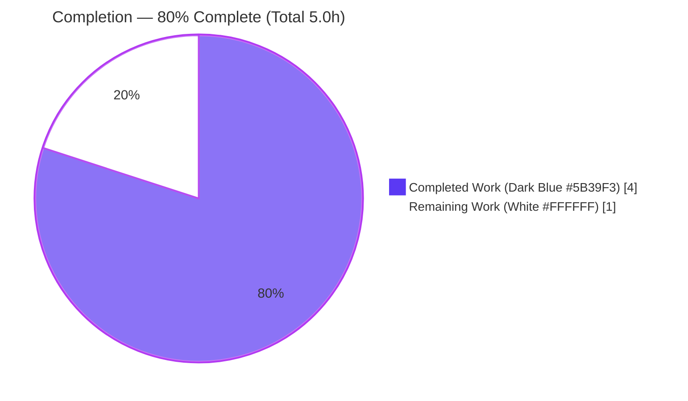
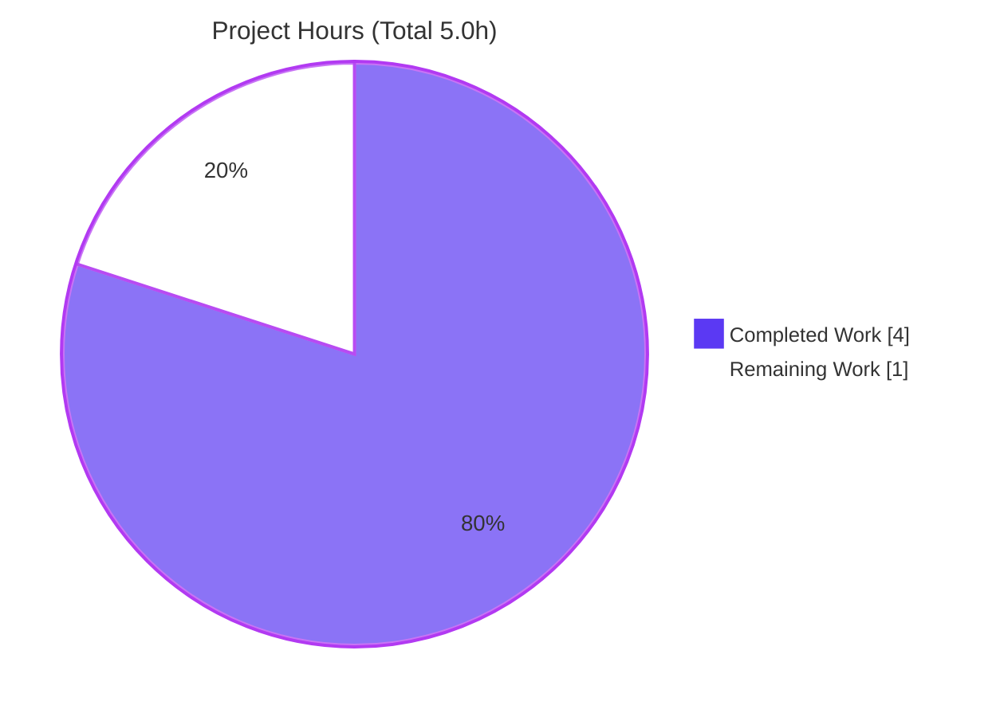
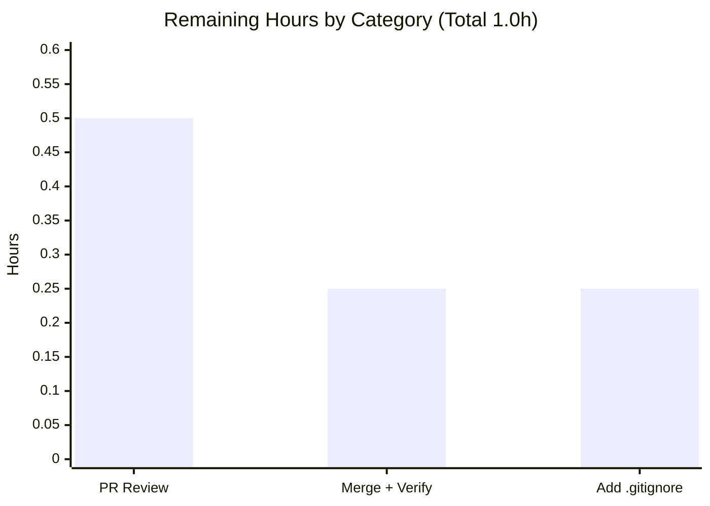

# Blitzy Project Guide

> **Project:** `hello_world` — Node.js HTTP server (Express.js migration + second endpoint)
> **Branch:** `blitzy-88e31735-c0b2-4b4b-926e-876d3643fcb4`
> **Status:** 80% complete · Production-ready feature scope, pending human review & merge
>
> **Brand color legend:** 🟦 Completed / AI Work = Dark Blue `#5B39F3` · ⬜ Remaining / Not Completed = White `#FFFFFF` · Headings/Accents = Violet-Black `#B23AF2` · Highlight = Mint `#A8FDD9`

---

## 1. Executive Summary

### 1.1 Project Overview

This project introduces the **Express.js** web framework into a minimal single-file Node.js tutorial server and exposes a second HTTP endpoint. The existing server (native `http` module) answered every request with `Hello, World!\n` on `127.0.0.1:3000`; the work migrates it to Express, preserves that legacy response exactly on `GET /`, and adds a new `GET /good-evening` route returning `Good evening`. The target users are tutorial/learning consumers and downstream automation that call the two endpoints. Technical scope is deliberately tiny — three files (`server.js`, `package.json`, `package-lock.json`) — governed by a strict minimal-change rule. Business impact is educational/demonstrative: it shows an idiomatic `http`→Express migration while holding all observable contracts stable.

### 1.2 Completion Status

The project is **80.0% complete**, calculated strictly on AAP-scoped and path-to-production work using the hours-based methodology: `Completed Hours ÷ Total Hours = 4.0 ÷ 5.0 = 80.0%`.



| Metric | Hours |
|--------|-------|
| **Total Hours** | **5.0** |
| Completed Hours — AI | 4.0 |
| Completed Hours — Manual | 0.0 |
| **Completed Hours — Total** | **4.0** |
| **Remaining Hours** | **1.0** |
| **Percent Complete** | **80.0%** |

### 1.3 Key Accomplishments

- ✅ **R1 — Express.js added & wired:** `express@^5.2.1` declared in `package.json`; `package-lock.json` regenerated (67 packages, `lockfileVersion: 3`, integrity hashes); `server.js` now uses `require('express')` and `const app = express()`.
- ✅ **R2 — New endpoint:** `GET /good-evening` returns exactly `Good evening` (HTTP 200, `text/plain`).
- ✅ **R3 — Legacy endpoint preserved:** `GET /` returns exactly `Hello, World!\n` (HTTP 200, `text/plain`) on the same `127.0.0.1:3000` bind with the identical startup banner.
- ✅ **Minimal-change discipline:** only the 3 in-scope files changed (857 insertions, 7 deletions); zero out-of-scope edits.
- ✅ **Explainability artifacts:** decision log (D1–D6) and a bidirectional, 100%-coverage traceability matrix delivered.
- ✅ **Fully validated:** `npm ci` (exit 0), `node --check` (exit 0), and live runtime checks of both endpoints all pass; independently re-verified.

### 1.4 Critical Unresolved Issues

| Issue | Impact | Owner | ETA |
|-------|--------|-------|-----|
| _None — no blocking issues_ | The Final Validator reported zero errors/failures; independent re-verification confirms all endpoints work and the code compiles/loads cleanly | — | — |

> There are **no critical unresolved issues**. All remaining work is standard path-to-production human activity (see §1.6 and §2.2), not a defect.

### 1.5 Access Issues

| System / Resource | Type of Access | Issue Description | Resolution Status | Owner |
|-------------------|----------------|-------------------|-------------------|-------|
| _None_ | — | No access issues identified. The repository, npm public registry (`express@5.2.1` resolved & cached), Node.js runtime, and git branch were all fully accessible during autonomous work | N/A | — |

> **No access issues identified.** No private registries, service credentials, or third-party API keys are required by this project.

### 1.6 Recommended Next Steps

1. **[High]** Review and approve the pull request — inspect the 3-file diff and confirm both endpoints locally (`node server.js` + two `curl` checks). _(0.5h)_
2. **[Medium]** Merge `blitzy-88e31735-c0b2-4b4b-926e-876d3643fcb4` to the main line and re-verify post-merge with `npm ci` + endpoint smoke test. _(0.25h)_
3. **[Low]** Add a `.gitignore` that excludes `node_modules/` to prevent accidental bulk commits (repo currently has no ignore file). _(0.25h)_

---

## 2. Project Hours Breakdown

### 2.1 Completed Work Detail

All completed work is AI-delivered and traces directly to an AAP requirement. Total = **4.0 hours** (matches Completed Hours in §1.2).

| Component | Hours | Description |
|-----------|-------|-------------|
| **[AAP R1] Express dependency + wiring** | 1.5 | Add `express@^5.2.1` to `package.json`; regenerate `package-lock.json` (67 packages, lockfileVersion 3, integrity hashes) via `npm install express`; replace `require('http')` with `require('express')` and construct `const app = express()`. Includes web research to pin a real, resolvable Express version (§0.2.2). Commits `7e19bcb`, `1856b98`, `fb1f97c`. |
| **[AAP R3] Preserve legacy `GET /` contract** | 1.0 | Migrate the single native-`http` handler to an Express route while preserving every observable contract: status `200`, `Content-Type: text/plain` (explicit `.type()` to override Express's `text/html` default), body `Hello, World!\n`, `127.0.0.1:3000` bind, and the startup banner via `app.listen(port, hostname, cb)`. |
| **[AAP R2] Add `GET /good-evening`** | 0.5 | Register the net-new route returning exactly `Good evening` (200, `text/plain`, no trailing newline per decision D5). |
| **Runtime verification** | 0.5 | Manual end-to-end validation: server start + banner, both endpoints' status/headers/bodies, and the intentional `404` for unmatched paths (§0.5.2 quality verification). |
| **Explainability artifacts** | 0.5 | Author the decision log (D1–D6) and the bidirectional source→target traceability matrix with 100% coverage (§0.7). |
| **Total** | **4.0** | |

### 2.2 Remaining Work Detail

All remaining work is standard path-to-production human activity. Total = **1.0 hour** (matches Remaining Hours in §1.2 and the pie chart in §7).

| Category | Hours | Priority |
|----------|-------|----------|
| PR code review & approval (path-to-production gate) | 0.5 | High |
| Merge to main + post-merge verification (`npm ci` + endpoint smoke test) | 0.25 | Medium |
| Repo hygiene — add `.gitignore` for `node_modules/` | 0.25 | Low |
| **Total** | **1.0** | |

### 2.3 Hours Reconciliation

| Check | Value | Result |
|-------|-------|--------|
| Section 2.1 Completed total | 4.0h | ✅ equals §1.2 Completed |
| Section 2.2 Remaining total | 1.0h | ✅ equals §1.2 Remaining & §7 pie |
| 2.1 + 2.2 | 5.0h | ✅ equals §1.2 Total |
| Completion % | 4.0 ÷ 5.0 | ✅ 80.0% (consistent across §1.2, §7, §8) |

---

## 3. Test Results

> **Integrity note:** Every entry below originates from **Blitzy's autonomous validation logs** for this project (re-verified independently in this session). No test data is fabricated.

**Automated test suite:** This project has **no automated test harness**, and the AAP (§0.6.2) explicitly excludes adding one ("no automated tests are added … and none were requested"). The `npm test` script is the verbatim npm-default placeholder (`echo "Error: no test specified" && exit 1`) — an inert stub, **not** a failing test. Formal automated tests are therefore **0 total / 0 passed / 0 failed** (vacuously 100% pass; nothing is blocked).

| Test Category | Framework | Total Tests | Passed | Failed | Coverage % | Notes |
|---------------|-----------|-------------|--------|--------|------------|-------|
| Unit | None (excluded per AAP §0.6.2) | 0 | 0 | 0 | N/A | No harness; adding tests would violate the minimal-change rule |
| Integration | None (excluded per AAP §0.6.2) | 0 | 0 | 0 | N/A | Not requested; no test tree exists |
| End-to-End | None (excluded per AAP §0.6.2) | 0 | 0 | 0 | N/A | Manual runtime validation used instead (see below) |

**Blitzy Autonomous Validation Checks (from validation logs):** In lieu of a unit-test framework, Blitzy performed the following scripted/manual verification checks — all **PASS**.

| Validation Check | Method | Result | Notes |
|------------------|--------|--------|-------|
| Dependency install | `npm ci` | ✅ Pass | "added 67 packages", exit 0; reproducible from committed lockfile |
| Dependency tree integrity | `npm ls` | ✅ Pass | Clean tree: `hello_world@1.0.0 → express@5.2.1`; no missing/extraneous/invalid |
| Syntax / compilation | `node --check server.js` | ✅ Pass | Exit 0 (CommonJS, no build step) |
| Module resolution | `require('express')` | ✅ Pass | Loads; `typeof express === 'function'` |
| Manifest validity | JSON parse of `package.json` & `package-lock.json` | ✅ Pass | Both valid JSON; lockfileVersion 3 |
| Runtime — `GET /` | Live HTTP request | ✅ Pass | 200, `text/plain; charset=utf-8`, body `Hello, World!\n` (14 bytes) — R3 exact match |
| Runtime — `GET /good-evening` | Live HTTP request | ✅ Pass | 200, `text/plain; charset=utf-8`, body `Good evening` (12 bytes) — R2 exact match |
| Runtime — negative routing | `GET /nonexistent`, `POST /` | ✅ Pass | 404 (Express default) — intentional deviation per decision D2 |

**Validation checks: 8 / 8 passed (100%).**

---

## 4. Runtime Validation & UI Verification

**Runtime health** — server process, bind, and startup:

- ✅ **Operational** — `node server.js` starts and prints the exact banner `Server running at http://127.0.0.1:3000/`.
- ✅ **Operational** — binds `127.0.0.1:3000` (loopback); clean shutdown releases the port.
- ✅ **Operational** — no stderr output on startup; `node --check` exit 0.

**Endpoint / API verification:**

- ✅ **Operational** — `GET /` → `200`, `Content-Type: text/plain; charset=utf-8`, `Content-Length: 14`, body `Hello, World!\n` (R3).
- ✅ **Operational** — `GET /good-evening` → `200`, `Content-Type: text/plain; charset=utf-8`, `Content-Length: 12`, body `Good evening` (R2).
- ✅ **Operational** — unmatched paths (`GET /nonexistent`, `POST /`) → `404` (Express default), an intentional, documented deviation from the old catch-all behavior (decision D2).
- ✅ **Operational** — response header `X-Powered-By: Express` confirms Express is on the request path (independent proof of R1 wiring).

**UI verification:**

- ⚠ **Not applicable** — this is a headless HTTP server emitting `text/plain`. Per AAP §0.5.3 there is **no frontend, component library, or design system**, and no Figma screens were provided. No UI verification is required or possible.

**External API integration:**

- ⚠ **Not applicable** — the server has **no external service, database, or third-party API integrations**. No credentials or network configuration are needed.

---

## 5. Compliance & Quality Review

Cross-mapping of AAP deliverables and feature rules to their verified status. All fixes required during autonomous validation: **none** (zero issues encountered).

| # | AAP Deliverable / Rule | Benchmark | Status | Evidence / Progress |
|---|------------------------|-----------|--------|---------------------|
| 1 | **R1** — Add Express as runtime dependency & wire it | Express on request path; version pinned | ✅ Pass | `package.json` `express ^5.2.1`; lock `5.2.1`; `require('express')`; `X-Powered-By: Express` header |
| 2 | **R2** — New endpoint returns `Good evening` | Exact body, 200, text/plain | ✅ Pass | `GET /good-evening` verified live (12 bytes, no trailing newline per D5) |
| 3 | **R3** — Preserve `Hello, World!\n` endpoint | Exact body, status, type, bind, banner | ✅ Pass | `GET /` verified live (14 bytes); bind `127.0.0.1:3000`; banner unchanged |
| 4 | **Minimal-change rule** | Only in-scope files touched | ✅ Pass | Diff: only `server.js`, `package.json`, `package-lock.json` (857+/7-) |
| 5 | **Preserve response contract** | `text/plain` retained (not Express `text/html`) | ✅ Pass | Explicit `.type('text/plain')` on both routes (D4) |
| 6 | **Pin a verified version** | Real, resolvable version (no `latest`/`1.0.0`) | ✅ Pass | `^5.2.1` → resolves to published `5.2.1` with integrity hash |
| 7 | **Single-file convention** | No new module tree | ✅ Pass | All logic remains in `server.js`; no new files created |
| 8 | **Explainability** | Decision log + bidirectional traceability | ✅ Pass | D1–D6 + matrix with 100% coverage (§0.7) |
| 9 | **Node.js floor for Express 5** | Node ≥ 18 | ✅ Pass | Runtime Node v20.20.2 (AAP-cited env v22.23.1); both ≥ 18 |
| 10 | **Out-of-scope items untouched** | `README.md`, `server - Copy.js`, artifacts | ✅ Pass | Verified unchanged; `server - Copy.js` still native-http |
| 11 | **Pre-existing conditions preserved (D6)** | `main` mismatch & missing `start` left as-is | ✅ Pass | Intentional per minimal-change; documented, non-blocking |
| 12 | **Changes committed** | Work committed to branch | ✅ Pass | 3 agent commits; `git status` clean except untracked `node_modules/` |

**Compliance score: 12 / 12 applicable benchmarks passed.** Outstanding compliance items: none.

---

## 6. Risk Assessment

All risks are **Low severity** given the tiny, fully-validated tutorial scope. No High/Critical risks exist; none block release.

| Risk | Category | Severity | Probability | Mitigation | Status |
|------|----------|----------|-------------|------------|--------|
| **TECH-1** No automated regression test suite | Technical | Low | Medium | Manual validation performed; add smoke tests if the project grows beyond tutorial scope | Accepted (out of scope, §0.6.2) |
| **TECH-2** `package.json main` → non-existent `index.js` | Technical | Low | Low | Run via `node server.js`; repoint `main` only if `npm start`/module `require` is needed | Accepted (pre-existing, D6) |
| **SEC-1** Express + 66 transitive deps (supply-chain surface) | Security | Low | Low | Committed lockfile pins exact versions + integrity hashes; run periodic `npm audit` | Mitigated |
| **SEC-2** Plaintext HTTP, no auth/TLS | Security | Low | Low | Loopback-only bind (`127.0.0.1`) prevents external exposure; add TLS/auth only if exposed | Accepted (out of scope; static, non-sensitive responses) |
| **OPS-1** No logging/monitoring/health endpoint; no graceful shutdown | Operational | Low | Medium | Add observability if promoted beyond tutorial | Accepted (out of scope, §0.6.2) |
| **OPS-2** `node_modules` untracked with no `.gitignore` | Operational | Low | Low | Add `.gitignore` (remaining task, 0.25h) | Open (planned) |
| **INT-1** Non-root paths now return `404` (was catch-all greeting) | Integration | Low | Low | Documented intentional deviation (D2 / §0.4.1); add a catch-all route only if a consumer depends on it | Accepted (intentional) |

> **Note:** No external service/DB/API-key integrations exist, so classic integration risks (untested integrations, missing credentials, network configuration) do not apply.

---

## 7. Visual Project Status

**Project hours breakdown** (Completed = Dark Blue `#5B39F3`, Remaining = White `#FFFFFF`):



**Remaining hours by category** (from §2.2 — sums to 1.0h):



> **Integrity check:** the pie's "Remaining Work" value (**1.0h**) equals §1.2 Remaining Hours and the §2.2 Hours-column sum. "Completed Work" (**4.0h**) equals §1.2 Completed and the §2.1 sum. 4.0 + 1.0 = 5.0 total.

---

## 8. Summary & Recommendations

**Achievements.** The `http`→Express migration is complete and correct. All three AAP requirements (R1 add & wire Express, R2 new `Good evening` endpoint, R3 preserve the `Hello, World!\n` endpoint) are delivered and independently validated end-to-end. The work honored a strict minimal-change mandate — only `server.js`, `package.json`, and `package-lock.json` changed — and shipped the required explainability artifacts (decision log + 100%-coverage traceability matrix).

**Remaining gaps.** None in the feature itself. The outstanding **1.0 hour** is standard path-to-production human activity: PR review (0.5h), merge + post-merge verification (0.25h), and adding a `.gitignore` for `node_modules/` (0.25h).

**Critical path to production.** Review the PR → merge to the main line → re-verify (`npm ci`, then `curl` both endpoints). Optionally add `.gitignore` for hygiene. There are no blockers on this path.

**Success metrics (all met).** `npm ci` exit 0 (67 packages); `node --check` exit 0; `GET /` → `Hello, World!\n`; `GET /good-evening` → `Good evening`; both `200 text/plain`; `X-Powered-By: Express` confirms Express serves responses.

**Production-readiness assessment.** The project is **80.0% complete** (4.0 of 5.0 hours). The AAP-scoped feature is production-ready and fully validated with zero known defects; the residual 20% reflects human review, merge, and repo-hygiene steps that by policy remain outside autonomous execution. Confidence is **High** — the scope is small, well-defined, and every claim was empirically re-verified.

| Metric | Value |
|--------|-------|
| Completion | 80.0% |
| Completed / Total hours | 4.0 / 5.0 |
| Remaining hours | 1.0 |
| Blocking issues | 0 |
| Validation checks passed | 8 / 8 |
| Confidence | High |

---

## 9. Development Guide

> Every command below was executed successfully in the validation environment (Windows / PowerShell, Node v20.20.2, npm 10.8.2). Bash equivalents are provided where they differ.

### 9.1 System Prerequisites

- **Node.js ≥ 18** (Express 5 requirement). Verified with **v20.20.2**; the AAP environment cited **v22.23.1**. Either satisfies the floor.
- **npm** (bundled with Node). Verified with **10.8.2**.
- **git** — to check out the branch.
- **Disk:** ~50 MB for `node_modules` (67 packages).
- **OS:** platform-agnostic (Windows, macOS, Linux).

```bash
node --version   # expect v18+  (verified: v20.20.2)
npm --version    # verified: 10.8.2
```

### 9.2 Environment Setup

- No environment variables are required — host `127.0.0.1` and port `3000` are hard-coded in `server.js` by design (§0.6.2).
- No databases, caches, message queues, or external services.

```bash
# Check out the feature branch
git checkout blitzy-88e31735-c0b2-4b4b-926e-876d3643fcb4
```

### 9.3 Dependency Installation

Use `npm ci` for a clean, reproducible install from the committed lockfile (preferred). Use `npm install` if you intentionally want to re-resolve.

```bash
npm ci
# Expected: "added 67 packages in ~3s"  (exit code 0)

npm ls
# Expected:
#   hello_world@1.0.0 <path>
#   `-- express@5.2.1
```

### 9.4 Application Startup

```bash
node server.js
# Expected stdout banner:
#   Server running at http://127.0.0.1:3000/
# Runs in the foreground; press Ctrl+C to stop.
```

Run detached in the background:

```bash
# Bash / macOS / Linux
node server.js &

# PowerShell (Windows)
Start-Process -FilePath node -ArgumentList server.js -NoNewWindow -PassThru
```

### 9.5 Verification Steps

```bash
# 1) Legacy endpoint (R3)
curl -i http://127.0.0.1:3000/
# HTTP/1.1 200 OK
# X-Powered-By: Express
# Content-Type: text/plain; charset=utf-8
# Content-Length: 14
# (body) Hello, World!

# 2) New endpoint (R2)
curl -i http://127.0.0.1:3000/good-evening
# HTTP/1.1 200 OK
# Content-Type: text/plain; charset=utf-8
# Content-Length: 12
# (body) Good evening

# 3) Unmatched path -> Express default 404 (intentional, D2)
curl -o /dev/null -w "HTTP %{http_code}\n" http://127.0.0.1:3000/nonexistent
# HTTP 404
```

> On Windows PowerShell, use `curl.exe` (not the `curl` alias for `Invoke-WebRequest`) to get identical output, and `-o NUL` instead of `-o /dev/null`.

### 9.6 Example Usage

```bash
$ curl http://127.0.0.1:3000/
Hello, World!

$ curl http://127.0.0.1:3000/good-evening
Good evening
```

### 9.7 Troubleshooting

| Symptom | Likely Cause | Resolution |
|---------|--------------|------------|
| `Error: listen EADDRINUSE :::3000` | Port 3000 already in use | Stop the other process, or free the port. PowerShell: `Get-NetTCPConnection -LocalPort 3000` then stop the owning PID. Bash: `lsof -i :3000`. |
| `Error: Cannot find module 'express'` | Dependencies not installed | Run `npm ci` (or `npm install`) at the repo root. |
| `npm start` fails / does nothing useful | No `start` script; `main` points to a non-existent `index.js` (pre-existing, kept per decision D6) | Start with `node server.js`. |
| `SyntaxError` / server won't parse | Node version too old for Express 5 | Upgrade to **Node ≥ 18**; verify with `node --version`. |
| `npm test` prints an error and exits 1 | It is the npm-default placeholder, not a real test | Expected — no test harness exists by design (§0.6.2). |

---

## 10. Appendices

### Appendix A — Command Reference

| Command | Purpose |
|---------|---------|
| `node --version` / `npm --version` | Verify runtime prerequisites |
| `npm ci` | Reproducible install from `package-lock.json` (67 packages) |
| `npm install` | Install/re-resolve dependencies |
| `npm ls` | Show the dependency tree (`express@5.2.1`) |
| `node --check server.js` | Syntax-check without executing (exit 0 = OK) |
| `node server.js` | Start the server on `127.0.0.1:3000` |
| `curl -i http://127.0.0.1:3000/` | Exercise the legacy endpoint |
| `curl -i http://127.0.0.1:3000/good-evening` | Exercise the new endpoint |
| `git log --oneline` | Review the three agent commits |

### Appendix B — Port Reference

| Port | Host | Protocol | Purpose |
|------|------|----------|---------|
| 3000 | 127.0.0.1 (loopback) | HTTP | Express server (both endpoints); hard-coded in `server.js` |

### Appendix C — Key File Locations

| File | Role | Change |
|------|------|--------|
| `server.js` | Express application (entry point); defines `GET /` and `GET /good-evening` | Migrated from native `http` |
| `package.json` | npm manifest; declares `express ^5.2.1` | Dependencies block added |
| `package-lock.json` | Locked dependency graph (`lockfileVersion 3`, 67 packages, integrity hashes) | Regenerated |
| `server - Copy.js` | Unwired native-`http` duplicate | Untouched (out of scope) |
| `README.md` | "Do not touch!" note | Untouched (out of scope) |

### Appendix D — Technology Versions

| Technology | Version | Notes |
|------------|---------|-------|
| Node.js | v20.20.2 (verified); v22.23.1 (AAP env) | Both satisfy Express 5's Node ≥ 18 floor |
| npm | 10.8.2 | Bundled with Node |
| express | 5.2.1 | Resolved from `^5.2.1`; sha512 integrity locked |
| Total packages | 67 | express + 66 transitive |
| package-lock.json | lockfileVersion 3 | — |

### Appendix E — Environment Variable Reference

| Variable | Required | Default | Notes |
|----------|----------|---------|-------|
| _(none)_ | No | — | Host `127.0.0.1` and port `3000` are hard-coded in `server.js` by design (§0.6.2). No `.env` file is used. |

### Appendix F — Developer Tools Guide

| Tool | Use in this project |
|------|---------------------|
| **git** | `git log --oneline` to see commits `7e19bcb`, `1856b98`, `fb1f97c`; `git diff e7604de HEAD --stat` for the change summary |
| **npm** | `npm ci` (install), `npm ls` (tree). Avoid committing `node_modules/` |
| **node** | `node --check server.js` (static syntax check); `node server.js` (run) |
| **curl** | Endpoint verification (use `curl.exe` on Windows PowerShell) |

### Appendix G — Glossary

| Term | Definition |
|------|------------|
| **Express.js** | Minimal Node.js web framework providing routing (`app.get`) and response helpers (`res.status`, `res.type`, `res.send`) |
| **AAP** | Agent Action Plan — the authoritative specification of scope and requirements for this feature |
| **R1 / R2 / R3** | The three clarified AAP requirements (add & wire Express / add `Good evening` endpoint / preserve `Hello, World!\n` endpoint) |
| **D1–D6** | Entries in the AAP decision log documenting non-trivial choices and deviations |
| **lockfileVersion 3** | The npm lockfile schema used by `package-lock.json` |
| **Path-to-production** | Standard human activities (review, merge, hygiene) required to deploy AAP deliverables, counted separately from AAP feature work |
| **Loopback bind** | Binding to `127.0.0.1`, reachable only from the local machine |

---

*End of Blitzy Project Guide. All cross-section integrity rules validated: §1.2 = §2.2 = §7 remaining hours (1.0h); §2.1 (4.0h) + §2.2 (1.0h) = §1.2 total (5.0h); all test data sourced from Blitzy autonomous validation logs; completion 80.0% consistent across §1.2, §7, §8; brand colors applied (Completed #5B39F3, Remaining #FFFFFF).*