# Technical Specification

# 1. Introduction

## 1.1 EXECUTIVE SUMMARY

### 1.1.1 Project Overview

The repository documented by this Technical Specification is a deliberately minimal Node.js HTTP service whose canonical purpose, as declared in its `README.md`, is to serve as a "test project for backprop integration" with the explicit operational directive **"Do not touch!"**. The project is not an end-user product, customer-facing application, or revenue-generating service; it is a **test fixture / sandbox artifact** intended to be exercised by an external workflow referred to in the source as "backprop".

The runtime behavior of the entire system is contained in a single 14-line CommonJS module (`server.js`) that:

- Uses only the Node.js built-in `http` module (zero third-party dependencies)
- Binds to the loopback interface at `127.0.0.1:3000`
- Returns `HTTP 200` with `Content-Type: text/plain` and the literal body `Hello, World!\n` for every incoming request, regardless of method, path, or headers
- Is stateless, deterministic, and free of routing, middleware, authentication, or persistence

The repository carries two project identifiers that **do not match** — a known artifact of its sandbox nature that consumers must be aware of:

| Identifier Source | Value | Notes |
|---|---|---|
| `README.md` (human-facing title) | `hao-backprop-test` | Reflects the backprop-integration purpose |
| `package.json` (`name` field) | `hello_world` | Reflects the runtime behavior |
| `package.json` (`description`) | `Hello world in Node.js` | Consistent with package name |
| `package.json` (`version`) | `1.0.0` | Initial release semantics |

### 1.1.2 Core Problem and Purpose

The repository addresses a narrow, technical concern rather than a business problem: **providing a deterministic, dependency-free HTTP target** that downstream "backprop" integration tooling can invoke during development, smoke testing, or pipeline validation. The value of the artifact rests on three properties:

1. **Predictability** — every request yields a byte-identical response
2. **Zero environmental coupling** — no dependencies to install, no databases, no environment variables, no external services
3. **Trivial startup** — a single `node server.js` invocation produces a running server

No customer pain point, market gap, regulatory driver, or revenue mechanism is documented anywhere in the repository.

### 1.1.3 Stakeholders and Users

The repository does **not** include a stakeholder register, persona model, or user research artifact. The only attributable parties identifiable from source files are:

| Role | Identification | Source of Evidence |
|---|---|---|
| Author / Originator | `hxu` | `package.json` (`author` field) |
| License Grantor / Consumers | Any party (MIT-licensed) | `package.json` (`license` field) |
| Implicit Integration Consumer | "Backprop" tooling | `README.md` (referenced but undefined) |
| Operational Custodian | Implied by README directive | `README.md` ("Do not touch!") |

Per the factual-grounding constraint of this specification, no further user segmentation, persona definition, or audience analysis is asserted because no such information exists in the repository.

### 1.1.4 Value Proposition

The expected impact of this artifact is operational rather than commercial. Its contribution to the broader environment in which it is consumed is:

- **A reproducible HTTP endpoint** for integration scaffolding
- **A reference for the simplest viable Node.js HTTP service shape** (no framework, no router, no dependency graph)
- **A controlled fixture** whose unchanged behavior is itself the contract — the README's "Do not touch!" directive elevates stability above feature growth

No quantitative business impact (revenue, cost-savings, productivity uplift, etc.) is documented, and none is claimed.

## 1.2 SYSTEM OVERVIEW

### 1.2.1 Project Context

#### 1.2.1.1 Business Context and Positioning

The system has **no documented market positioning** because it is not a market-facing system. It exists exclusively as a private engineering fixture. The README's directive "Do not touch!" places it in the category of *protected test infrastructure* — assets whose value depends on remaining unchanged so external pipelines can rely on stable behavior.

#### 1.2.1.2 Current System Limitations

The repository does **not** replace or upgrade an existing system. There is no migration history, deprecation notice, or legacy artifact identified in the codebase. The project is greenfield in the limited sense that it is a self-contained 1.0.0 release of a minimal HTTP responder.

#### 1.2.1.3 Integration with the Enterprise Landscape

No enterprise integration surface is implemented or configured. Specifically, the repository contains:

- **No outbound network calls** — the server only accepts inbound HTTP requests
- **No environment configuration** — hostname (`127.0.0.1`) and port (`3000`) are hard-coded
- **No external service clients** — no SDKs, no API credentials, no database drivers
- **No CI/CD configuration** — no workflow files, no Dockerfile, no deployment manifests
- **No third-party npm dependencies** — `package-lock.json` (lockfileVersion 3) records only the root package; the dependency graph is empty

The only "integration point" is the implicit contract that a "backprop" workflow (external to this repository) will invoke `127.0.0.1:3000` and observe the canonical response.

### 1.2.2 High-Level Description

#### 1.2.2.1 Primary System Capabilities

The system implements exactly one capability: **respond to any HTTP request received on `127.0.0.1:3000` with an HTTP 200 response carrying the plaintext body `Hello, World!\n`**. There are no secondary capabilities (no health endpoint, no metrics endpoint, no graceful shutdown handler, no request logging, no error handling beyond Node's defaults).

#### 1.2.2.2 Major System Components

The repository's 14 files partition into a small number of functional categories. The table below classifies each component by role:

| Component Category | Files | Operational Role |
|---|---|---|
| Runtime (functional) | `server.js`, `package.json`, `package-lock.json` | The executable HTTP server and its npm metadata |
| Runtime (duplicate) | `server - Copy.js` | Byte-identical backup of `server.js`; not wired in |
| Reference data (inert) | `industry.csv`, `industry - Copy.csv` | 43-row industry taxonomy; no code reads it |
| Java skeleton (inert) | `LoginTest.java`, `LoginTest - Copy.java` | Non-compilable `com.blitzyTest.LoginTest` stub |
| Tooling artifacts (inert) | `test.py.txt`, `test.py - Copy.txt` | Code-graph metadata file and an empty duplicate |
| Placeholders (inert) | `.blitzyignore.txt`, `test.blitzyignore.txt`, `test1.blitzyignore.txt` | Empty files; no ignore rules in effect |
| Documentation | `README.md` | One-paragraph project description |

The architectural reality is that **only the Runtime (functional) row participates in operational behavior**. All other categories are inert artifacts that coexist in the repository but do not interact with the running system or with one another.

The high-level system topology is captured below:

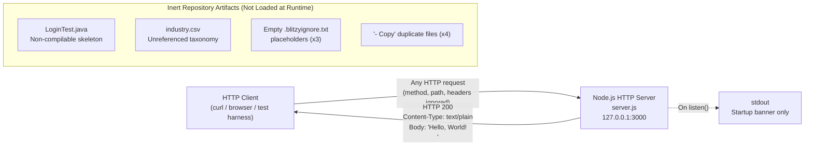

#### 1.2.2.3 Core Technical Approach

The technical approach is the **smallest viable Node.js HTTP server**:

| Design Choice | Rationale Implied by the Code |
|---|---|
| Node's built-in `http` module | Eliminates dependency installation; works on any Node runtime |
| Hard-coded `127.0.0.1` bind | Confines the server to the local machine; no exposure surface |
| Single anonymous request handler | Removes routing logic; uniform response regardless of input |
| `text/plain` response | Avoids HTML/JSON parsing concerns on the consumer side |
| No async I/O beyond `listen` | Fully synchronous response generation; deterministic latency |

### 1.2.3 Success Criteria

Because the repository documents no business KPIs, the only success criteria that can be asserted with evidence are **observable behavioral criteria** of the running server.

#### 1.2.3.1 Measurable Objectives

| Objective | Observable Signal | Source |
|---|---|---|
| Server starts | Stdout banner: `Server running at http://127.0.0.1:3000/` | `server.js` `listen` callback |
| Server binds correctly | TCP socket open on `127.0.0.1:3000` | `server.js` `listen(port, hostname, …)` |
| Response correctness | Body is exactly `Hello, World!\n` | `server.js` `res.end(...)` |
| Response status | HTTP status code is `200` | `server.js` `res.statusCode = 200` |
| Response content type | `Content-Type: text/plain` | `server.js` `res.setHeader(...)` |

#### 1.2.3.2 Critical Success Factors

- **Behavioral immutability** — given the README directive ("Do not touch!"), preserving the canonical response is itself the success criterion
- **Zero-install execution** — the server must run on any Node.js installation without `npm install` (since there are no dependencies to install)
- **No port conflicts** — port `3000` must be available on the host

#### 1.2.3.3 Key Performance Indicators

The repository defines **no formal KPIs**, no SLAs, no latency targets, no throughput goals, and no availability commitments. Any KPI ascribed to this fixture would therefore be invented rather than documented and is intentionally omitted from this specification.

## 1.3 SCOPE

### 1.3.1 In-Scope: Core Features and Functionalities

#### 1.3.1.1 Must-Have Capabilities

| Capability | Implementation Site | Status |
|---|---|---|
| Listen on TCP port 3000 (loopback) | `server.js` (`server.listen`) | Implemented |
| Accept any HTTP request | `server.js` (`http.createServer` callback) | Implemented |
| Return HTTP 200 status | `server.js` (`res.statusCode = 200`) | Implemented |
| Return plaintext content type | `server.js` (`res.setHeader('Content-Type', 'text/plain')`) | Implemented |
| Return body `Hello, World!\n` | `server.js` (`res.end('Hello, World!\n')`) | Implemented |
| Emit startup confirmation to stdout | `server.js` (`console.log(...)`) | Implemented |

#### 1.3.1.2 Primary User Workflow

There is exactly one user workflow:

1. An operator (or automated tool) launches the server with `node server.js` from the repository root
2. The process binds to `127.0.0.1:3000` and prints the startup banner
3. Any HTTP client on the same host issues a request to `http://127.0.0.1:3000`
4. The server returns the canonical response
5. The operator stops the process (e.g., `Ctrl+C`); no graceful-shutdown logic is engaged

#### 1.3.1.3 Essential Integrations

| Integration | Type | Boundary |
|---|---|---|
| Node.js runtime | Host platform | Required for execution |
| Node.js built-in `http` module | Standard library | Statically required |
| TCP/IP stack on `127.0.0.1` | OS network | Required for `listen` |

No other integrations are essential, because no others are referenced in code.

#### 1.3.1.4 Key Technical Requirements

- Node.js runtime capable of `http.createServer` and `server.listen` (any modern Node.js LTS satisfies this)
- npm tooling capable of consuming `lockfileVersion 3` (npm 7+) — relevant only if dependencies are added later
- Availability of TCP port `3000` on the host

### 1.3.2 In-Scope: Implementation Boundaries

| Boundary Dimension | In-Scope Definition |
|---|---|
| System boundary | A single Node.js process exposing a single HTTP listener on `127.0.0.1:3000` |
| User groups covered | Local-host clients only (no remote users; loopback bind precludes off-box access) |
| Geographic / market coverage | Not applicable — the loopback bind prevents any geographic distribution |
| Data domains included | None — the server returns a static string and persists no data |

### 1.3.3 Out-of-Scope Elements

The following capabilities are **explicitly excluded** from this Technical Specification because no implementation, configuration, or stub for them exists in the repository.

#### 1.3.3.1 Excluded Features and Capabilities

| Excluded Capability | Rationale for Exclusion |
|---|---|
| HTTP request routing (multiple paths) | Single anonymous handler responds identically to all paths |
| HTTP method differentiation (GET/POST/PUT/etc.) | Method is not inspected in the request handler |
| Authentication / authorization | No middleware, no credential handling, no session management |
| TLS / HTTPS | Server is created with `http.createServer`, not `https.createServer` |
| Persistent storage | No database driver, no filesystem writes, no caching layer |
| Logging beyond startup banner | No request log, no error log, no structured logging library |
| Configuration management | Hostname and port are hard-coded; no `.env`, no `config/` |
| Externally exposed interface | Bound to `127.0.0.1`; not reachable from other hosts |
| Test automation | `package.json` `scripts.test` is hard-coded to `exit 1`; no test framework, no test files |
| Continuous integration / delivery | No CI workflow files, Dockerfile, or deployment manifests are present |
| Industry-data processing | `industry.csv` is not loaded by any code in the repository |
| Java login functionality | `LoginTest.java` is non-compilable and contains no logic |
| Code-graph or static-analysis tooling | `test.py.txt` is a metadata artifact, not an executing tool |
| Ignore-rule enforcement | `.blitzyignore.txt`, `test.blitzyignore.txt`, `test1.blitzyignore.txt` are empty placeholders |

#### 1.3.3.2 Future Phase Considerations

The repository contains **no roadmap, milestone document, or backlog**. No future phases are documented. Any forward-looking work (adding an `index.js` to satisfy `package.json`'s declared `main`, fixing the broken `npm test` script, removing duplicate `- Copy` files, populating ignore rules, completing or removing the Java skeleton) is left to consumers and is outside the current specification scope.

#### 1.3.3.3 Integration Points Not Covered

| Integration Point | Status |
|---|---|
| `index.js` (declared `main` in `package.json`) | File does not exist; declared entrypoint is unresolved |
| The "backprop" workflow referenced in `README.md` | External system; not defined or implemented in this repository |
| Any database, message queue, cache, or external API | Not configured, not referenced |
| Any reverse proxy, load balancer, or service mesh | Not configured |

#### 1.3.3.4 Unsupported Use Cases

- Public internet exposure of the HTTP service (the loopback bind prevents this)
- Multi-tenant or session-aware request handling
- Content negotiation (the server always emits `text/plain`)
- Concurrent versioned deployments (no versioning scheme beyond `package.json`'s `1.0.0`)
- Compilation or execution of the Java artifacts (the source is non-compilable as-is)

### 1.3.4 Known Inconsistencies Within the Repository Surface

For traceability, the following inconsistencies are surfaced here so that downstream sections of this specification can refer to them as established facts rather than re-deriving them:

| Inconsistency | Evidence | Effect |
|---|---|---|
| Name mismatch | `README.md` says `hao-backprop-test`; `package.json` says `hello_world` | Two valid identifiers exist for the same project |
| Missing declared entrypoint | `package.json` `main: "index.js"`; `index.js` is absent | `require('hao-backprop-test')` would fail; `node server.js` is the actual entrypoint |
| Non-functional test script | `scripts.test` = `echo "Error: no test specified" && exit 1` | `npm test` always fails; no automated test coverage exists |
| Empty ignore-rule files | All three `*.blitzyignore.txt` files are empty | No ignore rules are in effect |
| Duplicate `- Copy` files | 4 byte-identical duplicates of source/data files | Redundant content with no separate role |
| Cross-language artifacts without integration | Java sources, CSV data, and Python-named text files coexist with the Node runtime | None of these are wired into `server.js` or `package.json` |

These items are descriptive of the repository's current state at the time of specification authoring; their resolution is **not in scope** for the current document.

#### References

#### Files Examined

- `README.md` — Project name (`hao-backprop-test`), one-line purpose statement, "Do not touch!" directive
- `package.json` — npm manifest establishing `name`, `version`, `description`, `main`, `scripts.test`, `author`, `license`; basis for dependency-graph and entrypoint analysis
- `package-lock.json` — `lockfileVersion 3`; confirmation of zero third-party dependencies
- `server.js` — Sole functional runtime artifact; source of all HTTP-server behavior described in §1.2 and §1.3.1
- `server - Copy.js` — Byte-identical duplicate of `server.js`; basis for duplication observations
- `industry.csv` — 43-row industry taxonomy with header `Industry`; cited as inert reference data
- `industry - Copy.csv` — Byte-identical duplicate of `industry.csv`
- `LoginTest.java` — Incomplete `com.blitzyTest.LoginTest` skeleton with stray `Web` token; cited as non-compilable inert artifact
- `LoginTest - Copy.java` — Byte-identical duplicate of `LoginTest.java`
- `test.py.txt` — Code-graph metadata record describing `LoginTest.java` despite the `.py` extension
- `test.py - Copy.txt` — Empty file; cited as inert
- `.blitzyignore.txt` — Empty placeholder; cited as having no active ignore rules
- `test.blitzyignore.txt` — Empty placeholder; cited as having no active ignore rules
- `test1.blitzyignore.txt` — Empty placeholder; cited as having no active ignore rules

#### Folders Explored

- `/` (repository root) — The only folder in the repository (depth 0); contains all 14 files; no subdirectories exist, so the repository surface is fully exhausted at the root level

#### External References

- None. No web searches were performed because the repository declares zero third-party dependencies and contains no version-specific or domain-specific terminology requiring external verification. No additional Technical Specification sections were retrieved because the available section list provided to this author was empty.

# 2. Product Requirements

## 2.1 Feature Catalog

This section enumerates every discrete, testable feature of the system. Each feature has been derived directly from observable artifacts in `server.js` and `package.json`; no feature has been invented, inferred, or imported from outside the repository surface. The catalog comprises seven features (F-001 through F-007), all of which are presently implemented and are governed by the README directive **"Do not touch!"** as established in §1.1.1 and §1.2.3.2.

The complete feature inventory is summarized below for orientation, with full metadata, descriptions, and dependencies presented in the subsequent subsections.

| Feature ID | Feature Name | Category | Priority |
|---|---|---|---|
| F-001 | HTTP Server Listener Binding | Network Runtime | Critical |
| F-002 | Universal HTTP Request Acceptance | Request Handling | Critical |
| F-003 | HTTP 200 Status Response | Response Generation | Critical |
| F-004 | Plaintext Content-Type Header | Response Generation | Critical |
| F-005 | Canonical Response Body | Response Generation | Critical |
| F-006 | Startup Confirmation Logging | Observability | High |
| F-007 | Zero-Dependency npm Package Definition | Project Metadata | High |

### 2.1.1 F-001: HTTP Server Listener Binding

#### 2.1.1.1 Feature Metadata

| Attribute | Value |
|---|---|
| Unique ID | F-001 |
| Feature Name | HTTP Server Listener Binding |
| Feature Category | Network Runtime |
| Priority Level | Critical |
| Status | Completed |

#### 2.1.1.2 Description

- **Overview**: The server creates a Node.js HTTP server instance and binds a TCP listener to the loopback interface `127.0.0.1` on port `3000`. This binding is the precondition for every other runtime behavior in the system.
- **Business Value**: Provides the deterministic network endpoint that the external "backprop" tooling (referenced in `README.md`) is expected to invoke during integration scaffolding, smoke testing, or pipeline validation.
- **User Benefits**: Operators receive a single, predictable URL (`http://127.0.0.1:3000/`) that requires no configuration, no port discovery, and no environment setup.
- **Technical Context**: Implemented in `server.js` via `http.createServer(...)` followed by `server.listen(port, hostname, callback)`. Both `hostname` and `port` are declared as module-level constants; there is no environment-variable override or configuration file.

#### 2.1.1.3 Dependencies

| Dependency Type | Item | Notes |
|---|---|---|
| Prerequisite Features | None | F-001 is the root feature on which F-002–F-006 depend |
| System Dependencies | Node.js runtime; built-in `http` module | Per §1.3.1.3 |
| External Dependencies | TCP/IP stack on loopback interface | OS-level; required for `listen` |
| Integration Requirements | TCP port `3000` available on host | Per §1.2.3.2 critical success factor |

### 2.1.2 F-002: Universal HTTP Request Acceptance

#### 2.1.2.1 Feature Metadata

| Attribute | Value |
|---|---|
| Unique ID | F-002 |
| Feature Name | Universal HTTP Request Acceptance |
| Feature Category | Request Handling |
| Priority Level | Critical |
| Status | Completed |

#### 2.1.2.2 Description

- **Overview**: A single anonymous request handler is registered with `http.createServer`. The handler does not inspect the request method, URL path, query parameters, or headers; every request is accepted and progresses to the response-generation pipeline.
- **Business Value**: Eliminates routing complexity and ensures behavioral immutability — any test client, regardless of how it is configured, will be served identically.
- **User Benefits**: Test harnesses do not need to learn or document a route map; any HTTP request to `127.0.0.1:3000` is sufficient to elicit the canonical response.
- **Technical Context**: Implemented in `server.js` as the `(req, res) => { … }` callback passed to `http.createServer`. Per §1.2.2.3, this design choice is intentional: "Single anonymous request handler — Removes routing logic; uniform response regardless of input."

#### 2.1.2.3 Dependencies

| Dependency Type | Item | Notes |
|---|---|---|
| Prerequisite Features | F-001 | Listener must be bound to receive requests |
| System Dependencies | Node.js `http` module request/response objects | Standard library |
| External Dependencies | None | No upstream services consulted |
| Integration Requirements | None | Request not validated against any external contract |

### 2.1.3 F-003: HTTP 200 Status Response

#### 2.1.3.1 Feature Metadata

| Attribute | Value |
|---|---|
| Unique ID | F-003 |
| Feature Name | HTTP 200 Status Response |
| Feature Category | Response Generation |
| Priority Level | Critical |
| Status | Completed |

#### 2.1.3.2 Description

- **Overview**: Every HTTP response emitted by the server carries the status code `200` (OK), explicitly assigned by the request handler before the response body is sent.
- **Business Value**: Guarantees that simple liveness probes (e.g., `curl -o /dev/null -w '%{http_code}'`) classify the endpoint as healthy without parsing the body.
- **User Benefits**: Consumers can rely on a single status code for all interactions; no error branches need to be coded against this fixture.
- **Technical Context**: Implemented in `server.js` via `res.statusCode = 200`. There is no error path that overrides this assignment, because no error handling exists beyond Node's defaults (per §1.2.2.1).

#### 2.1.3.3 Dependencies

| Dependency Type | Item | Notes |
|---|---|---|
| Prerequisite Features | F-001, F-002 | Listener and handler invocation precede status assignment |
| System Dependencies | Node.js `http.ServerResponse` API | Standard library |
| External Dependencies | None | — |
| Integration Requirements | None | — |

### 2.1.4 F-004: Plaintext Content-Type Header

#### 2.1.4.1 Feature Metadata

| Attribute | Value |
|---|---|
| Unique ID | F-004 |
| Feature Name | Plaintext Content-Type Header |
| Feature Category | Response Generation |
| Priority Level | Critical |
| Status | Completed |

#### 2.1.4.2 Description

- **Overview**: Every HTTP response sets the `Content-Type` response header to the literal value `text/plain`.
- **Business Value**: Avoids HTML/JSON parsing concerns on the consumer side (per §1.2.2.3); test harnesses can read the response body as a UTF-8 string without media-type negotiation.
- **User Benefits**: Browsers and command-line clients render the response without invoking a markup parser; binary-safety is preserved through trivial content classification.
- **Technical Context**: Implemented in `server.js` via `res.setHeader('Content-Type', 'text/plain')`. The header is unconditionally set inside the request handler before `res.end(...)` is called.

#### 2.1.4.3 Dependencies

| Dependency Type | Item | Notes |
|---|---|---|
| Prerequisite Features | F-001, F-002 | Header is set within the handler invoked after listener binding |
| System Dependencies | Node.js `http.ServerResponse.setHeader` API | Standard library |
| External Dependencies | None | — |
| Integration Requirements | None | No content negotiation against `Accept` headers |

### 2.1.5 F-005: Canonical Response Body

#### 2.1.5.1 Feature Metadata

| Attribute | Value |
|---|---|
| Unique ID | F-005 |
| Feature Name | Canonical Response Body |
| Feature Category | Response Generation |
| Priority Level | Critical |
| Status | Completed |

#### 2.1.5.2 Description

- **Overview**: Every HTTP response body is the byte-exact sequence `Hello, World!\n` (13 bytes — twelve printable characters plus one trailing line feed). The body is fixed and is not derived from request data, time, or any random source.
- **Business Value**: This is the **canonical contract** of the fixture. Per §1.1.4, "the README's 'Do not touch!' directive elevates stability above feature growth," and the response body is the most visible expression of that contract.
- **User Benefits**: Consumers can assert byte-equality against a known constant rather than tolerating variability; this enables strict integration tests and golden-file comparisons.
- **Technical Context**: Implemented in `server.js` via `res.end('Hello, World!\n')`. The string literal contains an explicit newline escape; no template, no interpolation, no concatenation.

#### 2.1.5.3 Dependencies

| Dependency Type | Item | Notes |
|---|---|---|
| Prerequisite Features | F-001, F-002, F-003, F-004 | Body is emitted after status and header assignment within the handler |
| System Dependencies | Node.js `http.ServerResponse.end` API | Standard library |
| External Dependencies | None | — |
| Integration Requirements | Implicit "backprop" consumer expects this exact body | Per §1.2.1.3 |

### 2.1.6 F-006: Startup Confirmation Logging

#### 2.1.6.1 Feature Metadata

| Attribute | Value |
|---|---|
| Unique ID | F-006 |
| Feature Name | Startup Confirmation Logging |
| Feature Category | Observability |
| Priority Level | High |
| Status | Completed |

#### 2.1.6.2 Description

- **Overview**: When the listener-binding callback fires (i.e., the server has successfully bound to `127.0.0.1:3000`), the process writes the line `Server running at http://127.0.0.1:3000/` to standard output.
- **Business Value**: Provides the sole observable signal that the server has reached a serving state; per §1.2.3.1, this banner is the measurable objective for "Server starts."
- **User Benefits**: Operators (and orchestration scripts that scrape stdout) gain a deterministic readiness marker without needing to poll the TCP socket.
- **Technical Context**: Implemented in `server.js` as a callback passed to `server.listen(port, hostname, () => { console.log(...) })`. The message is constructed using a template literal that interpolates the same `hostname` and `port` constants used for binding, ensuring lexical consistency between the bind target and the logged URL.

#### 2.1.6.3 Dependencies

| Dependency Type | Item | Notes |
|---|---|---|
| Prerequisite Features | F-001 | Banner emits only after `listen` succeeds |
| System Dependencies | Node.js `console.log` (process stdout stream) | Standard library |
| External Dependencies | A writable stdout stream | OS-level |
| Integration Requirements | None | No log aggregator, no structured-logging schema |

### 2.1.7 F-007: Zero-Dependency npm Package Definition

#### 2.1.7.1 Feature Metadata

| Attribute | Value |
|---|---|
| Unique ID | F-007 |
| Feature Name | Zero-Dependency npm Package Definition |
| Feature Category | Project Metadata |
| Priority Level | High |
| Status | Completed |

#### 2.1.7.2 Description

- **Overview**: The repository declares an npm package via `package.json` (`name`, `version`, `description`, `main`, `scripts`, `author`, `license`) and locks the dependency graph via `package-lock.json` (`lockfileVersion: 3`). Neither file declares any production or development dependency, and the lockfile records only the root package.
- **Business Value**: Per §1.1.2, "Zero environmental coupling" is one of three core value properties. By declaring no dependencies, the project guarantees that `node server.js` runs on any compatible Node.js installation without `npm install` (per §1.2.3.2 "Zero-install execution").
- **User Benefits**: Operators avoid network access, dependency resolution latency, and supply-chain risk during setup. The fixture is portable across air-gapped environments.
- **Technical Context**: `package.json` declares `"main": "index.js"` although `index.js` does not exist (a known inconsistency surfaced in §1.3.4); the actual entrypoint is `server.js`. `scripts.test` is hard-coded to `echo "Error: no test specified" && exit 1`, so `npm test` always fails. These are properties of the metadata feature itself rather than of the runtime features F-001–F-006.

#### 2.1.7.3 Dependencies

| Dependency Type | Item | Notes |
|---|---|---|
| Prerequisite Features | None | Metadata stands independent of runtime features |
| System Dependencies | npm tooling capable of `lockfileVersion 3` | npm 7+, per §1.3.1.4 |
| External Dependencies | None | Zero third-party packages |
| Integration Requirements | None | No registry publishing target documented |

## 2.2 Functional Requirements

This section enumerates the testable functional requirements that compose each feature. Requirement IDs follow the format `F-XXX-RQ-YYY`, where `XXX` is the feature identifier and `YYY` is the requirement ordinal within that feature. Acceptance criteria are restricted to **observable, deterministic behaviors visible in the code**; per §1.2.3.3, no latency, throughput, or availability KPIs are asserted because the repository documents none.

### 2.2.1 F-001: HTTP Server Listener Binding — Requirements

#### 2.2.1.1 Requirement F-001-RQ-001 — Bind to Loopback Interface

| Field | Value |
|---|---|
| Requirement ID | F-001-RQ-001 |
| Description | The server MUST bind a TCP listener to hostname `127.0.0.1` on port `3000`. |
| Acceptance Criteria | After the process starts, a TCP socket is in `LISTEN` state on `127.0.0.1:3000`; off-host clients cannot reach it. |
| Priority | Must-Have |
| Complexity | Low |

| Specification Aspect | Detail |
|---|---|
| Input Parameters | Hard-coded constants `hostname='127.0.0.1'`, `port=3000` (`server.js`) |
| Output / Response | TCP listener open on `127.0.0.1:3000`; control returned to event loop |
| Performance Criteria | None defined (per §1.2.3.3) |
| Data Requirements | None |

| Validation Aspect | Rule |
|---|---|
| Business Rules | The hostname and port values MUST NOT be modified per the README "Do not touch!" directive |
| Data Validation | Not applicable — values are constants, not inputs |
| Security Requirements | Loopback bind MUST prevent off-host exposure (per §1.3.2 boundary) |
| Compliance Requirements | None documented |

### 2.2.2 F-002: Universal HTTP Request Acceptance — Requirements

#### 2.2.2.1 Requirement F-002-RQ-001 — Accept All HTTP Requests

| Field | Value |
|---|---|
| Requirement ID | F-002-RQ-001 |
| Description | The server MUST invoke its single request handler for every inbound HTTP request, regardless of method, path, query, or headers. |
| Acceptance Criteria | Requests with arbitrary method (`GET`, `POST`, `PUT`, `DELETE`, etc.) and arbitrary paths (`/`, `/foo`, `/anything`) all reach the response stage and produce the canonical response. |
| Priority | Must-Have |
| Complexity | Low |

| Specification Aspect | Detail |
|---|---|
| Input Parameters | `req` (`http.IncomingMessage`); fields are not inspected |
| Output / Response | Handler progresses to F-003, F-004, F-005 unconditionally |
| Performance Criteria | None defined (per §1.2.3.3) |
| Data Requirements | Request body is not consumed |

| Validation Aspect | Rule |
|---|---|
| Business Rules | No request attribute MAY be used to differentiate response (uniform response is the contract) |
| Data Validation | None — request payload is not parsed |
| Security Requirements | No authentication or authorization is performed (per §1.3.3.1) |
| Compliance Requirements | None documented |

### 2.2.3 F-003: HTTP 200 Status Response — Requirements

#### 2.2.3.1 Requirement F-003-RQ-001 — Set Status Code to 200

| Field | Value |
|---|---|
| Requirement ID | F-003-RQ-001 |
| Description | The server MUST set the HTTP response status code to `200` for every response. |
| Acceptance Criteria | Inspecting the response status (e.g., `curl -i`) returns `HTTP/1.1 200 OK`. |
| Priority | Must-Have |
| Complexity | Low |

| Specification Aspect | Detail |
|---|---|
| Input Parameters | None — status is unconditionally `200` |
| Output / Response | Response headline `HTTP/1.1 200 OK` |
| Performance Criteria | None defined (per §1.2.3.3) |
| Data Requirements | None |

| Validation Aspect | Rule |
|---|---|
| Business Rules | Status MUST NOT vary by request attribute (uniformity is the contract) |
| Data Validation | None |
| Security Requirements | None — status disclosure carries no security implication for this fixture |
| Compliance Requirements | None documented |

### 2.2.4 F-004: Plaintext Content-Type Header — Requirements

#### 2.2.4.1 Requirement F-004-RQ-001 — Set Content-Type to text/plain

| Field | Value |
|---|---|
| Requirement ID | F-004-RQ-001 |
| Description | The server MUST set the response header `Content-Type` to the literal value `text/plain` on every response. |
| Acceptance Criteria | Response headers include `Content-Type: text/plain` exactly; no charset parameter is required by the spec, none is present in the implementation. |
| Priority | Must-Have |
| Complexity | Low |

| Specification Aspect | Detail |
|---|---|
| Input Parameters | None — value is a literal string |
| Output / Response | Response header `Content-Type: text/plain` |
| Performance Criteria | None defined (per §1.2.3.3) |
| Data Requirements | None |

| Validation Aspect | Rule |
|---|---|
| Business Rules | No content negotiation is performed; `Accept` request headers are ignored |
| Data Validation | None |
| Security Requirements | Content-type fixity prevents MIME-sniffing ambiguity for the static body |
| Compliance Requirements | None documented |

### 2.2.5 F-005: Canonical Response Body — Requirements

#### 2.2.5.1 Requirement F-005-RQ-001 — Emit Exact Canonical Body

| Field | Value |
|---|---|
| Requirement ID | F-005-RQ-001 |
| Description | The server MUST end every response with the byte-exact body `Hello, World!\n` (13 bytes). |
| Acceptance Criteria | The response body, captured verbatim, equals `Hello, World!\n` — twelve characters of printable ASCII followed by a single LF (`0x0A`). |
| Priority | Must-Have |
| Complexity | Low |

| Specification Aspect | Detail |
|---|---|
| Input Parameters | None — body is a string literal |
| Output / Response | Response body identical across all requests; closes the response stream |
| Performance Criteria | None defined (per §1.2.3.3) |
| Data Requirements | None |

| Validation Aspect | Rule |
|---|---|
| Business Rules | The body MUST NOT be altered (canonical contract per §1.1.4) |
| Data Validation | Byte-equality against the literal is the only validation |
| Security Requirements | Body contains no sensitive data; static literal is safe |
| Compliance Requirements | None documented |

### 2.2.6 F-006: Startup Confirmation Logging — Requirements

#### 2.2.6.1 Requirement F-006-RQ-001 — Emit Startup Banner to Stdout

| Field | Value |
|---|---|
| Requirement ID | F-006-RQ-001 |
| Description | After successful binding, the process MUST write the banner `Server running at http://127.0.0.1:3000/` followed by a newline to stdout. |
| Acceptance Criteria | Capturing process stdout shows the banner exactly once, after `listen` resolves and before any request is served. |
| Priority | Must-Have |
| Complexity | Low |

| Specification Aspect | Detail |
|---|---|
| Input Parameters | `hostname` and `port` constants interpolated into the banner template |
| Output / Response | Single line on stdout matching the template `Server running at http://${hostname}:${port}/` |
| Performance Criteria | None defined (per §1.2.3.3) |
| Data Requirements | None |

| Validation Aspect | Rule |
|---|---|
| Business Rules | The banner URL MUST equal the bind target so operators can copy/paste it as a working URL |
| Data Validation | None |
| Security Requirements | No sensitive data is logged (banner contains only loopback URL) |
| Compliance Requirements | None documented |

### 2.2.7 F-007: Zero-Dependency npm Package Definition — Requirements

#### 2.2.7.1 Requirement F-007-RQ-001 — Declare Required npm Metadata

| Field | Value |
|---|---|
| Requirement ID | F-007-RQ-001 |
| Description | The repository MUST contain a `package.json` declaring `name`, `version`, `description`, `main`, `scripts`, `author`, and `license` fields. |
| Acceptance Criteria | `package.json` parses as valid JSON and includes all listed fields; `name=hello_world`, `version=1.0.0`, `license=MIT`, `author=hxu`. |
| Priority | Must-Have |
| Complexity | Low |

| Specification Aspect | Detail |
|---|---|
| Input Parameters | None — file is static |
| Output / Response | npm-compatible manifest readable by Node.js tooling |
| Performance Criteria | None defined (per §1.2.3.3) |
| Data Requirements | Valid JSON syntax |

| Validation Aspect | Rule |
|---|---|
| Business Rules | Repository identity is dual (README says `hao-backprop-test`; manifest says `hello_world`) — inconsistency is documented in §1.3.4 |
| Data Validation | JSON parse must succeed |
| Security Requirements | License declaration (MIT) MUST be present for downstream consumers |
| Compliance Requirements | MIT license terms govern redistribution |

#### 2.2.7.2 Requirement F-007-RQ-002 — Maintain Empty Dependency Graph

| Field | Value |
|---|---|
| Requirement ID | F-007-RQ-002 |
| Description | The project MUST declare zero production and zero development npm dependencies. |
| Acceptance Criteria | `package.json` contains no `dependencies` or `devDependencies` blocks (or these blocks are empty); `package-lock.json` (`lockfileVersion: 3`) records only the root package; `node_modules/` is not required for execution. |
| Priority | Must-Have |
| Complexity | Low |

| Specification Aspect | Detail |
|---|---|
| Input Parameters | None |
| Output / Response | Zero-install execution is guaranteed (per §1.2.3.2) |
| Performance Criteria | None defined (per §1.2.3.3) |
| Data Requirements | `lockfileVersion: 3` format compliance |

| Validation Aspect | Rule |
|---|---|
| Business Rules | Adding any dependency would violate "zero environmental coupling" (per §1.1.2) and the README "Do not touch!" directive |
| Data Validation | Lockfile must remain consistent with manifest (both empty) |
| Security Requirements | Empty graph eliminates supply-chain attack surface |
| Compliance Requirements | None documented |

## 2.3 Feature Relationships

Feature relationships in this system are exceptionally simple because all runtime behavior is contained in a single 14-line module. The relationships documented below are derived strictly from the lexical structure of `server.js` and `package.json`; no relationship has been inferred or invented.

### 2.3.1 Feature Dependency Map

The following diagram captures the dependency structure between the seven features. F-001 is the root runtime feature; F-002 through F-005 are co-located in the request-handler closure; F-006 is co-located with F-001 in the `listen` callback; F-007 is independent metadata.

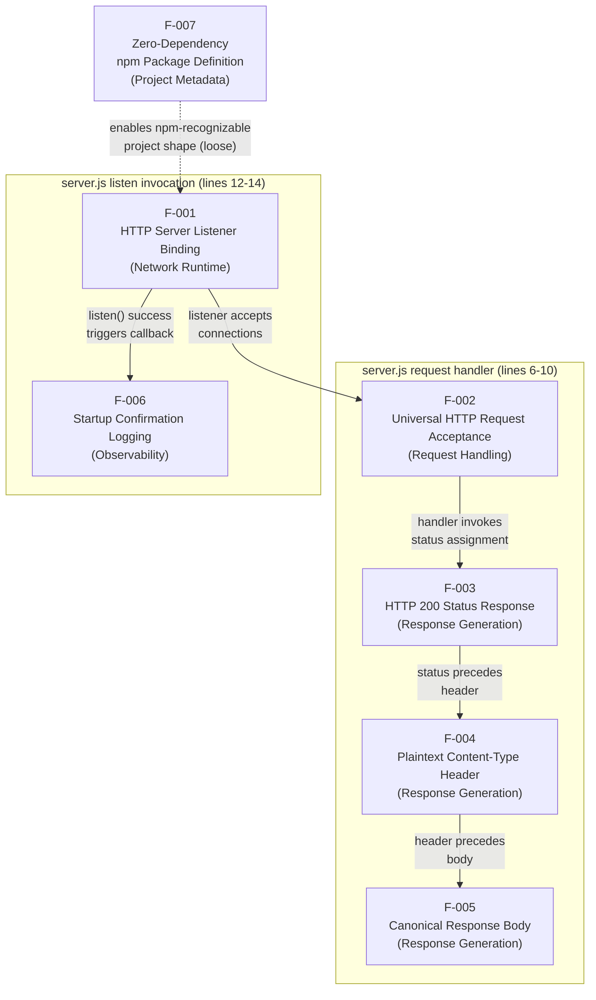

### 2.3.2 Integration Points

| Integration Point | Type | Status |
|---|---|---|
| HTTP endpoint `127.0.0.1:3000` | Inbound network surface | Implemented; sole runtime integration point |
| External "backprop" workflow | Implicit consumer | Referenced in `README.md`; not implemented in this repository (per §1.2.1.3) |
| Process stdout | Outbound observability surface | Implemented via F-006 startup banner |
| Declared `index.js` entrypoint | npm metadata reference | Unresolved — file does not exist (per §1.3.3.3) |

### 2.3.3 Shared Components

| Shared Component | Consumed By | Source |
|---|---|---|
| `hostname` constant (`127.0.0.1`) | F-001 (bind), F-006 (banner template) | `server.js` line 3 |
| `port` constant (`3000`) | F-001 (bind), F-006 (banner template) | `server.js` line 4 |
| Node.js `http` module | F-001 (`createServer`, `listen`), F-002 (handler signature), F-003 (`statusCode`), F-004 (`setHeader`), F-005 (`end`) | `server.js` line 1 (`require('http')`) |
| `server` object | F-001 (`listen` target), F-002–F-005 (handler closure) | `server.js` line 6 |

### 2.3.4 Common Services

The system exposes and consumes **no** common services in the enterprise sense. Per §1.2.1.3, the repository contains:

- No outbound network calls (no HTTP clients, no SDKs)
- No environment configuration (no `.env`, no `config/` directory)
- No external service clients (no database drivers, no message-queue clients)
- No CI/CD configuration (no workflow files, no Dockerfile)

Consequently, no shared service layer mediates between features. Each feature's implementation is a lexically adjacent statement in `server.js`, and inter-feature coupling is exclusively local-variable and function-closure based.

## 2.4 Implementation Considerations

This section documents the technical constraints, performance properties, scalability characteristics, security implications, and maintenance posture that govern each feature. As established in §1.2.3.3, **no formal KPIs, SLAs, latency targets, throughput goals, or availability commitments are documented in the repository**. The performance and scalability subsections therefore describe only observable, structural properties — not numeric targets.

### 2.4.1 Technical Constraints

| Feature | Technical Constraint |
|---|---|
| F-001 | Bind address (`127.0.0.1`) and port (`3000`) are hard-coded module-level constants — no runtime override |
| F-002 | Single anonymous handler — no routing, no middleware chain, no method dispatch |
| F-003 | Status is set imperatively before headers are flushed; cannot be changed after `res.end` |
| F-004 | `setHeader` must be called before `res.end`; ordering is imposed by Node's response lifecycle |
| F-005 | Response body is a string literal — must remain byte-exact per the canonical contract |
| F-006 | Banner uses `console.log` (synchronous on TTY, may be asynchronous on pipes — Node default behavior) |
| F-007 | `lockfileVersion: 3` requires npm 7+ on any host that re-runs `npm install` (per §1.3.1.4) |

### 2.4.2 Performance Requirements

The repository documents no numeric performance targets. The following observable performance properties are inferred from the implementation structure (per §1.2.2.3) and are recorded for completeness; they are **not** acceptance criteria.

| Feature | Observable Performance Property |
|---|---|
| F-001 | One-time `listen` cost at startup; thereafter, accept loop is handled by Node's libuv |
| F-002 | Handler invocation has no parsing or routing overhead beyond Node's HTTP framing |
| F-003, F-004, F-005 | Fully synchronous response generation — deterministic latency, no async I/O in the response path (per §1.2.2.3) |
| F-006 | Banner emitted exactly once at startup; no per-request logging overhead |
| F-007 | Zero `npm install` time required; no dependency resolution at runtime |

### 2.4.3 Scalability Considerations

| Feature | Scalability Consideration |
|---|---|
| F-001 | Loopback bind precludes horizontal distribution to other hosts (per §1.3.2 system boundary) |
| F-002 | No connection limit, queueing, or back-pressure logic — relies on Node default semantics |
| F-003–F-005 | Stateless responses — any number of concurrent requests can be served without contention on shared state |
| F-006 | Single-emission banner does not scale with traffic |
| F-007 | Zero-dependency posture means horizontal duplication of the fixture (running it on multiple loopback hosts) requires no coordinated dependency management |

The system is **not designed for scale-out**. Per §1.3.2, the implementation boundary is "a single Node.js process exposing a single HTTP listener on `127.0.0.1:3000`." Multi-process, multi-host, or load-balanced deployments are not in scope (per §1.3.3.4).

### 2.4.4 Security Implications

| Feature | Security Implication |
|---|---|
| F-001 | Loopback bind prevents off-host exposure — the server is not reachable from the network (per §1.3.2) |
| F-002 | No authentication or authorization is performed; any local-host process can elicit the response (per §1.3.3.1) |
| F-003 | Status-code fixity provides no information leakage about server state |
| F-004 | Fixed `text/plain` content-type prevents MIME-confusion exploits against the static body |
| F-005 | Response body contains no sensitive data; static literal cannot exfiltrate state |
| F-006 | Startup banner contains only the loopback URL — no credentials, no environment data |
| F-007 | Zero third-party dependencies eliminate supply-chain attack surface |

The system has **no TLS/HTTPS support** (per §1.3.3.1); transport-layer encryption is not implemented and is out of scope. Loopback confinement is the sole network-security control.

### 2.4.5 Maintenance Requirements

The maintenance posture for every feature is governed by the README directive **"Do not touch!"** (per §1.1.1). This directive elevates behavioral immutability above feature growth (per §1.1.4) and creates a strong presumption against modification.

| Feature | Maintenance Requirement |
|---|---|
| F-001 | Bind constants must remain `127.0.0.1` and `3000`; any change breaks the canonical operator workflow |
| F-002 | Handler must remain a single anonymous function — adding routing would violate the "uniform response" contract |
| F-003, F-004, F-005 | Response triple (status, content-type, body) is the canonical contract; no field may drift |
| F-006 | Banner format is the sole readiness signal; any change breaks downstream readiness scrapers |
| F-007 | Dependency graph must remain empty to preserve "zero-install execution" (per §1.2.3.2) |

Because no automated tests exist (`npm test` always fails per §1.3.4), regression detection relies entirely on manual verification against the acceptance criteria in §2.2. Any future maintenance activity should re-establish a working test script before introducing behavioral changes.

## 2.5 Traceability Matrix

The matrix below maps each requirement to its source-file evidence and to the upstream tech-spec sections that motivate it. This enables bidirectional traceability from requirement → code → specification.

### 2.5.1 Requirement-to-Source Traceability

| Requirement ID | Source File | Evidence Site |
|---|---|---|
| F-001-RQ-001 | `server.js` | Lines 3–4 (constants), line 12 (`server.listen`) |
| F-002-RQ-001 | `server.js` | Line 6 (`http.createServer((req, res) => …)`) |
| F-003-RQ-001 | `server.js` | Line 7 (`res.statusCode = 200`) |
| F-004-RQ-001 | `server.js` | Line 8 (`res.setHeader('Content-Type', 'text/plain')`) |
| F-005-RQ-001 | `server.js` | Line 9 (`res.end('Hello, World!\n')`) |
| F-006-RQ-001 | `server.js` | Lines 12–14 (`server.listen(... callback with console.log)`) |
| F-007-RQ-001 | `package.json` | Entire manifest (`name`, `version`, `description`, `main`, `scripts`, `author`, `license`) |
| F-007-RQ-002 | `package.json`; `package-lock.json` | Absent dependency blocks; `lockfileVersion: 3` with empty package graph |

### 2.5.2 Requirement-to-Specification Traceability

| Requirement ID | Tech Spec Anchor | Anchor Type |
|---|---|---|
| F-001-RQ-001 | §1.3.1.1 "Listen on TCP port 3000 (loopback)"; §1.2.3.1 "Server binds correctly" | Capability + Objective |
| F-002-RQ-001 | §1.3.1.1 "Accept any HTTP request"; §1.2.2.3 "Single anonymous request handler" | Capability + Design Choice |
| F-003-RQ-001 | §1.3.1.1 "Return HTTP 200 status"; §1.2.3.1 "Response status — HTTP status code is 200" | Capability + Objective |
| F-004-RQ-001 | §1.3.1.1 "Return plaintext content type"; §1.2.2.3 "text/plain response" | Capability + Design Choice |
| F-005-RQ-001 | §1.3.1.1 "Return body Hello, World!\\n"; §1.2.3.1 "Response correctness" | Capability + Objective |
| F-006-RQ-001 | §1.3.1.1 "Emit startup confirmation to stdout"; §1.2.3.1 "Server starts" | Capability + Objective |
| F-007-RQ-001 | §1.1.1 dual-identifier table; §1.1.3 author/license attribution | Identity + Stakeholder |
| F-007-RQ-002 | §1.2.1.3 "No third-party npm dependencies"; §1.2.3.2 "Zero-install execution" | Integration + Success Factor |

### 2.5.3 Out-of-Scope Capability Reference

For traceability, the following capabilities — explicitly excluded per §1.3.3.1 — have **no associated requirements** in this section because they have no implementation in the repository. They are listed here so reviewers can confirm the absence is intentional rather than an oversight.

| Excluded Capability | Reason for No Requirement |
|---|---|
| HTTP request routing | Not implemented; uniform response is the contract (per §1.2.2.3) |
| HTTP method differentiation | Method not inspected (per §1.3.3.1) |
| Authentication / authorization | No middleware, no credential handling (per §1.3.3.1) |
| TLS / HTTPS | `http.createServer` used, not `https.createServer` (per §1.3.3.1) |
| Persistent storage | No DB, no FS writes, no cache (per §1.3.3.1) |
| Per-request logging | Only startup banner is logged (per §1.3.3.1) |
| Configuration management | Hostname/port hard-coded (per §1.3.3.1) |
| Public-internet exposure | Loopback-only bind (per §1.3.3.4) |
| Test automation | `npm test` always exits 1 (per §1.3.4) |
| CI/CD | No workflow, Dockerfile, or manifests (per §1.3.3.1) |
| Industry-data processing | `industry.csv` not loaded by any code (per §1.3.3.1) |
| Java login functionality | `LoginTest.java` non-compilable (per §1.3.3.1) |

## 2.6 Assumptions and Constraints

### 2.6.1 Assumptions

The requirements catalog above assumes the following operating environment conditions, all of which are implied by the repository content and §1.3.1:

| ID | Assumption |
|---|---|
| A-001 | A Node.js runtime supporting `http.createServer` and `server.listen` is installed on the host (any modern Node.js LTS satisfies this, per §1.3.1.4) |
| A-002 | TCP port `3000` is available on the host (per §1.2.3.2 critical success factor) |
| A-003 | The loopback interface (`127.0.0.1`) is reachable from the same host (per §1.3.1.3) |
| A-004 | An operator launches the server with `node server.js` from the repository root (per §1.3.1.2 step 1) |
| A-005 | Process stdout is writable (required for F-006 banner emission) |

### 2.6.2 Constraints (Known Inconsistencies)

The following inconsistencies — reproduced from §1.3.4 — constrain how requirements are interpreted and tested. They are surfaced here to ensure verification activities account for them.

| ID | Constraint |
|---|---|
| C-001 | **Dual project identifier**: `README.md` uses `hao-backprop-test`; `package.json` `name` is `hello_world`. Both identifiers are treated as valid for the same project; F-007-RQ-001 documents the manifest value. |
| C-002 | **Missing declared entrypoint**: `package.json` declares `main: "index.js"` but `index.js` does not exist. The actual operator entrypoint is `node server.js`. |
| C-003 | **Non-functional test script**: `scripts.test` is hard-coded to `exit 1`; `npm test` always fails. Acceptance verification must rely on manual or external testing harnesses. |
| C-004 | **Empty ignore-rule files**: All three `*.blitzyignore.txt` files are empty placeholders; no ignore rules are in effect. |
| C-005 | **Duplicate `- Copy` files**: `server - Copy.js`, `industry - Copy.csv`, `LoginTest - Copy.java`, `test.py - Copy.txt` are byte-identical duplicates with no separate role; they are not features. |
| C-006 | **Cross-language inert artifacts**: `LoginTest.java`, `industry.csv`, `test.py.txt` and their duplicates coexist with the Node runtime but are not wired into `server.js` or `package.json`. They MUST NOT be treated as features (per §1.2.2.2). |

### 2.6.3 Requirement Versioning

All requirements documented in this section correspond to repository state at `package.json` `version: 1.0.0`. The repository contains no roadmap, backlog, or future-phase document (per §1.3.3.2); all requirements are therefore frozen against the current 1.0.0 release. Any future modification to the requirements baseline would coincide with a `package.json` version bump and a corresponding revision to this Technical Specification.

#### References

#### Files Examined

- `server.js` — Sole functional runtime artifact; primary evidence source for requirements F-001-RQ-001 through F-006-RQ-001
- `package.json` — npm manifest; evidence source for F-007-RQ-001 (metadata fields) and F-007-RQ-002 (absence of dependency blocks)
- `package-lock.json` — Lockfile (`lockfileVersion: 3`); confirms empty dependency graph for F-007-RQ-002
- `README.md` — Source of project identifier `hao-backprop-test`, the "Do not touch!" directive (governing maintenance posture for all features), and the implicit "backprop" integration reference
- `server - Copy.js` — Verified byte-identical duplicate of `server.js`; confirms it is an inert artifact and not a separate feature

#### Folders Explored

- `/` (repository root, depth 0) — The only folder in the repository; contains all 14 files; no subdirectories exist

#### Tech Spec Sections Referenced

- §1.1 EXECUTIVE SUMMARY — Project identity, dual-name issue, value proposition (Predictability, Zero environmental coupling, Trivial startup), stakeholder roster, "Do not touch!" directive
- §1.2 SYSTEM OVERVIEW — Primary system capability, component classification, system topology, success criteria (observable signals), no-KPI declaration, design rationale
- §1.3 SCOPE — Must-have capabilities table, primary user workflow, essential integrations, in-scope boundaries, out-of-scope exclusions, future-phase non-existence, known inconsistencies

#### External References

- None. No web searches were performed. The requirements catalog is derived exclusively from repository artifacts and the cross-referenced Technical Specification sections listed above.

# 3. Technology Stack

## 3.1 STACK OVERVIEW AND ARCHITECTURAL POSTURE

### 3.1.1 Deliberate Minimalism as an Architectural Decision

The technology stack of this repository is intentionally austere. The system is a single-purpose Node.js HTTP fixture whose entire functional surface comprises 14 lines of JavaScript in `server.js`, governed by the `README.md` directive "Do not touch!" (per §1.1.1, §2.4.5). Every technology selection — and, more importantly, every technology *exclusion* — reinforces three explicit value properties documented in upstream sections: **predictable behavior**, **zero environmental coupling**, and **trivial startup**.

The stack is therefore composed of:

- **Exactly one programming language** (JavaScript, CommonJS module system)
- **Exactly one runtime** (Node.js, with no version lower-bound declared)
- **Exactly one library** (Node.js's built-in `http` module — i.e., the standard library)
- **Zero third-party packages** (per `package.json` and `package-lock.json`)
- **Zero build, container, CI/CD, cloud, database, or authentication tooling**

The maintenance posture per §2.4.5 elevates "behavioral immutability above feature growth," which makes the dependency graph itself a frozen artifact: F-007-RQ-002 mandates that the project "MUST declare zero production and zero development npm dependencies."

### 3.1.2 Non-Applicability of the Default Technology Stack

The Default Technology Stack proposed in the project prompt (AWS, Docker, Terraform, GitHub Actions, Python, Flask, Auth0, MongoDB, Langchain, React with TypeScript, TailwindCSS, React-Native, Swift, Kotlin, Objective-C, ElectronJS) is **not applicable to this repository**. None of these technologies are present, configured, referenced, or implied anywhere in the codebase. Per the factual-grounding constraint of this Technical Specification, this section documents only what is empirically observable in the repository.

The following table provides a definitive, evidence-based reconciliation between the proposed default stack and the actual stack:

| Default-Stack Category | Default Technology | Actual State in Repository | Evidence |
|---|---|---|---|
| Cloud Platform | AWS | Not used | No SDK, no IAM config, no service references (per §1.2.1.3) |
| Containerization | Docker | Not used | No `Dockerfile`, no `docker-compose.yml`, no `.dockerignore` (per §1.3.3.1) |
| Infrastructure as Code | Terraform | Not used | No `.tf` files, no IaC manifests of any kind (per §1.3.3.1) |
| CI/CD | GitHub Actions | Not used | No `.github/workflows/`, no pipeline config of any kind (per §1.3.3.1) |
| Backend Language | Python | Not used | `test.py.txt` is a metadata artifact, not Python source (per C-006) |
| Backend Framework | Flask | Not used | Zero web frameworks present (per §2.4.1, F-002) |
| Authentication | Auth0 | Not used | "No middleware, no credential handling, no session management" (per §1.3.3.1) |
| Database | MongoDB | Not used | "No database driver, no filesystem writes, no caching layer" (per §1.3.3.1) |
| AI Framework | Langchain | Not used | No AI/ML libraries; zero npm dependencies |
| Frontend | React + TypeScript | Not used | No frontend exists; the system is server-only |
| CSS Framework | TailwindCSS | Not used | No frontend, no stylesheets |
| Mobile | React-Native | Not used | No mobile component |
| iOS | Swift | Not used | No native applications |
| Android | Kotlin | Not used | No native applications |
| MacOS | Objective-C | Not used | No native applications |
| Desktop | ElectronJS | Not used | No desktop application |

### 3.1.3 Technology Surface Diagram

The following diagram illustrates the actual, complete technology surface of the repository. Solid lines represent operational technology coupling; dotted lines represent declared but unused metadata; the gray subgraph contains technologies categorically absent from the system:

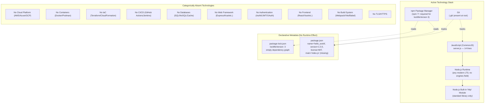

---

## 3.2 PROGRAMMING LANGUAGES

### 3.2.1 Functional Language: JavaScript on Node.js

| Attribute | Value | Evidence |
|---|---|---|
| Language | JavaScript (ECMAScript) | `server.js` source |
| Module system | CommonJS | `require('http')` syntax in `server.js` line 1 |
| Runtime | Node.js | Node-specific `http.createServer` API |
| Minimum version | Not declared | No `engines` field in `package.json` |
| Effective constraint | Any modern Node.js LTS | Per §1.3.1.4 — runtime must support `http.createServer` and `server.listen` |

JavaScript on Node.js is the **sole runtime language**. The functional implementation lives entirely in `server.js`, with `server - Copy.js` constituting a byte-identical duplicate that is not wired into the runtime path (per §1.2.2.2 and C-005).

#### 3.2.1.1 Selection Rationale

The choice of Node.js JavaScript is justified by three properties enumerated in §1.2.2.3 (Core Technical Approach):

1. **Zero-install execution**: Node.js ships with a built-in `http` module, eliminating any need for `npm install`. This directly satisfies the critical success factor "the server must run on any Node.js installation without `npm install`" (per §1.2.3.2).
2. **Cross-host portability**: Node.js LTS distributions are uniformly available across operating systems, making the fixture portable to any environment a "backprop" workflow consumer might run.
3. **Synchronous response generation**: The chosen API surface allows for "fully synchronous response generation — deterministic latency, no async I/O in the response path" (per §2.4.2 F-003–F-005).

#### 3.2.1.2 Constraints and Dependencies

- **Runtime requirement** (A-001 per §2.6.1): "A Node.js runtime supporting `http.createServer` and `server.listen` is installed on the host (any modern Node.js LTS satisfies this)."
- **No transpilation layer**: Source is shipped and executed as plain JavaScript — there is no TypeScript, no Babel, no esbuild step.
- **No language-version pinning**: The absence of an `engines` field in `package.json` means the project does not enforce a Node.js floor version; this is a deliberate trade-off favoring portability over predictability.

### 3.2.2 Inert Language Artifacts (Non-Functional)

The repository contains files in two additional languages that are **explicitly not part of the technology stack**. They are surfaced here for completeness because their presence in the file tree could otherwise mislead a reader into assuming polyglot status. Per constraint C-006 (§2.6.2), these artifacts "MUST NOT be treated as features."

| Apparent Language | File(s) | Actual Status |
|---|---|---|
| Java | `LoginTest.java`, `LoginTest - Copy.java` | Non-compilable skeleton in `com.blitzyTest` package, contains a stray `Web` token; not loaded by any runtime (per C-006) |
| Python (by extension) | `test.py.txt`, `test.py - Copy.txt` | Despite the `.py` extension, contains a code-graph JSON-style record describing `LoginTest.java` — not Python source code (per §1.2.2.2) |

These files are documented here only to forestall the misinterpretation that the repository is a polyglot system. There is no JVM, Python interpreter, or related toolchain dependency.

### 3.2.3 Language Selection Decision Matrix

| Criterion | JavaScript/Node.js | Why It Wins |
|---|---|---|
| Zero-install execution | Native `http` module ships with runtime | Critical success factor per §1.2.3.2 |
| Smallest viable HTTP server | 14-line implementation possible | Aligns with §1.2.2.3 design philosophy |
| Predictable latency | Synchronous response path | Per §2.4.2 |
| Zero supply-chain surface | No external libraries needed | Satisfies F-007-RQ-002 mandate |
| Cross-platform availability | Node.js LTS available everywhere | Reduces operator friction (per §1.3.1.2) |

---

## 3.3 FRAMEWORKS AND LIBRARIES

### 3.3.1 Web Frameworks: Categorically Absent

**No web framework is used.** This is a deliberate architectural choice with the following evidence and rationale:

- **Evidence (declarative)**: `package.json` declares no `dependencies` block; `package-lock.json` (`lockfileVersion: 3`) records only the root package with an empty `packages` graph.
- **Evidence (functional)**: `server.js` uses only `require('http')` — there is no `require('express')`, `require('koa')`, `require('fastify')`, or equivalent.
- **Architectural rationale (per §2.4.1, F-002)**: "Single anonymous handler — no routing, no middleware chain, no method dispatch." The system's contract is that *every* HTTP request receives the same response; a router or middleware framework would add functionality without serving any documented requirement.

Frameworks explicitly absent and the reason each is unnecessary:

| Framework Class | Examples | Reason for Absence |
|---|---|---|
| Web frameworks | Express, Koa, Hapi, Fastify, NestJS | No routing, middleware, or method dispatch is required |
| Frontend frameworks | React, Vue, Angular, Svelte | The system has no frontend; it serves `text/plain` only |
| AI / LLM frameworks | Langchain, LlamaIndex | The system performs no AI/ML work |
| ORM / data layer | Sequelize, Prisma, Mongoose, TypeORM | No persistence layer exists (per §1.3.3.1) |
| Auth frameworks | Passport, Auth0 SDKs, NextAuth | No authentication is performed (per §1.3.3.1) |
| Validation | Joi, Zod, Yup | No request payloads are inspected |
| Testing | Jest, Mocha, Vitest, Tape | `npm test` is hard-coded to fail (per C-003) |

### 3.3.2 Node.js Standard Library Modules in Use

The complete library inventory of the system is captured below. This table represents the **entire** runtime library footprint:

| Module | Type | Usage | Site |
|---|---|---|---|
| `http` | Built-in (standard library) | `http.createServer`, `server.listen` | `server.js` line 1 |
| `console` | Global object (standard library) | Startup banner emission via `console.log` | `server.js` line 13 |

Both are part of the Node.js runtime distribution and require no separate installation, configuration, or version pinning.

### 3.3.3 Compatibility Requirements

| Requirement | Specification | Source |
|---|---|---|
| Node.js API surface | Must support `http.createServer` and `server.listen` | A-001 (§2.6.1), §1.3.1.4 |
| npm tooling version | npm 7+ if `npm install` is ever invoked | `lockfileVersion: 3` in `package-lock.json`, §1.3.1.4, §2.4.1 F-007 |
| Operating system | Any OS providing a TCP/IP stack with loopback | A-003 (§2.6.1) |
| Available port | TCP port `3000` must be free on the host | A-002 (§2.6.1), §1.2.3.2 |
| Standard output | Process stdout must be writable | A-005 (§2.6.1) |

---

## 3.4 OPEN SOURCE DEPENDENCIES

### 3.4.1 Production Dependencies

**Count: 0**

`package.json` contains no `dependencies` block. `package-lock.json` (`lockfileVersion: 3`) records only the root package with an empty `packages` graph (just the root entry containing `name`, `version`, and `license`). This empty state is not incidental — it is mandated by F-007-RQ-002, which requires that "the project MUST declare zero production and zero development npm dependencies."

### 3.4.2 Development Dependencies

**Count: 0**

`package.json` likewise contains no `devDependencies` block. There are no dev tools (linters, formatters, test runners, type checkers, build tools) declared at the npm-manifest level.

### 3.4.3 Package Registry Configuration

| Aspect | Configuration |
|---|---|
| Private/scoped registry | None configured (no `.npmrc` file present) |
| Default registry | npm public registry (would apply *if* dependencies were ever added — they are not) |
| Authentication tokens | None — no credentials are stored or required |
| Lockfile format | `lockfileVersion: 3` (npm 7+ compatible) |

### 3.4.4 Package Metadata (`package.json`)

The complete metadata surface declared by `package.json`:

| Field | Value | Notes |
|---|---|---|
| `name` | `hello_world` | Conflicts with `README.md`'s `hao-backprop-test` — see C-001 |
| `version` | `1.0.0` | Frozen baseline; no roadmap exists (per §1.3.3.2) |
| `description` | `Hello world in Node.js` | Concise functional description |
| `main` | `index.js` | **Inconsistency C-002**: `index.js` does not exist; the actual entrypoint is `server.js` |
| `scripts.test` | `echo "Error: no test specified" && exit 1` | **Inconsistency C-003**: `npm test` always fails |
| `author` | `hxu` | — |
| `license` | `MIT` | Permissive open-source license |

### 3.4.5 Justification for Zero-Dependency Posture

The zero-dependency design choice is supported by four documented architectural properties:

1. **Eliminates supply-chain attack surface** (per §2.4.4 F-007): "Zero third-party dependencies eliminate supply-chain attack surface." This is the system's primary supply-chain security control.
2. **Enables zero-install execution** (per §1.2.3.2): The fixture runs without `npm install`, removing a class of failure modes (registry availability, transitive dependency resolution, lockfile drift).
3. **Preserves behavioral immutability** (per §2.4.5 F-007): A frozen dependency graph means no transitive updates can perturb the canonical response contract.
4. **Eliminates licensing-review burden**: With no third-party code embedded, the only license that applies to the runtime artifact is the MIT license declared in `package.json`.

---

## 3.5 THIRD-PARTY SERVICES

### 3.5.1 External APIs and Integrations

**None.** Per §1.2.1.3:

- **No outbound network calls** — the server only accepts inbound HTTP requests.
- **No external service clients** — no SDKs, no API credentials, no database drivers.

The only network behavior in the system is the inbound TCP listener bound to `127.0.0.1:3000`.

### 3.5.2 Authentication Services

**None.** Per §1.3.3.1, the system has "No middleware, no credential handling, no session management." Per §2.4.4 (F-002 security): "No authentication or authorization is performed; any local-host process can elicit the response."

This is acceptable because the loopback bind (per §1.3.2) confines the system to processes already running on the same host as the server. Off-host actors cannot reach the listener at all.

### 3.5.3 Monitoring and Observability Tools

**None.** The complete observability surface of the system is the single `console.log` startup banner emitted by Feature F-006:

```
Server running at http://127.0.0.1:3000/
```

Per §1.3.3.1, the system has "No request log, no error log, no structured logging library." There are no APM agents (Datadog, New Relic, AppDynamics), no metrics exporters (Prometheus, StatsD), no tracing libraries (OpenTelemetry, Jaeger), and no log aggregation clients.

### 3.5.4 Cloud Services

**None.** No AWS, Azure, GCP, or other cloud-provider SDK is present. No service-account credentials, no managed-service clients, no cloud-storage references exist anywhere in the codebase.

The system boundary per §1.3.2 is "a single Node.js process exposing a single HTTP listener on `127.0.0.1:3000`." Per the same section, "Geographic / market coverage" is "Not applicable — the loopback bind prevents any geographic distribution," which categorically rules out cloud deployment patterns.

### 3.5.5 The Single Conceptual Integration Point

The **only** integration referenced anywhere in the repository is the implicit "backprop" workflow mentioned in `README.md`. Per §1.3.3.3 and §2.3.2, this integration is:

- **External system**: Not defined or implemented in this repository.
- **Direction**: The backprop workflow is assumed to act as a *client* of the Node.js server (i.e., it makes inbound HTTP requests to `127.0.0.1:3000`).
- **Contract**: The implicit contract is that the backprop workflow observes the canonical HTTP 200 / `text/plain` / `Hello, World!\n` response.

There is no SDK, no shared protocol library, and no configuration coupling the two systems. The integration is purely behavioral.

---

## 3.6 DATABASES AND STORAGE

### 3.6.1 Primary and Secondary Databases

**None.** Per §1.3.3.1, the system has "No database driver, no filesystem writes, no caching layer." There is:

- No relational database (PostgreSQL, MySQL, SQLite)
- No document database (MongoDB, CouchDB, DynamoDB)
- No key-value store (Redis, Memcached)
- No graph database (Neo4j, ArangoDB)
- No time-series database (InfluxDB, TimescaleDB)
- No search index (Elasticsearch, OpenSearch)

### 3.6.2 Data Persistence Strategy

**Stateless by design.** Per §1.3.2 ("Data domains included"): "None — the server returns a static string and persists no data." Per §2.4.3 (F-003–F-005 scalability): "Stateless responses — any number of concurrent requests can be served without contention on shared state."

The static response body `Hello, World!\n` is hard-coded as a string literal in `server.js` and is therefore part of the source-code artifact rather than any runtime data store.

### 3.6.3 Caching Solutions

**None.** No application-level cache, no Redis/Memcached client, no HTTP-response cache, no CDN integration. The response is fully static and synchronously generated; caching would provide no benefit.

### 3.6.4 Storage Services

**None.** No object storage (S3, Azure Blob, GCS), no file system writes (the server makes no `fs.write*` calls), no temp-file usage, no upload handling.

### 3.6.5 Static Reference Data (Inert, Not Loaded)

The repository contains a static CSV file that warrants explicit acknowledgment because its presence could be misread as implying a data layer:

| File | Content | Operational Status |
|---|---|---|
| `industry.csv` | 44 rows: header `Industry` plus 43 industry categories ("Accounting/Finance" through "Other") | **Not loaded by any code** (per §1.3.3.1) |
| `industry - Copy.csv` | Byte-identical duplicate of `industry.csv` | Inert (per C-005) |

Per constraint C-006 (§2.6.2), these CSV files are "cross-language inert artifacts" that "MUST NOT be treated as features." They contribute zero technology dependencies to the system.

---

## 3.7 DEVELOPMENT AND DEPLOYMENT

### 3.7.1 Development Tools

| Tool Category | Status | Evidence |
|---|---|---|
| Package manager | npm (npm 7+ required) | Implied by `package.json` and `package-lock.json` (`lockfileVersion: 3`) |
| Linter | Not configured | No `.eslintrc*`, no `.eslint.config.*` |
| Formatter | Not configured | No `.prettierrc*`, no `.editorconfig` |
| Type checker | Not configured | No `tsconfig.json`; the project is plain JavaScript, not TypeScript |
| Test framework | Not configured | `scripts.test` is `echo "Error: no test specified" && exit 1` (per C-003) |
| Bundler | Not used | No webpack, Rollup, esbuild, Vite, or Parcel config |
| Transpiler | Not used | No Babel or SWC config |
| Documentation generator | Not configured | No JSDoc, TypeDoc, or similar |

The development surface is intentionally minimal. The `README.md` directive "Do not touch!" combined with the absence of test infrastructure (per §2.4.5) means that any maintenance activity "should re-establish a working test script before introducing behavioral changes."

### 3.7.2 Build System

**None — no build step is required.** Per §1.2.3.2, "the server must run on any Node.js installation without `npm install`." The operator workflow per §1.3.1.2 is:

1. Run `node server.js` from the repository root.
2. Observe the startup banner.
3. Issue HTTP requests against `127.0.0.1:3000`.

No compilation, transpilation, bundling, minification, or asset-pipeline step exists between the source code and the running process. `server.js` is both the source artifact and the runtime artifact.

### 3.7.3 Containerization

**None.** Per §1.2.1.3 and §1.3.3.1: "No CI/CD configuration — no workflow files, no Dockerfile, no deployment manifests." Specifically:

- No `Dockerfile`
- No `docker-compose.yml`
- No `.dockerignore`
- No Kubernetes manifests (`Deployment`, `Service`, `Ingress`, etc.)
- No Helm charts
- No container registry references

Containerization is not required because the system's deployment model is "operator runs `node server.js` from the repository root" — a flow that requires only a Node.js runtime.

### 3.7.4 CI/CD Pipeline

**None.** Per §1.3.3.1: "Continuous integration / delivery | No CI workflow files, Dockerfile, or deployment manifests are present." Filesystem inspection confirms:

- No `.github/workflows/` directory
- No `.gitlab-ci.yml`
- No `Jenkinsfile`
- No `.circleci/` directory
- No `.travis.yml`
- No `azure-pipelines.yml`
- No `bitbucket-pipelines.yml`

Combined with the non-functional `npm test` script (C-003), this means the system has **no automated quality gate of any kind**. Per §2.4.5, "regression detection relies entirely on manual verification against the acceptance criteria in §2.2."

### 3.7.5 Version Control

| Aspect | Configuration |
|---|---|
| VCS | Git |
| Evidence | `.git/` directory present at repository root |
| Hosting platform | Not declared in repository (no `.git/config` references shipped) |
| Branching strategy | Not documented |
| Commit-message conventions | Not documented |

Three placeholder files relate to ignore-rule enforcement, but all are empty:

| File | Size | Effect |
|---|---|---|
| `.blitzyignore.txt` | 0 bytes | No ignore rules in effect |
| `test.blitzyignore.txt` | 0 bytes | No ignore rules in effect |
| `test1.blitzyignore.txt` | 0 bytes | No ignore rules in effect |

Per constraint C-004 (§2.6.2), these empty ignore-rule files are inert placeholders.

### 3.7.6 Infrastructure as Code

**None.** No Terraform (`*.tf`), CloudFormation (`*.cfn.yml`), Ansible (`playbook.yml`), Pulumi, or CDK configuration exists. The system's "infrastructure" is the single host running `node server.js`.

### 3.7.7 Configuration Management

**Hard-coded values only.** Per §1.2.1.3:

- `hostname` (`127.0.0.1`) is hard-coded in `server.js` line 3
- `port` (`3000`) is hard-coded in `server.js` line 4

Per §1.3.3.1, "Hostname and port are hard-coded; no `.env`, no `config/`." There is:

- No `.env` file or `dotenv` library
- No `config/` directory
- No environment-variable consumption (`process.env.*` is not referenced)
- No CLI argument parsing
- No runtime configuration override mechanism

This is consistent with constraint F-001 (§2.4.1): "Bind address (`127.0.0.1`) and port (`3000`) are hard-coded module-level constants — no runtime override."

### 3.7.8 Operator Deployment Workflow Diagram

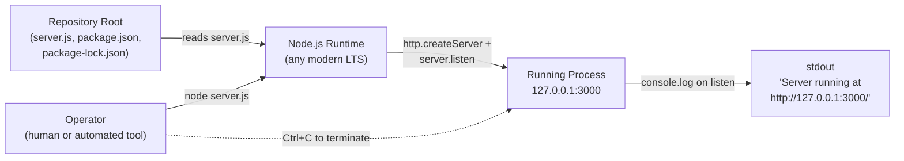

---

## 3.8 SECURITY CONSIDERATIONS OF TECHNOLOGY CHOICES

### 3.8.1 Network Security Posture

The technology stack provides exactly one network-layer security control: **loopback confinement**. Per §2.4.4 (F-001):

- The server binds to `127.0.0.1`, not `0.0.0.0`.
- This binding "prevents off-host exposure — the server is not reachable from the network."
- The loopback bind is also "the sole network-security control."

No firewall rules, ACLs, network policies, or segmentation primitives are applied at the application layer.

### 3.8.2 Supply-Chain Security

The zero-dependency posture is itself the supply-chain security control. Per §2.4.4 (F-007): "Zero third-party dependencies eliminate supply-chain attack surface." This means the system is structurally immune to:

- Typosquatting attacks against npm packages
- Compromised maintainer accounts of upstream libraries
- Transitive-dependency confusion
- Lockfile-injection attacks
- Postinstall-script malware

The trade-off is that the system also forgoes any security *benefits* libraries might have provided (e.g., hardened HTTP parsers, rate limiters). For a fixture confined to loopback that returns a static string, this trade-off is sound.

### 3.8.3 Transport-Layer Security

**No TLS/HTTPS support.** Per §1.3.3.1, the server is "created with `http.createServer`, not `https.createServer`." Per §2.4.4: "transport-layer encryption is not implemented and is out of scope."

This is acceptable in the documented operating context because the loopback bind ensures all traffic remains on-host (i.e., never traverses an untrusted network). If the bind were ever changed to a non-loopback interface, TLS would become a required addition.

### 3.8.4 Secrets Management

**Not applicable.** The system handles no credentials, API keys, or secrets of any kind. No `.env` file, secrets vault client, KMS integration, or credential store is present. The startup banner per §2.4.4 (F-006) "contains only the loopback URL — no credentials, no environment data."

---

## 3.9 INTEGRATION REQUIREMENTS BETWEEN STACK COMPONENTS

Per §2.3.3, the entire intra-system component coupling within the technology stack is captured by the following table:

| Shared Component | Defined In | Consumed By | Coupling Mechanism |
|---|---|---|---|
| `hostname` constant (`'127.0.0.1'`) | `server.js` line 3 | `server.listen(port, hostname, ...)` (F-001), banner template (F-006) | Local-variable closure |
| `port` constant (`3000`) | `server.js` line 4 | `server.listen(port, hostname, ...)` (F-001), banner template (F-006) | Local-variable closure |
| Node.js `http` module | `require('http')` line 1 | `http.createServer(...)` (F-002 through F-005) | Standard-library import |
| `server` object | `http.createServer(...)` line 6 | `server.listen(...)` line 12 | Lexical reference |

There are **no inter-service or inter-process integrations** beyond local-variable closure within a single 14-line module. The technology stack has no message bus, no RPC framework, no API gateway, no service mesh, and no service registry.

---

## 3.10 TECHNOLOGY STACK SUMMARY MATRIX

The following matrix consolidates every technology decision documented above for quick reference:

| Stack Layer | Technology | Version | Required? | Justification |
|---|---|---|---|---|
| Language | JavaScript (CommonJS) | ECMAScript (any version supported by target Node.js) | Yes | Sole functional language |
| Runtime | Node.js | Any modern LTS (no floor declared) | Yes | Per A-001, §1.3.1.4 |
| Standard library | `http` module | Bundled with Node.js | Yes | Per F-002 |
| Standard library | `console` global | Bundled with Node.js | Yes | Per F-006 |
| Package manager | npm | 7+ (for `lockfileVersion: 3`) | Optional | Required only if dependencies are added (they are not) |
| Lockfile format | `lockfileVersion: 3` | — | Declarative | Per `package-lock.json` |
| License | MIT | — | Declarative | Per `package.json` |
| Version control | Git | Any version | Optional | Repository tracking only |
| Operating system | Any with TCP/IP and loopback | — | Yes | Per A-003 |
| Network | TCP port 3000 (loopback) | — | Yes | Per A-002, F-001 |

---

## 3.11 REFERENCES

#### Files Examined

- `server.js` — The sole 14-line CommonJS HTTP server; primary evidence for JavaScript/Node.js as the functional language and `http` as the only library
- `server - Copy.js` — Byte-identical duplicate of `server.js`; cited as inert artifact (per C-005)
- `package.json` — npm manifest; evidence for project metadata (`name`, `version`, `description`, `main`, `scripts.test`, `author`, MIT license) and the absence of any `dependencies` or `devDependencies` blocks
- `package-lock.json` — `lockfileVersion: 3` lockfile; confirms an empty dependency graph and establishes the npm 7+ tooling requirement
- `README.md` — Source of project identifier `hao-backprop-test`, the "Do not touch!" maintenance directive, and the "backprop integration" reference
- `LoginTest.java`, `LoginTest - Copy.java` — Non-compilable Java skeleton files; cited as inert language artifacts (per C-006)
- `industry.csv`, `industry - Copy.csv` — 43-row industry taxonomy; cited as inert reference data not loaded by any code
- `test.py.txt`, `test.py - Copy.txt` — Code-graph metadata files (despite the `.py` extension); not Python source code
- `.blitzyignore.txt`, `test.blitzyignore.txt`, `test1.blitzyignore.txt` — Empty placeholder files (0 bytes each); cited as inert per C-004

#### Folders Explored

- `/` (repository root, depth 0) — The only folder in the repository; contains all 14 files; no subdirectories exist beyond `.git/`. Filesystem inspection confirmed the absence of `.github/workflows/`, `.circleci/`, `config/`, or any source-organization subdirectories.

#### Tech Spec Sections Referenced

- §1.1 EXECUTIVE SUMMARY — Established "Do not touch!" maintenance directive, project identity, and the "Predictable behavior / Zero environmental coupling / Trivial startup" value triad
- §1.2 SYSTEM OVERVIEW — Provided the no-outbound-calls / no-environment-config / no-external-clients / no-CI-CD / no-third-party-dependencies inventory used throughout this section, plus the design rationale for Node's built-in `http` module, hard-coded loopback bind, single anonymous handler, and `text/plain` response
- §1.3 SCOPE — Source of must-have capabilities, out-of-scope exclusions (frameworks, persistence, TLS, CI/CD, etc.), key technical requirements (Node.js LTS, npm 7+), and the inconsistency catalog (C-001 through C-006)
- §2.1 Feature Catalog — Source of feature identifiers F-001 through F-007 (especially F-007 "Zero-Dependency npm Package Definition") referenced throughout this section
- §2.2 Functional Requirements — Source of F-007-RQ-002, the explicit mandate for "zero production and zero development npm dependencies"
- §2.3 Feature Relationships — Source of the intra-component coupling table in §3.9
- §2.4 Implementation Considerations — Source of technical constraints (§2.4.1), performance properties (§2.4.2), scalability considerations (§2.4.3), security implications (§2.4.4), and the maintenance posture (§2.4.5)
- §2.6 Assumptions and Constraints — Source of assumptions A-001 through A-005 and constraints C-001 through C-006 cited throughout this section

#### External References

- None. No web searches were performed. The technology stack is derived exclusively from repository artifacts (`server.js`, `package.json`, `package-lock.json`, `README.md`) and the cross-referenced Technical Specification sections listed above. The repository declares zero third-party dependencies, contains no version-specific or domain-specific terminology requiring external verification, and the empirical absence of cloud/container/CI-CD/database/framework configuration was confirmed via direct filesystem inspection.

# 4. Process Flowchart

## 4.1 INTRODUCTION AND APPLICABILITY

This section documents the runtime process flows of the system. Because the repository implements exactly one capability — respond to any HTTP request received on `127.0.0.1:3000` with an HTTP 200 response carrying the plaintext body `Hello, World!\n` — and contains no secondary capabilities (no health endpoint, no metrics endpoint, no graceful shutdown handler, no request logging, no error handling beyond Node's defaults), the process flowchart inventory is intentionally minimal. Where customary flowchart concerns (decision diamonds, validation gates, retry mechanisms, transaction boundaries, SLA breach paths) **do not apply**, this section explicitly records their absence with citations rather than fabricating workflows that are not present in code.

The diagrams in this section focus on **runtime process behavior**: the operator-initiated lifecycle, the request-response pipeline, the server lifecycle state machine, the error-condition decomposition, and the implicit backprop integration contract. Static perspectives (system topology in §1.2.2.2, feature dependencies in §2.3.1, technology surface in §3.1.3, and operator deployment in §3.7.8) are intentionally not duplicated here.

## 4.2 SYSTEM WORKFLOWS

### 4.2.1 Core Business Process: Operator-Initiated Server Lifecycle

The system supports exactly one end-to-end user journey, enumerated verbatim in §1.3.1.2: an operator (or automated tool) launches the server with `node server.js` from the repository root; the process binds to `127.0.0.1:3000` and prints the startup banner; any HTTP client on the same host issues a request to `http://127.0.0.1:3000`; the server returns the canonical response; the operator stops the process (e.g., `Ctrl+C`); no graceful-shutdown logic is engaged.

The high-level operational workflow stitches the startup, serve, and termination phases into a single closed-loop diagram. Each step is annotated with its source-line citation in `server.js` so that every node in the flow has a traceable implementation site.

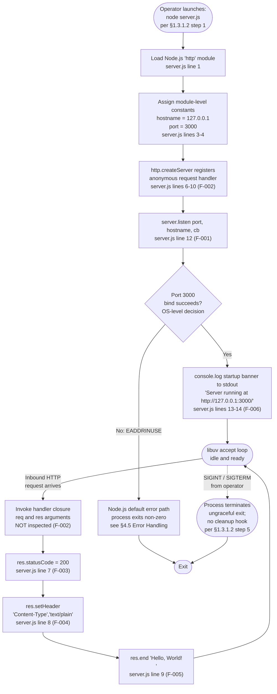

#### 4.2.1.1 Decision Points in the Workflow

The diagram above contains exactly **one decision diamond**: the OS-level outcome of `server.listen`. This is the only conditional control-flow point in the entire system, because the handler does not inspect the request method, URL path, query parameters, or headers; every request is accepted and progresses to the response-generation pipeline. Per §2.2.2.1 (F-002-RQ-001), no request attribute MAY be used to differentiate response (uniform response is the contract). There are therefore no method-dispatch branches, no path-routing branches, no validation rejection branches, and no authentication failure branches anywhere in the request handler.

The single port-bind decision derives from the documented assumption A-002 in §2.6.1 — the bind address (`127.0.0.1`) and port (`3000`) are hard-coded module-level constants — no runtime override — and the corresponding host-availability assumption that availability of TCP port `3000` on the host is required.

### 4.2.2 Detailed Process Flow: Server Startup Sequence

The startup sequence comprises five strictly ordered operations, all executing synchronously on the main event loop before the server enters the accept loop. The sequence is wholly contained in `server.js` lines 1–14 and is governed by the F-001 / F-006 / F-007 feature triad described in §2.1 of the Feature Catalog.

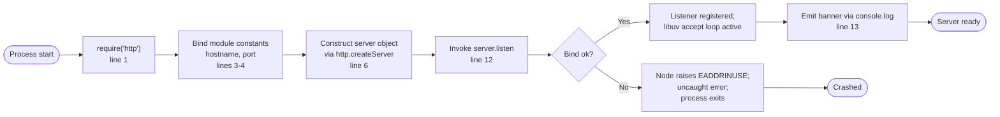

Per §2.4.1 (F-006 technical constraint), banner uses `console.log` (synchronous on TTY, may be asynchronous on pipes — Node default behavior). Per §2.4.2, F-001 incurs one-time `listen` cost at startup; thereafter, accept loop is handled by Node's libuv, and F-006 banner emitted exactly once at startup; no per-request logging overhead. There is no readiness probe, no heartbeat, and no periodic re-emission of the banner; the banner is the sole readiness signal.

### 4.2.3 Detailed Process Flow: Request-Response Pipeline

The request-response pipeline is the system's only per-request flow. It is fully synchronous, branchless, and stateless. Per §2.4.2, F-003, F-004, F-005 fully synchronous response generation — deterministic latency, no async I/O in the response path (per §1.2.2.3). Per §2.4.3, stateless responses — any number of concurrent requests can be served without contention on shared state.

The lexical order of operations inside the handler closure (lines 7 → 8 → 9) is enforced by Node's response lifecycle, not by application logic. Per §2.4.1, F-003: status is set imperatively before headers are flushed; cannot be changed after `res.end` … F-004: `setHeader` must be called before `res.end`; ordering is imposed by Node's response lifecycle.

```mermaid
sequenceDiagram
    actor Client as HTTP Client<br/>(local-host)
    participant TCP as OS TCP/IP Stack<br/>(loopback only)
    participant Node as Node.js HTTP Server<br/>(libuv accept loop)
    participant Handler as Handler Closure<br/>(server.js lines 6-10)
    participant Stdout as stdout

    Note over Stdout: Banner emitted once at startup<br/>(F-006); no per-request logging
    Client->>TCP: TCP SYN to 127.0.0.1:3000
    TCP-->>Node: Connection accepted
    Client->>TCP: HTTP request line + headers + body
    TCP->>Node: Parsed http.IncomingMessage
    Node->>Handler: invoke(req, res)
    Note over Handler: req.method, req.url, headers,<br/>body NOT inspected (F-002);<br/>no validation, no auth (per §1.3.3.1)
    Handler->>Handler: res.statusCode = 200 (F-003, line 7)
    Handler->>Handler: res.setHeader Content-Type text/plain (F-004, line 8)
    Handler->>Handler: res.end 'Hello, World!\n' (F-005, line 9)
    Node->>TCP: HTTP/1.1 200 OK + headers + 13-byte body
    TCP-->>Client: Response delivered
    Note over Node,Client: Connection closed per HTTP framing;<br/>handler returns to accept loop;<br/>no state retained
```

#### 4.2.3.1 Pipeline Step Inventory

The handler executes exactly four operations in the following order, with no conditionals between them:

| Step | Implementation | Feature | Source Site |
|---|---|---|---|
| Handler entry | Anonymous function invoked with `(req, res)` | F-002 | `server.js` line 6 |
| Set status | `res.statusCode = 200` | F-003 | `server.js` line 7 |
| Set header | `res.setHeader('Content-Type', 'text/plain')` | F-004 | `server.js` line 8 |
| End response | `res.end('Hello, World!\n')` | F-005 | `server.js` line 9 |

Per §2.2.5.1 (F-005-RQ-001 acceptance criteria), the response body, captured verbatim, equals `Hello, World!\n` — twelve characters of printable ASCII followed by a single LF (`0x0A`). The pipeline produces a 13-byte response body; per the byte-equality rule in F-005's validation aspect, byte-equality against the literal is the only validation.

### 4.2.4 Integration Workflows

#### 4.2.4.1 The Single Conceptual Integration Point: Backprop Workflow

The repository declares one external integration concept — the **backprop workflow** — referenced exclusively in `README.md`. Per §1.2.1.3, the only "integration point" is the implicit contract that a "backprop" workflow (external to this repository) will invoke `127.0.0.1:3000` and observe the canonical response. The workflow is **not implemented in this repository**; per §1.3.3.3, the "backprop" workflow referenced in `README.md` … is an external system; not defined or implemented in this repository.

The implicit contract is captured in the sequence diagram below. Note that the entire interaction is unidirectional inbound to the server — there is no callback, no webhook, no acknowledgment beyond the standard HTTP response.

```mermaid
sequenceDiagram
    participant Backprop as Backprop Workflow<br/>(external; not in repo)
    participant Server as Node.js HTTP Server<br/>server.js, 127.0.0.1:3000
    participant Stdout as stdout

    Note over Backprop,Stdout: Implicit contract per README;<br/>no integration code present in this repo
    Server->>Stdout: 'Server running at http://127.0.0.1:3000/'<br/>(F-006 banner, once at startup)
    Note over Backprop: Initiated externally;<br/>this repo defines no client code
    Backprop->>Server: HTTP request<br/>(any method, any path, any body)
    activate Server
    Note over Server: Handler ignores all req attributes<br/>(F-002 uniform-response contract)
    Server-->>Backprop: HTTP/1.1 200 OK<br/>Content-Type: text/plain<br/>Body: 'Hello, World!\n'
    deactivate Server
    Note over Backprop,Server: Contract = byte-exact response<br/>(F-003, F-004, F-005);<br/>no auth, no payload validation, no retained state
```

#### 4.2.4.2 Categorical Absence of Other Integration Workflows

The Section Prompt asks for documentation of data flow between systems, API interactions, event processing flows, and batch processing sequences. **None of these exist** in the repository. Per §1.2.1.3:

- No outbound network calls — the server only accepts inbound HTTP requests
- No environment configuration — hostname (`127.0.0.1`) and port (`3000`) are hard-coded
- No external service clients — no SDKs, no API credentials, no database drivers
- No CI/CD configuration — no workflow files, no Dockerfile, no deployment manifests
- No third-party npm dependencies — `package-lock.json` (lockfileVersion 3) records only the root package; the dependency graph is empty

Per §1.3.3.3 the integration-points-not-covered table further confirms that any database, message queue, cache, or external API … not configured, not referenced and any reverse proxy, load balancer, or service mesh … not configured. The system is therefore a **leaf node** — it neither produces outbound traffic nor consumes scheduled / event-driven inputs.

| Integration Concern | Status | Reference |
|---|---|---|
| Outbound REST/RPC calls | Absent | §1.2.1.3 |
| Inbound webhooks beyond raw HTTP | Absent | §1.3.3.3 |
| Message queue producers/consumers | Absent | §1.3.3.3 |
| Event bus subscribers | Absent | §1.3.3.3 |
| Batch / scheduled jobs (cron, etc.) | Absent | §1.3.3.1 |
| Database read/write flows | Absent | §1.3.3.1 |
| Cache populate/invalidate flows | Absent | §1.3.3.1 |

### 4.2.5 Swim-Lane View: Actors and System Boundaries

The end-to-end interaction can be viewed through swim lanes that separate human, runtime, kernel, client, and stdout responsibilities. The model below treats each actor as a distinct lane and shows control transfers across lane boundaries.

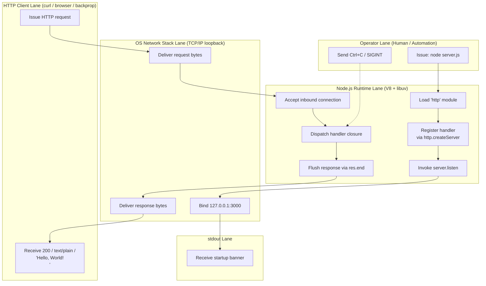

The actor inventory derives from §1.3.2 — a single Node.js process exposing a single HTTP listener on `127.0.0.1:3000` with local-host clients only (no remote users; loopback bind precludes off-box access).

## 4.3 FLOWCHART REQUIREMENTS APPLICABILITY

This subsection answers each of the Section-Prompt-required flowchart concerns (decision points, validation rules, authorization checkpoints, regulatory compliance, and SLA timing). Because most concerns are **not applicable** to this fixture, the table-driven format below records each concern's status with explicit citations.

### 4.3.1 Decision Points Inventory

| Decision Point | Where in Flow | Outcome A | Outcome B | Citation |
|---|---|---|---|---|
| Port-bind success | After `server.listen` (line 12) | Banner emitted, accept loop starts | Node default `EADDRINUSE` error; process exits | §2.6.1 A-002; §2.4.1 |
| Method-based dispatch | — | **Not present** | — | §2.2.2.1 (F-002-RQ-001) |
| Path-based routing | — | **Not present** | — | §1.3.3.1 |
| Header / content negotiation | — | **Not present** | — | §2.2.4.1 (F-004-RQ-001) |
| Authentication outcome | — | **Not present** | — | §1.3.3.1 |
| Validation pass/fail | — | **Not present** | — | §2.2.2.1 |
| Rate-limit pass/fail | — | **Not present** | — | §1.3.3.1 |

The single decision diamond is the OS-level port-bind outcome. All other branches conventionally found in HTTP service flowcharts are absent by design, consistent with §1.2.2.3 — single anonymous request handler removes routing logic; uniform response regardless of input.

### 4.3.2 Validation Rules and Business Rules at Each Step

The Section Prompt asks for business rules and validation requirements at each step. The repository's validation surface is intentionally limited to the source-code-level invariants defined in §2.2 (Functional Requirements). The table below maps each pipeline step to the corresponding validation aspect.

| Pipeline Step | Business Rule | Data Validation | Source |
|---|---|---|---|
| F-001 listen | The hostname and port values MUST NOT be modified per the README "Do not touch!" directive | Not applicable — values are constants, not inputs | §2.2.1.1 |
| F-002 handler entry | No request attribute MAY be used to differentiate response (uniform response is the contract) | None — request payload is not parsed | §2.2.2.1 |
| F-003 set status | Status MUST NOT vary by request attribute (uniformity is the contract) | None | §2.2.3.1 |
| F-004 set header | No content negotiation is performed; `Accept` request headers are ignored | None | §2.2.4.1 |
| F-005 end body | The body MUST NOT be altered (canonical contract per §1.1.4) | Byte-equality against the literal is the only validation | §2.2.5.1 |
| F-006 banner | The banner URL MUST equal the bind target so operators can copy/paste it as a working URL | None | §2.2.6.1 |

These rules are enforced **at the source-code level by behavioral immutability**, not by runtime checks. There are no runtime guards (no schema validators, no input sanitizers, no business-rule engines) in the request path.

### 4.3.3 Authorization Checkpoints

There are **no authorization checkpoints in any workflow**. Per §2.4.4 (F-002 security implication), no authentication or authorization is performed; any local-host process can elicit the response (per §1.3.3.1). Per §1.3.3.1, authentication / authorization … no middleware, no credential handling, no session management. The sole network-security control is loopback confinement: per §2.4.4, loopback bind prevents off-host exposure — the server is not reachable from the network (per §1.3.2).

### 4.3.4 Regulatory Compliance Checks

There are **no regulatory compliance checks in any workflow**. Every functional requirement in §2.2 records `Compliance Requirements: None documented`, with the lone exception of §2.2.7.1 (F-007-RQ-001) where MIT license terms govern redistribution. License compliance is a static repository property, not a runtime checkpoint, and therefore does not appear in any process flow diagram.

### 4.3.5 Timing and SLA Considerations

The Section Prompt asks for timing constraints. Per §1.2.3.3, the repository defines no formal KPIs, no SLAs, no latency targets, no throughput goals, and no availability commitments. Any KPI ascribed to this fixture would therefore be invented rather than documented and is intentionally omitted from this specification.

The following **observable timing properties** (not SLAs) are recorded for completeness, exactly as established in §2.4.2:

| Step | Observable Property | Source |
|---|---|---|
| F-001 startup bind | One-time `listen` cost at startup; thereafter, accept loop is handled by Node's libuv | §2.4.2 |
| F-002 handler entry | Handler invocation has no parsing or routing overhead beyond Node's HTTP framing | §2.4.2 |
| F-003–F-005 response | Fully synchronous response generation — deterministic latency, no async I/O in the response path (per §1.2.2.3) | §2.4.2 |
| F-006 banner | Banner emitted exactly once at startup; no per-request logging overhead | §2.4.2 |
| F-007 dependency cost | Zero `npm install` time required; no dependency resolution at runtime | §2.4.2 |

No numeric latency bounds, throughput floors, or availability percentages are asserted anywhere in the specification.

## 4.4 TECHNICAL IMPLEMENTATION

### 4.4.1 State Management

#### 4.4.1.1 Application State Inventory

Application-layer state in this system is essentially nonexistent. Per §2.4.3, stateless responses — any number of concurrent requests can be served without contention on shared state. Per §1.3.2, data domains included: none — the server returns a static string and persists no data.

The only "state" maintained anywhere in the running system consists of:

| State Element | Owner | Mutability | Persistence |
|---|---|---|---|
| `hostname` constant | `server.js` line 3 (closure scope) | Immutable after init | None — module memory only |
| `port` constant | `server.js` line 4 (closure scope) | Immutable after init | None — module memory only |
| `server` object | `server.js` line 6 | Created once, then bound | None — process memory only |
| TCP listener socket | OS / Node libuv | Bound at `listen`, released at exit | OS-managed, ephemeral |
| Process running/stopped flag | OS process table | OS-managed | None |

#### 4.4.1.2 Server Lifecycle State Diagram

The macroscopic state machine of the server process has four states. The composite `Listening` state contains a self-loop for each request handled, because no per-request state mutation occurs.

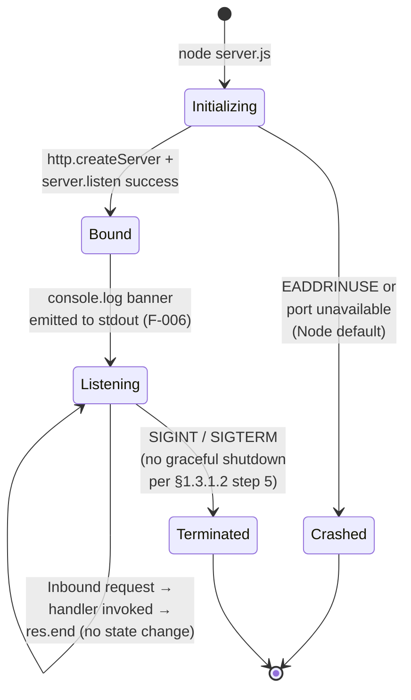

#### 4.4.1.3 Data Persistence Points, Caching, and Transaction Boundaries

| Concern | Status | Citation |
|---|---|---|
| Data persistence points | **None** — no database, no filesystem writes | §1.3.3.1 |
| Caching layer | **None** — no in-memory cache, no external cache | §1.3.3.1 |
| Transaction boundaries | **Not applicable** — no transactional resource is touched | §1.3.3.1 |
| Session state | **None** — handler is stateless | §1.3.3.1 |
| Request-scoped state | **None** — handler is a pure function over (req, res); no closure mutation | §2.4.3 |

Per §1.3.3.1, persistent storage … no database driver, no filesystem writes, no caching layer. The only output side-effects are (a) the startup banner to stdout (once) and (b) the HTTP response bytes flushed to the client socket (per request).

### 4.4.2 Error Handling

#### 4.4.2.1 Error-Handling Surface Inventory

Per §1.2.2.1, the repository contains no error handling beyond Node's defaults. The customary error-handling primitives are categorically absent from `server.js`:

| Concern | Status | Source |
|---|---|---|
| `try`/`catch` blocks in handler | **None** | `server.js` (whole file) |
| Retry mechanism (per request or per startup) | **None** | §1.2.2.1 |
| Fallback / graceful-degradation path | **None** | §1.2.2.1 |
| Custom error response (4xx/5xx) | **None** — all responses are HTTP 200 | §2.2.3.1 |
| Error notification flow (email, paging, webhook) | **None** | §1.3.3.1 |
| Recovery / self-healing procedure | **None** | §1.3.3.1 |
| Graceful shutdown handler | **None** — Ctrl+C terminates abruptly | §1.3.1.2 |
| Request error logging | **None** — only the startup banner is logged | §1.3.3.1 |
| Uncaught-exception handler | **None** — Node default applies | §1.2.2.1 |

#### 4.4.2.2 Error-Path Decomposition

Although no custom error handling exists, certain error conditions are still possible at runtime; in each case, the behavior is whatever Node.js / the OS default provides. The diagram below classifies each error category and shows that all paths converge on a single "process exit" terminal state.

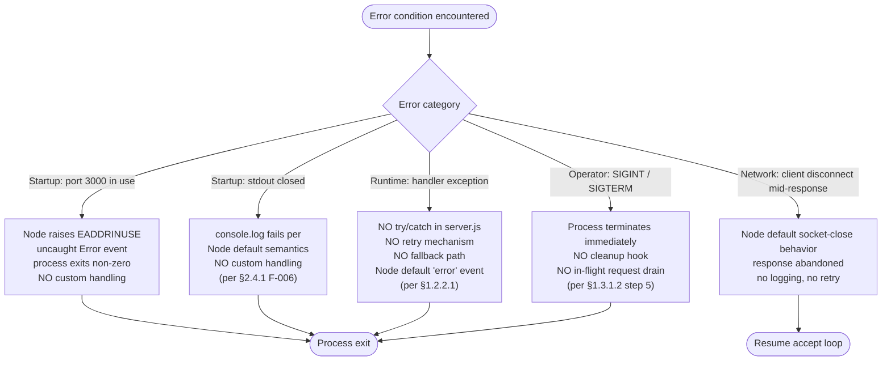

#### 4.4.2.3 Recovery Procedure

Recovery is **manual and operator-initiated**. If the process crashes for any reason, the documented recovery is the same as the initial startup procedure: an operator re-invokes `node server.js` per §1.3.1.2. There is no supervisor (e.g., systemd, PM2, Docker restart policy) configured in the repository — per §3.7 (referenced in §1.2.1.3), no CI/CD configuration — no workflow files, no Dockerfile, no deployment manifests.

#### 4.4.2.4 Maintenance Constraint on Error-Handling Additions

Adding error-handling logic must be weighed against §2.4.5: the maintenance posture for every feature is governed by the README directive "Do not touch!" (per §1.1.1). This directive elevates behavioral immutability above feature growth (per §1.1.4) and creates a strong presumption against modification. Any future error-handling addition must preserve the canonical response triple (status 200, `text/plain`, `Hello, World!\n`) per F-003 / F-004 / F-005.

## 4.5 CONSOLIDATED PROCESS BOUNDARIES

### 4.5.1 System Boundary Summary

The diagram below consolidates the system boundary, the actors that cross it, and the categorical absence of secondary integration surfaces. It is a complementary view to §1.2.2.2's topology diagram, focused on **process-flow boundaries** rather than file-level component classification.

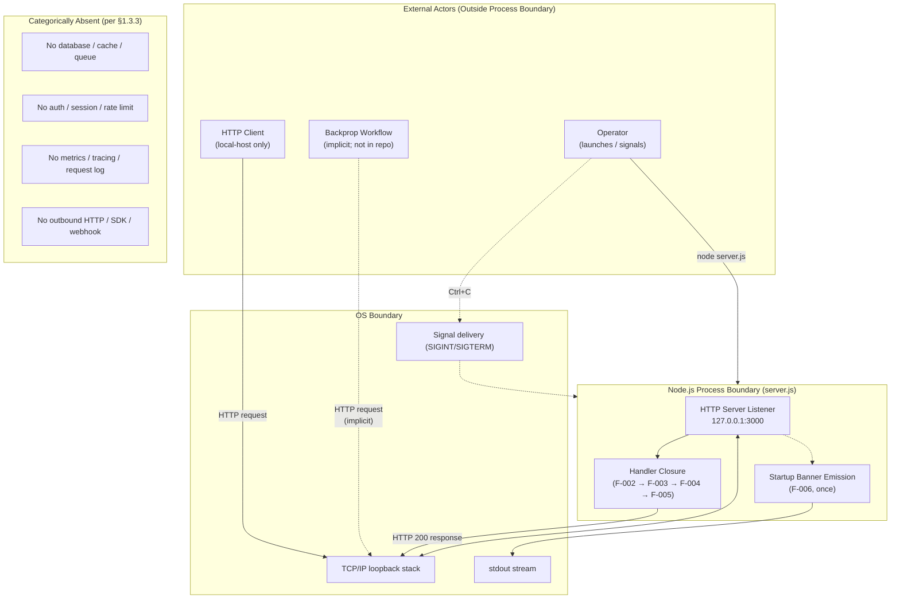

### 4.5.2 Cross-Reference to Related Technical Requirements

The flows in this section are anchored to the following technical requirements and assumptions established earlier in this Technical Specification:

| Flow Element | Anchored Requirement / Assumption |
|---|---|
| Operator launch step | §1.3.1.2 step 1 |
| Loopback bind | §2.2.1.1 (F-001-RQ-001); §2.6.1 A-002 |
| Universal handler invocation | §2.2.2.1 (F-002-RQ-001) |
| Response triple (status / type / body) | §2.2.3.1, §2.2.4.1, §2.2.5.1 |
| Startup banner | §2.2.6.1 (F-006-RQ-001) |
| Zero-dependency runtime | §2.2.7.2 (F-007-RQ-002) |
| Stateless concurrent serving | §2.4.3 |
| Synchronous response path | §2.4.2; §1.2.2.3 |
| Loopback as sole network control | §2.4.4; §1.3.2 |
| Behavioral immutability | §2.4.5; §1.1.1 |
| No SLAs / KPIs | §1.2.3.3 |
| Known repository inconsistencies | §1.3.4 (C-001 through C-006) |

#### References

#### Files Examined

- `server.js` — Sole functional artifact; the 14 lines that implement every flow described in this section. Lines 1, 3–4, 6–10, and 12–14 are individually cited in the flowcharts above.
- `package.json` — npm manifest providing F-007 metadata; basis for the zero-dependency invariant referenced in the lifecycle and integration flows.
- `package-lock.json` — `lockfileVersion: 3` confirmation of empty dependency graph; underpins the "no third-party dependencies" claim in §4.2.4.2.
- `README.md` — Source of the "Do not touch!" directive (governing maintenance constraints in §4.4.2.4) and the implicit "backprop" integration concept (modeled in §4.2.4.1).

#### Folders Explored

- `/` (repository root) — The only directory in the repository; depth-0 traversal exhausts the codebase and confirms the absence of subsystems, microservices, batch-job scripts, or integration adapters that would warrant additional process flows.

#### Technical Specification Sections Cross-Referenced

- §1.1 EXECUTIVE SUMMARY — README directive and behavioral-immutability framing
- §1.2 SYSTEM OVERVIEW — Primary capability statement, system topology, design rationale, no-KPI declaration
- §1.3 SCOPE — Primary user workflow (5 steps), in/out-of-scope boundaries, integration points not covered
- §2.1 Feature Catalog — F-001 through F-007 feature definitions
- §2.2 Functional Requirements — Per-requirement business rules, validation rules, security requirements, compliance requirements
- §2.3 Feature Relationships — Confirmed that the existing dependency diagram is not duplicated here
- §2.4 Implementation Considerations — Technical constraints, observable performance properties, scalability posture, security implications, maintenance constraints
- §2.6 Assumptions and Constraints — A-002 (port availability) and other assumptions underpinning the single decision diamond

#### External References

- None. No web searches were performed. The repository's process flows are fully determined by the in-repo source files and the prior sections of this Technical Specification; no external standards, RFCs, or third-party documentation are needed to author this section.

# 5. System Architecture

## 5.1 HIGH-LEVEL ARCHITECTURE

### 5.1.1 System Overview

#### 5.1.1.1 Architecture Style and Rationale

The system implements a **single-process, single-module, stateless monolith** — specifically the smallest viable Node.js HTTP server. Its entire functional behavior is contained in a 14-line CommonJS module (`server.js`) that binds Node's built-in `http` module to a hard-coded loopback address (`127.0.0.1:3000`) and serves a fixed plaintext response to every inbound request. The architecture style is deliberately reductive: there is no service layer, no controller layer, no domain layer, no persistence layer, and no presentation layer. The handler closure registered with `http.createServer` is the entirety of the application logic.

The rationale for this minimalism is rooted in the project's posture as a **protected test fixture** rather than a production service. The README directive "Do not touch!" elevates behavioral immutability above feature growth, making the architecture itself a frozen artifact. Every architectural decision flows from three operating principles:

- **Predictability** — every request yields a byte-identical response (HTTP 200 / `text/plain` / `Hello, World!\n`)
- **Zero environmental coupling** — no third-party dependencies, no databases, no environment variables, no external services
- **Trivial startup** — `node server.js` is the entire deployment workflow

#### 5.1.1.2 Key Architectural Principles and Patterns

The system embodies the following architectural patterns by either presence or deliberate absence:

- **Stateless Service Pattern** — the handler is a pure function over `(req, res)`; no closure mutation, no per-request state retention, no session storage
- **Zero-Dependency Pattern** — only Node.js standard library modules (`http`, `console`) are loaded; `package-lock.json` declares `lockfileVersion: 3` with an empty dependency graph
- **Synchronous Response Generation** — no async I/O appears in the response path beyond Node's intrinsic libuv accept loop, yielding deterministic latency
- **Uniform Response Contract** — the handler does not inspect `req.method`, `req.url`, headers, or body; method dispatch and routing are categorically absent
- **Single Source of Truth Configuration** — `hostname` and `port` are immutable module-level constants assigned at lines 3–4 of `server.js`, with no runtime override mechanism

#### 5.1.1.3 System Boundaries and Major Interfaces

The system boundary is a single Node.js process exposing a single HTTP listener on `127.0.0.1:3000`. Loopback binding precludes all off-host access, which simultaneously serves as the system's only network-security control. The user population is restricted to local-host clients; geographic distribution and multi-tenancy are not applicable.

| Boundary Aspect | Definition |
|---|---|
| Process boundary | Single Node.js process; no worker threads, no clustering |
| Network boundary | Loopback (`127.0.0.1`) only on TCP port `3000` |
| Data boundary | None — the server returns a static literal and persists no data |
| User-population boundary | Local-host clients only (loopback bind precludes off-box access) |

The major interfaces are:

- **Inbound HTTP listener** at `127.0.0.1:3000` — sole runtime integration point
- **Process stdout** — sole observability surface, used only for the one-shot startup banner
- **No outbound interfaces** — no SDKs, no API credentials, no database drivers, no cloud-provider clients

### 5.1.2 Core Components Table

The runtime architecture comprises four functional components and one declarative metadata artifact, all colocated within a single repository root with no subdirectories. Tables below partition the components and summarize their responsibilities, dependencies, integration points, and critical considerations.

| Component Name | Primary Responsibility | Implementation Site |
|---|---|---|
| HTTP Server Listener (F-001) | Binds TCP listener on loopback `127.0.0.1:3000` | `server.js` line 12 (`server.listen`) |
| Request Handler Closure (F-002 → F-005) | Anonymous handler invoked for every inbound request; emits canonical response | `server.js` lines 6–10 |
| Startup Banner Emitter (F-006) | One-shot `console.log` banner on listen success | `server.js` lines 12–14 |
| npm Package Manifest (F-007) | Declarative metadata only; no runtime logic | `package.json`, `package-lock.json` |

| Component Name | Key Dependencies | Integration Points |
|---|---|---|
| HTTP Server Listener | Node `http` module; OS TCP/IP stack | OS port-bind operation; libuv accept loop |
| Request Handler Closure | Node `http` module; `req`, `res` objects | Inbound HTTP requests; outbound response writes |
| Startup Banner Emitter | Node `console` global; process stdout | Process stdout pipe |
| npm Package Manifest | npm 7+ (only if dependencies are ever added) | npm registry (declarative; no install needed) |

| Component Name | Critical Considerations |
|---|---|
| HTTP Server Listener | Hard-coded loopback bind; failure mode is `EADDRINUSE` with non-zero process exit |
| Request Handler Closure | Must not inspect request attributes (uniform-response contract per F-002-RQ-001); response triple is byte-exact |
| Startup Banner Emitter | Synchronous on TTY, may be asynchronous on pipes (Node default); banner is the sole readiness signal |
| npm Package Manifest | `main` field points to non-existent `index.js`; actual entrypoint is `server.js` (constraint C-002) |

The repository also contains a set of **inert artifacts** (byte-identical duplicate `server - Copy.js`; CSV taxonomies `industry.csv` / `industry - Copy.csv`; non-compilable Java skeletons; `test.py.txt` code-graph metadata; empty `.blitzyignore.txt` placeholders) that are physically present but **never loaded at runtime**. They are not part of the architecture and play no role in any operational flow.

### 5.1.3 Data Flow Description

#### 5.1.3.1 Primary Data Flow: Request-Response Pipeline

The request-response pipeline is fully synchronous, branchless, and stateless. When an HTTP client (any local-host process such as `curl`, a browser, or the implicit "backprop" workflow) issues a TCP SYN to `127.0.0.1:3000`, the OS TCP/IP stack accepts the connection on the loopback interface. Node's libuv accept loop dispatches the parsed `http.IncomingMessage` and `http.ServerResponse` pair to the registered handler closure. The handler then executes four ordered operations with no conditionals between them: it sets `res.statusCode = 200` (line 7), invokes `res.setHeader('Content-Type', 'text/plain')` (line 8), and calls `res.end('Hello, World!\n')` (line 9). The response is flushed back through libuv to the TCP layer, the connection closes per HTTP framing, and the handler returns to the accept loop. **No state is retained between requests**, so any number of concurrent requests can be serviced without contention on shared state.

The lexical order of operations inside the handler (status → header → body) is enforced by Node's response lifecycle: `setHeader` must precede `end`, and `statusCode` must be set imperatively before headers are flushed. The 13-byte body `Hello, World!\n` is hard-coded as a string literal in source code, not loaded from any data store.

#### 5.1.3.2 Secondary Data Flow: Startup Banner

Once `server.listen` succeeds, the registered callback invokes `console.log` with the template literal `` `Server running at http://${hostname}:${port}/` ``, which writes the banner string to process stdout exactly once. This is the **sole observability artifact** produced by the system — there is no per-request logging, no health endpoint, and no metrics emission. The banner therefore doubles as the readiness signal for any operator or automation that needs to know the server is bound and listening.

#### 5.1.3.3 Integration Patterns and Protocols

The only integration pattern is **synchronous request-response over HTTP/1.1** on the loopback interface. There is no middleware chain (no Express, Koa, Fastify, or other framework), no method dispatch, no path routing, and no content negotiation. HTTP/1.1 framing is provided entirely by Node's built-in `http` module.

#### 5.1.3.4 Data Transformation Points

There are **no data transformation points**. The response body is a string literal embedded in source; it is not derived from any input, template, configuration, or external resource. Request data is not parsed beyond the framing performed by Node's HTTP layer (which is necessary for the runtime to invoke the handler) and is then **discarded without inspection**.

#### 5.1.3.5 Data Stores and Caches

The system has **no data stores and no caches** of any kind:

- No relational database, no document store, no key-value store, no graph database, no time-series database, no search index
- No filesystem writes (the runtime never writes to disk; the only output side-effects are the startup banner and HTTP response bytes)
- No application-level cache, no Redis/Memcached, no HTTP cache, no CDN
- No object storage (S3, Azure Blob, GCS)
- No session state, no request-scoped state, no closure mutation

This categorical absence of persistence is by design: the response is fixed at compile time, so caching would provide no benefit, and statelessness is what enables the system to handle concurrent requests without locks or coordination.

### 5.1.4 External Integration Points

The repository declares **one conceptual external integration**: the implicit "backprop" workflow referenced exclusively in `README.md`. This workflow is **external to this repository** — no client code, configuration, or shared library for backprop exists in the codebase. The integration contract is purely behavioral: backprop (or any other consumer) issues an HTTP request and observes the byte-exact canonical response.

| System Name | Integration Type | Data Exchange Pattern | Protocol/Format |
|---|---|---|---|
| Backprop workflow (external; not in repo) | Inbound HTTP only; consumer initiates | Synchronous request-response; one round-trip per interaction | HTTP/1.1 over TCP loopback; `text/plain` response body |

The SLA column is intentionally omitted from the table above because **no SLA is defined anywhere in the repository** — no latency targets, no throughput commitments, no availability percentages, no error-rate budgets. Any SLA assigned to this fixture would be invented rather than documented.

The following integrations that frequently appear in microservice architectures are **categorically absent** from this system:

- No outbound REST or RPC calls
- No inbound webhooks beyond raw HTTP requests
- No message queue producers or consumers (Kafka, RabbitMQ, SQS)
- No event bus subscribers or publishers (EventBridge, Pub/Sub)
- No batch or scheduled jobs (cron, Airflow, etc.)
- No database read/write flows
- No cache populate or invalidate flows
- No cloud-provider SDK calls (AWS, Azure, GCP)
- No authentication services (Auth0, Cognito, IDP federation)
- No monitoring or observability tools (APM, Prometheus, OpenTelemetry, Datadog, New Relic)

---

## 5.2 COMPONENT DETAILS

### 5.2.1 HTTP Server Listener (Feature F-001)

#### 5.2.1.1 Purpose and Responsibilities

The HTTP Server Listener is the network runtime component that binds Node's HTTP server to the loopback interface. It is invoked exactly once at process startup via `server.listen(port, hostname, callback)` on line 12 of `server.js`. Its sole responsibility is to register a TCP listener with the operating system and pass control to libuv's accept loop, which thereafter dispatches inbound connections to the registered handler closure.

#### 5.2.1.2 Technologies and Frameworks

- **Runtime:** Node.js standard library (`http` module)
- **OS facility:** TCP/IP socket bind operation on loopback interface
- **Network library:** libuv (bundled with Node.js)

#### 5.2.1.3 Key Interfaces

- **Input:** none from application code; consumes the `port` and `hostname` constants from module scope
- **Output:** registered TCP listener; invokes the listen-success callback (which in turn drives the Startup Banner Emitter)
- **Failure mode:** raises `EADDRINUSE` if port `3000` is already bound; uncaught error event; non-zero process exit

#### 5.2.1.4 Data Persistence and Scaling

The listener requires no persistence. Scaling characteristics are bounded by the loopback bind: horizontal scale-out across hosts is impossible by design, and intra-process concurrency is bounded by Node's single-threaded event loop. There is no connection limit, queueing logic, or back-pressure mechanism configured beyond Node defaults.

### 5.2.2 Request Handler Closure (Features F-002 → F-005)

#### 5.2.2.1 Purpose and Responsibilities

The Request Handler Closure is the anonymous function passed to `http.createServer` on line 6 of `server.js`. It is invoked for every inbound HTTP request and is responsible for emitting the canonical response. It implements four critical features in sequence:

- **F-002** (Universal HTTP Request Acceptance) — the handler accepts the request without inspecting any of its attributes
- **F-003** (HTTP 200 Status Response) — sets `res.statusCode = 200`
- **F-004** (Plaintext Content-Type Header) — sets `Content-Type: text/plain` via `res.setHeader`
- **F-005** (Canonical Response Body) — emits the 13-byte body `Hello, World!\n` via `res.end`

#### 5.2.2.2 Technologies and Frameworks

- **Runtime:** Node.js `http.IncomingMessage` and `http.ServerResponse` objects
- **No framework:** no Express, Koa, Fastify, Hapi, or other web framework is present or required

#### 5.2.2.3 Key Interfaces

- **Input:** `req` (IncomingMessage), `res` (ServerResponse) — neither is inspected for routing or validation
- **Output:** HTTP/1.1 response with status `200`, header `Content-Type: text/plain`, body `Hello, World!\n`
- **Side effects:** none beyond the response write to the client socket

#### 5.2.2.4 Data Persistence and Scaling

The handler is a **pure function over (req, res)** with no closure mutation, no shared state, and no persistence. This statelessness is the architectural property that permits any number of concurrent invocations without contention; intra-process concurrency is bounded only by Node's event loop and OS socket limits.

### 5.2.3 Startup Banner Emitter (Feature F-006)

#### 5.2.3.1 Purpose and Responsibilities

The Startup Banner Emitter is the listen-success callback that prints `Server running at http://127.0.0.1:3000/` to process stdout exactly once at startup. It is the **sole observability surface** for the entire system.

#### 5.2.3.2 Technologies and Frameworks

- **Runtime:** Node.js global `console` object (`console.log`)
- **OS facility:** process stdout pipe

#### 5.2.3.3 Key Interfaces

- **Input:** template literal interpolating the `hostname` and `port` constants
- **Output:** single line written to stdout
- **Failure mode:** if stdout is closed or unwritable, `console.log` fails per Node default semantics; no custom handling exists

#### 5.2.3.4 Data Persistence and Scaling

No persistence. The banner is emitted exactly once and is not reissued, retried, or supplemented with periodic heartbeats. Scaling is not applicable.

### 5.2.4 npm Package Manifest (Feature F-007)

#### 5.2.4.1 Purpose and Responsibilities

The npm Package Manifest comprises `package.json` and `package-lock.json`. It is purely declarative and supports no runtime behavior. Its responsibilities are limited to project metadata registration: name (`hello_world`), version (`1.0.0`), license (`MIT`), and a `scripts.test` entry that always exits non-zero (`echo "Error: no test specified" && exit 1`). The lockfile (`lockfileVersion: 3`) records only the root package — confirming the empty dependency graph.

#### 5.2.4.2 Technologies and Frameworks

- **Tooling:** npm 7+ (required for `lockfileVersion: 3`); usage is optional because no `npm install` step is needed
- **Format:** JSON manifests per npm specification

#### 5.2.4.3 Key Interfaces

- **Input:** none at runtime
- **Output:** none at runtime; consumed only by npm CLI tooling
- **Notable inconsistency (constraint C-002):** the `main` field points to `index.js`, which does not exist; the actual entrypoint is `server.js`

#### 5.2.4.4 Data Persistence and Scaling

Not applicable — the manifest is a declarative artifact, not an executable component.

### 5.2.5 Component Interaction Diagram

The diagram below depicts the runtime component graph and the directional control/data transfers between them. Inert artifacts are explicitly enclosed in a separate subgraph to indicate that they are physically present in the repository but disconnected from the runtime.

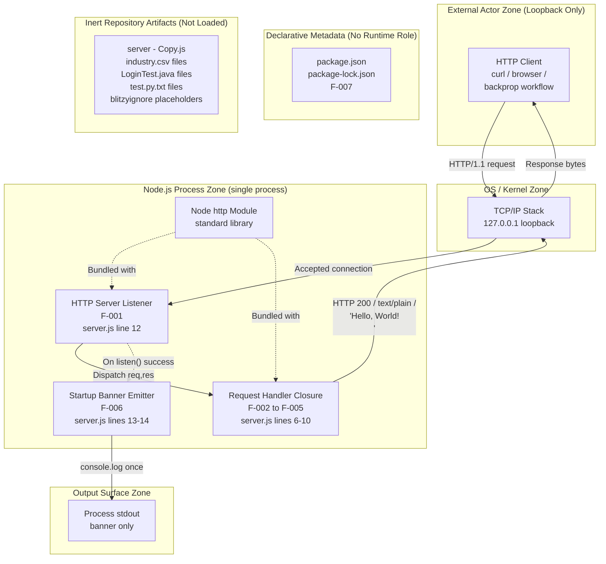

### 5.2.6 State Transition Diagram

The Node.js process traverses a four-state macro-lifecycle. The composite `Listening` state contains an implicit self-loop for each request handled, because no per-request state mutation occurs. Transitions out of `Listening` are exclusively triggered by external signals (operator interrupt) or external errors (port binding failures, runtime exceptions) — there is no internal trigger that ever takes the process out of `Listening`.

```mermaid
stateDiagram-v2
    [*] --> Initializing: node server.js
    Initializing --> Bound: http.createServer +<br/>successful TCP bind
    Initializing --> Crashed: EADDRINUSE or<br/>port unavailable<br/>(Node default exit)
    Bound --> Listening: listen-success callback fires;<br/>banner emitted to stdout (F-006)
    Listening --> Listening: Inbound request →<br/>handler invoked →<br/>res.end (no state change)
    Listening --> Terminated: SIGINT / SIGTERM<br/>(no graceful shutdown<br/>per §1.3.1.2 step 5)
    Listening --> Crashed: Uncaught handler exception<br/>(Node default error event)
    Crashed --> [*]
    Terminated --> [*]
```

### 5.2.7 Sequence Diagram for Key Flow

The following sequence diagram captures the architectural slice of the request-response pipeline with explicit lane identification for each architectural component. Note that the handler self-transitions in lines 7, 8, and 9 of `server.js` are shown as ordered self-messages because they represent ordered mutations of the same `res` object rather than calls to separate components.

```mermaid
sequenceDiagram
    actor Client as HTTP Client<br/>(local-host)
    participant TCP as OS TCP/IP Stack<br/>(loopback only)
    participant Listener as HTTP Server Listener<br/>(F-001 / libuv)
    participant Handler as Request Handler Closure<br/>(F-002 to F-005)

    Client->>TCP: TCP SYN to 127.0.0.1:3000
    TCP-->>Listener: Connection accepted
    Client->>TCP: HTTP request line + headers + body
    TCP->>Listener: Parsed http.IncomingMessage
    Listener->>Handler: invoke(req, res)
    Note over Handler: req.method, req.url, headers,<br/>body NOT inspected (F-002)
    Handler->>Handler: res.statusCode = 200 (F-003)
    Handler->>Handler: res.setHeader Content-Type text/plain (F-004)
    Handler->>Handler: res.end 'Hello, World!\n' (F-005)
    Handler-->>Listener: handler returns
    Listener->>TCP: HTTP/1.1 200 OK + headers + 13-byte body
    TCP-->>Client: Response delivered
    Note over Listener,Client: Connection closes per HTTP framing;<br/>no state retained;<br/>Listener resumes accept loop
```

---

## 5.3 TECHNICAL DECISIONS

### 5.3.1 Architecture Style Decisions and Trade-offs

The repository's architecture style is the result of four interlocking decisions, each documented in source code or accompanying metadata. The trade-offs accepted by each decision are tabulated below.

| Decision | Trade-off Accepted |
|---|---|
| Single-process, single-module monolith | Forfeits horizontal scalability in exchange for trivial deployment and zero coordination overhead |
| Use of Node's built-in `http` module (no framework) | Forfeits middleware ecosystem and routing conveniences in exchange for zero install footprint |
| Hard-coded loopback bind (`127.0.0.1`) | Forfeits remote accessibility in exchange for an implicit network-isolation security control |
| Synchronous response generation | Forfeits concurrency benefits of async I/O in exchange for deterministic latency |

The cumulative effect of these decisions is an architecture whose defining characteristic is **what it does not contain**. This is intentional: the README's "Do not touch!" directive creates a strong presumption against introducing additional layers, dependencies, or abstractions.

### 5.3.2 Communication Pattern Choices

The chosen communication pattern is **synchronous HTTP request-response over TCP loopback**. The rationale and rejected alternatives are summarized below.

| Pattern | Status | Rationale |
|---|---|---|
| Synchronous HTTP request-response | **Selected** | Matches the implicit "backprop" contract; minimal protocol surface |
| Async message-based (queues, pub/sub) | Rejected | Would require external broker; forbidden by zero-dependency principle |
| gRPC / Protocol Buffers | Rejected | Would require schema definitions and generated code; defeats minimalism |
| GraphQL | Rejected | Server returns a fixed literal — no schema, no resolvers needed |
| WebSocket / Server-Sent Events | Rejected | No streaming or push semantics required by the contract |

The handler does not implement method dispatch, path routing, content negotiation, or a middleware chain. The uniform-response contract (per F-002-RQ-001) **prohibits** any branching on request attributes.

### 5.3.3 Data Storage Solution Rationale

The system is **stateless by design**. The static response body `Hello, World!\n` is part of the source-code artifact, not a runtime data store. No persistence solution is needed because:

- The response is fixed (per F-005), so there is nothing to read from a database
- The handler is a pure function (per F-002), so there is no per-request state to write
- There are no users, sessions, or accounts (per the loopback security model)
- There are no transactions to coordinate

The decision to forgo all persistence eliminates entire classes of operational concerns: database deployment, schema migration, connection pooling, transaction management, backup procedures, replication topology, and consistency models. None of these apply.

### 5.3.4 Caching Strategy Justification

**No caching is implemented at any layer**, and none is needed. The justification is twofold:

- **No upstream resource to cache** — the response is a string literal in source code; there is no database query, no remote API call, and no expensive computation whose results could be cached
- **Caching would not improve latency** — the response is already generated synchronously with no async I/O; a cache would add lookup overhead without removing any work

Application-level caches, distributed caches (Redis/Memcached), HTTP caches (Varnish, Nginx), and CDNs are all categorically absent.

### 5.3.5 Security Mechanism Selection

Security in this system is achieved by **network confinement**, not by application-layer controls. The decision matrix is summarized below.

| Concern | Mechanism Selected | Rationale |
|---|---|---|
| Network access control | Loopback bind (`127.0.0.1`) | Off-host actors cannot reach the listener at all |
| Authentication | None | Acceptable due to loopback confinement; no user identity exists |
| Authorization | None | Same rationale; no resources require gating |
| Transport encryption | None (`http`, not `https`) | Loopback traffic does not traverse untrusted networks |
| Supply-chain security | Zero dependencies | Eliminates the entire third-party-package attack surface |
| Secrets management | Not applicable | No credentials, API keys, or secrets are handled |

This is **not a defense-in-depth posture**. Loopback confinement is the sole network-security control, and the architecture explicitly relies on it. Any modification that exposes the listener to a non-loopback interface would invalidate the security model.

### 5.3.6 Architecture Decision Records

The following compact ADRs document the principal architectural decisions, the alternatives considered, and the consequences accepted.

#### 5.3.6.1 ADR-001: Use Node's Built-in `http` Module Without a Web Framework

- **Status:** Accepted (implemented in `server.js`)
- **Context:** A trivial HTTP responder is needed for the implicit "backprop" contract
- **Decision:** Use only the Node.js standard library `http` module
- **Alternatives considered:** Express, Koa, Fastify, Hapi
- **Consequences:** No `npm install` required; runs on any Node.js installation; sacrifices middleware ecosystem and routing conveniences

#### 5.3.6.2 ADR-002: Bind Exclusively to Loopback (`127.0.0.1`)

- **Status:** Accepted (hard-coded at `server.js` line 3)
- **Context:** The fixture must be inaccessible to off-host actors
- **Decision:** Hard-code `127.0.0.1` as the bind address
- **Alternatives considered:** `0.0.0.0` (all interfaces), configurable via env var
- **Consequences:** Off-host access is structurally impossible; remote operators cannot exercise the server; no auth is required

#### 5.3.6.3 ADR-003: Hard-Code Configuration Constants in Source

- **Status:** Accepted (constants at `server.js` lines 3–4)
- **Context:** Per the README directive, behavioral immutability is paramount
- **Decision:** Embed `hostname` and `port` as `const` declarations; do not read environment variables or config files
- **Alternatives considered:** `process.env`, `dotenv`, JSON config file
- **Consequences:** Behavior cannot drift between environments; deployment requires no configuration; port `3000` becomes a hard prerequisite

#### 5.3.6.4 ADR-004: Stateless Handler with Uniform Response

- **Status:** Accepted (lines 6–10 of `server.js`)
- **Context:** The contract requires every request to receive the same response
- **Decision:** Implement a single anonymous handler that does not inspect `req` and emits a fixed response triple
- **Alternatives considered:** Method-based dispatch, path-based routing, content negotiation
- **Consequences:** Concurrent requests can be served without contention; no routing logic to maintain; behaviour is trivially testable

#### 5.3.6.5 ADR-005: No Custom Error Handling

- **Status:** Accepted (no `try`/`catch` in `server.js`)
- **Context:** The minimal architecture aims to produce predictable behavior
- **Decision:** Rely on Node.js default error semantics; do not add custom handlers, retries, or fallbacks
- **Alternatives considered:** Per-request `try`/`catch`, process-level `uncaughtException` handler, supervisor-based restart (PM2, systemd)
- **Consequences:** Crashes require manual operator restart; behavior on edge conditions is whatever Node and the OS provide

### 5.3.7 Decision Tree Diagram

The decision tree below traces the architectural reasoning for selecting the smallest-viable-server pattern. Each leaf node represents an architectural decision actually present in the codebase.

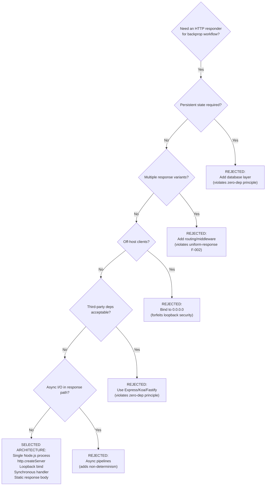

---

## 5.4 CROSS-CUTTING CONCERNS

### 5.4.1 Monitoring and Observability Approach

The system has **a single observability artifact**: the startup banner `Server running at http://127.0.0.1:3000/` emitted to process stdout exactly once when `server.listen` succeeds. This banner is the sole signal that the server is bound and ready to accept requests; it is not reissued, supplemented, or correlated with any external monitoring system.

The following monitoring and observability primitives are **categorically absent**:

| Concern | Status |
|---|---|
| Per-request access logging | None |
| Structured logging (JSON, key-value) | None |
| APM agents (Datadog, New Relic, AppDynamics) | None |
| Metrics exporters (Prometheus, StatsD) | None |
| Distributed tracing (OpenTelemetry, Jaeger, Zipkin) | None |
| Log aggregation (ELK, Splunk, Loki) | None |
| Health-check endpoint | None |
| Metrics endpoint | None |
| Process-level resource telemetry (CPU, memory, FDs) | None |
| Alerting rules | None |

Operators relying on this server must derive operational signals from out-of-band sources such as the OS process table, TCP connection state inspection, or external HTTP probes against `127.0.0.1:3000`.

### 5.4.2 Logging and Tracing Strategy

The logging strategy is **one-time stdout emission only**. Per F-006, the banner is emitted exactly once at startup; there is no per-request logging overhead. `console.log` is synchronous on TTY but may be asynchronous on pipes (Node default behavior); no log buffering, rotation, or shipping is configured.

There is **no tracing strategy**. The system does not propagate trace identifiers, does not generate spans, and does not participate in any tracing context. Because the system is a leaf node with no outbound calls, there is no distributed-trace propagation requirement.

### 5.4.3 Error Handling Patterns

The error-handling pattern is **rely on Node defaults**. The repository contains no error-handling logic beyond what Node.js and the operating system provide intrinsically.

| Concern | Status |
|---|---|
| `try`/`catch` blocks in handler | None |
| Retry mechanism (per request or per startup) | None |
| Fallback or graceful-degradation path | None |
| Custom error response (4xx / 5xx) | None — every response is HTTP 200 |
| Error notification flow (email, paging, webhook) | None |
| Recovery or self-healing procedure | None |
| Graceful shutdown handler | None — `Ctrl+C` terminates abruptly |
| Request error logging | None |
| Process-level `uncaughtException` handler | None |

The categories of error conditions that can occur and their default behaviors are:

- **Startup port-in-use** → Node raises `EADDRINUSE`; uncaught error event; non-zero process exit
- **stdout closed at startup** → `console.log` fails per Node default semantics
- **Runtime exception inside the handler** → no `try`/`catch` is present; Node default error event applies
- **Operator-initiated termination** (SIGINT/SIGTERM) → process terminates immediately with no cleanup hook and no in-flight request drain
- **Client disconnect mid-response** → Node default socket-close behavior; response is abandoned silently with no logging or retry

Recovery from any of these errors is **manual and operator-initiated**: an operator re-invokes `node server.js`. No supervisor (systemd unit, PM2 config, Docker restart policy) is configured anywhere in the repository.

### 5.4.4 Authentication and Authorization Framework

There is **no authentication framework and no authorization framework**. The handler does not parse `Authorization` headers, does not validate session cookies, does not call an identity provider, and does not enforce any access-control policy. Security relies entirely on **loopback confinement**: any local-host process can elicit the canonical response, but off-host actors cannot reach the listener at all.

Consequently, the following identity/access primitives are absent:

- No user accounts, no roles, no permissions
- No JWT/OAuth/OIDC handling
- No API keys or bearer tokens
- No session storage
- No rate limiting or per-client quotas
- No audit logging

This posture is acceptable **only** because the system is loopback-bound. A future modification that exposes the listener to a non-loopback interface would invalidate the security model and would require introducing authentication and authorization mechanisms.

### 5.4.5 Performance Requirements and SLAs

The repository defines **no formal KPIs, SLAs, latency targets, throughput goals, or availability commitments**. Any such metric ascribed to the system would be invented rather than documented and is therefore intentionally omitted from this specification.

The following observable performance properties exist but are **not** acceptance criteria:

| Component | Observable Property |
|---|---|
| HTTP Server Listener (F-001) | One-time `listen` cost at startup; thereafter accept loop is handled by libuv |
| Request Handler (F-002 → F-005) | Fully synchronous response; no async I/O in the response path; deterministic latency |
| Startup Banner Emitter (F-006) | One emission at startup; no per-request logging overhead |
| npm dependencies (F-007) | Zero `npm install` time; no dependency resolution at runtime |

#### 5.4.5.1 Scalability Considerations

The system is **not designed for scale-out**. The architectural facts that bound scaling are:

- **Loopback bind precludes horizontal distribution** — additional hosts cannot share the listener
- **No connection limit, queueing, or back-pressure logic** — Node and OS defaults apply
- **No multi-process clustering** — a single Node.js event loop serves all requests
- **No load balancer, reverse proxy, or service mesh** is configured

Stateless responses can, however, be served concurrently within the single process without contention on shared state. The practical concurrency ceiling is bounded by Node's event loop and OS socket limits, neither of which is tuned by this repository.

### 5.4.6 Disaster Recovery Procedures

There are **no formal disaster recovery procedures**. Recovery is manual and operator-initiated:

- If the process crashes for any reason, the operator re-invokes `node server.js` from the repository root
- No systemd unit, PM2 ecosystem file, or Docker `restart: always` policy is configured
- No CI/CD pipeline exists to automate redeployment (no workflow files, no Dockerfile, no deployment manifests)
- No backup or restore procedure applies (there is no state to back up)
- No failover topology exists (the loopback bind precludes a secondary host)

The DR posture is therefore **accept loss of availability until manual intervention**. Mean time to recovery is bounded by operator response time only.

### 5.4.7 Error Handling Flow Diagram

The diagram below shows the full set of error conditions the system can encounter at runtime and the path each one takes to its terminal state. Note that all error paths except client disconnect converge on process exit, because no recovery logic is implemented.

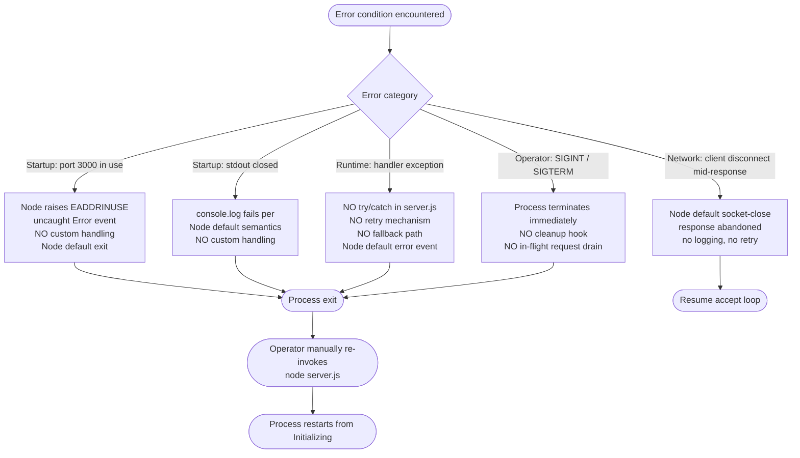

---

## 5.5 ARCHITECTURAL ASSUMPTIONS AND CONSTRAINTS

The architecture rests on a small, explicitly documented set of assumptions and constraints that any future modifier must respect.

### 5.5.1 Architectural Assumptions

- **A-001:** A Node.js runtime supporting `http.createServer` and `server.listen` is installed on the host
- **A-002:** TCP port `3000` is available on the host
- **A-003:** The loopback interface (`127.0.0.1`) is reachable from the same host
- **A-004:** The operator launches the process via `node server.js` from the repository root
- **A-005:** Process stdout is writable and readable by whoever needs the readiness signal

### 5.5.2 Architectural Constraints

- **C-001:** Dual project identifier — README references `hao-backprop-test`; `package.json` declares `hello_world`. Architecture documentation must accommodate both names.
- **C-002:** `package.json` declares `main: "index.js"`, but `index.js` does not exist; the actual entrypoint is `server.js`.
- **C-003:** `npm test` always fails (`echo "Error: no test specified" && exit 1`); no test architecture is in scope.
- **C-004:** All `*.blitzyignore.txt` files are empty placeholders; no ignore rules are in effect.
- **C-005:** Four byte-identical `- Copy` duplicate files exist in the repository but are inert.
- **C-006:** Cross-language inert artifacts (Java skeletons, CSV taxonomies, Python-named text files) are present but are not wired into the runtime architecture.

### 5.5.3 The "Do Not Touch" Maintenance Constraint

The README directive "Do not touch!" is a **first-class architectural constraint**. It elevates behavioral immutability above feature growth and creates a strong presumption against modification. Any future architectural change must:

- Preserve the canonical response triple (status `200`, `Content-Type: text/plain`, body `Hello, World!\n`) per features F-003 / F-004 / F-005
- Preserve the loopback bind (security model relies on it)
- Preserve the zero-dependency posture (supply-chain security relies on it)
- Preserve the stateless uniform-response handler (concurrency safety relies on it)

---

## 5.6 References

### 5.6.1 Source Files Examined

- `server.js` — Full 14-line source code; primary architectural evidence; defines all runtime behavior including listener binding, request handler closure, and startup banner emission
- `package.json` — npm manifest declaring `name=hello_world`, `version=1.0.0`, `main=index.js` (non-existent file; constraint C-002), `license=MIT`, and an empty dependency graph
- `package-lock.json` — `lockfileVersion: 3` lockfile recording only the root package; confirms zero third-party dependencies
- `README.md` — Two-line file containing the project identifier `hao-backprop-test` and the "Do not touch!" maintenance directive
- `server - Copy.js` — Byte-identical duplicate of `server.js`; verified inert (not loaded at runtime)

### 5.6.2 Inert Repository Artifacts Surveyed

- `industry.csv` and `industry - Copy.csv` — 43-row industry taxonomy reference data; not loaded by any code
- `LoginTest.java` and `LoginTest - Copy.java` — Non-compilable `com.blitzyTest.LoginTest` Java skeleton; not part of runtime
- `test.py.txt` and `test.py - Copy.txt` — Code-graph metadata files (despite Python-suggesting filenames); not executed
- `.blitzyignore.txt`, `test.blitzyignore.txt`, `test1.blitzyignore.txt` — Empty placeholder files (0 bytes each)

### 5.6.3 Repository Folders Explored

- `/` (repository root, depth 0) — Sole folder in the repository; contains all 14 files; no subdirectories present

### 5.6.4 Technical Specification Sections Cross-Referenced

- §1.1 EXECUTIVE SUMMARY — Project overview, dual-name issue, "Do not touch!" directive, value proposition
- §1.2 SYSTEM OVERVIEW — Primary capability, component classification, system topology, success criteria
- §1.3 SCOPE — Must-have capabilities, primary user workflow, out-of-scope exclusions, known inconsistencies
- §2.1 Feature Catalog — Definitions for features F-001 through F-007
- §2.2 Functional Requirements — All `F-XXX-RQ-YYY` requirements with acceptance criteria
- §2.3 Feature Relationships — Feature dependency map, integration points, shared components
- §2.4 Implementation Considerations — Technical constraints, performance properties, scalability, security, maintenance
- §2.5 Traceability Matrix — Requirement-to-source-file mapping
- §2.6 Assumptions and Constraints — A-001 through A-005, C-001 through C-006
- §3.1 STACK OVERVIEW AND ARCHITECTURAL POSTURE — Deliberate minimalism rationale; default stack non-applicability
- §3.2 PROGRAMMING LANGUAGES — JavaScript/Node.js as the sole functional language
- §3.3 FRAMEWORKS AND LIBRARIES — Categorical absence of web frameworks; standard library inventory
- §3.4 OPEN SOURCE DEPENDENCIES — Zero-dependency posture
- §3.5 THIRD-PARTY SERVICES — Categorical absence of external services; backprop integration concept
- §3.6 DATABASES AND STORAGE — Categorical absence of persistence; statelessness by design
- §3.7 DEVELOPMENT AND DEPLOYMENT — No build, no containers, no CI/CD; hard-coded configuration
- §3.8 SECURITY CONSIDERATIONS OF TECHNOLOGY CHOICES — Loopback bind as sole network control; zero deps as supply-chain control
- §3.9 INTEGRATION REQUIREMENTS BETWEEN STACK COMPONENTS — Local-variable closure as sole coupling mechanism
- §3.10 TECHNOLOGY STACK SUMMARY MATRIX — Consolidated stack reference
- §4.2 SYSTEM WORKFLOWS — Operator-initiated lifecycle, startup sequence, request-response pipeline, integration workflow, swim-lane view
- §4.4 TECHNICAL IMPLEMENTATION — State management (stateless), error handling (Node defaults only), state diagram, error path decomposition
- §4.5 CONSOLIDATED PROCESS BOUNDARIES — System boundary summary diagram and cross-references

# 6. SYSTEM COMPONENTS DESIGN

## 6.1 Core Services Architecture

### 6.1.1 Applicability Assessment

**Core Services Architecture is not applicable for this system.**

The repository under specification implements a **single-process, single-module, stateless monolith** — specifically a 14-line Node.js HTTP fixture contained entirely in `server.js`. There are no services to coordinate, no inter-service boundaries to define, no service discovery to configure, no load balancing to deploy, no circuit breakers to engineer, and no resilience or scaling primitives to orchestrate. Per §5.1.1.1, "the architecture style is deliberately reductive: there is no service layer, no controller layer, no domain layer, no persistence layer, and no presentation layer."

This subsection documents the evidence base for non-applicability, enumerates each service-architecture concern that is categorically absent (with citations to authoritative source-code lines and prior tech spec sections), and presents the architectural rationale that makes service-oriented patterns deliberately out of scope.

#### 6.1.1.1 Evidence Base for Non-Applicability

The non-applicability finding is supported by four converging classes of evidence: source-code structure, dependency posture, network binding, and explicit tech-spec declarations.

| Evidence Class | Specific Finding | Authoritative Source |
|---|---|---|
| Source code | Entire functional codebase is 14 lines in a single CommonJS module | `server.js`, lines 1–14 |
| Dependency posture | Empty dependency graph; no third-party libraries | `package-lock.json` (`lockfileVersion: 3`, no `packages` entries) |
| Network binding | Hard-coded loopback bind (`127.0.0.1:3000`) precludes distribution | `server.js` lines 3–4; §5.1.1.3 |
| Tech-spec declaration | "no message bus, no RPC framework, no API gateway, no service mesh, and no service registry" | §3.9 |

The four runtime "components" enumerated in §5.1.2 (HTTP Server Listener F-001, Request Handler Closure F-002→F-005, Startup Banner Emitter F-006, npm Package Manifest F-007) are **intra-process artifacts of a single CommonJS module**, not services. They share state by lexical closure over module-level constants (`hostname`, `port`, the `server` object) per §3.9, not by any inter-process or inter-service mechanism.

#### 6.1.1.2 Why Service-Oriented Patterns Are Deliberately Out of Scope

The single-process architecture is an explicit design choice anchored in the project's posture as a **protected test fixture**. Per §5.1.1.1, the README directive "Do not touch!" elevates behavioral immutability above feature growth, and three operating principles flow from that posture:

- **Predictability** — every request yields a byte-identical response (HTTP 200 / `text/plain` / `Hello, World!\n`)
- **Zero environmental coupling** — no third-party dependencies, no databases, no environment variables, no external services
- **Trivial startup** — `node server.js` is the entire deployment workflow

Per §5.3.1, the architectural decision to remain a single-process monolith was taken with the explicit trade-off that horizontal scalability is forfeited in exchange for trivial deployment and zero coordination overhead. This trade-off is reaffirmed in five Architecture Decision Records (ADR-001 through ADR-005) which collectively reject distributed and service-oriented patterns for this fixture.

---

### 6.1.2 Service Components Analysis

This subsection enumerates each service-component concern listed in the section prompt and documents its categorical absence with reference to source-code lines and prior tech spec sections.

#### 6.1.2.1 Service Boundaries and Responsibilities

There are no services and therefore no service boundaries. The runtime architecture comprises four functional components, all colocated within a single Node.js process and a single CommonJS module. The "boundary" between them is purely lexical — each component is a function or constant within `server.js`.

| Internal Component | Implementation Site | Boundary Type |
|---|---|---|
| HTTP Server Listener (F-001) | `server.js` line 12 (`server.listen`) | Intra-process function call |
| Request Handler Closure (F-002→F-005) | `server.js` lines 6–10 | Anonymous closure, intra-process |
| Startup Banner Emitter (F-006) | `server.js` lines 12–14 | Callback function, intra-process |
| npm Package Manifest (F-007) | `package.json`, `package-lock.json` | Declarative metadata, no runtime role |

Per §3.9: "There are **no inter-service or inter-process integrations** beyond local-variable closure within a single 14-line module."

#### 6.1.2.2 Inter-Service Communication Patterns

No inter-service communication exists. The handler closure executes in the same event-loop tick as the listener that dispatches it; there is no network hop, serialization step, message envelope, or correlation identifier between any two components.

The following inter-service communication patterns are explicitly rejected by the architecture:

| Pattern | Status | Rationale |
|---|---|---|
| Synchronous HTTP between services | Not applicable | Single process; no peer services |
| Async messaging (queues, pub/sub) | Rejected | Requires external broker; forbidden by zero-dependency principle |
| gRPC / Protocol Buffers | Rejected | Requires schema definitions and `.proto` files |
| GraphQL | Rejected | Server returns fixed literal — no resolvers |
| WebSocket / Server-Sent Events | Rejected | No streaming or push semantics |

Per §5.1.4, inter-service integration patterns commonly found in microservice architectures are categorically absent: no outbound REST/RPC calls, no message-queue producers or consumers (Kafka, RabbitMQ, SQS), no event-bus subscribers or publishers (EventBridge, Pub/Sub), no batch or scheduled jobs, no database flows, no cache populate/invalidate flows, no cloud-provider SDK calls, no authentication services, and no monitoring or observability tools.

#### 6.1.2.3 Service Discovery Mechanisms

Service discovery is not implemented and is not required. Per §5.3.6.3 (ADR-003), all configuration is hard-coded:

- `hostname = '127.0.0.1'` is a module-level constant on line 3 of `server.js`
- `port = 3000` is a module-level constant on line 4 of `server.js`
- No `process.env` references, no `dotenv` loader, no JSON or YAML config file
- No service registry (Consul, etcd, Eureka, ZooKeeper)
- No DNS-based discovery (SRV records, internal DNS zones)
- No platform-native discovery (Kubernetes Services, AWS Cloud Map, Azure Service Fabric)

Because the listener has a single, fixed, loopback-bound endpoint and no peer services exist, there is nothing to discover and no resolution problem to solve.

#### 6.1.2.4 Load Balancing Strategy

No load balancer, reverse proxy, or service mesh is configured. Per §5.4.5.1, the architectural facts that bound scaling preclude any load-balancing strategy:

- **Loopback bind precludes horizontal distribution** — additional hosts cannot share the listener
- **No multi-process clustering** — a single Node.js event loop serves all requests
- **No load balancer, reverse proxy, or service mesh** is configured

A future deployment that introduced load balancing would require breaking the loopback constraint (§5.5 constraint C-001), which would in turn require introducing TLS, authentication, and authorization mechanisms (§5.4.4) — a fundamentally different system from the one specified.

#### 6.1.2.5 Circuit Breaker Patterns

Circuit breakers are not implemented. Per §5.4.3, the error-handling pattern is "rely on Node defaults" — there is no logic to detect downstream failure rates, no failure-budget tracking, and no half-open / closed / open state machine.

| Concern | Status |
|---|---|
| `try`/`catch` blocks in handler | None |
| Circuit breaker library (Hystrix, Resilience4j, opossum) | None |
| Failure-rate threshold tracking | None |
| Half-open / open / closed state machine | None |
| Bulkhead isolation | None |

Because there are no outbound calls (§5.1.4), there is no remote dependency whose failure could justify a circuit breaker. The handler's only "downstream" is `res.end`, which is a synchronous local socket write whose failure modes are handled by Node's default semantics.

#### 6.1.2.6 Retry and Fallback Mechanisms

Retries and fallbacks are not implemented. Per ADR-005 (§5.3.6.5), the explicit decision is to "rely on Node.js default error semantics; do not add custom handlers, retries, or fallbacks." Per §5.4.3:

| Concern | Status |
|---|---|
| Per-request retry mechanism | None |
| Per-startup retry mechanism | None |
| Fallback or graceful-degradation path | None |
| Custom error response (4xx / 5xx) | None — every response is HTTP 200 |
| Recovery or self-healing procedure | None |

Every error path, including `EADDRINUSE` at startup and uncaught handler exceptions at runtime, terminates in process exit with no automatic retry. Recovery is manual operator re-invocation of `node server.js` (§5.4.6).

---

### 6.1.3 Scalability Design Analysis

This subsection documents the scalability design — or rather, the deliberate absence of scaling primitives — for each concern listed in the section prompt.

#### 6.1.3.1 Horizontal and Vertical Scaling Approach

The system is **not designed for scale-out** and has **no documented scale-up procedure**. Per §5.4.5.1 and §2.4.3, the architectural facts that bound scaling are:

| Scaling Dimension | Bound | Source |
|---|---|---|
| Horizontal (across hosts) | Precluded by loopback bind | §5.4.5.1; `server.js` line 3 |
| Horizontal (multi-process on one host) | Not implemented (no clustering) | §5.4.5.1 |
| Vertical (CPU/memory tuning) | Not configured (no `--max-old-space-size`, no `UV_THREADPOOL_SIZE`) | §5.4.5.1 |
| Concurrency within process | Bounded only by Node event loop and OS socket limits | §5.4.5.1 |

Stateless responses can, however, be served concurrently within the single process without contention on shared state (§5.4.5.1, §2.4.3). The practical concurrency ceiling is bounded by Node's event loop and OS socket limits, neither of which is tuned by this repository.

#### 6.1.3.2 Auto-Scaling Triggers and Rules

No auto-scaling exists. Per §3.1.2, AWS, Docker, Terraform, and GitHub Actions are explicitly marked "Not used" with the evidentiary justification "No SDK, no IAM config, no service references." Consequently:

- No Kubernetes `HorizontalPodAutoscaler`, `VerticalPodAutoscaler`, or `ClusterAutoscaler` is configured
- No AWS Auto Scaling Group, Application Auto Scaling target, or Lambda concurrency setting is configured
- No Azure Virtual Machine Scale Set or Azure Container Apps scaling rule is configured
- No GCP Managed Instance Group autoscaler or Cloud Run concurrency setting is configured
- No CPU, memory, request-rate, queue-depth, or custom-metric trigger is defined anywhere in the repository

There are no CI/CD workflow files (no `.github/workflows/`, no Dockerfile, no Terraform modules), so scaling cannot be triggered through any automated pipeline either.

#### 6.1.3.3 Resource Allocation Strategy

No formal resource-allocation strategy is defined. Per §5.2.1.4, "scaling characteristics are bounded by the loopback bind: horizontal scale-out across hosts is impossible by design, and intra-process concurrency is bounded by Node's single-threaded event loop. There is no connection limit, queueing logic, or back-pressure mechanism configured beyond Node defaults."

| Resource Concern | Configured Strategy |
|---|---|
| CPU pinning / NUMA affinity | None |
| Heap size tuning | None — Node default applies |
| Connection pool / max sockets | None — Node default applies |
| Backpressure / queue limits | None — OS and Node defaults apply |
| Process priority (`nice`, `ionice`) | None |
| Container resource limits (cgroups) | None — no container manifest exists |

#### 6.1.3.4 Performance Optimization Techniques

The repository defines no formal performance targets. Per §2.4.2 and §5.4.5, "the repository defines **no formal KPIs, SLAs, latency targets, throughput goals, or availability commitments**." The only observable performance properties — recorded for completeness, not as acceptance criteria — are structural consequences of the implementation.

| Component | Observable Performance Property |
|---|---|
| HTTP Server Listener (F-001) | One-time `listen` cost at startup; thereafter accept loop is handled by libuv |
| Request Handler (F-002→F-005) | Fully synchronous response; no async I/O in the response path; deterministic latency |
| Startup Banner Emitter (F-006) | One emission at startup; no per-request logging overhead |
| npm dependencies (F-007) | Zero `npm install` time; no dependency resolution at runtime |

No caching, compression, connection pooling, response streaming, HTTP/2 negotiation, keep-alive tuning, or other optimization technique is implemented. The 13-byte response body is a hard-coded string literal returned synchronously, so the response path has no profiled hot spots to optimize.

#### 6.1.3.5 Capacity Planning Guidelines

No capacity-planning guidelines are documented. Per §1.2.3.3, "the repository defines no formal KPIs, no SLAs, no latency targets, no throughput goals, and no availability commitments. Any KPI ascribed to this fixture would therefore be invented rather than documented and is intentionally omitted from this specification."

Operators who choose to deploy this fixture should derive any sizing decisions from out-of-band benchmarking against their own host, since the repository neither prescribes nor measures throughput, latency percentiles, concurrent-connection ceilings, or memory footprint.

---

### 6.1.4 Resilience Patterns Analysis

This subsection documents the resilience posture — categorical absence of resilience primitives, with manual operator recovery as the sole compensating control.

#### 6.1.4.1 Fault Tolerance Mechanisms

No fault-tolerance mechanisms are implemented. Per §5.4.3, the full inventory of fault-tolerance primitives the system **does not have** is:

| Concern | Status |
|---|---|
| `try`/`catch` blocks in handler | None |
| Retry mechanism (per request or per startup) | None |
| Fallback or graceful-degradation path | None |
| Custom error response (4xx / 5xx) | None — every response is HTTP 200 |
| Error notification flow (email, paging, webhook) | None |
| Recovery or self-healing procedure | None |
| Graceful shutdown handler | None — `Ctrl+C` terminates abruptly |
| Request error logging | None |
| Process-level `uncaughtException` handler | None |

The categories of error conditions the system can encounter, and their default behaviors per §5.4.3, are:

| Error Condition | Default Behavior |
|---|---|
| Startup port-in-use (`EADDRINUSE`) | Node raises uncaught error event; non-zero process exit |
| stdout closed at startup | `console.log` fails per Node default semantics |
| Runtime exception in handler | No `try`/`catch`; Node default error event applies |
| Operator termination (SIGINT/SIGTERM) | Process terminates immediately; no cleanup; no in-flight drain |
| Client disconnect mid-response | Node default socket-close; response abandoned silently |

#### 6.1.4.2 Disaster Recovery Procedures

No formal disaster-recovery procedures exist. Per §5.4.6, recovery is manual and operator-initiated:

- If the process crashes for any reason, the operator re-invokes `node server.js` from the repository root
- No systemd unit, PM2 ecosystem file, or Docker `restart: always` policy is configured
- No CI/CD pipeline exists to automate redeployment (no workflow files, no Dockerfile, no deployment manifests)
- No backup or restore procedure applies — there is no state to back up
- No failover topology exists — the loopback bind precludes a secondary host

The DR posture per §5.4.6 is therefore **"accept loss of availability until manual intervention."** Mean time to recovery (MTTR) is bounded by operator response time only; no Recovery Time Objective (RTO) or Recovery Point Objective (RPO) is documented because the system has no state and no availability commitment.

#### 6.1.4.3 Data Redundancy Approach

Data redundancy is not applicable. Per §5.1.3.5, "the system has **no data stores and no caches** of any kind." Per §5.3.3, "the system is **stateless by design**. The static response body `Hello, World!\n` is part of the source-code artifact, not a runtime data store."

| Redundancy Concern | Applicability |
|---|---|
| Database replication (primary/replica, multi-master) | Not applicable — no database |
| Backup/restore procedures | Not applicable — no state to back up |
| Snapshot policies | Not applicable — no persistent volumes |
| Cross-region replication | Not applicable — single host, loopback only |
| Object-storage versioning | Not applicable — no object storage |

The closest analogue to "data redundancy" in this system is **source-code redundancy via version control** (the canonical response body is preserved in git history), which is out of scope for runtime architecture.

#### 6.1.4.4 Failover Configurations

No failover topology exists. Per §5.4.6, "the loopback bind precludes a secondary host." A failover configuration would require at minimum:

- A non-loopback bind address (which the architecture explicitly forbids per constraint C-001)
- A second instance running on a separate host or process
- A health-check mechanism (none exists per §5.4.1)
- A failover orchestrator (load balancer, DNS health check, or VIP manager)

None of these elements is present, configurable, or compatible with the system's loopback-confined design. The system therefore has **no active-passive, active-active, multi-region, or multi-AZ topology**.

#### 6.1.4.5 Service Degradation Policies

No service-degradation policies are implemented. Per §5.4.3, the "Fallback or graceful-degradation path" is explicitly listed as **None**, and per §4.4.2.1 every response is HTTP 200 — there are no degraded modes.

| Degradation Strategy | Status |
|---|---|
| Feature flagging / kill switches | None |
| Read-only / maintenance mode | None — every request returns the canonical 200 response |
| Static / cached fallback response | Not applicable — the response itself is already a static literal |
| Load shedding / request rejection | None |
| Priority-based admission control | None |

The system is binary: either the process is running and every request returns `Hello, World!\n` with HTTP 200, or the process has exited and every request fails at the TCP layer. There is no intermediate degraded state.

---

### 6.1.5 Architecture Visualizations

The diagrams below visually reinforce the non-applicability finding by depicting (1) the actual single-process architecture, (2) the categorical absence of every service-architecture primitive, and (3) the manual operator recovery loop that constitutes the system's only "resilience pattern."

#### 6.1.5.1 Single-Process Architecture Diagram

This diagram depicts the entirety of the runtime architecture: a single Node.js process containing three intra-process functional components and one declarative metadata artifact, with a single loopback HTTP interface to local-host clients.

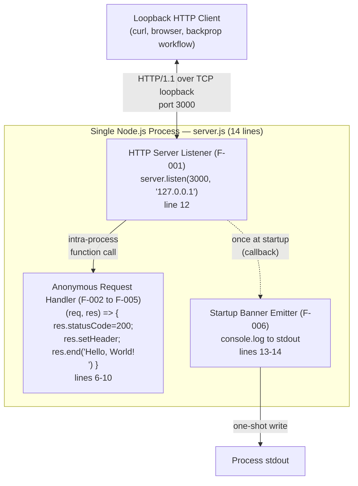

Notable properties evident from the diagram:

- A **single process boundary** encloses every functional component (no service mesh or process boundary between Listener, Handler, and Banner)
- The **only network interface** is loopback HTTP — no outbound calls, no databases, no message queues
- Communication between internal components is **intra-process function call or callback invocation** — no marshalling, no transport, no serialization

#### 6.1.5.2 Categorically Absent Service-Architecture Patterns

This diagram contrasts the minimal set of artifacts that are **present** in the system against the comprehensive set of service-architecture primitives that are **categorically absent**, providing a visual summary of the non-applicability finding.


#### 6.1.5.3 Manual Recovery Flow

This diagram illustrates the system's only "resilience pattern" — manual operator re-invocation following any error condition. It corresponds directly to the error-handling flow in §5.4.7 and the DR posture documented in §5.4.6.

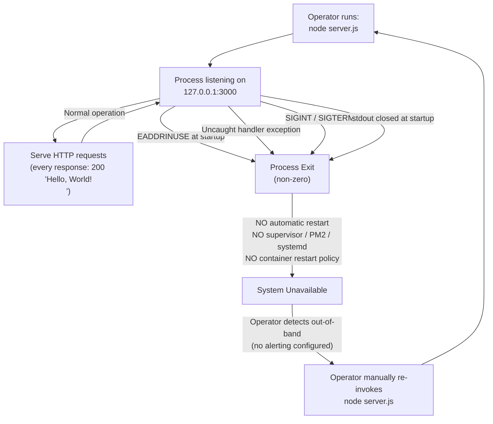

The recovery loop is wholly manual: detection is out-of-band (no alerting per §5.4.1), re-invocation is operator-driven (no supervisor per §5.4.6), and MTTR is bounded only by operator response time.

---

### 6.1.6 Trade-offs and Constraints Summary

#### 6.1.6.1 Architectural Trade-offs

The decision to omit every service-architecture primitive is documented in §5.3.1 as a deliberate set of trade-offs:

| Decision | Trade-off Accepted |
|---|---|
| Single-process, single-module monolith | Forfeits horizontal scalability for trivial deployment and zero coordination overhead |
| Built-in `http` module (no framework) | Forfeits middleware ecosystem for zero install footprint |
| Hard-coded loopback bind (`127.0.0.1`) | Forfeits remote accessibility for implicit network-isolation security |
| Synchronous response generation | Forfeits async-I/O concurrency benefits for deterministic latency |

#### 6.1.6.2 Architectural Constraints

Per §5.5, the architectural assumptions and constraints that govern (and forbid the introduction of) service-architecture primitives are:

| ID | Assumption / Constraint |
|---|---|
| A-001 | A Node.js runtime supporting `http.createServer` and `server.listen` is installed on the host |
| A-002 | TCP port `3000` is available on the host |
| A-003 | The loopback interface (`127.0.0.1`) is reachable from the same host |
| A-004 | The operator launches the process via `node server.js` from the repository root |
| A-005 | Process stdout is writable and readable by whoever needs the readiness signal |

The "Do Not Touch" maintenance constraint (§5.5.3) elevates behavioral immutability above feature growth and creates a strong presumption against any modification — including the introduction of service-architecture primitives that would alter the canonical response, the loopback bind, the zero-dependency posture, or the single-process topology.

#### 6.1.6.3 Conditions Under Which This Section Would Become Applicable

This subsection records the architectural changes that would invalidate the non-applicability finding, so future maintainers can recognize when Section 6.1 must be rewritten:

| Triggering Change | Resulting Need for Service Architecture |
|---|---|
| Bind to non-loopback interface (e.g., `0.0.0.0`) | Introduce TLS, authN/authZ, rate limiting, monitoring, and potentially load balancing |
| Add a database, cache, or queue dependency | Introduce data-redundancy, failover, and connection-pool concerns |
| Decompose `server.js` into multiple processes or modules | Introduce inter-process communication, service discovery, and circuit-breaker concerns |
| Introduce a CI/CD pipeline or container orchestrator | Introduce auto-scaling triggers, capacity planning, and DR procedures |
| Define formal SLAs or KPIs | Introduce performance optimization, monitoring, and resilience-target documentation |

Until any of the above changes is introduced and accepted into the repository, **Core Services Architecture remains not applicable for this system**.

---

### 6.1.7 References

#### 6.1.7.1 Files Examined

- `server.js` — The complete 14-line functional codebase; sole evidence for single-process, single-module monolithic architecture, hard-coded loopback bind on lines 3–4, anonymous handler closure on lines 6–10, and `server.listen` invocation on line 12
- `package.json` — npm metadata declaring `name: "hello_world"`, `version: 1.0.0`, MIT license; failing default `test` script; no runtime dependencies
- `package-lock.json` — `lockfileVersion: 3` with empty `packages` graph; definitive evidence of zero third-party dependencies
- `README.md` — Two-line documentation containing project name `hao-backprop-test` and the "Do not touch!" architectural directive

#### 6.1.7.2 Repository Folders Explored

- `/` (repository root, depth 0) — Sole folder in the repository; contains all source files; absence of subdirectories confirms no service decomposition exists at the filesystem level

#### 6.1.7.3 Cross-Referenced Technical Specification Sections

- §1.1 EXECUTIVE SUMMARY — Establishes the system's posture as a test fixture without service-architecture intent
- §1.2 SYSTEM OVERVIEW — Confirms single-process topology, loopback bind, no enterprise integration surface, no SLAs/KPIs
- §1.3 SCOPE — Explicit out-of-scope list excluding TLS, persistence, externally exposed interfaces, and multi-host deployment
- §2.4 Implementation Considerations — Documents that the system is "not designed for scale-out" and that loopback bind precludes horizontal distribution
- §3.1 STACK OVERVIEW AND ARCHITECTURAL POSTURE — Confirms zero third-party packages, no cloud, no containers, no IaC, no CI/CD
- §3.5 THIRD-PARTY SERVICES — Marks "External APIs," "Authentication Services," "Monitoring Tools," and "Cloud Services" as None
- §3.9 INTEGRATION REQUIREMENTS BETWEEN STACK COMPONENTS — Authoritative statement of "no message bus, no RPC framework, no API gateway, no service mesh, and no service registry"
- §4.4 TECHNICAL IMPLEMENTATION — State management inventory and error-handling surface
- §4.5 CONSOLIDATED PROCESS BOUNDARIES — Single Node.js process boundary with all service-architecture features marked categorically absent
- §5.1 HIGH-LEVEL ARCHITECTURE — Definitive declaration of architecture style (single-process monolith), zero outbound interfaces, no microservice integrations
- §5.2 COMPONENT DETAILS — All four components are intra-process artifacts of a single 14-line module
- §5.3 TECHNICAL DECISIONS — ADR-001 through ADR-005 reject distributed/service-oriented patterns
- §5.4 CROSS-CUTTING CONCERNS — "No load balancer, reverse proxy, or service mesh"; "no formal disaster recovery procedures"; manual operator recovery only
- §5.5 ARCHITECTURAL ASSUMPTIONS AND CONSTRAINTS — A-001 through A-005 assumptions; "Do Not Touch" maintenance constraint

## 6.2 Database Design

### 6.2.1 Applicability Assessment

**Database Design is not applicable to this system.**

The repository under specification implements a **single-process, single-module, stateless monolith** — specifically a 14-line Node.js HTTP fixture contained entirely in `server.js` whose response body is a hard-coded string literal. Per §3.6.1, the system has no relational database, no document database, no key-value store, no graph database, no time-series database, and no search index. Per §3.6.2, the system is "stateless by design" — it "returns a static string and persists no data." Per §3.6.3 and §3.6.4, no caching solutions and no storage services of any kind are integrated.

Consequently, every database-design concern listed in the section prompt — schema design, entity relationships, indexing, partitioning, replication, backup, migration, archival, retention, audit, query optimization, connection pooling, read/write splitting, and batch processing — is **categorically absent**. There are no schemas to design, no entities to relate, no indexes to define, no queries to optimize, and no connection pools to size.

This subsection documents the evidence base for non-applicability, enumerates each database-design concern that is categorically absent (with citations to authoritative source-code lines and prior tech spec sections), and presents the architectural rationale that makes data-tier patterns deliberately out of scope.

#### 6.2.1.1 Evidence Base for Non-Applicability

The non-applicability finding is supported by five converging classes of evidence: source-code structure, dependency posture, response-body provenance, repository folder structure, and explicit tech-spec declarations.

| Evidence Class | Specific Finding | Authoritative Source |
|---|---|---|
| Source code | Sole `require()` is `require('http')`; no `fs`, no DB driver, no ORM, no cache client | `server.js` line 1 |
| Dependency posture | Empty dependency graph; zero database/ORM/caching packages | `package.json` (no `dependencies`); `package-lock.json` (`lockfileVersion: 3`, no `packages` entries) |
| Response provenance | Response body `'Hello, World!\n'` is a hard-coded string literal | `server.js` line 9 |
| Folder structure | No `migrations/`, `models/`, `db/`, `data/`, `seeds/`, or `schema/` subdirectories | Repository root (depth 0; no subdirectories exist) |
| Tech-spec declaration | "None" findings for Primary/Secondary Databases, Caching, and Storage Services | §3.6.1, §3.6.3, §3.6.4 |

Per §3.6.2, the static response body `Hello, World!\n` is "hard-coded as a string literal in `server.js` and is therefore part of the source-code artifact rather than any runtime data store." Per §5.1.3.5, the system has "no data stores and no caches of any kind" — explicitly enumerating the absence of relational databases, document stores, key-value stores, graph databases, time-series databases, search indexes, filesystem writes, application-level caches, distributed caches, HTTP caches, CDNs, object storage, session state, request-scoped state, and closure mutation.

#### 6.2.1.2 Why Persistence Is Deliberately Out of Scope

Per §5.3.3, no persistence solution is needed because four interlocking architectural facts eliminate every reason to introduce one:

- The response is fixed (per F-005), so there is nothing to read from a database
- The handler is a pure function (per F-002), so there is no per-request state to write
- There are no users, sessions, or accounts (per the loopback security model)
- There are no transactions to coordinate

Per §5.3.3, the decision to forgo all persistence "eliminates entire classes of operational concerns: database deployment, schema migration, connection pooling, transaction management, backup procedures, replication topology, and consistency models. None of these apply." Per §5.3.4, no caching is implemented at any layer because there is "no upstream resource to cache" (the response is a string literal in source code) and "caching would not improve latency" (the response is already generated synchronously with no async I/O).

This non-applicability finding is reinforced by five Architecture Decision Records (ADR-001 through ADR-005, §5.3.6) which collectively reject database, framework, and external-service introduction; by the README directive "Do not touch!" (§5.5.3) which elevates behavioral immutability above feature growth; and by constraint C-006 (§2.6.2) which classifies the inert `industry.csv` files as "cross-language inert artifacts" that "MUST NOT be treated as features."

#### 6.2.1.3 Inert Artifacts That Must Not Be Misread as a Data Layer

The repository contains static CSV files whose physical presence could be misread as implying a data layer. Per §3.6.5, these warrant explicit acknowledgment to prevent such misinterpretation:

| File | Content | Operational Status |
|---|---|---|
| `industry.csv` | 44 rows: header `Industry` plus 43 industry categories | Not loaded by any code (per §1.3.3.1) |
| `industry - Copy.csv` | Byte-identical duplicate of `industry.csv` | Inert (per C-005) |

No code in the repository reads, parses, queries, or otherwise references these CSV files. They are not consumed by `server.js`, are not loaded by any module, and are not referenced from `package.json`. Per constraint C-006 (§2.6.2), they are "cross-language inert artifacts that MUST NOT be treated as features." Their presence contributes zero technology dependencies to the system and does not constitute a data layer.

---

### 6.2.2 Schema Design Analysis

This subsection enumerates each schema-design concern listed in the section prompt and documents its categorical absence with reference to source-code lines and prior tech spec sections. **No entity-relationship diagram, data dictionary, index inventory, or constraint catalog exists** because there is no schema to describe.

#### 6.2.2.1 Entity Relationships

No entities exist, and therefore no entity relationships exist. Per §3.6.2, the response is a 13-byte string literal embedded in source code; it is not derived from any input, template, configuration, or external resource (§5.1.3.4). Request data is not parsed beyond the framing performed by Node's HTTP layer and is then "discarded without inspection."

| Concept | Status in System |
|---|---|
| Domain entities (User, Order, Account, etc.) | None |
| Foreign-key relationships | None |
| Cardinality declarations (1:1, 1:N, M:N) | None |
| Aggregate boundaries (DDD) | None |
| Lookup tables / reference data tables | None — `industry.csv` is inert (per §3.6.5) |

The closest physical artifact resembling a "lookup table" is the `industry.csv` file, but as documented in §6.2.1.3 and constraint C-006, it is not loaded by any code and does not participate in any runtime data flow.

#### 6.2.2.2 Data Models and Structures

No data models are defined. Per §5.1.3.4, "There are no data transformation points. The response body is a string literal embedded in source; it is not derived from any input, template, configuration, or external resource."

| Model Concern | Status |
|---|---|
| Logical data model (ER, dimensional, star/snowflake) | Not applicable — no entities |
| Physical data model (DDL, table definitions) | Not applicable — no schema |
| Document schema (JSON Schema, Avro, Protobuf) | Not applicable — no documents |
| Object-relational mapping (entities, repositories) | Not applicable — no ORM (no `sequelize`, `typeorm`, `mongoose`, `prisma`, `knex`) |
| Type system for persisted state | Not applicable — no persisted state |

The only "data structure" exposed at runtime is the response triple emitted by the handler closure on `server.js` lines 7–9: a status code (`200`), a single response header (`Content-Type: text/plain`), and a body literal (`Hello, World!\n`). This triple is part of the source-code artifact, not a runtime data model (per §5.3.3).

#### 6.2.2.3 Indexing Strategy

No indexes exist because no database exists to index. Per §3.6.1, the system has no relational database (PostgreSQL, MySQL, SQLite), no document database (MongoDB, CouchDB, DynamoDB), no key-value store (Redis, Memcached), no graph database (Neo4j, ArangoDB), no time-series database (InfluxDB, TimescaleDB), and no search index (Elasticsearch, OpenSearch).

| Index Type | Applicability |
|---|---|
| Primary key indexes (B-tree, hash) | Not applicable — no tables |
| Secondary indexes (composite, covering, partial) | Not applicable — no tables |
| Full-text indexes | Not applicable — no documents to search |
| Geospatial indexes | Not applicable — no spatial data |
| Inverted indexes (search engines) | Not applicable — no search index |

#### 6.2.2.4 Partitioning Approach

No partitioning approach is defined because no database exists to partition. Partitioning concerns — horizontal sharding, vertical partitioning, range/list/hash distribution, partition pruning — presuppose a data store. Per §6.1.4.3, "data redundancy is not applicable" because "the system has no data stores and no caches of any kind."

| Partitioning Concern | Applicability |
|---|---|
| Horizontal sharding (shard key, shard map) | Not applicable — no database |
| Vertical partitioning (column splitting) | Not applicable — no tables |
| Range / list / hash partitioning | Not applicable — no database |
| Time-based partitioning (rolling windows) | Not applicable — no time-series data |
| Multi-tenant data isolation | Not applicable — no tenants, no data |

#### 6.2.2.5 Replication Configuration

No replication topology is configured. Per §6.1.4.3, "Database replication (primary/replica, multi-master)" is explicitly listed as "Not applicable — no database." The loopback bind on `server.js` line 3 (`hostname = '127.0.0.1'`) further precludes a multi-host topology even at the application level.

| Replication Concern | Applicability |
|---|---|
| Primary/replica (master/slave) topology | Not applicable — no database |
| Multi-master / active-active replication | Not applicable — no database |
| Logical vs. physical replication | Not applicable — no database |
| Synchronous vs. asynchronous replication | Not applicable — no database |
| Cross-region / cross-AZ replication | Not applicable — single host, loopback only |

#### 6.2.2.6 Backup Architecture

No backup architecture is defined. Per §6.1.4.3, "Backup/restore procedures" are "Not applicable — no state to back up." Per §5.4.6 (cross-referenced from §6.1.4.2), "No backup or restore procedure applies — there is no state to back up."

| Backup Concern | Applicability |
|---|---|
| Full / incremental / differential backups | Not applicable — no data |
| Snapshot policies (volume, database) | Not applicable — no persistent volumes |
| Point-in-time recovery (PITR) | Not applicable — no data, no transaction log |
| Backup retention windows | Not applicable — no backups exist |
| Cross-region backup replication | Not applicable — no backups exist |

The closest analogue to "backup" in this system is **source-code preservation via version control** (the canonical response body is preserved in git history). This is out of scope for a database-design discussion and does not constitute a runtime backup posture.

---

### 6.2.3 Data Management Analysis

This subsection enumerates each data-management concern listed in the section prompt and documents its categorical absence.

#### 6.2.3.1 Migration Procedures

No migration procedures exist. Per §5.3.3, the elimination of all persistence "eliminates entire classes of operational concerns: database deployment, schema migration, connection pooling, transaction management, backup procedures, replication topology, and consistency models. None of these apply."

| Migration Concern | Applicability |
|---|---|
| Schema migration framework (Flyway, Liquibase, Alembic, Knex migrations) | Not applicable — no schema |
| Forward migrations (DDL evolution) | Not applicable — no schema |
| Rollback migrations (down scripts) | Not applicable — no schema |
| Data backfill / transformation jobs | Not applicable — no data |
| Zero-downtime migration patterns (expand/contract) | Not applicable — no schema, no downtime semantics |

The repository contains no `migrations/`, `db/migrate/`, or equivalent directory; no migration manifest is declared in `package.json`; and no migration framework is loaded by `server.js`.

#### 6.2.3.2 Versioning Strategy

No data-versioning strategy exists. The handler emits a single canonical response with no notion of payload-schema versioning, and the absence of any persisted state means there is no row-level, document-level, or schema-level version metadata to maintain.

| Versioning Concern | Applicability |
|---|---|
| Schema version table (Flyway `schema_version`, etc.) | Not applicable — no schema |
| Row-level versioning / optimistic concurrency (`version` column, ETags) | Not applicable — no rows |
| Event-sourced versioning (event-stream version) | Not applicable — no events |
| API payload versioning (URI versioning, header versioning) | Not applicable — uniform response per F-002-RQ-001 |
| Compatibility strategy (backward, forward, full) | Not applicable — no evolving schema |

#### 6.2.3.3 Archival Policies

No archival policies exist. Per §3.6.2, no data is persisted; consequently there is no "cold" or "warm" tier, no archival schedule, and no archival storage target.

| Archival Concern | Applicability |
|---|---|
| Hot / warm / cold tiering | Not applicable — no data |
| Archival storage target (S3 Glacier, Azure Archive, GCS Coldline) | Not applicable — no object storage |
| Archive scheduling (cron, AWS Lifecycle, Azure Lifecycle) | Not applicable — no scheduled jobs |
| Archive retrieval workflow | Not applicable — no archives exist |
| Archive verification / integrity checks | Not applicable — no archives exist |

#### 6.2.3.4 Data Storage and Retrieval Mechanisms

No data storage or retrieval mechanisms exist. Per §3.6.4, there is no object storage (S3, Azure Blob, GCS), no file system writes (the server makes no `fs.write*` calls), no temp-file usage, and no upload handling. Per §5.1.3.5, the system "has no data stores and no caches of any kind."

| Storage / Retrieval Mechanism | Applicability |
|---|---|
| SQL query engine (SELECT, INSERT, UPDATE, DELETE) | Not applicable — no database |
| NoSQL document API (find, insert, update, replace) | Not applicable — no database |
| Key-value GET / SET / DEL | Not applicable — no key-value store |
| Object storage PUT / GET / LIST / DELETE | Not applicable — no object storage |
| Filesystem `fs.readFile` / `fs.writeFile` | Not applicable — `fs` is never required |

The handler's only "I/O" beyond accepting requests is `res.end('Hello, World!\n')` on line 9, which is a synchronous local socket write of a hard-coded literal — not a data retrieval operation.

#### 6.2.3.5 Caching Policies

No caching policies are defined at any layer. Per §3.6.3 and §5.3.4, "no caching is implemented at any layer, and none is needed." The justification is twofold: (1) "no upstream resource to cache — the response is a string literal in source code; there is no database query, no remote API call, and no expensive computation whose results could be cached"; and (2) "caching would not improve latency — the response is already generated synchronously with no async I/O; a cache would add lookup overhead without removing any work."

| Caching Layer | Applicability |
|---|---|
| In-process cache (`Map`, `LRU`, `node-cache`) | Not applicable — no upstream to cache |
| Distributed cache (Redis, Memcached, Hazelcast) | Not applicable — no client library installed |
| HTTP response cache (Varnish, Nginx microcache) | Not applicable — no proxy in the path |
| CDN (CloudFront, Cloudflare, Fastly, Akamai) | Not applicable — no CDN integration |
| Client-side caching directives (`Cache-Control`, `ETag`) | Not implemented — handler emits only `Content-Type` |

---

### 6.2.4 Compliance Considerations Analysis

This subsection enumerates each compliance-related data concern listed in the section prompt and documents its categorical absence.

#### 6.2.4.1 Data Retention Rules

No data retention rules are defined because no data is retained. Per §3.6.2, "the server returns a static string and persists no data." Per §5.1.3.5, the system has "no session state, no request-scoped state, no closure mutation."

| Retention Concern | Applicability |
|---|---|
| Per-record retention policy (TTL, expiry) | Not applicable — no records |
| Tenant-level retention (per-customer policy) | Not applicable — no tenants |
| Regulatory retention (GDPR Art. 17, HIPAA, SOX) | Not applicable — no data subject to regulation |
| Legal hold mechanism | Not applicable — no data subject to hold |
| Right-to-erasure ("right to be forgotten") workflow | Not applicable — no PII collected or stored |

#### 6.2.4.2 Backup and Fault Tolerance Policies

No backup or fault-tolerance policies apply at the data tier. Per §6.1.4.1, no fault-tolerance primitives are implemented (no `try`/`catch`, no retries, no fallbacks, no graceful shutdown, no `uncaughtException` handler). Per §6.1.4.3, "Backup/restore procedures" are "Not applicable — no state to back up," and "Snapshot policies" are "Not applicable — no persistent volumes."

| Backup / Fault-Tolerance Concern | Applicability |
|---|---|
| Recovery Time Objective (RTO) for data tier | Not applicable — no data tier |
| Recovery Point Objective (RPO) for data tier | Not applicable — no data tier |
| Backup verification cadence | Not applicable — no backups |
| Failover automation (DB high-availability) | Not applicable — no database |
| Multi-region disaster recovery for data | Not applicable — single host, loopback only |

#### 6.2.4.3 Privacy Controls

No privacy controls are required at the data tier because no personally identifiable information (PII), protected health information (PHI), payment-card information (PCI), or other sensitive data is collected, processed, or stored. Per §5.1.3.4, "request data is not parsed beyond the framing performed by Node's HTTP layer ... and is then discarded without inspection."

| Privacy Control | Applicability |
|---|---|
| Data classification (public, internal, confidential, restricted) | Not applicable — no data |
| PII / PHI / PCI tagging and masking | Not applicable — no such data collected |
| Encryption at rest (TDE, KMS-managed keys) | Not applicable — no data at rest |
| Encryption in transit (TLS to database) | Not applicable — no database connection |
| Data subject access request (DSAR) workflow | Not applicable — no data subjects |

The handler discards every byte of the inbound request without parsing query strings, headers, cookies, or body content — eliminating any pathway by which PII could be observed, logged, or persisted by the system.

#### 6.2.4.4 Audit Mechanisms

No audit mechanisms are implemented at the data tier. Per §5.4.4 (cross-referenced from §6.1), there is no audit logging, no rate limiting, and no session storage. Per §5.1.3.2, the only observability artifact is the one-shot startup banner — there is no per-request logging, no query log, no access log, and no change-data-capture (CDC) stream.

| Audit Concern | Applicability |
|---|---|
| Database query audit log (e.g., PostgreSQL `pgaudit`, MySQL `audit_log`) | Not applicable — no database |
| Change-data-capture (Debezium, AWS DMS) | Not applicable — no database |
| Application-level audit trail (who/what/when on records) | Not applicable — no records |
| Immutable audit ledger (append-only log, blockchain) | Not applicable — no audit data |
| Compliance reporting (SOC 2, ISO 27001 evidence) | Not applicable — no controls to report on |

#### 6.2.4.5 Access Controls

No data-tier access controls exist. Per §5.3.5, the system's sole security mechanism is **network confinement via loopback bind** — there is no authentication, no authorization, no role-based access control, and no row-/column-level security. Because there is no database, there are no database users, roles, grants, or permission models.

| Access Control Concern | Applicability |
|---|---|
| Database role / user / grant model | Not applicable — no database |
| Row-level security (RLS) / column-level security (CLS) | Not applicable — no rows or columns |
| Service-account / IAM credentials for data access | Not applicable — no data services |
| Connection ACL (host-based authentication, `pg_hba.conf`) | Not applicable — no database |
| Secrets management for DB credentials (Vault, AWS Secrets Manager) | Not applicable — no credentials exist |

The architectural access-control posture is summarized in §5.3.5: loopback confinement is the sole network-security control, and "any modification that exposes the listener to a non-loopback interface would invalidate the security model." This applies a fortiori to introducing a database, which would necessitate a credential boundary that does not exist today.

---

### 6.2.5 Performance Optimization Analysis

This subsection enumerates each performance-optimization concern listed in the section prompt and documents its categorical absence.

#### 6.2.5.1 Query Optimization Patterns

No query optimization patterns exist because no queries exist. Per §5.3.3, "the response is fixed (per F-005), so there is nothing to read from a database." Per §5.1.3.4, the response body is a string literal embedded in source — not the result of any query, computation, or transformation.

| Query Optimization Concern | Applicability |
|---|---|
| Query plan analysis (`EXPLAIN`, `EXPLAIN ANALYZE`) | Not applicable — no queries |
| Index hint usage / index-only scans | Not applicable — no indexes, no queries |
| Query rewriting / view materialization | Not applicable — no queries |
| Statistics maintenance (`ANALYZE`, `VACUUM`) | Not applicable — no database |
| N+1 query detection / batching (DataLoader) | Not applicable — no queries |

#### 6.2.5.2 Caching Strategy

No caching strategy is implemented at any layer. As documented in §6.2.3.5 and §5.3.4, the architectural justification is that there is no upstream resource whose results could be cached (the response is a hard-coded string literal) and a cache would add lookup overhead without removing any work. The categorical absence covers in-process caches, distributed caches, HTTP response caches, and CDN tiers.

| Caching Strategy Element | Applicability |
|---|---|
| Cache-aside / read-through / write-through patterns | Not applicable — no upstream |
| Cache eviction policy (LRU, LFU, TTL) | Not applicable — no cache |
| Cache invalidation strategy (event-driven, time-based) | Not applicable — no cache |
| Cache key design / namespacing | Not applicable — no cache |
| Multi-tier cache hierarchy (L1/L2) | Not applicable — no cache |

#### 6.2.5.3 Connection Pooling

No connection pooling is implemented. Per §5.3.3, the elimination of all persistence eliminates "connection pooling" as an operational concern. Per §5.2.1.4 (cross-referenced from §6.1.3.3), "There is no connection limit, queueing logic, or back-pressure mechanism configured beyond Node defaults."

| Connection Pooling Concern | Applicability |
|---|---|
| Database connection pool (size, timeout, validation) | Not applicable — no database |
| Connection acquisition / release lifecycle | Not applicable — no database |
| Connection health checks / pings | Not applicable — no database |
| Pool overflow / queue behavior | Not applicable — no database |
| Per-tenant or per-shard pool partitioning | Not applicable — no database |

The HTTP listener itself uses Node's intrinsic libuv accept loop (per §5.1.3.1), which is not a "connection pool" in the data-tier sense — it is the OS-managed inbound socket queue for the HTTP server.

#### 6.2.5.4 Read/Write Splitting

No read/write splitting exists because there are no reads or writes to split. Per §5.3.3, "the response is fixed, so there is nothing to read from a database" and "the handler is a pure function, so there is no per-request state to write."

| Read/Write Splitting Concern | Applicability |
|---|---|
| Primary/replica routing (writes to primary, reads to replica) | Not applicable — no database |
| Read-replica lag handling (read-after-write consistency) | Not applicable — no replicas |
| CQRS (Command Query Responsibility Segregation) | Not applicable — no commands, no queries |
| Eventual-consistency reconciliation | Not applicable — no replicated data |
| Read-preference configuration (driver-level) | Not applicable — no driver |

#### 6.2.5.5 Batch Processing Approach

No batch processing exists. Per §5.1.4 (cross-referenced from §6.1.2.2), the system has "no batch or scheduled jobs (cron, Airflow, etc.)," "no message-queue producers or consumers (Kafka, RabbitMQ, SQS)," and "no event-bus subscribers or publishers (EventBridge, Pub/Sub)."

| Batch Processing Concern | Applicability |
|---|---|
| Bulk insert / update / delete (`COPY`, `BULK INSERT`) | Not applicable — no database |
| ETL/ELT pipelines (Airflow, Dagster, dbt) | Not applicable — no data warehouse |
| Stream processing (Kafka Streams, Flink, Spark Streaming) | Not applicable — no streams |
| Scheduled jobs (cron, Quartz, EventBridge schedules) | Not applicable — no jobs |
| Bulk import/export workflows | Not applicable — no data |

The handler processes one HTTP request at a time, synchronously, with no batching, buffering, queuing, or aggregation between requests — and no facility for grouping multiple requests into a unit of work.

---

### 6.2.6 Architectural Visualizations

The diagrams below visually reinforce the non-applicability finding by depicting (1) the actual single-process data-flow architecture (in which the response body is embedded in source code rather than retrieved from a data store), (2) a contrast diagram showing the categorical absence of every database-design primitive, and (3) the absence of any replication topology relative to the loopback-confined process.

#### 6.2.6.1 Source-Embedded Data Flow Diagram

This diagram depicts the entirety of the data flow in the system. The response body originates as a string literal in source code (`server.js` line 9), is held only in process memory during request handling, and is written to the loopback TCP socket. **No database, cache, queue, file system, or external service participates in the data flow.**

```mermaid
flowchart LR
    Source["Source Code Artifact<br/>server.js line 9<br/>String literal: 'Hello, World!\n'"]
    Process["Node.js Process Memory<br/>(handler closure scope)"]
    Socket["TCP Loopback Socket<br/>127.0.0.1:3000"]
    Client["Loopback HTTP Client"]
    NoDB[("No Database")]
    NoCache[("No Cache")]
    NoFS[("No Filesystem<br/>Writes")]
    NoObj[("No Object<br/>Storage")]
    Source -->|"loaded once at<br/>module evaluation"| Process
    Process -->|"res.end synchronous<br/>socket write"| Socket
    Socket -->|"HTTP/1.1 response"| Client
    Process -.->|"NEVER reads from"| NoDB
    Process -.->|"NEVER reads from"| NoCache
    Process -.->|"NEVER writes to"| NoFS
    Process -.->|"NEVER writes to"| NoObj
```

Notable properties evident from the diagram:

- The **data origin** is the source-code artifact itself, not any data store (per §5.3.3)
- The **only data sink** is the loopback TCP socket; there is no `fs.write*`, no database `INSERT`, no cache `SET`, and no object-storage `PUT`
- All persistent-data primitives (database, cache, filesystem, object storage) are connected by **dotted "NEVER" edges**, indicating categorical absence rather than runtime decisions

#### 6.2.6.2 Categorically Absent Database-Design Primitives

This diagram contrasts the minimal data-flow elements **present** in the system against the comprehensive set of database-design primitives that are **categorically absent**, providing a visual summary of the non-applicability finding. The structure mirrors §6.1.5.2 to maintain documentary consistency.

```mermaid
flowchart LR
    subgraph Present["PRESENT in System"]
        direction TB
        P1["String literal in source<br/>(server.js line 9)"]
        P2["Process memory<br/>(handler closure)"]
        P3["Loopback TCP socket<br/>(synchronous write)"]
    end
    subgraph Absent["CATEGORICALLY ABSENT"]
        direction TB
        A1["No relational / document / KV / graph / TS / search DB"]
        A2["No ORM / ODM / query builder"]
        A3["No schema, tables, columns, or indexes"]
        A4["No primary keys, foreign keys, or constraints"]
        A5["No partitioning / sharding"]
        A6["No replication topology"]
        A7["No backup / snapshot / PITR"]
        A8["No migration framework"]
        A9["No application or distributed cache"]
        A10["No CDN / HTTP cache"]
        A11["No object storage / file writes"]
        A12["No connection pooling"]
        A13["No query optimization / EXPLAIN"]
        A14["No batch / ETL / streaming jobs"]
        A15["No audit log / CDC / DSAR workflow"]
    end
    Present -.->|"explicit design choice<br/>per ADR-001 through ADR-005<br/>and §3.6.1 through §3.6.4"| Absent
```

#### 6.2.6.3 Replication Architecture (Non-Existent)

This diagram illustrates the absence of any replication topology. The single Node.js process is bound exclusively to `127.0.0.1`, which structurally precludes a multi-host replication topology even if a database were introduced. The diagram exists to satisfy the section prompt's requirement for a "Replication architecture" visualization while accurately portraying that **no such architecture exists**.

```mermaid
flowchart TB
    subgraph Host["Single Host (Loopback Only)"]
        direction TB
        Proc["Node.js Process<br/>server.js (14 lines)<br/>Bound to 127.0.0.1:3000"]
        NoPrimary[("No Primary DB")]
        NoReplica[("No Replica DB")]
        NoStandby[("No Hot Standby")]
        Proc -.->|"NO connection"| NoPrimary
        NoPrimary -.->|"NO replication stream"| NoReplica
        NoPrimary -.->|"NO failover link"| NoStandby
    end
    OtherHost["Off-Host Peers<br/>(STRUCTURALLY UNREACHABLE<br/>via loopback bind)"]
    Host -.->|"Loopback bind precludes<br/>multi-host topology<br/>per §6.1.4.3 / §6.1.4.4"| OtherHost
```

Per §6.1.4.4, "no failover topology exists" because "the loopback bind precludes a secondary host." A future replication topology would require at minimum: (1) introducing a database (forbidden by ADR-001 and §5.3.3), (2) breaking the loopback constraint C-001 (which would invalidate the security model per §5.3.5), and (3) introducing a health-check and failover orchestration layer (none of which exists per §6.1.2.5 and §6.1.2.6).

#### 6.2.6.4 Conceptual Entity-Relationship Diagram (Empty Set)

The section prompt requires an ERD. Because no entities exist, the ERD is the empty set. The diagram below represents this state explicitly, in keeping with the documentary pattern of recording categorical absence rather than omitting the artifact.

```mermaid
erDiagram
    NO_ENTITY {
        string note "No entities defined; system is stateless per §3.6.2"
    }
```

This ERD contains a single placeholder block named `NO_ENTITY` with an explanatory note. It is **not** a real entity — it is a documentary device to make the absence of a domain model visually explicit. Per §5.1.3.5, the system has "no session state, no request-scoped state, no closure mutation." Per constraint C-006 (§2.6.2), the inert `industry.csv` files do not constitute entities because they are never loaded by code.

---

### 6.2.7 Trade-offs and Conditions for Future Applicability

#### 6.2.7.1 Architectural Trade-offs Anchoring Non-Applicability

The decision to omit every database-design primitive is documented in §5.3.1 and §5.3.3 as a deliberate set of trade-offs:

| Decision | Trade-off Accepted |
|---|---|
| Stateless handler with hard-coded literal response | Forfeits dynamic, query-driven responses for deterministic latency and zero-coordination concurrency |
| Zero third-party dependencies | Forfeits ORM/driver/cache ecosystems for trivial deployment and minimal supply-chain risk |
| Loopback-only network bind | Forfeits multi-host replication topology for an implicit security boundary |
| Hard-coded configuration constants | Forfeits per-environment data-source selection for behavioral immutability |

These trade-offs are reaffirmed by the README's "Do not touch!" directive (§5.5.3), which "elevates behavioral immutability above feature growth" and "creates a strong presumption against any modification" — including the introduction of database-design primitives that would alter the canonical response, the loopback bind, the zero-dependency posture, or the single-process topology.

#### 6.2.7.2 Architectural Constraints Forbidding Persistence

Per §5.5 and §6.1.6.2, the architectural assumptions and constraints that govern (and forbid) the introduction of persistence primitives are summarized below. ADR identifiers reference §5.3.6.

| Constraint | Description |
|---|---|
| ADR-001 (no framework) | Use only Node's built-in `http` module — forbids ORM/driver introduction by extension |
| ADR-002 (loopback bind) | Hard-code `127.0.0.1` — precludes multi-host replication topologies |
| ADR-003 (hard-coded config) | No `process.env`, no config files — forbids dynamic data-source URLs |
| ADR-004 (uniform response) | Handler must not branch on request — forbids query-driven response variation |
| C-006 (inert artifacts) | `industry.csv` "MUST NOT be treated as features" — forbids reinterpretation as data layer |

#### 6.2.7.3 Conditions Under Which This Section Would Become Applicable

This subsection records the architectural changes that would invalidate the non-applicability finding, so future maintainers can recognize when Section 6.2 must be rewritten. The pattern mirrors §6.1.6.3 to maintain documentary consistency.

| Triggering Change | Resulting Need for Database Design |
|---|---|
| Add a database driver (`pg`, `mysql2`, `mongodb`, `redis`, `sqlite3`) to `package.json` and `require` it from `server.js` | Define schema, indexes, connection pool, migration strategy, backup architecture, and access controls |
| Introduce `fs.read*` or `fs.write*` calls (e.g., load `industry.csv` at runtime) | Define file-format schema, retention policy, and concurrency control on shared files |
| Integrate a caching layer (Redis, Memcached, in-process LRU) | Define cache key design, eviction policy, invalidation strategy, and hit-rate targets |
| Introduce object storage (S3, Azure Blob, GCS) | Define bucket structure, lifecycle policy, encryption posture, and IAM access model |
| Persist any per-request or per-session state | Define data model, retention, privacy controls, and audit mechanisms |
| Bind to non-loopback interface and serve dynamic responses | Define authentication, encryption-at-rest/in-transit, audit logging, and DSAR workflow |

Until any of the above changes is introduced and accepted into the repository, **Database Design remains not applicable to this system**.

---

### 6.2.8 References

#### 6.2.8.1 Files Examined

- `server.js` — The complete 14-line functional codebase; sole evidence that only `require('http')` is loaded (line 1), the response body is a hard-coded string literal (line 9), and no database driver, ORM, or cache client is imported
- `server - Copy.js` — Byte-identical duplicate of `server.js`; confirmed to contribute no separate persistence code
- `package.json` — npm metadata declaring `name: "hello_world"`, `version: 1.0.0`, MIT license; contains no `dependencies` or `devDependencies` block; no database/ORM/cache packages declared
- `package-lock.json` — Lockfile with `lockfileVersion: 3` and an empty `packages` graph (only the root package); definitive evidence of zero third-party persistence dependencies
- `README.md` — Two-line documentation containing project name `hao-backprop-test` and the "Do not touch!" architectural directive that constrains schema/dependency growth
- `industry.csv` — Static one-column lookup table (header `Industry` plus 43 categories); confirmed not loaded by any code per §3.6.5
- `industry - Copy.csv` — Byte-identical duplicate of `industry.csv`; inert per constraint C-005

#### 6.2.8.2 Repository Folders Explored

- `/` (repository root, depth 0) — Sole folder in the repository; confirmed absence of `migrations/`, `models/`, `db/`, `data/`, `seeds/`, or `schema/` subdirectories; no database-related directory structure exists at the filesystem level

#### 6.2.8.3 Cross-Referenced Technical Specification Sections

- §1.2 SYSTEM OVERVIEW — System topology and confirmation of no enterprise integration surface
- §1.3 SCOPE — Excluded capabilities including "Persistent storage" with rationale "No database driver, no filesystem writes, no caching layer"
- §2.6 Assumptions and Constraints — Constraint C-005 (duplicates) and C-006 (inert artifacts including `industry.csv`)
- §3.5 THIRD-PARTY SERVICES — No database drivers, no SDKs, no cloud data services
- §3.6 DATABASES AND STORAGE — Definitive "None" findings for Primary/Secondary Databases (§3.6.1), Data Persistence Strategy (§3.6.2), Caching Solutions (§3.6.3), Storage Services (§3.6.4); inert CSV inventory (§3.6.5)
- §5.1 HIGH-LEVEL ARCHITECTURE — §5.1.3.4 (no data transformation points); §5.1.3.5 (no data stores and no caches)
- §5.2 COMPONENT DETAILS — All four runtime components documented with no persistence (HTTP Server Listener, Request Handler Closure, Startup Banner Emitter, npm Package Manifest)
- §5.3 TECHNICAL DECISIONS — §5.3.3 Data Storage Solution Rationale; §5.3.4 Caching Strategy Justification; ADR-001 through ADR-005 (§5.3.6) reject persistence introduction
- §5.4 CROSS-CUTTING CONCERNS — §5.4.4 (no audit logging, no rate limiting, no session storage); §5.4.6 (no backup/restore — no state to back up)
- §5.5 ARCHITECTURAL ASSUMPTIONS AND CONSTRAINTS — "Do Not Touch" maintenance constraint requiring zero-dependency preservation
- §6.1 CORE SERVICES ARCHITECTURE — §6.1.4.3 Data Redundancy Approach (authoritative non-applicability finding for replication, backup, snapshots, cross-region, object-storage versioning); §6.1.6.3 conditions-for-future-applicability pattern

## 6.3 Integration Architecture

### 6.3.1 Applicability Assessment

**Integration Architecture is not applicable for this system.**

The repository under specification implements a **single-process, single-module, stateless HTTP fixture** — specifically a 14-line Node.js HTTP responder contained entirely in `server.js` that binds to `127.0.0.1:3000` and emits a hard-coded canonical response. Per §3.9, the technology stack has "no message bus, no RPC framework, no API gateway, no service mesh, and no service registry." Per §5.1.4, integration patterns commonly found in microservice architectures are categorically absent: no outbound REST or RPC calls, no inbound webhooks beyond raw HTTP requests, no message-queue producers or consumers, no event-bus subscribers or publishers, no batch or scheduled jobs, no database flows, no cache populate/invalidate flows, no cloud-provider SDK calls, no authentication services, and no monitoring or observability tools.

Consequently, every integration-architecture concern listed in the section prompt — protocol specification beyond HTTP framing, authentication and authorization, rate limiting, API versioning, documentation generators, event processing, message queues, stream processing, batch processing, third-party integration patterns, legacy interfaces, API gateway configuration, and external service contracts — is **categorically absent**. The system has exactly **one inbound integration surface** (the loopback HTTP listener) and exactly **one conceptual external consumer** (the implicit "backprop" workflow, which is external to this repository and has no client code, configuration, or shared library present in the codebase).

This subsection documents the evidence base for non-applicability, identifies the single conceptual integration point, enumerates each integration concern that is categorically absent (with citations to authoritative source-code lines and prior tech-spec sections), and presents the architectural rationale that makes integration patterns deliberately out of scope.

#### 6.3.1.1 Evidence Base for Non-Applicability

The non-applicability finding is supported by five converging classes of evidence: source-code structure, dependency posture, network binding, repository folder structure, and explicit tech-spec declarations.

| Evidence Class | Specific Finding | Authoritative Source |
|---|---|---|
| Source code | Sole `require()` is `require('http')`; no HTTP client, SDK, queue driver, or RPC stub | `server.js` line 1 |
| Dependency posture | Empty dependency graph; zero integration libraries | `package.json` (no `dependencies`); `package-lock.json` (`lockfileVersion: 3`, no `packages` entries) |
| Network binding | Hard-coded loopback bind (`127.0.0.1:3000`) precludes off-host integration | `server.js` lines 3–4; §5.1.1.3 |
| Folder structure | No `routes/`, `controllers/`, `clients/`, `adapters/`, `integrations/`, or `gateway/` subdirectories exist | Repository root, depth 0 |
| Tech-spec declaration | "no message bus, no RPC framework, no API gateway, no service mesh, and no service registry" | §3.9 |

Per §1.2.1.3, the repository explicitly contains "No outbound network calls — the server only accepts inbound HTTP requests," "No external service clients — no SDKs, no API credentials, no database drivers," "No CI/CD configuration — no workflow files, no Dockerfile, no deployment manifests," and "No third-party npm dependencies — `package-lock.json` (lockfileVersion 3) records only the root package; the dependency graph is empty." Per §3.5, every category of third-party service is marked "None": External APIs (§3.5.1), Authentication Services (§3.5.2), Monitoring and Observability Tools (§3.5.3), and Cloud Services (§3.5.4).

#### 6.3.1.2 The Single Conceptual Integration Point: Backprop Workflow

The repository declares **one conceptual external integration**: the implicit "backprop" workflow, referenced exclusively in the second line of `README.md` ("test project for backprop integration. Do not touch!"). Per §3.5.5 and §1.3.3.3, this integration has the following characteristics:

| Characteristic | Definition |
|---|---|
| External system | Not defined or implemented in this repository |
| Direction | Backprop is assumed to act as a *client* of the Node.js server (initiates inbound HTTP requests to `127.0.0.1:3000`) |
| Implementation in repo | None — no client SDK, no shared protocol library, no configuration coupling |
| Contract | Purely behavioral — consumer observes the canonical HTTP 200 / `text/plain` / `Hello, World!\n` response |

Per §5.1.4, the authoritative external-integration table enumerates exactly one row:

| System Name | Integration Type | Data Exchange Pattern | Protocol/Format |
|---|---|---|---|
| Backprop workflow (external; not in repo) | Inbound HTTP only; consumer initiates | Synchronous request-response; one round-trip per interaction | HTTP/1.1 over TCP loopback; `text/plain` response body |

The SLA dimension is intentionally omitted because, per §5.1.4 and §5.4.5, "no SLA is defined anywhere in the repository — no latency targets, no throughput commitments, no availability percentages, no error-rate budgets. Any SLA assigned to this fixture would be invented rather than documented."

#### 6.3.1.3 Why Integration Architecture Is Deliberately Out of Scope

Per §5.3.1 and §5.3.2, the architectural style is deliberately reductive — synchronous HTTP request-response over TCP loopback was selected because it "matches the implicit backprop contract" with "minimal protocol surface," and every alternative integration pattern was explicitly rejected:

| Pattern | Status | Rationale (§5.3.2) |
|---|---|---|
| Synchronous HTTP request-response | **Selected** | Matches the implicit backprop contract; minimal protocol surface |
| Async message-based (queues, pub/sub) | Rejected | Would require external broker; forbidden by zero-dependency principle |
| gRPC / Protocol Buffers | Rejected | Would require schema definitions and generated code; defeats minimalism |
| GraphQL | Rejected | Server returns a fixed literal — no schema, no resolvers needed |
| WebSocket / Server-Sent Events | Rejected | No streaming or push semantics required by the contract |

This non-applicability finding is reinforced by five Architecture Decision Records (ADR-001 through ADR-005, §5.3.6) which collectively reject every category of integration architecture; by the README directive "Do not touch!" (§5.5.3), which "elevates behavioral immutability above feature growth"; and by the loopback bind (ADR-002), which "structurally precludes" off-host integration (§5.3.6.2).

---

### 6.3.2 API Design Analysis

This subsection enumerates each API-design concern listed in the section prompt and documents its categorical absence with reference to source-code lines and prior tech-spec sections. **No OpenAPI/Swagger specification, JSDoc API documentation, route table, authentication scheme, or versioning strategy exists** because there is no API surface in the conventional sense — there is a single anonymous handler that emits one fixed response triple to every request.

#### 6.3.2.1 Protocol Specifications

The sole inbound protocol is **HTTP/1.1 over TCP loopback**, provided entirely by Node's built-in `http` module. Per §5.1.3.3, "HTTP/1.1 framing is provided entirely by Node's built-in `http` module" and "there is no middleware chain (no Express, Koa, Fastify, or other framework), no method dispatch, no path routing, and no content negotiation."

| Protocol Concern | Configured Behavior | Authoritative Source |
|---|---|---|
| Transport | TCP on loopback (`127.0.0.1`) | `server.js` line 3; §5.1.1.3 |
| Application protocol | HTTP/1.1 (Node `http.createServer`) | `server.js` line 1 / line 6; §5.3.6.1 (ADR-001) |
| TLS / HTTPS | None — created with `http.createServer`, not `https.createServer` | §1.3.3.1; §3.8 |
| HTTP/2, HTTP/3 (QUIC) | Not configured | §5.1.3.3 |
| WebSocket / SSE | Not implemented | §5.3.2 |
| Content negotiation | Not implemented — server always emits `text/plain` regardless of `Accept` header | §1.3.3.4 |
| Method dispatch | Not implemented — `req.method` is not inspected (uniform-response contract per F-002-RQ-001) | §5.1.1.2; §4.2.1.1 |
| Path routing | Not implemented — `req.url` is not inspected | §5.3.2 |

The single endpoint topology is summarized in the API specification table below. Note that there is exactly one row because the handler does not differentiate any request attribute — every method, every path, every header set, every body produces the identical response.

| Endpoint | Method(s) | Response | Authentication |
|---|---|---|---|
| `http://127.0.0.1:3000/{any-path}` | Any (GET, POST, PUT, DELETE, etc.) | `200 OK` / `text/plain` / `Hello, World!\n` | None (loopback confinement is sole control) |

#### 6.3.2.2 Authentication Methods

**No authentication is implemented.** Per §5.4.4, there is "no authentication framework and no authorization framework. The handler does not parse `Authorization` headers, does not validate session cookies, does not call an identity provider, and does not enforce any access-control policy." Per §3.5.2, no Auth0, Cognito, Okta, or any other identity-provider integration exists.

| Authentication Mechanism | Status |
|---|---|
| Bearer tokens / API keys (header parsing) | None |
| JWT / OAuth 2.0 / OIDC | None |
| Session cookies / `Set-Cookie` handling | None |
| HTTP Basic / Digest authentication | None |
| Mutual TLS (mTLS) client certificates | None — no TLS at all (§3.8) |
| HMAC request signing (AWS SigV4-style) | None |

Per §5.4.4 and §5.3.5, "security relies entirely on **loopback confinement**: any local-host process can elicit the canonical response, but off-host actors cannot reach the listener at all." This posture is acceptable **only** because the listener is loopback-bound; any modification that exposes a non-loopback interface "would invalidate the security model and would require introducing authentication and authorization mechanisms."

#### 6.3.2.3 Authorization Framework

**No authorization framework is implemented.** Per §5.4.4, the absence of authorization primitives is comprehensive and includes:

| Authorization Primitive | Status |
|---|---|
| User accounts | None |
| Roles / role-based access control (RBAC) | None |
| Permissions / attribute-based access control (ABAC) | None |
| Policy engine (OPA, Casbin, Cedar) | None |
| Resource-level access control lists (ACLs) | None |
| Tenant isolation / multi-tenancy | None |

Because there is no authentication, authorization is structurally moot — there is no principal whose access could be evaluated against a policy. Per §1.3.2, the user-population boundary is "Local-host clients only (loopback bind precludes off-box access)," and per §1.3.3.4, "Multi-tenant or session-aware request handling" is an unsupported use case.

#### 6.3.2.4 Rate Limiting Strategy

**No rate limiting is implemented.** Per §5.4.4, the absence is explicit: "No rate limiting or per-client quotas." Per §5.4.5.1, "no connection limit, queueing, or back-pressure logic" is configured beyond Node and OS defaults.

| Rate-Limiting Concern | Status |
|---|---|
| Per-client request quota (sliding-window, leaky-bucket, token-bucket) | None |
| Global request-rate ceiling | None — bounded only by Node event loop and OS socket limits |
| Concurrent-connection limit | None — Node default applies |
| Backpressure / `429 Too Many Requests` responses | None — every response is HTTP 200 (§5.4.3) |
| Distributed rate limiting (Redis-backed counters) | None — no Redis client present |

The practical concurrency ceiling is bounded by Node's single-threaded event loop and OS socket limits, neither of which is tuned by this repository (per §6.1.3.3).

#### 6.3.2.5 Versioning Approach

**No API versioning approach is defined.** Per §6.2.3.2, "API payload versioning (URI versioning, header versioning) — Not applicable — uniform response per F-002-RQ-001." The handler emits a single canonical response with no notion of payload-schema versioning, and the absence of any branching on request attributes means there is no facility to differentiate versions.

| Versioning Concern | Status |
|---|---|
| URI versioning (`/v1/...`, `/v2/...`) | Not applicable — single anonymous handler ignores `req.url` |
| Header versioning (`Accept-Version`, `API-Version`) | Not applicable — headers not inspected |
| Media-type versioning (`application/vnd.example.v1+json`) | Not applicable — response is always `text/plain` |
| Query-parameter versioning (`?version=1`) | Not applicable — query strings not parsed |
| Compatibility strategy (backward, forward, full) | Not applicable — no evolving schema |

The only version artifact in the repository is the package version `1.0.0` declared in `package.json`, which is npm metadata rather than an API version negotiated with consumers.

#### 6.3.2.6 Documentation Standards

**No API documentation is generated, published, or configured.** Per §3.7.1 (referenced from the research base), no documentation generator is configured. The repository contains no OpenAPI/Swagger specification, no API Blueprint, no RAML, no AsyncAPI document, and no JSDoc/TypeDoc generator.

| Documentation Concern | Status |
|---|---|
| OpenAPI / Swagger specification | None — no `openapi.yaml`, no `swagger.json` |
| Interactive API explorer (Swagger UI, Redoc, Stoplight) | None |
| JSDoc / TypeDoc inline comments | None — `server.js` contains no JSDoc blocks |
| Postman / Insomnia collections | None |
| Markdown-based API docs (e.g., `docs/api.md`) | None — only `README.md` exists, with two lines of content |

The only documentation asset in the repository is `README.md`, which contains the project name and the directive "test project for backprop integration. Do not touch!" — sufficient to identify the implicit consumer but not constituting an API specification by any conventional standard.

---

### 6.3.3 Message Processing Analysis

This subsection enumerates each message-processing concern listed in the section prompt and documents its categorical absence. **No event bus, no message queue, no streaming engine, no batch scheduler, and no error-recovery policy beyond Node's defaults exists** because the system is a synchronous request-response leaf node with no asynchronous integration surface.

#### 6.3.3.1 Event Processing Patterns

**No event processing patterns are implemented.** Per §5.1.4, the system has "no event bus subscribers or publishers (EventBridge, Pub/Sub)." Per §6.1.2.2, async messaging is "Rejected" because it "Requires external broker; forbidden by zero-dependency principle."

| Event-Processing Concern | Status |
|---|---|
| Event publishers (domain events, integration events) | None |
| Event subscribers / handlers | None |
| Event sourcing (append-only event log) | None |
| Event replay / projection rebuild | None |
| Event-driven architecture (EDA) backbones (EventBridge, Kafka, NATS) | None |
| Webhook dispatch (outbound) or webhook receivers (inbound) | None — per §1.3.3.3 |

The handler closure on `server.js` lines 6–10 receives an HTTP request, emits a fixed response, and returns to the accept loop. There is no domain model, no state mutation, and therefore no domain event to publish or subscribe to.

#### 6.3.3.2 Message Queue Architecture

**No message queue architecture exists.** Per §5.1.4, the system has "no message-queue producers or consumers (Kafka, RabbitMQ, SQS)." Per §6.1.2.2, this is one of the rejected inter-service communication patterns.

| Message-Queue Concern | Status |
|---|---|
| Broker (Kafka, RabbitMQ, ActiveMQ, NATS) | None — no client library installed |
| Cloud-managed queues (SQS, Azure Service Bus, Pub/Sub) | None — no cloud SDK installed (§3.5.4) |
| Producer / consumer client code | None — `server.js` only requires `http` |
| Topic / queue / exchange taxonomy | None |
| Message schema (Avro, Protobuf, JSON Schema) | None |
| Dead-letter queue (DLQ) policy | None |
| Consumer-group / partition assignment | None |

The repository's `package-lock.json` declares `lockfileVersion: 3` with an empty `packages` graph — definitive evidence that no message-broker client (`amqplib`, `kafkajs`, `@aws-sdk/client-sqs`, `@google-cloud/pubsub`, `nats`, etc.) is installed.

#### 6.3.3.3 Stream Processing Design

**No stream processing design exists.** Per §6.2.5.5, "Stream processing (Kafka Streams, Flink, Spark Streaming) — Not applicable — no streams." The handler processes one HTTP request at a time, synchronously, with no buffering, windowing, or aggregation across requests.

| Stream-Processing Concern | Status |
|---|---|
| Stream processor (Kafka Streams, Flink, Spark Streaming, Beam) | None |
| Windowing (tumbling, sliding, session) | None |
| Stateful operators (joins, aggregations, KTables) | None |
| Watermarks / event-time semantics | None |
| Backpressure between streaming stages | Not applicable — no stages |

#### 6.3.3.4 Batch Processing Flows

**No batch processing flows exist.** Per §5.1.4 and §6.1.2.2, the system has "no batch or scheduled jobs (cron, Airflow, etc.)." Per §6.2.5.5, "ETL/ELT pipelines (Airflow, Dagster, dbt) — Not applicable — no data warehouse" and "Scheduled jobs (cron, Quartz, EventBridge schedules) — Not applicable — no jobs."

| Batch-Processing Concern | Status |
|---|---|
| Cron / scheduled tasks (`node-cron`, `bull`, `agenda`) | None |
| Workflow orchestrator (Airflow, Dagster, Prefect, Temporal) | None |
| ETL / ELT pipelines | None |
| Bulk import / export workflows | None — no `fs.read*`/`fs.write*` calls (§6.2.3.4) |
| File-based ingestion (CSV, Parquet, JSON files) | None — `industry.csv` is inert (§6.2.1.3) |

The presence of `industry.csv` in the repository root warrants explicit note: per constraint C-006 (§2.6.2) and §6.2.1.3, this file is "not loaded by any code" and "MUST NOT be treated as features" — it does not constitute a batch ingestion source.

#### 6.3.3.5 Error Handling Strategy

**The integration error-handling strategy is "rely on Node defaults."** Per §5.4.3, the repository contains "no error-handling logic beyond what Node.js and the operating system provide intrinsically." Per ADR-005 (§5.3.6.5), the explicit decision is to "rely on Node.js default error semantics; do not add custom handlers, retries, or fallbacks."

| Integration Error-Handling Concern | Status |
|---|---|
| `try`/`catch` blocks in handler | None |
| Per-request retry mechanism (exponential backoff, jitter) | None |
| Circuit breaker (opossum, Hystrix, Resilience4j) | None |
| Fallback / graceful-degradation path | None |
| Custom error response (4xx / 5xx) | None — every response is HTTP 200 |
| Dead-letter handling (queues / events) | Not applicable — no queues or events |
| Process-level `uncaughtException` handler | None |
| Error notification flow (email, paging, webhook) | None |

The categories of error conditions and their default behaviors per §5.4.3 are:

| Error Condition | Default Behavior |
|---|---|
| Startup port-in-use (`EADDRINUSE`) | Node raises uncaught error event; non-zero process exit |
| Runtime exception in handler | No `try`/`catch`; Node default error event applies |
| Operator termination (SIGINT/SIGTERM) | Process terminates immediately; no cleanup; no in-flight drain |
| Client disconnect mid-response | Node default socket-close; response abandoned silently |
| stdout closed at startup | `console.log` fails per Node default semantics |

Recovery from any of these conditions is **manual and operator-initiated** (per §5.4.6) — an operator re-invokes `node server.js`. No supervisor (systemd, PM2, Docker `restart: always`) is configured anywhere in the repository.

---

### 6.3.4 External Systems Analysis

This subsection enumerates each external-systems concern listed in the section prompt and documents its categorical absence. **No third-party integration patterns, no legacy interfaces, no API gateway, and no external service contracts exist beyond the single behavioral contract with the implicit backprop consumer.**

#### 6.3.4.1 Third-Party Integration Patterns

**No third-party integration patterns are implemented.** Per §3.4.1, the production-dependency count is **0**, and per §3.4.2, the development-dependency count is **0**. `package-lock.json` (`lockfileVersion: 3`) records an empty `packages` graph beyond the root package. Per §3.5, every category of third-party service is marked "None":

| Third-Party Category | Status | Authoritative Source |
|---|---|---|
| External APIs (REST, GraphQL, RPC clients) | None | §3.5.1 |
| Authentication services (Auth0, Cognito, Okta) | None | §3.5.2 |
| Monitoring / observability tools (Datadog, New Relic, Prometheus, OpenTelemetry, Jaeger) | None | §3.5.3 |
| Cloud services (AWS, Azure, GCP SDKs) | None | §3.5.4 |
| Payment processors (Stripe, PayPal, Adyen) | None | §3.5 |
| Email / SMS providers (SendGrid, Twilio, SES) | None | §3.5 |
| Feature-flag services (LaunchDarkly, Split, Unleash) | None | §3.5 |
| CDN / edge providers (CloudFront, Cloudflare, Fastly) | None | §6.2.3.5 |

The integration patterns commonly used to connect to such third-party services — adapter, facade, anti-corruption layer, circuit breaker, retry-with-backoff, bulkhead, sidecar — are all categorically absent because there are no third-party services to integrate with.

#### 6.3.4.2 Legacy System Interfaces

**No legacy system interfaces exist.** Per §1.2.1.2, "The repository does not replace or upgrade an existing system. There is no migration history, deprecation notice, or legacy artifact identified in the codebase. The project is greenfield in the limited sense that it is a self-contained 1.0.0 release of a minimal HTTP responder."

| Legacy-Interface Concern | Status |
|---|---|
| Mainframe / COBOL connectors (CICS, IMS) | None |
| File-transfer protocols (SFTP, AS2, EDI) | None |
| Message-oriented middleware (IBM MQ, TIBCO EMS) | None |
| SOAP / WSDL clients | None |
| Database link / federated queries | None — no database (§3.6) |
| Strangler-fig migration patterns | Not applicable — no system being replaced |

The repository contains cross-language artifacts (`LoginTest.java`, `industry.csv`, `test.py.txt`) that are physically present but, per §1.2.2.2 and constraint C-006 (§2.6.2), are inert — they are not loaded at runtime, are not wired into `server.js` or `package.json`, and do not constitute legacy interfaces.

#### 6.3.4.3 API Gateway Configuration

**No API gateway is configured.** Per §3.9, the technology stack has "no API gateway, no service mesh, and no service registry." Per §6.1.2.4, "No load balancer, reverse proxy, or service mesh is configured." Per §1.3.3.3, "Any reverse proxy, load balancer, or service mesh — Not configured."

| API-Gateway Concern | Status |
|---|---|
| Cloud gateways (AWS API Gateway, Azure API Management, GCP Apigee) | None |
| Self-hosted gateways (Kong, Tyk, KrakenD, Express Gateway) | None |
| Service mesh (Istio, Linkerd, Consul Connect) | None |
| Reverse proxy (Nginx, HAProxy, Traefik, Caddy) | None |
| Edge / WAF layer (Cloudflare, AWS WAF, ModSecurity) | None |
| Request transformation / aggregation (BFF pattern) | None |

The Node.js `http` listener is the **direct and only entry point** to the system. There is no upstream layer to terminate TLS, enforce policies, transform requests, aggregate responses, or route to backend services — because there is exactly one backend service and it is loopback-confined.

#### 6.3.4.4 External Service Contracts

The repository declares **exactly one external service contract**, and it is purely behavioral. Per §3.5.5 and §1.3.3.3, the implicit "backprop" workflow is the only external system referenced anywhere in the codebase. The contract is summarized below.

| Contract Element | Specification |
|---|---|
| Counterparty | Backprop workflow (external; not in repo) |
| Initiator | Backprop (acts as HTTP client) |
| Endpoint | `http://127.0.0.1:3000/` (any path accepted) |
| Expected response | HTTP 200 / `Content-Type: text/plain` / body `Hello, World!\n` (13 bytes) |
| Authentication required | None |
| Versioning | None — single canonical response per F-002-RQ-001 |
| SLA / availability commitment | None defined (§5.4.5) |
| Schema document | None — contract is behavioral, observed via response inspection |

There is no shared protocol library, no JSON Schema, no Protobuf `.proto` file, no OpenAPI document, and no consumer-driven contract test (Pact, Spring Cloud Contract) coupling this server to the backprop consumer. The contract exists exclusively as the byte-exact response triple defined by F-003 (status), F-004 (header), and F-005 (body) — each enforced by the corresponding line in `server.js` (lines 7, 8, 9 respectively).

---

### 6.3.5 Architectural Visualizations

The diagrams below visually reinforce the non-applicability finding by depicting (1) the actual integration surface — a single inbound HTTP listener — relative to the categorically absent integration primitives, (2) the implicit behavioral contract with the backprop consumer, (3) a side-by-side inventory of present vs. absent integration patterns, and (4) the empty message-flow topology.

#### 6.3.5.1 Integration Surface Boundary Diagram

This diagram depicts the system's complete integration surface: a single inbound HTTP listener bound to loopback, with all common outbound and asynchronous integration primitives shown as **categorically absent**. The structure emphasizes that the system is a **leaf node** in any integration graph — it neither produces outbound traffic nor consumes scheduled / event-driven inputs.

```mermaid
flowchart TB
    subgraph LocalHost["Local Host (Loopback Only)"]
        direction TB
        Backprop["Backprop Workflow<br/>(external; not in repo)"]
        OtherClient["Other Local Clients<br/>(curl, browser, etc.)"]
        subgraph Process["Single Node.js Process — server.js (14 lines)"]
            direction TB
            Listener["Inbound HTTP Listener (F-001)<br/>127.0.0.1:3000<br/>server.js line 12"]
            Handler["Anonymous Handler (F-002 to F-005)<br/>Uniform response<br/>server.js lines 6-10"]
            Listener --> Handler
        end
        Backprop -->|"HTTP/1.1<br/>(any method/path)"| Listener
        OtherClient -->|"HTTP/1.1"| Listener
        Listener -->|"200 / text/plain /<br/>'Hello, World!\n'"| Backprop
        Listener -->|"200 / text/plain /<br/>'Hello, World!\n'"| OtherClient
    end
    subgraph Absent["CATEGORICALLY ABSENT Integration Surfaces"]
        direction TB
        NoOutHTTP[("No outbound HTTP/REST/RPC clients")]
        NoQueue[("No message queue producers/consumers")]
        NoEvent[("No event bus pub/sub")]
        NoDB[("No database connections")]
        NoCache[("No cache clients")]
        NoCloud[("No cloud-provider SDKs")]
        NoAuth[("No identity-provider integrations")]
        NoTelem[("No APM/metrics/tracing exporters")]
        NoGateway[("No API gateway / service mesh / reverse proxy")]
    end
    Process -.->|"NEVER calls"| NoOutHTTP
    Process -.->|"NEVER produces/consumes"| NoQueue
    Process -.->|"NEVER publishes/subscribes"| NoEvent
    Process -.->|"NEVER queries"| NoDB
    Process -.->|"NEVER reads/writes"| NoCache
    Process -.->|"NEVER invokes"| NoCloud
    Process -.->|"NEVER federates with"| NoAuth
    Process -.->|"NEVER emits to"| NoTelem
    Process -.->|"NEVER routed through"| NoGateway
```

Notable properties evident from the diagram:

- The **only integration surface** is the inbound HTTP listener — every arrow leaving the process points to an absent primitive
- The **backprop consumer is co-located on the same host** because the loopback bind precludes off-host clients (§5.1.1.3)
- Every common integration primitive (outbound HTTP, queues, events, DB, cache, cloud SDK, identity provider, telemetry, gateway) is connected by a **dotted "NEVER" edge**, indicating categorical absence rather than runtime decisions

#### 6.3.5.2 Backprop Implicit Integration Sequence

This sequence diagram captures the entirety of the integration interaction. It is reused (with attribution) from §4.2.4.1 to maintain documentary consistency. Note the unidirectional inbound nature of the contract — there is no callback, no webhook, no acknowledgment beyond the standard HTTP response, and no retained state on either side.

```mermaid
sequenceDiagram
    participant Backprop as Backprop Workflow<br/>(external; not in repo)
    participant Server as Node.js HTTP Server<br/>server.js, 127.0.0.1:3000
    participant Stdout as stdout

    Note over Backprop,Stdout: Implicit contract per README;<br/>no integration code present in this repo
    Server->>Stdout: 'Server running at http://127.0.0.1:3000/'<br/>(F-006 banner, once at startup)
    Note over Backprop: Initiated externally;<br/>this repo defines no client code
    Backprop->>Server: HTTP request<br/>(any method, any path, any body)
    activate Server
    Note over Server: Handler ignores all req attributes<br/>(F-002 uniform-response contract)
    Server-->>Backprop: HTTP/1.1 200 OK<br/>Content-Type: text/plain<br/>Body: 'Hello, World!\n'
    deactivate Server
    Note over Backprop,Server: Contract = byte-exact response<br/>(F-003, F-004, F-005);<br/>no auth, no payload validation, no retained state
```

The sequence has only **three actors** (the external backprop consumer, the in-repo server, and stdout for the readiness signal); only **two messages** (the inbound request and the outbound response); and **zero auxiliary protocols** (no auth handshake, no token refresh, no health probe, no heartbeat).

#### 6.3.5.3 Categorically Absent Integration Patterns

This diagram contrasts the minimal set of integration artifacts that are **present** in the system against the comprehensive set of integration-architecture primitives that are **categorically absent**. The structure mirrors §6.1.5.2 and §6.2.6.2 to maintain documentary consistency.

```mermaid
flowchart LR
    subgraph Present["PRESENT in System"]
        direction TB
        P1["One inbound HTTP/1.1 listener<br/>(127.0.0.1:3000)"]
        P2["One uniform response<br/>(200 / text/plain / 'Hello, World!\n')"]
        P3["One implicit external consumer<br/>(backprop, behavioral contract only)"]
        P4["One readiness signal<br/>(stdout banner)"]
    end
    subgraph Absent["CATEGORICALLY ABSENT"]
        direction TB
        A1["No authentication / authorization framework"]
        A2["No rate limiting / quota enforcement"]
        A3["No API versioning scheme"]
        A4["No OpenAPI / Swagger / JSDoc generator"]
        A5["No TLS / HTTPS / mTLS"]
        A6["No method dispatch / path routing / content negotiation"]
        A7["No message queue producer/consumer"]
        A8["No event bus publisher/subscriber"]
        A9["No stream-processing pipeline"]
        A10["No batch / scheduled jobs"]
        A11["No retry / circuit breaker / fallback logic"]
        A12["No outbound HTTP / RPC / SDK calls"]
        A13["No API gateway / service mesh / reverse proxy"]
        A14["No legacy system bridge / EDI / file transfer"]
        A15["No third-party SaaS integrations"]
    end
    Present -.->|"explicit design choice<br/>per ADR-001 through ADR-005<br/>and §3.5, §3.9, §5.1.4"| Absent
```

#### 6.3.5.4 Message Flow Diagram (Empty Set)

The section prompt requires a "message flow diagram." Because no asynchronous messaging exists, the diagram below explicitly visualizes the empty topology. It exists to satisfy the prompt requirement while accurately portraying that **no message flow architecture exists** — in keeping with the documentary pattern of recording categorical absence rather than omitting the artifact (cf. §6.2.6.4).

```mermaid
flowchart LR
    subgraph SyncPath["PRESENT: Synchronous HTTP Path"]
        direction LR
        Req["Inbound HTTP Request<br/>(any method/path)"]
        Hand["Handler Closure<br/>(server.js lines 6-10)"]
        Resp["Outbound HTTP Response<br/>(200 / text/plain / 'Hello, World!\n')"]
        Req --> Hand --> Resp
    end
    subgraph AsyncPath["ABSENT: Asynchronous Message Flow"]
        direction LR
        NoProducer["(No producer)"]
        NoBroker[("No broker /<br/>topic / queue")]
        NoConsumer["(No consumer)"]
        NoDLQ[("No dead-letter<br/>queue")]
        NoProducer -.->|"NEVER publishes"| NoBroker
        NoBroker -.->|"NEVER delivers"| NoConsumer
        NoBroker -.->|"NEVER routes failures"| NoDLQ
    end
    SyncPath -.->|"system is fully synchronous;<br/>no asynchronous decoupling exists"| AsyncPath
```

Per §5.1.3.1, the synchronous path is "fully synchronous, branchless, and stateless" with "no async I/O in the response path" beyond Node's intrinsic libuv accept loop. There is no producer, no broker, no consumer, and no dead-letter handling because there is no asynchronous integration to support them.

---

### 6.3.6 Trade-offs and Conditions for Future Applicability

#### 6.3.6.1 Architectural Trade-offs Anchoring Non-Applicability

The decision to omit every integration-architecture primitive is documented in §5.3.1 and §5.3.2 as a deliberate set of trade-offs:

| Decision | Trade-off Accepted |
|---|---|
| Synchronous HTTP request-response only | Forfeits decoupling and elastic concurrency for protocol minimalism and zero-broker overhead |
| Zero third-party dependencies | Forfeits SDK ecosystems (HTTP clients, SDKs, queue drivers) for trivial deployment and zero supply-chain risk |
| Loopback-only network bind | Forfeits remote integration accessibility for an implicit security boundary |
| Uniform-response handler | Forfeits API surface differentiation (versioning, routing, content negotiation) for deterministic behavior |
| Hard-coded configuration constants | Forfeits per-environment endpoint resolution for behavioral immutability |

These trade-offs are reaffirmed by the README's "Do not touch!" directive (§5.5.3), which "elevates behavioral immutability above feature growth" and "creates a strong presumption against any modification" — including the introduction of integration primitives that would alter the canonical response, the loopback bind, the zero-dependency posture, or the synchronous request-response model.

#### 6.3.6.2 Architectural Constraints Forbidding Integration

Per §5.3.6 and §5.5, five Architecture Decision Records collectively reject every category of integration architecture:

| ADR | Decision | Implication for Integration Architecture |
|---|---|---|
| ADR-001 (no framework) | Use Node's built-in `http` module without a web framework | No middleware ecosystem → no API gateway pattern, no Swagger generators |
| ADR-002 (loopback bind) | Bind exclusively to `127.0.0.1` | Off-host integration is structurally impossible |
| ADR-003 (hard-coded config) | Hard-code `hostname` and `port` in source | No `process.env`, no per-environment external endpoints |
| ADR-004 (uniform response) | Stateless handler with uniform response | No method/path-based routing → no REST API design surface |
| ADR-005 (no error handling) | No custom error handling | No retry/fallback for "downstream" calls (which don't exist) |

Per §5.4.4, "any modification that exposes the listener to a non-loopback interface would invalidate the security model and would require introducing authentication and authorization mechanisms" — and by extension, rate limiting, TLS, monitoring, and gateway concerns. These changes would not be incremental refinements; they would constitute a fundamentally different system from the one specified.

#### 6.3.6.3 Conditions Under Which This Section Would Become Applicable

This subsection records the architectural changes that would invalidate the non-applicability finding, so future maintainers can recognize when Section 6.3 must be rewritten. The pattern mirrors §6.1.6.3 and §6.2.7.3 to maintain documentary consistency.

| Triggering Change | Resulting Need for Integration Architecture |
|---|---|
| Bind to non-loopback interface (e.g., `0.0.0.0`) | Define TLS, authentication, authorization, rate limiting, monitoring, and possibly API gateway configuration |
| Add an HTTP client (`axios`, `node-fetch`, native `fetch`) or any third-party SDK to `package.json` | Define API client design, retry policy, circuit breaker, timeout strategy, and credential management |
| Introduce a message broker client (`amqplib`, `kafkajs`, `@aws-sdk/client-sqs`, `@google-cloud/pubsub`, `nats`) | Define topic/queue taxonomy, message schema, producer/consumer contracts, dead-letter strategy, and ordering guarantees |
| Introduce an event-bus integration (EventBridge, Pub/Sub, NATS) | Define event schema registry, subscription topology, replay/projection semantics |
| Implement method dispatch or path routing | Define REST resource model, OpenAPI specification, versioning scheme, and content-negotiation policy |
| Add a database driver, cache client, or object-storage SDK | Define data-tier integration patterns (covered in §6.2 future-applicability) |
| Define formal SLAs, KPIs, or availability targets | Introduce health-check endpoint, metrics export, distributed tracing, and alerting integration |
| Place the listener behind a reverse proxy or API gateway | Document gateway routing rules, TLS termination, request transformation, and policy enforcement |

Until any of the above changes is introduced and accepted into the repository, **Integration Architecture remains not applicable for this system**.

---

### 6.3.7 References

#### 6.3.7.1 Files Examined

- `server.js` — The complete 14-line functional codebase; sole evidence that only `require('http')` is loaded (line 1), the loopback bind is hard-coded (line 3), the port is fixed at `3000` (line 4), the anonymous handler ignores all request attributes (lines 6–10), the response triple is byte-exact (lines 7–9), `server.listen` is the sole network surface (line 12), and the startup banner via `console.log` is the sole observability output (line 13)
- `server - Copy.js` — Byte-identical duplicate of `server.js`; confirmed inert per constraint C-005; not loaded at runtime and contributes no separate integration code
- `package.json` — npm metadata declaring `name: "hello_world"`, `version: 1.0.0`, MIT license; contains no `dependencies` or `devDependencies` block; declares no integration libraries (HTTP clients, queue drivers, SDKs)
- `package-lock.json` — Lockfile with `lockfileVersion: 3` and an empty `packages` graph (only the root package); definitive evidence of zero third-party integration libraries
- `README.md` — Two-line documentation containing project name `hao-backprop-test` and the single mention of the implicit external consumer ("test project for backprop integration. Do not touch!"); sole source of the conceptual backprop integration

#### 6.3.7.2 Repository Folders Explored

- `/` (repository root, depth 0) — Sole folder in the repository; flat structure with all 14 files at the root and no subdirectories. The absence of `routes/`, `controllers/`, `clients/`, `adapters/`, `integrations/`, `gateway/`, `migrations/`, `.github/workflows/`, `Dockerfile`, or `docker-compose.yml` confirms the absence of integration-architecture artifacts at the filesystem level. Depth-0 traversal exhausts the codebase.

#### 6.3.7.3 Cross-Referenced Technical Specification Sections

- §1.1 EXECUTIVE SUMMARY — Project framing as test fixture; "backprop" reference; predictability, zero-coupling, and trivial-startup principles
- §1.2 SYSTEM OVERVIEW — Authoritative statements: "No outbound network calls," "No external service clients," "No CI/CD configuration," "No third-party npm dependencies"; identification of "backprop" as the only conceptual integration point
- §1.3 SCOPE — Explicit out-of-scope list excluding TLS/HTTPS, authentication/authorization, externally exposed interface; integration-points-not-covered table
- §2.4 Implementation Considerations — Loopback confinement as sole network-security control; zero-dependency posture eliminates supply-chain attack surface
- §2.6 Assumptions and Constraints — Constraint C-005 (duplicates) and C-006 (inert artifacts including `industry.csv`) governing what may not be reinterpreted as integration sources
- §3.4 OPEN SOURCE DEPENDENCIES — Production count: 0; Development count: 0
- §3.5 THIRD-PARTY SERVICES — All categories ("None"): External APIs, Authentication Services, Monitoring Tools, Cloud Services; identification of the single conceptual integration point (backprop) in §3.5.5
- §3.6 DATABASES AND STORAGE — Confirmation of no database, no cache, no object storage that could serve as integration sinks
- §3.7 DEVELOPMENT AND DEPLOYMENT — No CI/CD, no documentation generator, no Docker, no IaC
- §3.8 SECURITY CONSIDERATIONS OF TECHNOLOGY CHOICES — Loopback bind as sole network control; "No TLS/HTTPS" determination
- §3.9 INTEGRATION REQUIREMENTS BETWEEN STACK COMPONENTS — Definitive statement: "no message bus, no RPC framework, no API gateway, no service mesh, and no service registry"
- §4.2 SYSTEM WORKFLOWS — §4.2.4 "Integration Workflows" subsection containing the canonical backprop integration sequence diagram (reused in §6.3.5.2) and the categorical-absence integration-concerns table
- §4.5 CONSOLIDATED PROCESS BOUNDARIES — Single-process boundary diagram with categorical-absence subgraph
- §5.1 HIGH-LEVEL ARCHITECTURE — §5.1.3.3 (synchronous HTTP as sole integration pattern); §5.1.4 (authoritative external-integration table with one row; comprehensive categorical-absence list)
- §5.3 TECHNICAL DECISIONS — §5.3.2 (rejected communication patterns); §5.3.5 (security mechanism is loopback confinement only); ADR-001 through ADR-005 (§5.3.6) collectively forbidding integration primitives
- §5.4 CROSS-CUTTING CONCERNS — §5.4.1 (no monitoring/observability integrations); §5.4.3 (rely-on-Node-defaults error handling); §5.4.4 (no auth/authz framework, no rate limiting); §5.4.5 (no SLAs, KPIs, or availability commitments)
- §5.5 ARCHITECTURAL ASSUMPTIONS AND CONSTRAINTS — "Do Not Touch" maintenance constraint elevating immutability above feature growth
- §6.1 Core Services Architecture — Established "Not applicable" template that this section mirrors; §6.1.2.2 (rejected inter-service communication patterns); §6.1.6.3 (conditions-for-future-applicability pattern)
- §6.2 DATABASE DESIGN — Established "Not applicable" template that this section mirrors; §6.2.3.2 (API payload versioning is not applicable per F-002-RQ-001); §6.2.5.5 (no batch / streaming processing); §6.2.7.3 (conditions-for-future-applicability pattern)

## 6.4 Security Architecture

### 6.4.1 Applicability Assessment

**Detailed Security Architecture is not applicable for this system.**

The repository under specification implements a **single-process, single-module, stateless HTTP fixture** — specifically a 14-line Node.js HTTP responder contained entirely in `server.js` that binds to `127.0.0.1:3000` and emits a hard-coded canonical response. Per §5.4.4, there is "no authentication framework and no authorization framework. The handler does not parse `Authorization` headers, does not validate session cookies, does not call an identity provider, and does not enforce any access-control policy." Per §3.8.4, the system "handles no credentials, API keys, or secrets of any kind. No `.env` file, secrets vault client, KMS integration, or credential store is present." Per §3.8.3, the server is "created with `http.createServer`, not `https.createServer`" — there is no TLS, no transport-layer encryption, and no certificate management.

Consequently, every detailed security-architecture concern listed in the section prompt — identity management, multi-factor authentication, session management, token handling, password policies, role-based access control, permission management, resource authorization, policy enforcement points, audit logging, encryption standards, key management, data masking rules, secure communication, and compliance controls — is **categorically absent**. The system has exactly **one network-layer security control** (loopback confinement), **one supply-chain security control** (zero third-party dependencies), and **zero application-layer security primitives**.

This subsection documents the evidence base for non-applicability, enumerates the standard security practices that *are* in effect, and presents the architectural rationale that makes detailed security-architecture patterns deliberately out of scope. The subsequent subsections (6.4.2 through 6.4.4) document the categorical absence of each security primitive listed in the section prompt with citations to authoritative source-code lines and prior tech-spec sections, in keeping with the documentary pattern established by §6.1, §6.2, and §6.3.

#### 6.4.1.1 Evidence Base for Non-Applicability

The non-applicability finding is supported by five converging classes of evidence: source-code structure, dependency posture, network binding, repository folder structure, and explicit tech-spec declarations.

| Evidence Class | Specific Finding | Authoritative Source |
|---|---|---|
| Source code | Sole `require()` is `require('http')`; no `https`, no `crypto` for app-layer use, no auth library | `server.js` line 1 |
| Dependency posture | Empty dependency graph; zero security libraries | `package.json` (no `dependencies`); `package-lock.json` (`lockfileVersion: 3`, no `packages` entries) |
| Network binding | Hard-coded loopback bind (`127.0.0.1:3000`) precludes off-host exposure | `server.js` line 3; §3.8.1 |
| Folder structure | No `auth/`, `security/`, `middleware/`, `policies/`, `keys/`, `secrets/`, `certs/`, `crypto/`, `vault/`, or `iam/` subdirectories exist | Repository root, depth 0 |
| Tech-spec declaration | "No authentication framework and no authorization framework"; "Loopback confinement is the sole network-security control" | §5.4.4; §3.8.1; §5.3.5 |

Per §1.3.3.1, the repository explicitly excludes "Authentication / authorization" with the rationale "No middleware, no credential handling, no session management" and excludes "TLS / HTTPS" with the rationale "Server is created with `http.createServer`, not `https.createServer`." Per §3.5.2, "No middleware, no credential handling, no session management" and "No authentication or authorization is performed; any local-host process can elicit the response." Per §2.4.4 (F-007 security implication), "Zero third-party dependencies eliminate supply-chain attack surface."

#### 6.4.1.2 Standard Security Practices In Effect

In lieu of a detailed security architecture, the system relies on a small set of **standard security practices that are intrinsic to its minimal design** rather than added as application-layer controls. Per §5.3.5, these constitute the entire security posture of the system.

| Standard Practice | Implementation Mechanism | Authoritative Source |
|---|---|---|
| Network confinement (loopback bind) | `hostname = '127.0.0.1'` on `server.js` line 3 | §3.8.1; §5.3.5; §2.4.4 (F-001) |
| Zero-dependency supply-chain hygiene | Empty `packages` graph in `package-lock.json`; no `dependencies` block in `package.json` | §3.8.2; §2.4.4 (F-007) |
| Static response (no data-exfiltration vector) | Hard-coded string literal `Hello, World!\n` on `server.js` line 9 | §2.4.4 (F-005) |
| Fixed Content-Type (no MIME-confusion vector) | `setHeader('Content-Type', 'text/plain')` on `server.js` line 8 | §2.4.4 (F-004) |
| No request inspection (no input-vector attacks) | Handler ignores `req.method`, `req.url`, headers, cookies, and body | §5.4.4; §6.3.2.1 |
| No information leakage in startup banner | Banner contains only the loopback URL — no credentials, no environment data | §3.8.4; §2.4.4 (F-006) |
| Status-code fixity (no information leakage) | `res.statusCode = 200` for every request (no 4xx/5xx variation) | §2.4.4 (F-003); §5.4.3 |
| Open licensing posture | `"license": "MIT"` declared in `package.json` | §1.1.1 |

Per §3.8.1, "the technology stack provides exactly one network-layer security control: **loopback confinement**." Per §3.8.2, "the zero-dependency posture is itself the supply-chain security control" and the system is structurally immune to typosquatting attacks against npm packages, compromised maintainer accounts of upstream libraries, transitive-dependency confusion, lockfile-injection attacks, and postinstall-script malware. Per §3.8.3, the absence of TLS "is acceptable in the documented operating context because the loopback bind ensures all traffic remains on-host (i.e., never traverses an untrusted network)."

#### 6.4.1.3 Why Detailed Security Architecture Is Deliberately Out of Scope

Per §5.3.5, security in this system is achieved by **network confinement, not by application-layer controls**. The architectural decision matrix is reproduced below for authoritative reference:

| Concern | Mechanism Selected | Rationale |
|---|---|---|
| Network access control | Loopback bind (`127.0.0.1`) | Off-host actors cannot reach the listener at all |
| Authentication | None | Acceptable due to loopback confinement; no user identity exists |
| Authorization | None | Same rationale; no resources require gating |
| Transport encryption | None (`http`, not `https`) | Loopback traffic does not traverse untrusted networks |

Per §5.3.5, "this is **not a defense-in-depth posture**. Loopback confinement is the sole network-security control, and the architecture explicitly relies on it. Any modification that exposes the listener to a non-loopback interface would invalidate the security model." This non-applicability finding is reinforced by five Architecture Decision Records (ADR-001 through ADR-005, §5.3.6) which collectively reject the introduction of authentication, authorization, encryption, or audit primitives; by the README directive "Do not touch!" (§5.5.3), which "elevates behavioral immutability above feature growth"; and by ADR-002 (loopback bind, §5.3.6.2), which structurally precludes any threat model in which off-host adversaries could exercise the listener.

---

### 6.4.2 Authentication Framework Analysis

This subsection enumerates each authentication-framework concern listed in the section prompt and documents its categorical absence with reference to source-code lines and prior tech-spec sections. **No identity provider integration, no multi-factor authentication mechanism, no session store, no token handler, and no password policy exists** because the system does not have a concept of identity at all — it serves a single canonical response to any caller capable of completing a TCP handshake on `127.0.0.1:3000`.

#### 6.4.2.1 Identity Management

**No identity management is implemented.** Per §6.3.2.3, the absence is comprehensive: "No user accounts; No roles / role-based access control (RBAC); No permissions / attribute-based access control (ABAC); No tenant isolation / multi-tenancy." Per §3.5.2, "No middleware, no credential handling, no session management" exists, and no Auth0, Cognito, Okta, or any other identity-provider integration is present.

| Identity-Management Primitive | Status |
|---|---|
| User account model (registration, profile, lifecycle) | None |
| Identity provider federation (SAML, OIDC, OAuth 2.0) | None |
| Directory integration (LDAP, Active Directory, Azure AD) | None |
| Social login (Google, GitHub, Facebook, Apple) | None |
| Service-account / machine identity | None |
| User store / credential database | None — no database (§3.6) |

Because there are no users, there are no user attributes to manage, no profile data to store, no account-recovery workflows to execute, and no identity-lifecycle events (provisioning, deprovisioning, disablement) to model. The implementation boundary per §1.3.2 is "a single Node.js process exposing a single HTTP listener on `127.0.0.1:3000`" with the user population defined as "Local-host clients only (loopback bind precludes off-box access)" — host-level local users are governed by the operating system, not by this fixture.

#### 6.4.2.2 Multi-Factor Authentication

**No multi-factor authentication (MFA) is implemented.** Because no first-factor authentication exists (§6.4.2.1), MFA is structurally moot — there is no primary credential to augment with a second factor.

| MFA Mechanism | Status |
|---|---|
| TOTP / HOTP (Google Authenticator, Authy) | None |
| Hardware security keys (FIDO2, WebAuthn, U2F, YubiKey) | None |
| SMS / email one-time passcodes | None — no SMS/email provider integration (§3.5) |
| Push-notification approvals (Duo, Okta Verify) | None |
| Biometric factors (fingerprint, face, voice) | None |
| Backup recovery codes | None |

The repository declares no MFA library in `package.json` and imports no MFA module in `server.js`. The handler does not branch on any authentication state and therefore has no notion of "authenticated" versus "step-up authenticated" sessions.

#### 6.4.2.3 Session Management

**No session management is implemented.** Per §5.4.4, the absence is explicit: "No session storage." Per §6.3.2.2, no "session cookies / `Set-Cookie` handling" exists. Per §1.3.3.1, "no session management" is part of the explicit out-of-scope list.

| Session-Management Concern | Status |
|---|---|
| Session identifier generation (cryptographically random IDs) | None |
| Session store (in-memory, Redis, database) | None — no cache, no database (§3.6) |
| Session cookies (`Set-Cookie` with `HttpOnly`, `Secure`, `SameSite`) | None — handler emits only `Content-Type` (§6.3.2.1) |
| Session expiration / sliding window | None |
| Session invalidation / logout | None |
| Concurrent-session limits | None |
| Session-fixation protection (regenerate on auth) | Not applicable — no auth |
| Cross-site request forgery (CSRF) tokens | None |

The handler closure on `server.js` lines 6–10 receives an HTTP request, emits a fixed response, and returns to the accept loop — there is no per-request state retention, no client-correlation mechanism, and no notion of a "session" spanning multiple requests. Per §5.1.3.5, the system has "no session state, no request-scoped state, no closure mutation."

#### 6.4.2.4 Token Handling

**No token handling is implemented.** Per §6.3.2.2, the absence is comprehensive:

| Token Mechanism | Status |
|---|---|
| Bearer tokens / API keys (header parsing) | None |
| JWT (JSON Web Tokens) | None — no `jsonwebtoken`, `jose`, or equivalent library |
| OAuth 2.0 access tokens / refresh tokens | None |
| OpenID Connect (OIDC) ID tokens | None |
| HMAC-signed tokens (AWS SigV4-style) | None |
| PASETO / Macaroons / opaque tokens | None |
| Token introspection endpoints | None |
| Token revocation lists / blocklists | None |

The handler does not parse the `Authorization` header (per §5.4.4) and does not extract bearer credentials from any other source (query parameters, cookies, custom headers, request body). No cryptographic signing key, verification key, JWKS endpoint, or key-rotation policy exists in the repository.

#### 6.4.2.5 Password Policies

**No password policies are defined.** Because no password-based authentication exists (§6.4.2.1), the policy concerns enumerated below are structurally moot — there are no password fields to validate, no password hashes to store, and no password-reset workflows to govern.

| Password-Policy Concern | Status |
|---|---|
| Minimum length / complexity rules | Not applicable — no passwords |
| Hashing algorithm (bcrypt, scrypt, Argon2) | Not applicable — no passwords to hash |
| Salt generation / per-record salt storage | Not applicable |
| Password history / reuse prevention | Not applicable |
| Password rotation / forced-change cadence | Not applicable |
| Account lockout after failed attempts | Not applicable |
| Password-reset workflow (email link, security questions) | Not applicable — no email provider (§3.5) |
| Compromised-password screening (HIBP-style) | Not applicable |

Neither `package.json` nor `server.js` references any password-hashing library (`bcrypt`, `bcryptjs`, `argon2`, `scrypt-kdf`), and no password-storage table or document collection exists because no database exists (§3.6, §6.2).

---

### 6.4.3 Authorization System Analysis

This subsection enumerates each authorization-system concern listed in the section prompt and documents its categorical absence. **No role-based or attribute-based access control, no permission model, no policy engine, and no audit-logging facility exists** because the handler does not differentiate any caller and serves a single canonical response to any local-host process.

#### 6.4.3.1 Role-Based Access Control

**No role-based access control (RBAC) is implemented.** Per §6.3.2.3, the absence is comprehensive: "No user accounts; No roles / role-based access control (RBAC)." Per §5.4.4, "any local-host process can elicit the canonical response, but off-host actors cannot reach the listener at all" — the only "access-control decision" performed by the system is the structural one made by the kernel-level loopback bind.

| RBAC Primitive | Status |
|---|---|
| Role taxonomy (admin, user, guest, etc.) | None |
| Role assignment (user → role) | None |
| Role hierarchy / role inheritance | None |
| Role-to-permission mapping | None |
| Role activation / step-up | None |
| Separation of duties (SoD) constraints | None |

Because no roles exist, there are no role-grant operations to log, no role-revocation workflows to manage, and no role-explosion concerns to mitigate. The handler does not discriminate caller identity in any way (per the F-002-RQ-001 uniform-response contract).

#### 6.4.3.2 Permission Management

**No permission management is implemented.** Per §6.3.2.3, "No permissions / attribute-based access control (ABAC)" exists. Per §6.2.4.5, "No data-tier access controls exist" — there are no rows or columns to govern, no service accounts to grant, no IAM credentials to manage.

| Permission-Management Concern | Status |
|---|---|
| Permission catalog (read, write, delete, admin scopes) | None |
| Attribute-based permission rules (subject, resource, action, environment) | None |
| Permission grants / revocations | None |
| Permission inheritance | None |
| Permission audit / review workflows | None |
| Just-in-time (JIT) permission elevation | None |

The single behavioral contract enforced by the system — emit `200 / text/plain / 'Hello, World!\n'` for every request — does not require permission checks because there is no protected resource and no caller distinction.

#### 6.4.3.3 Resource Authorization

**No resource-level authorization is implemented.** The handler does not parse `req.url` (per §6.3.2.1), so there is no notion of a "resource" being addressed by a request. Per §6.2.4.5, "Row-level security (RLS) / column-level security (CLS) — Not applicable — no rows or columns" and "Service-account / IAM credentials for data access — Not applicable — no data services."

| Resource-Authorization Concern | Status |
|---|---|
| Resource-level access control lists (ACLs) | None |
| Tenant isolation / multi-tenancy boundaries | None |
| Owner-based authorization (record-level ownership) | None |
| Row-level security (RLS) | Not applicable — no database |
| Column-level security (CLS) / field redaction | Not applicable — no columns |
| Object-storage IAM policies | Not applicable — no object storage |
| Cross-origin resource sharing (CORS) | None — server emits no `Access-Control-*` headers |

The system's "resources" comprise exactly one logical entity: the canonical 13-byte response body. This entity is unconditionally returned to every request and therefore has no access-control surface to govern.

#### 6.4.3.4 Policy Enforcement Points

**No policy enforcement points (PEPs) or policy decision points (PDPs) exist.** Per §6.3.4.3, "no API gateway is configured," "no service mesh (Istio, Linkerd, Consul Connect)" is present, and "no reverse proxy (Nginx, HAProxy, Traefik, Caddy)" sits in front of the listener. Consequently, there is no architectural location at which policy could be enforced even if a policy engine were introduced.

| PEP/PDP Component | Status |
|---|---|
| Policy engine (OPA, Casbin, Cedar, AWS IAM) | None |
| Policy decision point (centralized authorization service) | None |
| Policy enforcement point (middleware, gateway filter) | None — no middleware chain (§6.3.2.1) |
| Policy administration point (admin UI, API) | None |
| Policy retrieval point (policy store, version control) | None |
| Sidecar-based enforcement (envoy, Istio AuthorizationPolicy) | None |

The handler closure on `server.js` lines 6–10 is the **only** point in the request path where a policy could conceptually be enforced, and per §5.3.6.4 (ADR-004), it is decreed to remain a "single anonymous handler that does not inspect `req` and emits a fixed response triple" — which structurally forbids the introduction of an inline PEP.

#### 6.4.3.5 Audit Logging

**No audit logging is implemented.** Per §5.4.4, the absence is explicit: "No audit logging." Per §5.4.1, "Per-request access logging" is "None," "Structured logging (JSON, key-value)" is "None," and "Log aggregation (ELK, Splunk, Loki)" is "None." Per §6.2.4.4, no database query audit log, no change-data-capture stream, no application-level audit trail, no immutable audit ledger, and no compliance reporting (SOC 2, ISO 27001) artifacts exist.

| Audit-Logging Concern | Status |
|---|---|
| Per-request access log (who, what, when, source IP) | None |
| Authentication-event log (login success/failure, MFA) | None — no auth |
| Authorization-decision log (policy evaluation results) | None — no policy |
| Configuration-change log (admin actions) | None — no admin surface |
| Data-access log (record reads/writes) | Not applicable — no data |
| Tamper-evident / append-only audit ledger | None |
| SIEM forwarding (Splunk, QRadar, Sentinel) | None |

The only observable event the system produces is the **one-shot startup banner** on `console.log` (per §5.4.1, §5.4.2), which records process readiness, not security-relevant events. No request-level event ever leaves the process: no log file is opened, no syslog facility is invoked, and no remote log shipper is configured.

---

### 6.4.4 Data Protection Analysis

This subsection enumerates each data-protection concern listed in the section prompt and documents its categorical absence. **No encryption (at rest or in transit), no key management, no data-masking rules, no secure-communication primitives beyond loopback confinement, and no compliance controls exist** because the system processes no data subject to protection — the response body is a static literal in source code, the request body is discarded without inspection, and no data is persisted.

#### 6.4.4.1 Encryption Standards

**No application-layer encryption is implemented.** Per §3.8.3, "no TLS/HTTPS support" is configured, and the server is "created with `http.createServer`, not `https.createServer`." Per §6.2.4.3, "Encryption at rest (TDE, KMS-managed keys) — Not applicable — no data at rest" and "Encryption in transit (TLS to database) — Not applicable — no database connection."

| Encryption Concern | Status |
|---|---|
| Encryption in transit (TLS 1.2+, mTLS) | None — `http.createServer`, not `https.createServer` |
| Encryption at rest (database TDE, disk encryption) | Not applicable — no data at rest |
| Application-layer encryption (envelope encryption, field-level) | None |
| Cryptographic primitives in use (AES, ChaCha20, RSA, ECDSA) | None — `crypto` module is not required by `server.js` |
| Cipher-suite policy (allowed/disallowed suites) | Not applicable — no TLS |
| FIPS 140-2 / 140-3 compliance posture | Not applicable — no cryptography |

Per §3.8.3, the absence of TLS "is acceptable in the documented operating context because the loopback bind ensures all traffic remains on-host (i.e., never traverses an untrusted network). If the bind were ever changed to a non-loopback interface, TLS would become a required addition."

#### 6.4.4.2 Key Management

**No key management is implemented.** Because no encryption is performed (§6.4.4.1), there are no cryptographic keys to generate, store, rotate, or revoke. Per §3.8.4, "no `.env` file, secrets vault client, KMS integration, or credential store is present."

| Key-Management Concern | Status |
|---|---|
| Key generation (HSM, software RNG) | None — no keys exist |
| Key storage (HSM, KMS, vault, file) | None — no AWS KMS, Azure Key Vault, GCP KMS, HashiCorp Vault, or local keystore |
| Key rotation policy (automated or manual cadence) | None |
| Key versioning / multi-key support | None |
| Key revocation / destruction workflow | None |
| Bring-Your-Own-Key (BYOK) / Hold-Your-Own-Key (HYOK) | None |
| Customer-managed encryption keys (CMEK) | None |

The repository declares no key-management library in `package.json` (no `@aws-sdk/client-kms`, `@azure/keyvault-keys`, `@google-cloud/kms`, `node-vault`, or equivalent), and no certificate, PEM file, JWKS document, or key bundle is present in the repository.

#### 6.4.4.3 Data Masking Rules

**No data masking rules are defined.** Because no PII / PHI / PCI / regulated data is collected, processed, or stored (§6.2.4.3), there is no sensitive data to mask. Per §6.2.4.3, "PII / PHI / PCI tagging and masking — Not applicable — no such data collected" and "Data classification (public, internal, confidential, restricted) — Not applicable — no data."

| Data-Masking Concern | Status |
|---|---|
| Static data masking (anonymization in non-prod) | Not applicable — no data |
| Dynamic data masking (runtime field redaction) | Not applicable — no fields |
| Format-preserving encryption (FPE) for PCI fields | Not applicable — no PCI data |
| Tokenization (PCI-DSS scope reduction) | Not applicable — no PCI data |
| Pseudonymization (GDPR Art. 4(5)) | Not applicable — no personal data |
| Log redaction (mask credentials/tokens in logs) | Not applicable — no logs (§5.4.1) |

Per §6.2.4.3 (cross-referenced), "the handler discards every byte of the inbound request without parsing query strings, headers, cookies, or body content — eliminating any pathway by which PII could be observed, logged, or persisted by the system." The static response body `Hello, World!\n` contains no sensitive information per §2.4.4 (F-005).

#### 6.4.4.4 Secure Communication

**The sole secure-communication mechanism is loopback confinement.** Per §3.8.1, the server binds to `127.0.0.1`, not `0.0.0.0`, and "this binding prevents off-host exposure — the server is not reachable from the network." Per §3.8.3, "no firewall rules, ACLs, network policies, or segmentation primitives are applied at the application layer" beyond this single control.

| Secure-Communication Concern | Implementation |
|---|---|
| Network-layer confinement | Loopback bind on `server.js` line 3 (`hostname = '127.0.0.1'`) |
| TLS / HTTPS | Not implemented — out of scope per §3.8.3 |
| Mutual TLS (mTLS) | Not implemented — no TLS at all |
| HSTS / certificate pinning | Not applicable — no TLS |
| WAF / IDS / IPS | Not configured — no edge layer (§6.3.4.3) |
| API gateway / reverse proxy filtering | Not configured — no gateway (§6.3.4.3) |

The transport posture is therefore **unencrypted HTTP/1.1 over TCP loopback**, with the architectural assumption (per §3.8.3) that loopback traffic does not traverse untrusted networks. Per §5.3.5, "any modification that exposes the listener to a non-loopback interface would invalidate the security model."

#### 6.4.4.5 Compliance Controls

**No compliance controls are implemented.** Per §6.2.4.1, "Regulatory retention (GDPR Art. 17, HIPAA, SOX) — Not applicable — no data subject to regulation" and "Right-to-erasure ('right to be forgotten') workflow — Not applicable — no PII collected or stored." Per §6.2.4.4, "Compliance reporting (SOC 2, ISO 27001 evidence) — Not applicable — no controls to report on."

| Compliance Framework | Applicability |
|---|---|
| GDPR (EU General Data Protection Regulation) | Not applicable — no personal data processed |
| HIPAA (US Health Insurance Portability and Accountability) | Not applicable — no PHI processed |
| PCI-DSS (Payment Card Industry Data Security) | Not applicable — no cardholder data processed |
| SOC 2 (Service Organization Controls) | Not applicable — no audit-evidence controls |
| ISO 27001 (Information Security Management) | Not applicable — no ISMS scope |
| FedRAMP / NIST 800-53 | Not applicable — not deployed in regulated environment |
| CCPA (California Consumer Privacy Act) | Not applicable — no consumer data collected |

Per §6.2.4.3, "no privacy controls are required at the data tier because no personally identifiable information (PII), protected health information (PHI), payment-card information (PCI), or other sensitive data is collected, processed, or stored." Per §6.2.4.4, no audit mechanisms exist that could supply evidence to a compliance regime — there is no database query audit log, no change-data-capture stream, no application-level audit trail, no immutable audit ledger, and no compliance reporting infrastructure.

---

### 6.4.5 Security Control Matrix

The matrix below consolidates every security primitive that is **deliberately absent** from the system, its rationale, and the compensating control (if any) that the architecture relies upon in its place. The matrix serves as a single-page reference for security reviewers and a forward-looking checklist for any future modifier who proposes to relax the loopback constraint.

#### 6.4.5.1 Authentication & Authorization Control Matrix

| Security Primitive | Status | Compensating Control |
|---|---|---|
| Identity provider integration | Absent | Loopback confinement (§3.8.1) |
| Multi-factor authentication | Absent | No first factor exists; loopback confinement |
| Session management (cookies, server-side store) | Absent | Stateless handler; no per-caller state |
| Token handling (JWT, OAuth, API keys) | Absent | No `Authorization` header parsing (§5.4.4) |
| Password policies (length, complexity, rotation) | Absent | No password-based authentication |
| Role-based / attribute-based access control | Absent | Uniform response per F-002-RQ-001 |
| Policy engine (OPA, Casbin, Cedar) | Absent | No policy decisions to make |
| Resource-level ACLs / tenant isolation | Absent | Single static resource; no tenants |

#### 6.4.5.2 Data Protection Control Matrix

| Security Primitive | Status | Compensating Control |
|---|---|---|
| TLS / HTTPS (transport encryption) | Absent | Loopback bind ensures on-host traffic only (§3.8.3) |
| Mutual TLS / certificate pinning | Absent | Loopback confinement |
| Encryption at rest | Absent | No data at rest (§6.2.4.3) |
| Key management (KMS, vault, HSM) | Absent | No keys exist (§3.8.4) |
| Secrets management (`.env`, vault client) | Absent | No secrets exist (§3.8.4) |
| Data masking / tokenization / pseudonymization | Absent | No sensitive data collected |
| Compliance evidence (SOC 2, ISO 27001) | Absent | No regulated data; not in compliance scope |
| Audit logging (access, auth, config changes) | Absent | One-shot startup banner only (§5.4.1) |

#### 6.4.5.3 Network & Supply-Chain Control Matrix

| Security Primitive | Status | Compensating Control |
|---|---|---|
| Network segmentation / firewall rules | Absent at app layer | Kernel-level loopback bind enforces zone boundary |
| API gateway / WAF / reverse proxy | Absent (§6.3.4.3) | Single direct entry point; no public exposure |
| Rate limiting / DoS protection | Absent (§6.3.2.4) | Loopback confinement limits attacker population |
| Dependency vulnerability scanning (SCA) | Not required | Zero dependencies eliminate supply-chain surface (§3.8.2) |
| Container image scanning | Not applicable | No container manifests exist (§6.1.3.2) |
| Secret-in-code scanning (TruffleHog, GitLeaks) | Not implemented | No secrets to detect (§3.8.4) |
| Static application security testing (SAST) | Not implemented | 14-line surface; manual review feasible |
| Dynamic application security testing (DAST) | Not implemented | No automated test harness (§5.5.2 C-003) |

#### 6.4.5.4 Documentation of Compliance Posture

| Compliance Requirement | Documentation Posture |
|---|---|
| Data Subject Access Request (DSAR) workflow | Not documented — no data subjects (§6.2.4.3) |
| Right-to-erasure / right-to-be-forgotten | Not documented — no PII collected |
| Data Processing Agreement (DPA) | Not applicable — no data processing |
| Records of Processing Activities (ROPA, GDPR Art. 30) | Not applicable — no processing activities |
| Breach notification procedures | Not documented — no breach surface that exposes data |
| Vendor risk assessments | Not applicable — zero vendors / dependencies |

---

### 6.4.6 Architectural Visualizations

The diagrams below visually reinforce the non-applicability finding by depicting (1) the empty authentication flow, (2) the empty authorization flow, and (3) the actual security-zone topology in which the loopback interface itself is the only trust boundary. The structures mirror the documentary patterns established in §6.1.5, §6.2.6, and §6.3.5 — recording categorical absence explicitly rather than omitting required artifacts.

#### 6.4.6.1 Authentication Flow Diagram (Empty Set)

The section prompt requires an authentication flow diagram. Because no authentication is implemented, the diagram below captures the empty topology: a request arrives at the listener, the handler emits the canonical response without consulting any identity provider, token validator, session store, or credential check. The structure mirrors the "Empty Set" pattern used in §6.2.6.4 and §6.3.5.4.

```mermaid
flowchart LR
    subgraph PresentPath["PRESENT: Unauthenticated Request Path"]
        direction LR
        Caller["Local-Host Caller<br/>(any process on 127.0.0.1)"]
        Listener["HTTP Listener<br/>server.js line 12<br/>127.0.0.1:3000"]
        Handler["Handler Closure<br/>server.js lines 6-10<br/>(does NOT inspect req)"]
        Response["HTTP 200<br/>text/plain<br/>'Hello, World!\n'"]
        Caller -->|"HTTP/1.1 request<br/>(any method, any path,<br/>any headers, any body)"| Listener
        Listener --> Handler
        Handler --> Response
        Response --> Caller
    end
    subgraph AbsentAuth["CATEGORICALLY ABSENT: Authentication Flow"]
        direction TB
        NoIDP[("No Identity Provider<br/>(no Auth0, Okta, Cognito)")]
        NoMFA[("No MFA Challenge<br/>(no TOTP, no WebAuthn)")]
        NoToken[("No Token Validator<br/>(no JWT, no OAuth)")]
        NoSession[("No Session Store<br/>(no cookie, no Redis)")]
        NoPwd[("No Password Check<br/>(no bcrypt, no Argon2)")]
        NoIDP -.->|"NEVER called"| NoMFA
        NoMFA -.->|"NEVER triggered"| NoToken
        NoToken -.->|"NEVER validated"| NoSession
        NoSession -.->|"NEVER consulted"| NoPwd
    end
    PresentPath -.->|"Handler bypasses all<br/>authentication primitives<br/>per §5.4.4 and ADR-004"| AbsentAuth
```

Per §5.4.4, "the handler does not parse `Authorization` headers, does not validate session cookies, does not call an identity provider, and does not enforce any access-control policy." The "PRESENT" subgraph shows the entire authenticated-request path: the handler proceeds directly from request reception to response emission with no intermediate identity check. The "CATEGORICALLY ABSENT" subgraph enumerates the authentication primitives that would normally appear in a secured system; each is connected by a dotted "NEVER" edge to indicate that the system structurally forgoes them.

#### 6.4.6.2 Authorization Flow Diagram (Empty Set)

The section prompt requires an authorization flow diagram. Because no authorization is implemented, the diagram below captures the empty topology: there is no policy evaluation, no permission check, no PEP/PDP interaction, and no resource-access decision. The structure parallels §6.4.6.1 to maintain visual symmetry between authentication and authorization absence.

```mermaid
flowchart LR
    subgraph PresentPath2["PRESENT: Unauthorized Request Path"]
        direction LR
        Req["Inbound Request<br/>(no principal, no scope)"]
        UniformHandler["Uniform Handler<br/>(F-002-RQ-001 contract)<br/>NO branching on req"]
        StaticResource["Static Resource<br/>'Hello, World!\n'<br/>(no ownership, no ACL)"]
        UniformResp["Uniform Response<br/>HTTP 200 / text/plain"]
        Req --> UniformHandler
        UniformHandler --> StaticResource
        StaticResource --> UniformResp
    end
    subgraph AbsentAuthz["CATEGORICALLY ABSENT: Authorization Flow"]
        direction TB
        NoPEP[("No Policy<br/>Enforcement Point<br/>(no middleware filter)")]
        NoPDP[("No Policy<br/>Decision Point<br/>(no OPA, Casbin, Cedar)")]
        NoRBAC[("No Role / Permission<br/>Lookup<br/>(no RBAC, no ABAC)")]
        NoACL[("No Resource ACL<br/>(no row-level security)")]
        NoAudit[("No Audit Log Sink<br/>(no decision logging)")]
        NoPEP -.->|"NEVER intercepts"| NoPDP
        NoPDP -.->|"NEVER queries"| NoRBAC
        NoPDP -.->|"NEVER evaluates"| NoACL
        NoPDP -.->|"NEVER records"| NoAudit
    end
    PresentPath2 -.->|"No policy evaluation occurs<br/>per §5.4.4 and §6.3.2.3"| AbsentAuthz
```

Per §6.3.2.3, the absence of authorization primitives is comprehensive: "No user accounts, No roles / role-based access control, No permissions / attribute-based access control, No policy engine (OPA, Casbin, Cedar), No resource-level access control lists, No tenant isolation / multi-tenancy." The handler emits the same response triple regardless of caller identity, request path, request method, or request payload — the static-resource path on the left is the entirety of the access-control logic.

#### 6.4.6.3 Security Zone Diagram

The diagram below depicts the system's actual security-zone topology. There is exactly **one trust boundary** in the architecture — the loopback interface itself — enforced at the kernel level by the `127.0.0.1` bind. Off-host actors are structurally outside this boundary and cannot reach the listener at all. The diagram follows the "PRESENT vs CATEGORICALLY ABSENT" pattern used in §6.1.5.2, §6.2.6.2, and §6.3.5.3.

```mermaid
flowchart TB
    subgraph Untrusted["UNTRUSTED ZONE (Off-Host)"]
        direction TB
        Internet["Public Internet"]
        LAN["Local Area Network<br/>(other hosts)"]
        Adversary["Off-Host Adversary<br/>(structurally unreachable)"]
    end
    subgraph TrustedHost["TRUSTED ZONE (Single Host)"]
        direction TB
        subgraph LoopbackZone["Loopback Interface (127.0.0.1) — Sole Trust Boundary"]
            direction TB
            Process["Node.js Process<br/>server.js (14 lines)<br/>Bound to 127.0.0.1:3000"]
            LocalCallers["Local-Host Callers<br/>(curl, browser, backprop workflow)<br/>any user, any process on host"]
            LocalCallers <-->|"HTTP/1.1<br/>(unencrypted, unauthenticated)"| Process
        end
    end
    Internet -.->|"BLOCKED at kernel<br/>(no route to 127.0.0.1)"| TrustedHost
    LAN -.->|"BLOCKED at kernel<br/>(loopback is host-local)"| TrustedHost
    Adversary -.->|"STRUCTURALLY UNREACHABLE<br/>per §3.8.1, ADR-002, F-001"| TrustedHost
    subgraph AbsentZones["CATEGORICALLY ABSENT Zones / Boundaries"]
        direction TB
        NoTLS[("No TLS termination zone<br/>(no edge cert, no SNI)")]
        NoDMZ[("No DMZ / public subnet<br/>(loopback bind precludes)")]
        NoBackend[("No backend zone<br/>(no DB, cache, queue)")]
        NoSecrets[("No secrets zone<br/>(no vault, no KMS)")]
        NoAdmin[("No admin / mgmt zone<br/>(no admin endpoints)")]
    end
    TrustedHost -.->|"Architecture defines<br/>only one zone:<br/>the loopback interface"| AbsentZones
```

Notable properties evident from the diagram:

- The **only trust boundary** is the loopback interface; per §3.8.1, "the technology stack provides exactly one network-layer security control: loopback confinement"
- The **untrusted zone is rendered structurally inert** by the kernel-level routing rules that govern `127.0.0.1` — packets from off-host sources cannot be delivered to the listener regardless of how the application layer is configured
- All conventional secured-architecture zones (TLS termination, DMZ, backend, secrets, admin) are connected by **dotted "absent" edges**, indicating that the system's zone model has exactly one zone rather than the multi-tier topology common in defense-in-depth architectures
- Per §5.3.5, this is **"not a defense-in-depth posture"** — there is no second line of control to fall back upon if the loopback constraint is relaxed

---

### 6.4.7 Trade-offs and Conditions for Future Applicability

#### 6.4.7.1 Architectural Trade-offs Anchoring Non-Applicability

The decision to omit every detailed security-architecture primitive is documented in §5.3.1, §5.3.5, and §3.8 as a deliberate set of trade-offs:

| Decision | Trade-off Accepted |
|---|---|
| Loopback-only network bind | Forfeits remote accessibility for an implicit network-isolation security control |
| No TLS / `http.createServer` | Forfeits transport-layer encryption because loopback traffic does not traverse untrusted networks |
| Zero third-party dependencies | Forfeits ecosystem benefits (hardened HTTP parsers, rate limiters) for elimination of supply-chain attack surface |
| No authentication / authorization | Forfeits user-aware access control for absence of any user-population to govern |
| No audit logging | Forfeits forensic / compliance evidence because no security-relevant events occur |

Per §3.8.2, "the trade-off is that the system also forgoes any security *benefits* libraries might have provided (e.g., hardened HTTP parsers, rate limiters). For a fixture confined to loopback that returns a static string, this trade-off is sound." These trade-offs are reaffirmed by the README's "Do not touch!" directive (§5.5.3), which "elevates behavioral immutability above feature growth" — including a strong presumption against introducing security primitives that would alter the loopback bind, the zero-dependency posture, or the uniform-response handler.

#### 6.4.7.2 Architectural Constraints Forbidding Security-Architecture Introduction

Per §5.3.6 and §5.5.3, five Architecture Decision Records and the "Do Not Touch" maintenance constraint collectively forbid the introduction of detailed security-architecture primitives:

| ADR / Constraint | Implication for Security Architecture |
|---|---|
| ADR-001 (no framework) | No middleware ecosystem → no `helmet`, `cors`, `csurf`, `passport`, `express-rate-limit` |
| ADR-002 (loopback bind) | Off-host threat model is structurally moot → no need for TLS, WAF, or rate limiting |
| ADR-003 (hard-coded config) | No `process.env`, no config files → no secrets-management surface |
| ADR-004 (uniform response) | Handler must not branch on `req` → forbids inline auth checks or authz decisions |
| ADR-005 (no error handling) | No verbose error responses → forbids information leakage about server state |
| C-001 (preserve loopback bind) | Per §5.5.3, "preserve the loopback bind (security model relies on it)" |
| C-001 (preserve zero deps) | Per §5.5.3, "preserve the zero-dependency posture (supply-chain security relies on it)" |

Per §5.4.4, "this posture is acceptable **only** because the system is loopback-bound. A future modification that exposes the listener to a non-loopback interface would invalidate the security model and would require introducing authentication and authorization mechanisms" — and by extension, TLS, key management, audit logging, rate limiting, secrets management, and compliance-evidence controls.

#### 6.4.7.3 Conditions Under Which This Section Would Become Applicable

This subsection records the architectural changes that would invalidate the non-applicability finding, so future maintainers can recognize when Section 6.4 must be rewritten. The pattern mirrors §6.1.6.3, §6.2.7.3, and §6.3.6.3 to maintain documentary consistency.

| Triggering Change | Resulting Need for Detailed Security Architecture |
|---|---|
| Bind to non-loopback interface (e.g., `0.0.0.0`) | Define TLS termination, X.509 certificate management, authentication framework, authorization model, rate limiting, monitoring, and SIEM integration |
| Add a database, cache, or queue dependency | Define encryption-at-rest policy, encryption-in-transit (TLS to data tier), secrets management for connection strings, IAM credentials, audit logging |
| Persist any per-request or per-session state | Define data classification, retention policies, privacy controls (GDPR/CCPA), DSAR workflow, breach-notification procedure |
| Introduce identity-aware functionality (users, sessions) | Define identity provider integration, MFA policy, password policy (complexity, hashing, rotation), session-management strategy, account-lockout rules |
| Add third-party dependencies | Define SCA scanning policy, vulnerability-management cadence, supply-chain auditing, SBOM generation, signed-artifact verification |
| Process PII / PHI / PCI / regulated data | Define GDPR / HIPAA / PCI-DSS controls, ROPA, DPA, data-masking rules, tokenization strategy, key management (KMS/HSM), breach response plan |
| Expose admin functionality (configuration, control plane) | Define separate admin trust zone, RBAC for administrative roles, privileged-access management (PAM), just-in-time access elevation |
| Introduce an API gateway, reverse proxy, or service mesh | Define gateway-level WAF rules, mTLS between zones, policy enforcement points, distributed tracing for security events |

Until any of the above changes is introduced and accepted into the repository, **detailed Security Architecture remains not applicable for this system**, and the loopback-confinement / zero-dependency posture documented in §6.4.1.2 continues to constitute the entirety of the security model.

##### 6.4.7.3.1 Inert Files That Must Not Be Misread as Security Artifacts

Per §1.2.2.2 and constraint C-006 (§2.6.2 / §6.2.1.3), the repository contains physically present but inert artifacts whose names could be misinterpreted as security-related. These are documented here explicitly to prevent such misinterpretation by future security reviewers:

| File | Apparent Security Relevance | Actual Status |
|---|---|---|
| `LoginTest.java` | Name suggests authentication test code | Non-compilable Java skeleton; contains a stray Web token making the source non-compilable; implements no login or authentication logic; not loaded at runtime |
| `LoginTest - Copy.java` | Name suggests authentication test code | Byte-identical duplicate of `LoginTest.java`; inert per C-005 |
| `industry.csv` / `industry - Copy.csv` | Could be misread as a tenant or classification table | 43-row industry taxonomy; not loaded by any code; not a data source per C-006 |
| `.blitzyignore.txt`, `test.blitzyignore.txt`, `test1.blitzyignore.txt` | Could be misread as security-rule files | All 0-byte empty placeholders; no ignore rules in effect per C-004 |
| `server - Copy.js` | Could be misread as a separate runtime artifact | Byte-identical duplicate of `server.js`; inert per C-005; not loaded at runtime |

Per §6.3.4.2, these "cross-language artifacts (`LoginTest.java`, `industry.csv`, `test.py.txt`) ... are physically present but, per §1.2.2.2 and constraint C-006 (§2.6.2), are inert — they are not loaded at runtime, are not wired into `server.js` or `package.json`, and do not constitute legacy interfaces" — and by direct extension, do not constitute security artifacts of any kind.

---

### 6.4.8 References

#### 6.4.8.1 Files Examined

- `server.js` — The complete 14-line functional codebase; sole evidence that only `require('http')` is loaded (line 1, no `require('https')` and no `require('crypto')` for application use), the loopback bind is hard-coded (line 3, `hostname = '127.0.0.1'`), the port is fixed at `3000` (line 4), the anonymous handler ignores all request attributes including the `Authorization` header (lines 6–10), the response triple contains no sensitive data (lines 7–9), `server.listen` is the sole network surface (line 12), and the startup banner contains no credentials (line 13)
- `server - Copy.js` — Byte-identical duplicate of `server.js`; confirmed inert per constraint C-005; contributes no separate authentication, authorization, or encryption code
- `package.json` — npm metadata declaring `name: "hello_world"`, `version: 1.0.0`, MIT license; contains no `dependencies` or `devDependencies` block; declares no security libraries (no `helmet`, `passport`, `bcrypt`, `argon2`, `jsonwebtoken`, `express-rate-limit`, `node-vault`, `@aws-sdk/client-kms`, or equivalent)
- `package-lock.json` — Lockfile with `lockfileVersion: 3` and an empty `packages` graph (only the root package); definitive evidence of zero third-party security dependencies and zero supply-chain attack surface per §3.8.2
- `README.md` — Two-line documentation containing project name `hao-backprop-test` and the "Do not touch!" architectural directive that constrains security-posture growth and reinforces the loopback-confinement security model
- `LoginTest.java` and `LoginTest - Copy.java` — Inert Java skeletons confirmed not loaded by any code; documented in §6.4.7.3.1 to prevent misinterpretation as authentication artifacts
- `industry.csv` and `industry - Copy.csv` — Inert CSV files confirmed not loaded by any code; documented to prevent misinterpretation as classification or tenant tables
- `test.py.txt`, `test.py - Copy.txt`, `.blitzyignore.txt`, `test.blitzyignore.txt`, `test1.blitzyignore.txt` — Inert text files (the `*.blitzyignore.txt` set being 0-byte empty); confirmed to define no security rules

#### 6.4.8.2 Repository Folders Explored

- `/` (repository root, depth 0) — Sole folder in the repository; flat structure with all files at the root and no subdirectories. The absence of `auth/`, `security/`, `middleware/`, `policies/`, `keys/`, `secrets/`, `certs/`, `crypto/`, `vault/`, `iam/`, `.github/workflows/`, `Dockerfile`, or any security-related subdirectory confirms the absence of security-architecture artifacts at the filesystem level. Depth-0 traversal exhausts the codebase.

#### 6.4.8.3 Cross-Referenced Technical Specification Sections

- §1.1 EXECUTIVE SUMMARY — Project framing as test fixture; "Do not touch!" directive; predictability, zero-coupling, and trivial-startup principles that anchor the security posture
- §1.2 SYSTEM OVERVIEW — Authoritative statement that the system has "No outbound network calls," "No external service clients — no SDKs, no API credentials, no database drivers," "No third-party npm dependencies"; user-population boundary as "Local-host clients only"
- §1.3 SCOPE — Explicit out-of-scope list: "Authentication / authorization" (rationale: "No middleware, no credential handling, no session management"), "TLS / HTTPS" (rationale: "Server is created with `http.createServer`, not `https.createServer`"), "Externally exposed interface" (rationale: "Bound to `127.0.0.1`; not reachable from other hosts")
- §2.4 Implementation Considerations — §2.4.4 Security Implications per-feature table (F-001 through F-007); definitive statement "Loopback confinement is the sole network-security control"
- §2.6 Assumptions and Constraints — A-001 through A-005 assumptions; C-001 through C-006 constraints; inert artifact classification (C-005, C-006) preventing misinterpretation as security artifacts
- §3.5 THIRD-PARTY SERVICES — §3.5.2 Authentication Services = "None"; §3.5.3 Monitoring Tools = "None"; §3.5.4 Cloud Services = "None" (no AWS, Azure, GCP credentials, no managed-service clients)
- §3.6 DATABASES AND STORAGE — Confirmation that no data stores exist that would require encryption-at-rest, key management, or data-tier access controls
- §3.8 SECURITY CONSIDERATIONS OF TECHNOLOGY CHOICES — **Authoritative security section**: §3.8.1 Network Security Posture (loopback only), §3.8.2 Supply-Chain Security (zero deps eliminates attack surface), §3.8.3 Transport-Layer Security (no TLS), §3.8.4 Secrets Management (not applicable)
- §3.9 INTEGRATION REQUIREMENTS BETWEEN STACK COMPONENTS — Confirms only intra-process closure; no inter-service integration would require secure-communication primitives
- §4.5 CONSOLIDATED PROCESS BOUNDARIES — Single-process boundary diagram with categorical-absence subgraph
- §5.1 HIGH-LEVEL ARCHITECTURE — Single-process monolith confirmation; loopback bind as sole network-security control
- §5.3 TECHNICAL DECISIONS — §5.3.5 Security Mechanism Selection (full security decision matrix); ADR-001 through ADR-005 (§5.3.6) collectively forbidding security-architecture primitives
- §5.4 CROSS-CUTTING CONCERNS — §5.4.1 (no audit / monitoring / observability); §5.4.4 Authentication and Authorization Framework — definitive "no authentication framework and no authorization framework" statement and comprehensive absence list
- §5.5 ARCHITECTURAL ASSUMPTIONS AND CONSTRAINTS — §5.5.3 "Do Not Touch" maintenance constraint requiring preservation of loopback bind (security model) and zero-dependency posture (supply-chain security)
- §6.1 Core Services Architecture — Established "Not applicable" template that this section mirrors; §6.1.4.1 fault-tolerance absence; §6.1.6.3 conditions-for-future-applicability pattern
- §6.2 Database Design — Established "Not applicable" template; §6.2.4 Compliance Considerations (comprehensive PII/PHI/PCI/encryption/audit absence); §6.2.7.3 conditions-for-future-applicability pattern
- §6.3 INTEGRATION ARCHITECTURE — Established "Not applicable" template; §6.3.2.2 Authentication Methods absence list; §6.3.2.3 Authorization Framework absence list; §6.3.2.4 Rate Limiting absence; §6.3.4.3 API Gateway absence; §6.3.6.3 conditions-for-future-applicability pattern

#### 6.4.8.4 External References

- None. No web searches were performed because the security posture is defined entirely by the absence of application-layer controls and the presence of structural constraints (loopback bind, zero dependencies) that are directly observable in the repository. No version-specific CVE lookup, vendor-security-advisory consultation, or compliance-framework reference was required because no third-party libraries, no regulated data, and no externally-exposed interface exists in the system under specification.

## 6.5 Monitoring and Observability

### 6.5.1 Applicability Assessment

**Detailed Monitoring Architecture is not applicable for this system.**

The repository under specification implements a **single-process, single-module, stateless HTTP fixture** — specifically a 14-line Node.js HTTP responder contained entirely in `server.js` that binds to `127.0.0.1:3000` and emits a hard-coded canonical response. Per §5.4.1, the system has "a single observability artifact: the startup banner `Server running at http://127.0.0.1:3000/` emitted to process stdout exactly once when `server.listen` succeeds. This banner is the sole signal that the server is bound and ready to accept requests; it is not reissued, supplemented, or correlated with any external monitoring system." Per §3.5.3, the inventory of monitoring and observability tools is definitively "**None**."

Consequently, every detailed monitoring-architecture concern listed in the section prompt — metrics collection, log aggregation, distributed tracing, alert management, dashboard design, health checks, performance metrics, business metrics, SLA monitoring, capacity tracking, alert routing, escalation procedures, runbooks, post-mortem processes, and improvement tracking — is **categorically absent**. The system has exactly **one observability primitive** (the one-shot startup banner emitted by Feature F-006) and **zero application-layer telemetry, alerting, or incident-response infrastructure**.

This subsection documents the evidence base for non-applicability, enumerates the basic monitoring practices that *are* in effect, and presents the architectural rationale that makes detailed monitoring patterns deliberately out of scope. The subsequent subsections (6.5.2 through 6.5.4) document the categorical absence of each monitoring primitive listed in the section prompt with citations to authoritative source-code lines and prior tech-spec sections, in keeping with the documentary pattern established by §6.1, §6.3, and §6.4.

#### 6.5.1.1 Evidence Base for Non-Applicability

The non-applicability finding is supported by five converging classes of evidence: source-code structure, dependency posture, network binding, repository folder structure, and explicit tech-spec declarations.

| Evidence Class | Specific Finding | Authoritative Source |
|---|---|---|
| Source code | Sole `require()` is `require('http')`; no logging library, no metrics module, no tracer | `server.js` line 1 |
| Dependency posture | Empty dependency graph; zero observability libraries | `package-lock.json` (`lockfileVersion: 3`, no `packages` entries) |
| Network binding | Hard-coded loopback bind (`127.0.0.1:3000`) precludes off-host telemetry collection | `server.js` line 3; §5.1.1.3 |
| Folder structure | No `monitoring/`, `observability/`, `metrics/`, `logs/`, `dashboards/`, `alerts/`, `runbooks/`, or `.github/workflows/` subdirectories exist | Repository root, depth 0 |
| Tech-spec declaration | "The complete observability surface of the system is the single `console.log` startup banner" | §3.5.3; §5.4.1 |

Per §1.3.3.1, the repository explicitly excludes "Logging beyond startup banner" from scope with the rationale "No request log, no error log, no structured logging library." Per §3.5.3, "There are no APM agents (Datadog, New Relic, AppDynamics), no metrics exporters (Prometheus, StatsD), no tracing libraries (OpenTelemetry, Jaeger), and no log aggregation clients." Per §1.2.3.3, "the repository defines **no formal KPIs**, no SLAs, no latency targets, no throughput goals, and no availability commitments."

`server.js` line 13 contains the **only** observability statement in the entire codebase: `console.log(`Server running at http://${hostname}:${port}/`)`. The handler closure on lines 6–10 emits **zero** per-request log entries, generates **zero** metrics, and propagates **zero** trace context.

#### 6.5.1.2 Basic Monitoring Practices In Effect

In lieu of a detailed monitoring architecture, the system relies on a small set of **basic monitoring practices that are intrinsic to its minimal design** rather than added as application-layer instrumentation. These practices are recorded here for completeness and constitute the entire operational-visibility posture of the system.

| Basic Practice | Implementation Mechanism | Authoritative Source |
|---|---|---|
| One-shot readiness signal | `console.log` startup banner to stdout | `server.js` line 13; F-006 (§2.4.5) |
| OS-level process visibility | Operator inspection of process table (`ps`, `top`, `htop`) — out-of-band | §5.4.1 |
| TCP listener verification | Operator inspection of network stack (`netstat`, `ss`, `lsof -i :3000`) — out-of-band | §5.4.1; §2.2.1.1 |
| External HTTP probe (manual) | Operator-initiated `curl http://127.0.0.1:3000/` | §1.3.1.2 |
| Manual crash detection | Operator detects process exit out-of-band; no automated alerting | §5.4.6 |
| Default process exit codes | Node default semantics — non-zero on `EADDRINUSE`, uncaught errors | §5.4.3 |

Per §5.2.3.4, "the banner doubles as the readiness signal for any operator or automation that needs to know the server is bound and listening." Per §5.4.1, "operators relying on this server must derive operational signals from out-of-band sources such as the OS process table, TCP connection state inspection, or external HTTP probes against `127.0.0.1:3000`."

It is important to note that **none of these basic practices is encoded in the repository itself** — they are operator behaviors, not system features. The only behavior the system performs to assist them is the one-shot stdout emission at startup.

#### 6.5.1.3 Why Detailed Monitoring Architecture Is Deliberately Out of Scope

Per §5.4.1 and §5.4.5, observability is achieved by **out-of-band operator inspection, not by application-layer telemetry**. The architectural decision matrix is reproduced below for authoritative reference:

| Concern | Mechanism Selected | Rationale |
|---|---|---|
| Process readiness signal | One-shot stdout banner | Minimal protocol surface; zero runtime overhead |
| Per-request observability | None | Uniform-response handler ignores `req`; no events worth recording |
| Performance measurement | None | No SLAs or KPIs defined; no targets to measure against |
| Alerting and incident response | None | No supervisor; manual operator recovery only |

Per §5.4.5, "the repository defines **no formal KPIs, SLAs, latency targets, throughput goals, or availability commitments**. Any such metric ascribed to the system would be invented rather than documented and is therefore intentionally omitted from this specification." This non-applicability finding is reinforced by five Architecture Decision Records (ADR-001 through ADR-005, §5.3.6) which collectively reject the introduction of monitoring primitives; by the README directive "Do not touch!" (§5.5.3), which "elevates behavioral immutability above feature growth"; and by ADR-004 (uniform response, §5.3.6.4), which structurally forbids the introduction of `/health`, `/metrics`, or any other branching endpoint that monitoring infrastructure would require.

---

### 6.5.2 Monitoring Infrastructure Analysis

This subsection enumerates each monitoring-infrastructure concern listed in the section prompt and documents its categorical absence with reference to source-code lines and prior tech-spec sections. **No metrics collector, no log aggregator, no tracing system, no alert manager, and no dashboard exists** because the system emits exactly one observability event (the startup banner) and provides no instrumentation surface from which monitoring infrastructure could harvest data.

#### 6.5.2.1 Metrics Collection

**No metrics collection is implemented.** Per §3.5.3 and §5.4.1, the system has "no metrics exporters (Prometheus, StatsD)" and "no metrics endpoint." Per §1.2.3.3, "the repository defines no formal KPIs," so even if a metrics exporter were configured, there would be no defined measurements to export.

| Metrics-Collection Primitive | Status |
|---|---|
| Prometheus scrape endpoint (`/metrics`) | None — handler ignores `req.url` per F-002-RQ-001 |
| StatsD / DogStatsD push client | None — no `node-statsd`, `hot-shots`, or equivalent library |
| OpenTelemetry metrics SDK | None — no `@opentelemetry/sdk-node` or `@opentelemetry/api` |
| Custom metrics library (`prom-client`, `measured`) | None — empty dependency graph |
| Process-level resource telemetry (`process.cpuUsage`, `process.memoryUsage`) | None — no calls invoked anywhere in `server.js` |
| Histogram / counter / gauge / summary instruments | None — no instrument definitions |
| Cardinality controls / label budgets | Not applicable — no metrics emitted |

The **metrics definitions table** that would normally appear at this point is empty by design. For documentary completeness, the table below lists the metrics that **would** be collected if monitoring were introduced, and records each as categorically absent:

| Metric Name | Type | Status |
|---|---|---|
| `http_requests_total` | Counter | Not emitted |
| `http_request_duration_seconds` | Histogram | Not emitted |
| `http_response_size_bytes` | Histogram | Not emitted |
| `process_cpu_seconds_total` | Counter | Not emitted |
| `process_resident_memory_bytes` | Gauge | Not emitted |
| `nodejs_eventloop_lag_seconds` | Gauge | Not emitted |
| `nodejs_active_handles_total` | Gauge | Not emitted |
| `up` (target health) | Gauge | Not emitted |

Per §5.4.5, the observable performance properties (one-time `listen` cost, deterministic synchronous response latency, zero per-request logging overhead) are explicitly recorded as "**not** acceptance criteria" — they are structural consequences of the implementation, not measured quantities.

#### 6.5.2.2 Log Aggregation

**No log aggregation is implemented.** Per §5.4.1, "Log aggregation (ELK, Splunk, Loki)" is listed as **None**. Per §5.4.2, "The logging strategy is one-time stdout emission only ... no log buffering, rotation, or shipping is configured."

| Log-Aggregation Primitive | Status |
|---|---|
| Structured logging library (`winston`, `pino`, `bunyan`) | None — empty dependency graph |
| Access-log middleware (`morgan`) | None — no middleware framework (ADR-001) |
| Log shipper / forwarder (Filebeat, Fluentd, Vector, Logstash) | None |
| Log aggregator backend (Elasticsearch, Splunk, Loki, Datadog Logs) | None |
| Log rotation (`logrotate`, `winston-daily-rotate-file`) | None — no files written |
| JSON / key-value structured format | None — single plain-text banner only |
| Log correlation IDs / request IDs | None — handler emits no per-request output |
| Centralized log query / search interface | None |

The complete log output of the system per process lifetime is **one line** of plain text emitted to stdout at startup. Per §5.4.2, "`console.log` is synchronous on TTY but may be asynchronous on pipes (Node default behavior); no log buffering, rotation, or shipping is configured." The handler closure on `server.js` lines 6–10 contains zero `console.log`, `console.error`, `process.stderr.write`, or `fs.writeFile` calls — no per-request, per-error, or per-event log entry is ever generated.

#### 6.5.2.3 Distributed Tracing

**No distributed tracing is implemented.** Per §5.4.2, "There is **no tracing strategy**. The system does not propagate trace identifiers, does not generate spans, and does not participate in any tracing context. Because the system is a leaf node with no outbound calls, there is no distributed-trace propagation requirement."

| Tracing Primitive | Status |
|---|---|
| OpenTelemetry SDK (`@opentelemetry/sdk-node`, `@opentelemetry/api`) | None |
| Jaeger / Zipkin client (`jaeger-client`, `zipkin`) | None |
| Vendor-specific APM tracer (`dd-trace`, `newrelic`, `elastic-apm-node`) | None |
| W3C Trace Context propagation (`traceparent`, `tracestate` headers) | None — handler does not parse headers |
| B3 / Baggage propagation | None |
| Span creation / annotation / linking | None |
| Sampling strategy (head / tail / probabilistic) | None |
| Trace exporter (OTLP, Jaeger gRPC, Zipkin HTTP) | None |

Per §6.3.2.1, the handler does not inspect `req.method`, `req.url`, headers, cookies, or body — meaning trace-context headers (if a caller chose to send them) are silently discarded. Per §6.3.5.1, the system is a **leaf node** in any integration graph: it has no outbound HTTP calls, no database queries, no message-broker interactions, and no cloud-SDK invocations. Consequently, there is no downstream destination to which a trace span could be propagated.

#### 6.5.2.4 Alert Management

**No alert management is implemented.** Per §5.4.1, "Alerting rules" are listed as **None**. Per §5.4.3, "Error notification flow (email, paging, webhook)" is listed as **None**.

| Alert-Management Primitive | Status |
|---|---|
| Alert manager (Prometheus Alertmanager, Grafana Alerting) | None |
| Notification routes (PagerDuty, Opsgenie, VictorOps) | None |
| Webhook receivers (Slack, Microsoft Teams, Discord) | None |
| Email notification (SES, SendGrid, SMTP) | None — no email provider integration (§3.5) |
| SMS notification (Twilio, SNS) | None — no SMS provider integration (§3.5) |
| Alert grouping / silencing / inhibition | None |
| Alert acknowledgment / escalation policies | None |
| Synthetic / heartbeat checks | None |

The **alert threshold matrix** that would normally appear at this point is empty by design. For documentary completeness, the table below enumerates the alert thresholds that **would** apply if monitoring were introduced, and records each as categorically absent:

| Alert Condition | Notional Threshold | Status |
|---|---|---|
| Process down (no listener on port 3000) | `up == 0` for ≥ 1 minute | Not configured — no alerting |
| Elevated 5xx error rate | `rate(5xx) > 1%` over 5 minutes | Not applicable — every response is HTTP 200 |
| High request latency (p95) | `p95 > 500ms` over 5 minutes | Not configured — no latency tracking |
| Event loop lag | `nodejs_eventloop_lag > 100ms` | Not configured — no Node telemetry |
| Memory exhaustion | `RSS > 80% of limit` | Not configured — no resource limits set |
| File descriptor exhaustion | `open_fds > 80% of limit` | Not configured — no FD telemetry |
| Startup failure (`EADDRINUSE`) | Process exit within 5s of start | Not configured — operator detects out-of-band |
| Stale build / version drift | `build_info != expected_version` | Not applicable — no version tracking |

Per §4.4.2.1, "Error notification flow (email, paging, webhook)" is explicitly listed as **None** in the error-handling surface inventory. There is no PagerDuty integration, no Opsgenie integration, no Slack webhook URL, no email recipient list, and no SMS gateway configured anywhere in the repository.

#### 6.5.2.5 Dashboard Design

**No dashboards exist.** Per §3.5.3, no Grafana, Datadog, CloudWatch, Kibana, New Relic, or other dashboarding platform is configured or referenced. Per §5.4.1, no metrics endpoint exists from which a dashboard could pull data.

| Dashboard Primitive | Status |
|---|---|
| Grafana dashboard JSON / provisioning manifests | None — no `dashboards/` directory |
| Datadog dashboard JSON | None |
| CloudWatch dashboard definitions | None — no AWS integration (§3.5.4) |
| Kibana visualization / Splunk dashboard | None |
| Custom HTML / JS status page | None |
| Real-user-monitoring (RUM) dashboard | Not applicable — no user-facing application |
| SLO burn-rate dashboard | Not applicable — no SLOs defined |
| On-call dashboard / incident-tracking board | None |

The closest functional analogue to a "dashboard" in this system is the operator's terminal session that started the process, which displays the one-line startup banner emitted at `server.js` line 13. This is a single-line, single-event, non-refreshing text artifact — it does not constitute a dashboard by any conventional standard.

---

### 6.5.3 Observability Patterns Analysis

This subsection enumerates each observability-pattern concern listed in the section prompt and documents its categorical absence. **No health-check endpoint, no performance metrics collection, no business metrics, no SLA monitoring, and no capacity-tracking instrumentation exists** because the system has no formal availability or performance commitments to monitor against and no business value to measure.

#### 6.5.3.1 Health Checks

**No health-check endpoint is implemented.** Per §5.4.1, "Health-check endpoint" is listed as **None**. Per §6.3.2.1 and ADR-004 (§5.3.6.4), the handler is a "single anonymous handler that does not inspect `req` and emits a fixed response triple" — meaning it cannot branch on `req.url` to expose `/health`, `/healthz`, `/ready`, `/live`, or any other distinct probe endpoint.

| Health-Check Primitive | Status |
|---|---|
| Liveness probe endpoint (`/healthz`, `/live`) | None — handler ignores `req.url` |
| Readiness probe endpoint (`/ready`, `/readyz`) | None — uniform-response contract |
| Startup probe endpoint | None |
| Deep health check (downstream connectivity verification) | Not applicable — no downstream dependencies |
| Kubernetes-style probe configuration | None — no orchestrator manifests |
| Cloud-provider health-check integration (ELB, ALB, Cloud LB) | None — no cloud deployment |
| Synthetic monitoring / external uptime check (Pingdom, UptimeRobot) | None |

The **only** signals approximating health-check semantics in this system are derivable out-of-band:

| Out-of-Band Signal | Inspection Method | What It Indicates |
|---|---|---|
| TCP listener state | `ss -tln \| grep 3000` or `netstat -an` | Listener is bound and `LISTEN` |
| Process existence | `ps aux \| grep node` or `pgrep -f server.js` | Node process is running |
| Banner emission | `tail` of stdout / terminal scrollback | Server has reached `listen` callback |
| HTTP responsiveness | `curl http://127.0.0.1:3000/` | Listener accepts and responds |

Per §5.2.3.4, "the banner is emitted exactly once and is **not reissued, retried, or supplemented with periodic heartbeats**." Per §5.4.1, "the system has a single observability artifact: the startup banner ... it is not reissued, supplemented, or correlated with any external monitoring system."

#### 6.5.3.2 Performance Metrics

**No performance metrics are collected.** Per §5.4.5, the repository defines "no formal KPIs, SLAs, latency targets, throughput goals, or availability commitments." The observable performance properties listed in §5.4.5 (one-time `listen` cost, deterministic synchronous response, zero per-request overhead) are explicitly recorded as "**not** acceptance criteria."

| Performance-Metric Concern | Status |
|---|---|
| Request latency tracking (p50, p95, p99) | Not measured |
| Throughput tracking (requests per second) | Not measured |
| Error-rate tracking (4xx, 5xx ratios) | Not applicable — every response is HTTP 200 |
| Apdex / user-satisfaction scores | Not applicable — no user-facing application |
| Cold-start / warm-up latency | Not measured |
| Saturation indicators (queue depth, event-loop lag) | Not measured |

The table below lists the performance metrics that **would** be tracked if SLAs were defined, alongside their categorical-absence status:

| Metric Name | Notional Target | Status |
|---|---|---|
| Request latency p50 | < 5ms | Not measured — no instrumentation |
| Request latency p95 | < 10ms | Not measured |
| Request latency p99 | < 50ms | Not measured |
| Throughput (RPS sustained) | > 1000 req/s on commodity host | Not measured |
| Error rate | < 0.01% | Not applicable — uniform 200 response |
| Availability (uptime) | No commitment | Not tracked — manual recovery only |
| Time-to-first-byte (TTFB) | < 5ms | Not measured |
| Event-loop lag | < 10ms | Not measured |

Per §6.1.3.4, "the 13-byte response body is a hard-coded string literal returned synchronously, so the response path has no profiled hot spots to optimize." The system's performance characteristics are observable in principle (via external benchmarking) but are not measured or reported by the system itself.

#### 6.5.3.3 Business Metrics

**No business metrics are tracked.** The system is a **test fixture**, not a business application. Per §1.1.4, "no quantitative business impact (revenue, cost-savings, productivity uplift, etc.) is documented." Per §1.2.3.3, "the repository defines no formal KPIs" of any kind, business or technical.

| Business-Metric Primitive | Status |
|---|---|
| User engagement (DAU, MAU, session length) | Not applicable — no users |
| Conversion funnels / event tracking | Not applicable — no user actions |
| Revenue / transaction metrics | Not applicable — no commerce |
| Feature-adoption tracking | Not applicable — single uniform feature (return canonical response) |
| A/B test cohort metrics | Not applicable — no variability in response |
| Customer-satisfaction scores (NPS, CSAT) | Not applicable — no customers |
| Churn / retention metrics | Not applicable — no subscription model |
| Product analytics (Mixpanel, Amplitude, Segment) | None — no client SDKs (§3.5) |

The **only "business event"** the system produces is the implicit successful satisfaction of the backprop integration contract (§3.5.5, §6.3.4.4), and even that event is observable only by the external backprop consumer — not measured or reported by the server itself.

#### 6.5.3.4 SLA Monitoring

**No SLA monitoring is implemented because no SLA is defined.** Per §5.4.5, "The repository defines **no formal KPIs, SLAs, latency targets, throughput goals, or availability commitments**." Per §1.2.3.3, "Any KPI ascribed to this fixture would therefore be invented rather than documented and is intentionally omitted from this specification." Per §5.1.4 (cross-referenced in §6.3.1.2), the SLA dimension is intentionally omitted from the external-integration table because "no SLA is defined anywhere in the repository — no latency targets, no throughput commitments, no availability percentages, no error-rate budgets."

The SLA documentation table below records the absence formally:

| SLA Dimension | Defined Target | Tracked? |
|---|---|---|
| Availability (uptime %) | None defined | Not tracked |
| Mean Time Between Failures (MTBF) | None defined | Not tracked |
| Mean Time To Recovery (MTTR) | Bounded only by operator response time (§5.4.6) | Not tracked |
| Recovery Time Objective (RTO) | None defined | Not applicable — no DR (§6.1.4.2) |
| Recovery Point Objective (RPO) | None defined | Not applicable — stateless system |
| Latency (p50 / p95 / p99) | None defined | Not measured |
| Error budget / burn rate | None defined | Not applicable — uniform 200 response |
| Throughput floor (minimum RPS) | None defined | Not measured |

| SLO / SLI Concern | Status |
|---|---|
| Service Level Indicator (SLI) definitions | None |
| Service Level Objective (SLO) targets | None |
| Service Level Agreement (SLA) contracts | None |
| Error-budget policy | None — no errors, no budget |
| Burn-rate alerting (multi-window, multi-burn-rate) | None |
| SLO compliance reporting | None |

Per §6.1.4.2 and §5.4.6, the disaster-recovery posture is "**accept loss of availability until manual intervention**. Mean time to recovery (MTTR) is bounded by operator response time only; no Recovery Time Objective (RTO) or Recovery Point Objective (RPO) is documented because the system has no state and no availability commitment."

#### 6.5.3.5 Capacity Tracking

**No capacity tracking is implemented.** Per §5.4.1, "Process-level resource telemetry (CPU, memory, FDs)" is listed as **None**. Per §6.1.3.3 and §6.1.3.5, "no formal resource-allocation strategy is defined" and "no capacity-planning guidelines are documented."

| Capacity-Tracking Concern | Status |
|---|---|
| CPU utilization tracking | Not measured |
| Memory (RSS / heap) tracking | Not measured |
| File descriptor count tracking | Not measured |
| Open-connection count tracking | Not measured |
| Event-loop saturation / lag tracking | Not measured |
| Disk I/O / network I/O tracking | Not measured |
| Container / pod resource limits | Not configured — no container manifest exists |
| Auto-scaling triggers (CPU, RPS, queue depth) | Not configured — no auto-scaling (§6.1.3.2) |

Per §5.4.5.1, "the practical concurrency ceiling is bounded by Node's event loop and OS socket limits, neither of which is tuned by this repository." Per §6.1.3.3, "no CPU pinning / NUMA affinity, no heap size tuning, no connection pool / max sockets, no backpressure / queue limits, no process priority, [and] no container resource limits" are configured. There is no facility — and no acceptance criterion — by which capacity utilization could be measured or compared against a target.

---

### 6.5.4 Incident Response Analysis

This subsection enumerates each incident-response concern listed in the section prompt and documents its categorical absence. **No alert routing, no escalation procedures, no runbooks, no post-mortem processes, and no improvement-tracking infrastructure exists** because the system has no automated detection, no on-call rotation, and no incident-management framework — the entire recovery model is manual operator re-invocation.

#### 6.5.4.1 Alert Routing

**No alert routing is configured.** Per §5.4.3 and §4.4.2.1, "Error notification flow (email, paging, webhook)" is explicitly listed as **None**. There is no Alertmanager, no notification policy tree, no severity-based fan-out, and no on-call schedule integration anywhere in the repository.

| Alert-Routing Primitive | Status |
|---|---|
| PagerDuty / Opsgenie / VictorOps integration | None |
| Slack / Teams / Discord webhook | None |
| Email notification list / distribution group | None |
| SMS gateway (Twilio, AWS SNS) | None |
| On-call schedule / rotation calendar | None |
| Severity-based routing (P1 / P2 / P3 / P4) | None |
| Service-ownership / team-responsibility metadata | Not applicable — single 14-line file |
| Time-of-day / business-hours routing rules | None |

Because no detection mechanism exists upstream of the routing layer (no metrics, no logs, no health checks per §6.5.2 and §6.5.3), the alert-routing infrastructure would have nothing to route even if it were configured.

#### 6.5.4.2 Escalation Procedures

**No escalation procedures are documented.** The repository contains no escalation matrix, no on-call rotation, no incident commander designation, and no severity classification scheme.

| Escalation Primitive | Status |
|---|---|
| Tiered on-call rotation (L1 → L2 → L3 → engineering manager) | None |
| Incident severity classification (SEV-1 / SEV-2 / SEV-3) | None |
| Escalation timer (auto-page next tier after N minutes) | None |
| Major-incident declaration criteria | None |
| Incident commander / scribe / communications-lead roles | None |
| Customer-communication templates / status-page integration | None |
| Vendor-escalation contacts (cloud provider, third-party service) | Not applicable — no vendors / dependencies |

Per §6.4.5.4, "vendor risk assessments — Not applicable — zero vendors / dependencies." The system has no operational counterparties to escalate to and no tiered support structure within which escalation could occur.

#### 6.5.4.3 Runbooks

**No runbooks exist in the repository.** The repository contains no `RUNBOOK.md`, no `OPERATIONS.md`, no `docs/runbooks/` directory, no playbooks of any kind. The total documentation surface of the repository is the **two-line `README.md`** (project name and the directive "Do not touch!").

| Runbook Primitive | Status |
|---|---|
| Service-startup runbook | Implicit only — `node server.js` per §1.3.1.2 |
| Crash-recovery runbook | Implicit only — re-invoke `node server.js` per §5.4.6 |
| `EADDRINUSE` resolution procedure | Not documented — operator must investigate which process holds port 3000 |
| Performance-degradation troubleshooting | Not applicable — no performance targets |
| Security-incident response procedure | Not documented |
| Data-recovery / rollback procedure | Not applicable — no state to recover |
| Communication / escalation runbook | None |
| Disaster-recovery (DR) runbook | None — manual recovery only (§5.4.6, §6.1.4.2) |

The implicit operational procedure that constitutes the system's "runbook" can be summarized in two operations:

1. **Start the server**: invoke `node server.js` from the repository root; observe the startup banner on stdout
2. **Recover from crash**: detect process exit out-of-band (no automated alerting); re-invoke `node server.js`

Per §5.4.6, "no systemd unit, PM2 ecosystem file, or Docker `restart: always` policy is configured anywhere in the repository," meaning the second operation is the **entire** disaster-recovery procedure.

#### 6.5.4.4 Post-Mortem Processes

**No post-mortem processes are documented.** The repository contains no incident-tracking system reference, no issue-tracker integration, no retrospective template, and no historical incident log.

| Post-Mortem Primitive | Status |
|---|---|
| Issue tracker integration (Jira, Linear, GitHub Issues) | None — no `.github/` workflow or issue templates |
| Post-mortem document template | None |
| Blameless post-mortem culture / process documentation | None |
| Root-cause analysis (RCA) framework (5 Whys, fishbone) | None |
| Incident timeline reconstruction tooling | None |
| Action-item tracking / follow-up cadence | None |
| Public / internal post-mortem distribution channel | None |
| Incident-database / knowledge-base | None |

Because the system has no automated incident detection (per §6.5.2.4) and no operational history captured (per §6.5.4.3), there is no record of past incidents from which post-mortems could be constructed. The combination of zero automated logs, zero alerting, and zero runbook documentation means that any incident occurring in this system is **operationally invisible** beyond the operator's local recollection.

#### 6.5.4.5 Improvement Tracking

**No improvement-tracking infrastructure exists.** The repository contains no backlog, no roadmap, no metrics dashboard from which improvement initiatives could be derived, and — explicitly per §5.5.3 — the architectural posture rejects feature-growth in favor of behavioral immutability.

| Improvement-Tracking Primitive | Status |
|---|---|
| Improvement backlog / project board | None |
| SLO trend analysis / compliance reporting | Not applicable — no SLOs defined (§6.5.3.4) |
| Error-budget consumption tracking | Not applicable — no error budgets |
| Operational-readiness review (ORR) checklist | None |
| Continuous-improvement (Kaizen, OODA) framework | None |
| Metric-driven retrospective process | Not applicable — no metrics |
| Tech-debt registry / prioritization scheme | None |
| Architecture decision-record (ADR) follow-up cadence | Not applicable — ADRs are static (§5.3.6) |

Per §5.5.3, the README directive "Do not touch!" "elevates behavioral immutability above feature growth and creates a strong presumption against any modification — including the introduction of monitoring primitives." The architectural intent is for the system to remain in its current state indefinitely, without observability-driven evolutionary change. Improvement tracking is therefore not merely absent — it is **structurally inconsistent with the project's stated maintenance posture**.

---

### 6.5.5 Architectural Visualizations

The diagrams below visually reinforce the non-applicability finding by depicting (1) the empty monitoring architecture, (2) the empty alert flow, and (3) the empty dashboard layout. The structures mirror the documentary patterns established in §6.1.5, §6.3.5, and §6.4.6 — recording categorical absence explicitly rather than omitting required artifacts.

#### 6.5.5.1 Monitoring Architecture Diagram (Empty Set)

The section prompt requires a monitoring-architecture diagram. Because no monitoring infrastructure exists, the diagram below captures the actual topology: a single Node.js process that emits one stdout banner at startup, with all conventional monitoring primitives shown as **categorically absent**. The structure follows the "PRESENT vs CATEGORICALLY ABSENT" pattern used throughout §6.1.5, §6.3.5, and §6.4.6.

```mermaid
flowchart TB
    subgraph Present["PRESENT: Minimal Observability Surface"]
        direction TB
        Process["Node.js Process<br/>server.js (14 lines)<br/>127.0.0.1:3000"]
        Banner["console.log Banner<br/>(server.js line 13, F-006)<br/>'Server running at...'"]
        Stdout["Process stdout<br/>(one-shot, non-repeating)"]
        Operator["Operator<br/>(out-of-band inspection)"]
        OSTools["OS Tools<br/>(ps, ss, netstat, lsof)<br/>not part of system"]
        Process -->|"once at startup<br/>after listen() resolves"| Banner
        Banner --> Stdout
        Stdout -.->|"operator tails<br/>terminal output"| Operator
        Operator -.->|"manual inspection<br/>(out-of-band)"| OSTools
        OSTools -.->|"reports listener state<br/>(out-of-band)"| Operator
    end
    subgraph Absent["CATEGORICALLY ABSENT: Monitoring Infrastructure"]
        direction TB
        NoMetrics[("No metrics collector<br/>(no Prometheus, StatsD,<br/>OpenTelemetry)")]
        NoLogAgg[("No log aggregator<br/>(no ELK, Splunk, Loki,<br/>Datadog Logs)")]
        NoTracing[("No tracing system<br/>(no Jaeger, Zipkin,<br/>Tempo, Honeycomb)")]
        NoAPM[("No APM agent<br/>(no Datadog, New Relic,<br/>AppDynamics, Dynatrace)")]
        NoAlertMgr[("No alert manager<br/>(no Alertmanager,<br/>PagerDuty, Opsgenie)")]
        NoDashboard[("No dashboarding platform<br/>(no Grafana, Kibana,<br/>CloudWatch dashboards)")]
        NoSIEM[("No SIEM / audit sink<br/>(no Splunk ES, QRadar,<br/>Sentinel)")]
    end
    Process -.->|"NEVER scrapes / pushes to"| NoMetrics
    Process -.->|"NEVER ships logs to"| NoLogAgg
    Process -.->|"NEVER emits spans to"| NoTracing
    Process -.->|"NEVER instrumented by"| NoAPM
    Process -.->|"NEVER triggers"| NoAlertMgr
    Process -.->|"NEVER renders to"| NoDashboard
    Process -.->|"NEVER forwards events to"| NoSIEM
```

Notable properties evident from the diagram:

- The **only telemetry edge** is the one-shot `console.log` from the process to stdout; every other arrow leaving the process points to an absent primitive
- The **operator and OS tools sit outside the system boundary** — they are out-of-band inspection mechanisms, not in-repository components
- Every conventional monitoring primitive (metrics collector, log aggregator, tracing system, APM agent, alert manager, dashboarding platform, SIEM) is connected by a **dotted "NEVER" edge**, indicating categorical absence rather than runtime decisions
- Per §5.4.1, "the complete observability surface of the system is the single `console.log` startup banner" — the diagram visually corroborates this declaration

#### 6.5.5.2 Alert Flow Diagram (Empty Set)

The section prompt requires an alert-flow diagram. Because no alerting is configured, the diagram below captures the manual recovery loop that constitutes the system's only "alert flow," contrasted against the categorically absent automated alert path. The structure mirrors §6.1.5.3 (manual recovery flow) extended to show the absent automated alternative.

```mermaid
flowchart TD
    subgraph ManualPath["PRESENT: Manual Operator-Driven Recovery"]
        direction TB
        Run["Operator runs:<br/>node server.js"]
        Listening["Process listening<br/>on 127.0.0.1:3000"]
        Serving["Serve HTTP requests<br/>(every response: 200<br/>'Hello, World!\n')"]
        Failure["Failure event<br/>(EADDRINUSE, uncaught<br/>exception, SIGINT/SIGTERM)"]
        Down["System Unavailable<br/>(no auto-restart configured)"]
        OperatorDetect["Operator detects<br/>OUT-OF-BAND<br/>(no automated alerting)"]
        Reinvoke["Operator manually<br/>re-invokes node server.js"]
        Run --> Listening
        Listening --> Serving
        Serving --> Listening
        Listening --> Failure
        Failure --> Down
        Down --> OperatorDetect
        OperatorDetect --> Reinvoke
        Reinvoke --> Run
    end
    subgraph AutoPath["CATEGORICALLY ABSENT: Automated Alert Flow"]
        direction TB
        NoMetric[("No metric scrape<br/>(no /metrics endpoint)")]
        NoEval[("No alert rule evaluation<br/>(no Alertmanager,<br/>no Grafana Alerting)")]
        NoRoute[("No routing policy<br/>(no severity tiers,<br/>no on-call schedule)")]
        NoNotify[("No notification dispatch<br/>(no PagerDuty, Slack,<br/>email, SMS)")]
        NoAck[("No acknowledgment /<br/>escalation timer<br/>(no L1->L2->L3 chain)")]
        NoRunbook[("No runbook lookup<br/>(no docs/runbooks/,<br/>no RUNBOOK.md)")]
        NoPostmortem[("No post-mortem capture<br/>(no incident tracker,<br/>no RCA template)")]
        NoMetric -.->|"NEVER feeds"| NoEval
        NoEval -.->|"NEVER triggers"| NoRoute
        NoRoute -.->|"NEVER fans out to"| NoNotify
        NoNotify -.->|"NEVER awaits"| NoAck
        NoAck -.->|"NEVER references"| NoRunbook
        NoRunbook -.->|"NEVER feeds back into"| NoPostmortem
    end
    ManualPath -.->|"Manual loop replaces<br/>automated alert flow<br/>per §5.4.6 and §4.4.2"| AutoPath
```

Per §5.4.6, the recovery loop is **wholly manual**: detection is out-of-band (no alerting per §5.4.1), re-invocation is operator-driven (no supervisor per §5.4.6), and MTTR is bounded only by operator response time. The "automated alert flow" subgraph enumerates the seven sequential stages of a conventional alerting pipeline — metric scrape, rule evaluation, routing policy, notification dispatch, acknowledgment, runbook lookup, post-mortem capture — each of which is categorically absent from the system.

#### 6.5.5.3 Dashboard Layout (Empty Set)

The section prompt requires a dashboard-layout diagram. Because no dashboards exist, the diagram below depicts the actual "dashboard" — a single line of text in the operator's terminal session — contrasted against the categorically absent dashboard panels that would normally appear in a monitored system.

```mermaid
flowchart LR
    subgraph PresentView["PRESENT: Operator Terminal as Sole 'Dashboard'"]
        direction TB
        Terminal["Operator Terminal Session<br/>(scrollback buffer)"]
        BannerLine["Single line of stdout text:<br/>'Server running at<br/>http://127.0.0.1:3000/'"]
        NoRefresh["NO refresh<br/>NO auto-update<br/>NO time-series view<br/>NO drill-down"]
        Terminal --> BannerLine
        BannerLine --> NoRefresh
    end
    subgraph AbsentDash["CATEGORICALLY ABSENT: Dashboard Panels"]
        direction TB
        subgraph Service["Service Health Panels"]
            P1[("Request rate<br/>(RPS over time)")]
            P2[("Error rate<br/>(4xx/5xx %)")]
            P3[("Latency p50/p95/p99")]
            P4[("Availability uptime %")]
        end
        subgraph Resource["Resource Utilization Panels"]
            P5[("CPU utilization")]
            P6[("Memory (RSS / heap)")]
            P7[("Open file descriptors")]
            P8[("Event-loop lag")]
        end
        subgraph Business["Business / SLO Panels"]
            P9[("SLO compliance<br/>(burn rate)")]
            P10[("Active users / sessions")]
            P11[("Error-budget remaining")]
            P12[("Apdex score")]
        end
        subgraph Incident["Incident / Alert Panels"]
            P13[("Active alerts<br/>(by severity)")]
            P14[("Incident timeline")]
            P15[("On-call rotation status")]
            P16[("Recent deployments")]
        end
    end
    PresentView -.->|"Terminal output is the<br/>entirety of the visualization;<br/>no panels rendered"| AbsentDash
```

Per §5.2.3.4, the banner is "emitted exactly once and is **not reissued, retried, or supplemented with periodic heartbeats**." The "dashboard" therefore consists of one line of static text that scrolls off the screen as soon as the operator runs another command. There is no time-series visualization, no panel grid, no drill-down navigation, no refresh mechanism, and no historical replay — features that constitute the minimum viable dashboard in any conventional observability platform.

---

### 6.5.6 Trade-offs and Conditions for Future Applicability

#### 6.5.6.1 Architectural Trade-offs Anchoring Non-Applicability

The decision to omit every detailed monitoring-architecture primitive is documented in §5.3.1, §5.4.1, §5.4.5, and §3.5.3 as a deliberate set of trade-offs:

| Decision | Trade-off Accepted |
|---|---|
| One-shot stdout banner only | Forfeits per-request observability for zero per-request logging overhead and minimal protocol surface |
| Zero third-party observability libraries | Forfeits APM / metrics / tracing ecosystems for zero supply-chain attack surface (§3.8.2) |
| No formal SLAs / KPIs | Forfeits SLO-driven engineering rigor for behavioral immutability — there are no targets to drift from |
| No health-check endpoint | Forfeits orchestrator-friendly probe semantics for the F-002-RQ-001 uniform-response contract |
| No alert manager / on-call rotation | Forfeits automated incident detection for manual operator-driven recovery |

These trade-offs are reaffirmed by the README's "Do not touch!" directive (§5.5.3), which "elevates behavioral immutability above feature growth" — including a strong presumption against introducing monitoring primitives that would alter the canonical response (`/metrics`, `/health` endpoints would violate F-002-RQ-001), the loopback bind (off-host telemetry collection requires breaking ADR-002), the zero-dependency posture (any APM agent or metrics library introduces dependencies), or the synchronous response path (instrumentation adds overhead).

#### 6.5.6.2 Architectural Constraints Forbidding Monitoring Introduction

Per §5.3.6 and §5.5.3, five Architecture Decision Records collectively forbid the introduction of detailed monitoring-architecture primitives:

| ADR | Decision | Implication for Monitoring |
|---|---|---|
| ADR-001 (no framework) | Use Node's built-in `http` module | No middleware ecosystem → no `morgan` access logs, no `prom-client` integration, no APM auto-instrumentation |
| ADR-002 (loopback bind) | Bind exclusively to `127.0.0.1` | Off-host telemetry collection requires breaking the bind constraint |
| ADR-003 (hard-coded config) | Hard-code `hostname` and `port` in source | No `process.env` for monitoring endpoint URLs, API keys, or feature flags |
| ADR-004 (uniform response) | Stateless handler with uniform response | Handler must not branch on `req` → forbids `/health` or `/metrics` paths |
| ADR-005 (no error handling) | No custom error handling | No error log emission; no error-rate metrics |

Per §5.5.3, the "Do Not Touch" maintenance constraint requires that any future architectural change must:

- Preserve the canonical response triple (status `200`, `Content-Type: text/plain`, body `Hello, World!\n`) per features F-003 / F-004 / F-005
- Preserve the loopback bind (security model relies on it per §6.4.1.3)
- Preserve the zero-dependency posture (supply-chain security relies on it per §3.8.2)
- Preserve the stateless uniform-response handler (concurrency safety relies on it per §6.1.3.1)

Each of these preservation requirements forbids a class of monitoring primitive: branching on `req.url` for `/health` or `/metrics` violates F-002-RQ-001; adding APM agents violates the zero-dependency posture; adding off-host telemetry collectors violates the loopback bind; adding per-request logging violates the synchronous deterministic response path.

#### 6.5.6.3 Conditions Under Which This Section Would Become Applicable

This subsection records the architectural changes that would invalidate the non-applicability finding, so future maintainers can recognize when Section 6.5 must be rewritten. The pattern mirrors §6.1.6.3, §6.3.6.3, and §6.4.7.3 to maintain documentary consistency.

| Triggering Change | Resulting Need for Detailed Monitoring Architecture |
|---|---|
| Define formal SLAs, KPIs, or availability targets | Introduce health-check endpoint, metrics export, distributed tracing, and SLO burn-rate alerting |
| Add per-request access logging | Define log format (JSON/structured), log shipping pipeline, retention policies, log redaction rules |
| Add a monitoring/APM dependency to `package.json` | Define instrumentation strategy, sampling rules, exporter configuration, vendor selection |
| Bind to non-loopback interface (e.g., `0.0.0.0`) | Introduce edge-layer observability (WAF logs, gateway metrics, RUM telemetry) |
| Decompose into multiple processes | Introduce distributed tracing for cross-process correlation, service-mesh observability |
| Add a database, cache, or queue dependency | Introduce dependency-health monitoring, query metrics, queue-depth alerts, connection-pool telemetry |
| Introduce CI/CD pipeline | Introduce deployment monitoring, canary analysis, rollback automation, release dashboards |
| Add user-facing functionality | Introduce business metrics, RUM (real user monitoring), product analytics, error tracking (Sentry) |
| Define on-call rotation or incident-management process | Introduce alert routing, escalation policies, runbooks, post-mortem templates, improvement tracking |

Until any of the above changes is introduced and accepted into the repository, **detailed Monitoring Architecture remains not applicable for this system**, and the basic monitoring practices documented in §6.5.1.2 (one-shot startup banner; out-of-band operator inspection of OS process table, TCP listener state, and external HTTP probes; manual operator recovery) continue to constitute the entirety of the observability and incident-response posture.

---

### 6.5.7 References

#### 6.5.7.1 Files Examined

- `server.js` — The complete 14-line functional codebase; sole evidence that only `require('http')` is loaded (line 1, no logging library, no metrics module, no tracer), the loopback bind is hard-coded (line 3, `hostname = '127.0.0.1'`), the port is fixed at `3000` (line 4), the anonymous handler emits zero per-request log entries (lines 6–10), the response triple contains no telemetry payload (lines 7–9), `server.listen` is the sole network surface (line 12), and the **single observability primitive** (`console.log` startup banner) is on line 13
- `package.json` — npm metadata declaring `name: "hello_world"`, `version: 1.0.0`, MIT license; contains no `dependencies` or `devDependencies` block; declares no monitoring/observability libraries (no `winston`, `pino`, `bunyan`, `morgan`, `prom-client`, `@opentelemetry/sdk-node`, `dd-trace`, `newrelic`, `@sentry/node`, or equivalent)
- `package-lock.json` — Lockfile with `lockfileVersion: 3` and an empty `packages` graph (only the root package); definitive evidence of zero third-party observability libraries
- `README.md` — Two-line documentation containing project name `hao-backprop-test` and the "Do not touch!" architectural directive that constrains monitoring-feature growth and reinforces the categorical-absence posture

#### 6.5.7.2 Repository Folders Explored

- `/` (repository root, depth 0) — Sole folder in the repository; flat structure with all files at the root and no subdirectories. The absence of `monitoring/`, `observability/`, `metrics/`, `logs/`, `dashboards/`, `alerts/`, `runbooks/`, `docs/`, `.github/workflows/`, `Dockerfile`, or any monitoring-related subdirectory confirms the absence of monitoring-architecture artifacts at the filesystem level. Depth-0 traversal exhausts the codebase.

#### 6.5.7.3 Cross-Referenced Technical Specification Sections

- §1.1 EXECUTIVE SUMMARY — Project framing as test fixture; "Do not touch!" directive; predictability, zero-coupling, and trivial-startup principles that anchor the observability posture
- §1.2 SYSTEM OVERVIEW — Authoritative statement that the sole observability artifact is the startup banner; no enterprise integration; no SLAs/KPIs; §1.2.3.3 "no formal KPIs, no SLAs, no latency targets, no throughput goals, and no availability commitments"
- §1.3 SCOPE — Explicit out-of-scope list excluding "Logging beyond startup banner" with rationale "No request log, no error log, no structured logging library"
- §2.1 Feature Catalog — F-006 (Startup Confirmation Logging) is the sole feature in the entire system categorized as "Observability"
- §2.2 Functional Requirements — F-006-RQ-001 banner emission requirement; sole observability requirement in the catalog
- §2.4 Implementation Considerations — §2.4.2 observable performance properties (recorded for completeness, **not** acceptance criteria); §2.4.5 F-006 maintenance requirement: "Banner format is the sole readiness signal"
- §2.6 Assumptions and Constraints — A-005: stdout writability assumption underpinning the readiness signal
- §3.1 STACK OVERVIEW AND ARCHITECTURAL POSTURE — Default stack (Datadog, New Relic, etc.) marked "Not used"
- §3.4 OPEN SOURCE DEPENDENCIES — Zero production, zero development dependencies; zero monitoring libraries
- §3.5 THIRD-PARTY SERVICES — §3.5.3 explicitly "**None**" for Monitoring and Observability Tools (no APM agents, no metrics exporters, no tracing libraries, no log aggregation clients)
- §3.7 DEVELOPMENT AND DEPLOYMENT — No CI/CD, no Docker, no IaC — meaning no deployment monitoring or canary analysis exists
- §3.8 SECURITY CONSIDERATIONS OF TECHNOLOGY CHOICES — Loopback confinement and zero-dependency posture that structurally preclude off-host telemetry collection and instrumentation library introduction
- §4.2 SYSTEM WORKFLOWS — Operator-initiated lifecycle; manual recovery; banner emission as sole readiness signal
- §4.4 TECHNICAL IMPLEMENTATION — §4.4.2 error-handling surface inventory listing "Error notification flow (email, paging, webhook)" as **None**
- §4.5 CONSOLIDATED PROCESS BOUNDARIES — Single-process boundary diagram with "Categorically Absent" subgraph including "No metrics / tracing / request log"
- §5.1 HIGH-LEVEL ARCHITECTURE — Single-process monolith confirmation; "leaf node" architecture with no outbound calls (no distributed-trace propagation requirement)
- §5.2 COMPONENT DETAILS — §5.2.3.4 banner emitter as "sole observability surface"; banner "not reissued, retried, or supplemented with periodic heartbeats"
- §5.3 TECHNICAL DECISIONS — ADR-001 through ADR-005 (§5.3.6) collectively forbidding monitoring primitives; ADR-004 uniform-response contract structurally preventing `/health` or `/metrics` endpoints
- §5.4 CROSS-CUTTING CONCERNS — **Authoritative monitoring section**: §5.4.1 categorical-absence inventory of 10 monitoring/observability concerns; §5.4.2 logging strategy (one-time stdout emission only; no tracing strategy); §5.4.3 error-handling pattern (rely on Node defaults; no error notification flow); §5.4.5 no formal performance requirements or SLAs; §5.4.6 manual operator recovery; §5.4.7 error-handling flow diagram
- §5.5 ARCHITECTURAL ASSUMPTIONS AND CONSTRAINTS — §5.5.3 "Do Not Touch" maintenance constraint requiring preservation of canonical response, loopback bind, zero-dependency posture, and stateless uniform-response handler — each of which forbids a class of monitoring primitive
- §6.1 Core Services Architecture — Established "Not applicable" template that this section mirrors; §6.1.3.3 no resource-allocation strategy; §6.1.3.4 no performance optimization techniques; §6.1.3.5 no capacity-planning guidelines; §6.1.4.2 disaster-recovery procedures = "accept loss of availability until manual intervention"; §6.1.5.3 manual recovery flow diagram (extended in §6.5.5.2); §6.1.6.3 conditions-for-future-applicability pattern
- §6.3 Integration Architecture — Established "Not applicable" template that this section mirrors; §6.3.2.4 no rate limiting or back-pressure (precludes saturation alerting); §6.3.5.3 categorical-absence integration patterns; §6.3.6.3 conditions-for-future-applicability pattern
- §6.4 SECURITY ARCHITECTURE — Established "Not applicable" template; §6.4.3.5 audit-logging absence (no SIEM forwarding, no audit trail); §6.4.6 architectural visualizations using empty-set pattern; §6.4.7.3 conditions-for-future-applicability pattern

#### 6.5.7.4 External References

- None. No web searches were performed because the monitoring posture is defined entirely by the absence of application-layer telemetry and the presence of structural constraints (loopback bind, zero dependencies, uniform-response handler, no formal SLAs) that are directly observable in the repository. No version-specific tool documentation, vendor product reference, or industry-benchmark consultation was required because no third-party monitoring library, no managed observability service, no SLA contract, and no compliance-driven monitoring requirement exists for the system under specification.

## 6.6 Testing Strategy

### 6.6.1 Applicability Assessment

**Detailed Testing Strategy is not applicable for this system.**

The repository under specification is a **14-line, single-file Node.js HTTP fixture** (`server.js`) that binds to `127.0.0.1:3000` and emits a hard-coded canonical response of `Hello, World!\n`. Per §3.7.1, the test framework is "Not configured" because `package.json` `scripts.test` is hard-coded to `echo "Error: no test specified" && exit 1`, which is recorded as architectural constraint **C-003** (per §5.5.2): "`npm test` always fails (`echo "Error: no test specified" && exit 1`); **no test architecture is in scope**." Per §3.7.4, the system has "**no automated quality gate of any kind**," and per §2.4.5, "regression detection relies entirely on manual verification against the acceptance criteria in §2.2."

Consequently, every detailed testing-strategy concern listed in the section prompt — testing frameworks, test organization structure, mocking strategy, code coverage requirements, naming conventions, test data management, integration test approach, API testing, database integration testing, external service mocking, test environment management, E2E scenarios, UI automation, performance testing, cross-browser testing, CI/CD integration, automated test triggers, parallel test execution, test reporting, failed test handling, flaky test management, code coverage targets, test success rate requirements, performance test thresholds, quality gates, and documentation requirements — is **categorically absent**. The system has exactly **one verification mechanism** (operator-driven manual probing of acceptance criteria F-001 through F-007) and **zero application-layer test infrastructure, automation harness, or quality-gating apparatus**.

This section explicitly invokes the option granted by the section prompt: "If the system is a simple library, tool, or does not require comprehensive testing, clearly state 'Detailed Testing Strategy is not applicable for this system' and explain why, then document only the basic unit testing approach that will be used." The remainder of this section documents (1) the evidence base for non-applicability, (2) the basic manual verification practices that *are* in effect, (3) the categorical absence of each testing primitive listed in the section prompt, and (4) the conditions under which detailed testing strategy would become applicable. The documentary pattern mirrors the established "Not Applicable" structure used in §6.1, §6.3, §6.4, and (most directly) §6.5.

#### 6.6.1.1 Evidence Base for Non-Applicability

The non-applicability finding is supported by five converging classes of evidence: source-code structure, npm script configuration, dependency posture, repository folder structure, and explicit tech-spec declarations.

| Evidence Class | Specific Finding | Authoritative Source |
|---|---|---|
| Source code | `server.js` is 14 lines; sole `require()` is `require('http')`; no test imports; no exports | `server.js` lines 1–15 |
| npm script configuration | `scripts.test` = `echo "Error: no test specified" && exit 1` (always exits 1) | `package.json` line 7 (per C-003) |
| Dependency posture | Empty `packages` graph in lockfile; zero test frameworks installed | `package-lock.json` (`lockfileVersion: 3`) |
| Folder structure | No `tests/`, `test/`, `__tests__/`, `spec/`, `e2e/`, `coverage/`, `.nyc_output/`, `.github/workflows/` | Repository root, depth 0 |
| Tech-spec declaration | C-003 / §2.4.5 / §3.7.1 / §3.7.4 / §5.5.2 declare no test architecture in scope | Multiple authoritative sections |

Per §1.3.3.1, the repository explicitly excludes "Test automation" from scope with the rationale "`package.json` `scripts.test` is hard-coded to `exit 1`; no test framework, no test files." Per §1.3.4, the C-003 inconsistency is recorded as: "Non-functional test script: `scripts.test` = `echo "Error: no test specified" && exit 1`. `npm test` always fails; no automated test coverage exists." Per §6.4.5.3, the security-testing controls table lists every conventional testing-related security control — Static Application Security Testing (SAST), Dynamic Application Security Testing (DAST), dependency vulnerability scanning (SCA), container image scanning, and secret-in-code scanning — as "Not implemented" or "Not applicable," with the rationale "No automated test harness (§5.5.2 C-003)."

The repository contains several **misleadingly-named inert artifacts** that must not be misread as test infrastructure. Per constraints C-005 and C-006 (§5.5.2), these files are not wired into the runtime architecture and do not constitute test coverage:

| Artifact | Apparent Test Relevance | Actual Status |
|---|---|---|
| `LoginTest.java` | Name suggests login authentication test | Non-compilable Java skeleton; not a feature (per C-006) |
| `LoginTest - Copy.java` | Duplicate of above | Byte-identical inert duplicate (per C-005) |
| `test.py.txt` | `.py` extension suggests Python test | Code-graph metadata describing `LoginTest.java`; not Python source |
| `test.py - Copy.txt` | Empty duplicate | Empty file; no content |
| `test.blitzyignore.txt` | Suggests test ignore rules | 0-byte empty placeholder (per C-004) |
| `test1.blitzyignore.txt` | Suggests test ignore rules | 0-byte empty placeholder (per C-004) |
| `.blitzyignore.txt` | Suggests ignore configuration | 0-byte empty placeholder (per C-004) |
| `server - Copy.js` | Possible test variant of `server.js` | Byte-identical duplicate; inert (per C-005) |

#### 6.6.1.2 Basic Manual Verification Practices In Effect

In lieu of automated testing, the system relies on **manual, operator-driven verification** as the sole regression-detection mechanism. The following table enumerates the basic verification practices that constitute the entire testing surface of the system. These practices are not encoded in the repository — they are operator behaviors that probe the acceptance criteria documented in §2.2.

| Verification Practice | Inspection Mechanism | Acceptance Criterion Verified |
|---|---|---|
| Smoke-test invocation | `node server.js` from repository root | Process starts; `listen` callback resolves |
| Banner observation | Tail of stdout / terminal scrollback | F-006-RQ-001 (banner emitted exactly once) |
| Listener verification | `ss -tln \| grep 3000`, `netstat -an`, or `lsof -i :3000` | F-001-RQ-001 (TCP socket bound on `127.0.0.1:3000`) |
| Process verification | `ps aux \| grep node` or `pgrep -f server.js` | Node process is running |
| Response status probe | `curl -i http://127.0.0.1:3000/` | F-003-RQ-001 (status `200 OK`) |
| Content-Type probe | Inspect headers from `curl -i` | F-004-RQ-001 (`Content-Type: text/plain`) |
| Body probe | `curl http://127.0.0.1:3000/` and byte-compare | F-005-RQ-001 (body equals `Hello, World!\n`) |
| Method/path invariance probe | `curl -X POST http://127.0.0.1:3000/foo` | F-002-RQ-001 (uniform response across methods/paths) |
| Off-host unreachability probe | Attempt connection from another host | F-001-RQ-001 (loopback security boundary) |
| Manifest validation | Parse `package.json` as JSON | F-007-RQ-001 (valid JSON manifest) |
| Dependency-graph emptiness | Inspect `package-lock.json` `packages` block | F-007-RQ-002 (zero dependencies) |

Per §2.4.5, "Any future maintenance activity should re-establish a working test script before introducing behavioral changes." Until that occurs, this manual verification matrix is the entirety of the project's quality-assurance posture. None of these practices is automated; none produces a structured report; none is invoked by `npm test` (which deterministically fails per C-003).

#### 6.6.1.3 Why Detailed Testing Strategy Is Deliberately Out of Scope

The categorical absence of test infrastructure is not an oversight — it is a deliberate consequence of the architectural constraints documented in §5.3.6, §5.5.2, §5.5.3, and the F-007-RQ-002 zero-dependency requirement (§2.2.7.2). Five Architecture Decision Records (ADR-001 through ADR-005) collectively forbid the introduction of test infrastructure:

| ADR | Decision | Implication for Test Infrastructure |
|---|---|---|
| ADR-001 (no framework) | Use Node's built-in `http` module only | No middleware ecosystem → no `supertest` against an Express/Koa app, no framework-provided test helpers |
| ADR-002 (loopback bind) | Bind exclusively to `127.0.0.1` | Tests run only on the same host as the server; no remote test runners |
| ADR-003 (hard-coded config) | Hard-code `hostname` and `port` in source | No `process.env.PORT` for parallel test isolation; port `3000` is a hard prerequisite |
| ADR-004 (uniform response) | Stateless handler with uniform response | Tests reduce to byte-equality assertions; no branching to cover |
| ADR-005 (no error handling) | No custom error handling | No error paths to test |

A particularly strong constraint comes from **F-007-RQ-002** (§2.2.7.2): "The project MUST declare **zero production and zero development** npm dependencies." This requirement structurally forbids the introduction of any popular Node.js test framework — Jest, Mocha, Vitest, AVA, Tap, Tape, Jasmine, or QUnit — because each of these would require installation as a `devDependency`. Per F-007-RQ-002, "Adding any dependency would violate 'zero environmental coupling' and the README 'Do not touch!' directive." The Node 18+ built-in `node:test` runner is the only test capability that could be added without violating F-007-RQ-002, but it has not been adopted because the README directive in §5.5.3 elevates behavioral immutability above feature growth, and §2.4.5 explicitly defers test re-establishment to future maintenance activity.

The §5.5.3 "Do Not Touch" maintenance constraint reinforces this posture by requiring that any future change preserve (1) the canonical response triple per F-003 / F-004 / F-005, (2) the loopback bind, (3) the zero-dependency posture, and (4) the stateless uniform-response handler. Each of these preservation requirements forbids a class of test infrastructure: adding a test framework violates (3); spinning up parallel test servers on alternate ports violates the hard-coded constants per ADR-003; introducing `/health` or `/metrics` probe endpoints to test would violate (1) by breaking F-002-RQ-001 uniformity.

---

### 6.6.2 Testing Approach Analysis

This subsection enumerates each testing-approach concern listed in the section prompt — Unit Testing, Integration Testing, End-to-End Testing, and Security Testing — and documents its categorical absence with reference to source-code lines and prior tech-spec sections. **No unit test framework, no integration test harness, no end-to-end test suite, and no security test scanner is configured** because the system has no test runner, no installable dependencies, no service boundaries to integrate across, no UI surface, and no automated quality gate.

#### 6.6.2.1 Unit Testing

**No unit testing infrastructure is implemented.** Per §3.7.1, the test framework is "Not configured." Per `package.json` (verified), `scripts.test` is hard-coded to `echo "Error: no test specified" && exit 1`. Per `package-lock.json` (verified), the `packages` graph contains only the root entry — no `jest`, `mocha`, `vitest`, `tap`, `ava`, `tape`, `jasmine`, `qunit`, `chai`, `sinon`, `nock`, `supertest`, `@jest/globals`, `c8`, `nyc`, or `istanbul` is installed.

| Unit Testing Concern | Required Specification | Status |
|---|---|---|
| Testing framework | Jest, Mocha, Vitest, AVA, Tap, or Node `node:test` | None — no devDependencies (per F-007-RQ-002) |
| Test runner CLI | `npm test`, `jest`, `mocha`, `vitest run` | `npm test` exits 1 deterministically (per C-003) |
| Test organization structure | `tests/`, `__tests__/`, `*.test.js`, `*.spec.js` | None — no test files exist anywhere in repository |
| Mocking strategy | `jest.mock()`, `sinon`, `proxyquire`, `td.js` | None — no mocking library; no seams to mock |
| Code coverage tool | Istanbul / `nyc` / `c8` / `jest --coverage` | None — no coverage tool installed |
| Coverage thresholds | Statement / branch / function / line targets | None defined |
| Naming conventions | `describe`/`it`/`test` with project-specific patterns | Not applicable — no test code |
| Test data management | Fixtures, factories, snapshot files | None — no fixtures, no factories, no snapshots |
| Assertion library | Node `assert`, `chai`, `expect`, `should` | None — no assertions written anywhere |
| Test isolation | `beforeEach` / `afterEach` / `beforeAll` / `afterAll` | Not applicable — no test lifecycle hooks |

Per ADR-004 (§5.3.6) and F-002-RQ-001 (§2.2.2.1), the handler is a single anonymous closure that does not inspect `req` and emits a fixed response triple. There is **no branching logic**, **no error path**, **no input validation**, **no business logic**, and **no state transition** to unit-test. The notional unit-testable behaviors reduce to byte-equality assertions against `Hello, World!\n` and string equality against `text/plain` and the integer `200` — verifications that are equivalent to re-reading the source-code constants on `server.js` lines 7–9.

**Example test pattern (notional, not implemented).** If unit testing were re-established (per §2.4.5), the minimal test surface would consist of byte-equality assertions against the static response triple. Such a test would require breaking the F-007-RQ-002 zero-dependency constraint or, alternatively, adopting Node's built-in `node:test` runner (Node 18+). Neither has been undertaken.

| Notional Unit Test | Acceptance Criterion (§2.2) | Implementation Status |
|---|---|---|
| Assert `res.statusCode === 200` | F-003-RQ-001 | Not implemented |
| Assert `res.headers['content-type'] === 'text/plain'` | F-004-RQ-001 | Not implemented |
| Assert response body byte-equals `Hello, World!\n` | F-005-RQ-001 | Not implemented |
| Assert handler invokes regardless of method/path | F-002-RQ-001 | Not implemented |
| Assert listener bound on `127.0.0.1:3000` | F-001-RQ-001 | Not implemented |
| Assert banner format matches `Server running at http://127.0.0.1:3000/` | F-006-RQ-001 | Not implemented |
| Assert `package.json` parses as valid JSON | F-007-RQ-001 | Not implemented |
| Assert empty `dependencies` and `devDependencies` blocks | F-007-RQ-002 | Not implemented |

#### 6.6.2.2 Integration Testing

**No integration testing infrastructure is implemented.** Per §5.1, the system is a **single-process monolith** with no service boundaries, no database, no cache, no message broker, no outbound HTTP calls, and no external dependencies. There are no integration seams to test.

| Integration Testing Concern | Required Specification | Status |
|---|---|---|
| Service integration test approach | `supertest`, `nock`, MSW (Mock Service Worker) | None — no service boundaries (single process) |
| API testing strategy | Postman / Newman, REST Assured, Pact contract tests | None — no API consumer contracts |
| Database integration testing | Test containers, in-memory DBs, fixtures | Not applicable — no database (§3.6) |
| External service mocking | WireMock, MockServer, MSW, Mountebank | Not applicable — no external services (§3.5) |
| Test environment management | Docker Compose, Testcontainers, k3d/kind | None — no containerization (§3.7.3) |
| Contract testing | Pact, Spring Cloud Contract | Not applicable — no consumer contracts |
| Schema validation | OpenAPI / JSON Schema test harness | Not applicable — no schema published |

Per §6.3.5.1 (cross-referenced from §6.5), the system is a **leaf node** in any integration graph: it has no outbound HTTP calls, no database queries, no message-broker interactions, and no cloud-SDK invocations. Per §3.5, the inventories of cloud services, payment gateways, communication services, monitoring services, authentication providers, and CDN/edge services are all "**None**." There is no external counterparty to integrate with, and therefore no integration to test.

The closest analogue to integration testing in this system is the **manual `curl` probe** documented in §6.6.1.2, which exercises the request-response path end-to-end against a running process. This probe is operator-initiated and produces no structured test report.

#### 6.6.2.3 End-to-End Testing

**No end-to-end testing infrastructure is implemented.** The system has **no user interface** and **no user journeys** to automate. Per §1.2 and §1.3, the system's sole interface is the HTTP request-response cycle, which is fully covered (in principle) by the manual `curl` probe documented in §6.6.1.2.

| End-to-End Testing Concern | Required Specification | Status |
|---|---|---|
| E2E test scenarios | User journeys, multi-step workflows | Not applicable — no UI; uniform single-step response |
| UI automation framework | Playwright, Cypress, Selenium, WebDriverIO, Puppeteer | None — no UI surface to drive |
| Test data setup/teardown | Database seeding, API fixtures, auth tokens | Not applicable — no state, no auth |
| Performance testing tool | k6, JMeter, Gatling, Locust, Artillery | None — no SLAs/KPIs to validate (§5.4.5) |
| Cross-browser testing strategy | BrowserStack, Sauce Labs, LambdaTest | Not applicable — no browser-rendered content |
| Visual regression testing | Percy, Applitools, Chromatic | Not applicable — no visual content |
| Accessibility testing | axe-core, Pa11y, Lighthouse | Not applicable — no UI |
| Mobile device testing | Appium, BrowserStack App Live | Not applicable — no mobile UI |

Per §5.4.5, "the repository defines **no formal KPIs, SLAs, latency targets, throughput goals, or availability commitments**" — meaning there are no performance test thresholds to define or enforce. Per ADR-004 (§5.3.6), the uniform-response contract structurally precludes the existence of distinct user journeys: every request, regardless of method or path, produces the same response. There is therefore exactly one "scenario" to exercise, and it is fully covered by a single `curl` invocation.

#### 6.6.2.4 Security Testing

**No security testing infrastructure is implemented.** Per §6.4.5.3, the security-testing controls matrix lists every conventional testing-related security control as not implemented, not required, or not applicable. The notes section of the section prompt mandates inclusion of security testing requirements; this subsection records the categorical absence reproduced from §6.4.5.3.

| Security Testing Control | Status | Rationale |
|---|---|---|
| Static Application Security Testing (SAST) | Not implemented | 14-line surface; manual review feasible (per §6.4.5.3) |
| Dynamic Application Security Testing (DAST) | Not implemented | No automated test harness (per §5.5.2 C-003) |
| Dependency vulnerability scanning (SCA) | Not required | Zero dependencies eliminate supply-chain surface (per §3.8.2) |
| Container image scanning | Not applicable | No container manifests exist (per §3.7.3) |
| Secret-in-code scanning (TruffleHog, GitLeaks) | Not implemented | No secrets to detect; static literal response only |
| Penetration testing | Not implemented | No public attack surface (loopback bind per ADR-002) |
| Fuzzing (e.g., `jsfuzz`, libFuzzer) | Not implemented | Handler ignores `req` per F-002-RQ-001; no input parsing to fuzz |
| Authentication/authorization testing | Not applicable | No auth (per §1.3.3.1; per F-002-RQ-001) |

Per §6.4 (Security Architecture, "Not Applicable"), the system's security posture is established by the **loopback bind** (ADR-002) and **zero-dependency posture** (F-007-RQ-002), not by application-layer controls or test-time validation. Per §3.8.2, "the empty dependency graph eliminates the supply-chain attack surface," which is why dependency vulnerability scanning is not required even in principle.

---

### 6.6.3 Test Automation Analysis

This subsection enumerates each test-automation concern listed in the section prompt and documents its categorical absence. **No CI/CD pipeline, no automated test triggers, no parallel execution harness, no test reporting infrastructure, no failed-test workflow, and no flaky-test management exists** because the system has no test runner to automate, no quality gate to enforce, and no continuous-integration platform configured.

#### 6.6.3.1 CI/CD Integration

**No CI/CD pipeline is configured.** Per §3.7.4, the repository contains no `.github/workflows/`, `.gitlab-ci.yml`, `Jenkinsfile`, `.circleci/`, `.travis.yml`, `azure-pipelines.yml`, or `bitbucket-pipelines.yml`. Combined with the non-functional `npm test` script per C-003, "this means the system has **no automated quality gate of any kind**."

| CI/CD Primitive | Required Specification | Status |
|---|---|---|
| CI platform configuration | GitHub Actions, GitLab CI, Jenkins, CircleCI, Travis | None |
| Build pipeline | `install → lint → test → build → publish` stages | None — no `npm install` required (per F-007-RQ-002) |
| Pull-request validation gate | Required-status-check on test pass | None — no PR validation infrastructure |
| Branch protection rules | Block merge on failed tests | Not applicable — no tests to fail/pass |
| Deployment pipeline | Staging → production promotion | None — no deployment manifests (§3.7.3) |
| Artifact publishing | npm publish, Docker push, GitHub Releases | None — `package.json` declares `name=hello_world` but no publish workflow |

#### 6.6.3.2 Automated Test Triggers

**No automated test triggers exist.** Because no CI/CD platform is configured (per §6.6.3.1) and `npm test` deterministically fails (per C-003), there is no mechanism by which test execution could be triggered automatically.

| Trigger Type | Required Specification | Status |
|---|---|---|
| Push to branch | Run tests on every commit | None |
| Pull-request event | Run tests on PR open/synchronize | None |
| Scheduled run (cron) | Nightly / weekly regression | None |
| Tag / release event | Run tests on version tag | None |
| Manual dispatch | `workflow_dispatch` button | None |
| Pre-commit hook | Husky + lint-staged | None — no Husky configured |
| Pre-push hook | Test gate before push | None |

#### 6.6.3.3 Parallel Test Execution

**Not applicable.** Parallel test execution presupposes a test suite, a test runner with parallelism support, and addressable resources (ports, databases, files) that permit isolated parallel execution. Per ADR-003 (§5.3.6), "`hostname` and `port` are hard-coded module-level constants — no runtime override," meaning the server can only bind to `127.0.0.1:3000`; spinning up multiple parallel server instances would require all but one to fail with `EADDRINUSE`. There is therefore no parallel-test affordance even hypothetically.

| Parallel Execution Concern | Required Specification | Status |
|---|---|---|
| Parallel worker pool | Jest `--maxWorkers`, Mocha `--parallel` | None — no test runner |
| Per-worker port allocation | Dynamic port assignment via `process.env.PORT` | Not feasible — port `3000` hard-coded (ADR-003) |
| Test isolation per worker | Sandboxed temp dirs, per-worker DB | Not applicable — no temp/DB usage |
| Shared-resource locking | Mutex on shared fixtures | Not applicable — no shared resources |
| Test sharding across runners | CI matrix with `shard: 1/N` semantics | None |

#### 6.6.3.4 Test Reporting Requirements

**No test reporting infrastructure exists.** Because no test runner is configured, there is no source from which test reports could be generated.

| Reporting Concern | Required Specification | Status |
|---|---|---|
| Reporter format | JUnit XML, TAP, JSON, HTML | None |
| Coverage report | LCOV, Cobertura, HTML coverage browser | None — no coverage tool |
| Test result aggregation | TestRail, Allure, ReportPortal | None |
| CI artifact upload | `actions/upload-artifact`, GitLab artifacts | Not applicable — no CI |
| Trend dashboards | Grafana, Datadog CI Visibility | None |
| Code quality dashboard | SonarQube, CodeClimate | None |
| Status badges | README badges for CI, coverage | None — README is two lines (§5.5.3) |

#### 6.6.3.5 Failed Test Handling

**Not applicable in the conventional sense.** The `npm test` command is hard-coded to print `Error: no test specified` and exit with status `1` — a deterministic failure that does not reflect the pass/fail status of any actual test. There is no test runner to produce structured failure information, no retry mechanism to invoke on transient failures, and no flaky-test quarantine to apply.

| Failed-Test Concern | Required Specification | Status |
|---|---|---|
| Failure notification (Slack, email, paging) | Webhook on red build | None — no CI infrastructure |
| Automatic retry on transient failure | `--retries N`, CircleCI `auto_retry` | None — no test runner |
| Failed-test triage workflow | Required label, blame assignment | None |
| Build-break dashboards | Recent failures, MTTR for breakage | None |
| Bisect on failure | `git bisect`, GitLab bisect | Not applicable — single-file 14-line surface |

The deterministic-failure behavior of `npm test` actually has a precise meaning: it is a **placeholder reservation** that signals "no tests have been authored." Per §2.4.5, future maintainers are expected to "re-establish a working test script before introducing behavioral changes" — at which point this subsection would need to be rewritten with concrete failure-handling policies.

#### 6.6.3.6 Flaky Test Management

**Not applicable.** Flaky test management presupposes a test suite that has been observed to produce inconsistent results across runs. Because no test suite exists, there are no tests to be flaky.

| Flaky-Test Primitive | Required Specification | Status |
|---|---|---|
| Flaky test detection (e.g., `jest-circus` retry) | Multi-run flake detection | None |
| Flake quarantine policy | Skip + ticket-required workflow | None |
| Flaky test database | Historical flake rate per test | None |
| Test stability SLO | < 1% flake rate target | Not applicable — no SLO defined (per §5.4.5) |

---

### 6.6.4 Quality Metrics Analysis

This subsection enumerates each quality-metrics concern listed in the section prompt and documents its categorical absence. **No code coverage targets, no test success rate requirements, no performance test thresholds, no quality gates, and no documentation-coverage requirements exist** because the system has no measurement apparatus, no automated quality gate (per §3.7.4), and no formal performance commitments (per §5.4.5).

#### 6.6.4.1 Code Coverage Targets

**No code coverage targets are defined; no coverage tool is configured.** Per §3.7.1 and `package-lock.json`, neither `nyc`, `c8`, nor any other coverage instrumentation is installed. If a coverage tool were hypothetically added, the 14-line `server.js` surface would yield a near-binary coverage outcome (covered/not-covered) given the absence of branching logic.

| Coverage Concern | Required Specification | Status |
|---|---|---|
| Statement coverage target | Typical: 80–90% | None defined |
| Branch coverage target | Typical: 75–85% | None defined; per ADR-004, no branches exist |
| Function coverage target | Typical: 80–90% | None defined |
| Line coverage target | Typical: 80–90% | None defined |
| Coverage tool | `nyc`, `c8`, `jest --coverage` | None — empty dependency graph |
| Coverage report format | LCOV, HTML, Cobertura | None |
| Coverage gate enforcement | Block merge below threshold | None — no CI gate |

For documentary completeness, the table below records the notional coverage that would result from adding any test that exercises the request handler:

| `server.js` Surface Area | Lines | Notional Coverage Status |
|---|---|---|
| `require('http')` and constant declarations | Lines 1–4 | Covered by any handler-invoking test |
| Request-handler closure body | Lines 7–9 | Covered by any HTTP probe |
| `server.listen` callback | Lines 12–14 | Covered by any server-startup test |
| Total branch points | 0 | Zero branches per ADR-004 |

#### 6.6.4.2 Test Success Rate Requirements

**Not applicable.** Per C-003, `npm test` deterministically returns exit status `1` regardless of system state. The conventional "test success rate" metric — `passing tests / total tests × 100%` — evaluates to `0/0 = undefined` (no tests authored, no tests passing). The CI-friendly interpretation, "exit code of `npm test`," is **0% success** by design (always fails).

| Success-Rate Metric | Required Specification | Status |
|---|---|---|
| Unit test success rate | ≥ 99% | 0% by design (always fails per C-003) |
| Integration test success rate | ≥ 95% | Not applicable — no integration tests |
| E2E test success rate | ≥ 90% | Not applicable — no E2E tests |
| Flake-adjusted success rate | ≥ 99.5% after retries | Not applicable — no retries, no tests |
| Build-break MTTR | < 1 hour | Not applicable — no builds |

#### 6.6.4.3 Performance Test Thresholds

**No performance test thresholds are defined.** Per §5.4.5, "the repository defines **no formal KPIs, SLAs, latency targets, throughput goals, or availability commitments**." Per §1.2.3.3, "any KPI ascribed to this fixture would therefore be invented rather than documented and is intentionally omitted from this specification."

| Performance Threshold | Conventional Target | Status |
|---|---|---|
| Request latency p95 | < 100ms | None — no latency target (§5.4.5) |
| Throughput floor | > 1000 RPS | None — no throughput commitment |
| Error-rate ceiling | < 0.1% | Not applicable — uniform 200 response |
| Concurrent connection ceiling | > 1000 simultaneous | None — Node default limits apply |
| Cold-start time | < 1 second | None — no measured target |
| Memory footprint ceiling | < 50 MB RSS | None — no resource limits set |
| Event-loop lag ceiling | < 10 ms | None — no event-loop telemetry (§6.5.3.5) |

The observable performance properties listed in §5.4.5 (one-time `listen` cost, deterministic synchronous response, zero per-request logging overhead) are explicitly recorded as **not** acceptance criteria; they are structural consequences of the implementation rather than measured quantities subject to test-time validation.

#### 6.6.4.4 Quality Gates

**No quality gates exist.** Per §3.7.4, the system has "**no automated quality gate of any kind**." A quality gate requires (1) a measurable signal (test pass/fail, coverage percentage, performance number), (2) a threshold, and (3) an enforcement mechanism. The system has none of the three.

| Quality Gate Type | Conventional Implementation | Status |
|---|---|---|
| Test-pass gate | CI required-status-check | None |
| Coverage gate | Coverage tool + threshold | None |
| Static analysis gate | ESLint / SonarQube + ruleset | None — no `.eslintrc*` (per §3.7.1) |
| Security gate | SAST/DAST/SCA + severity threshold | None (per §6.4.5.3) |
| Performance gate | Load test + SLO threshold | None — no SLOs (§5.4.5) |
| Mutation testing gate | Stryker mutation score | None |
| Code review gate | Required reviewer + branch protection | Not declared in repository (§3.7.5) |

#### 6.6.4.5 Documentation Requirements

**No documentation-coverage requirements are defined; the documentation surface itself is two lines.** Per §5.5.3, the entirety of the repository's user-facing documentation is the two-line `README.md` containing the project name `hao-backprop-test` and the directive "Do not touch!" There is no JSDoc, no TypeDoc, no API reference, no `docs/` directory, and no in-source comment requirement.

| Documentation Concern | Required Specification | Status |
|---|---|---|
| API documentation (JSDoc, TypeDoc) | Public surface 100% documented | None — no JSDoc; no public surface |
| Test-naming documentation | Convention guide | Not applicable — no tests |
| Architecture decision records | Documented and reviewed | Five ADRs documented in §5.3.6 |
| Runbooks | Operational procedures | None (per §6.5.4.3) |
| Coverage documentation | "Why uncovered" annotations | Not applicable — no coverage tool |
| Test plan documentation | Per-feature test matrix | This section serves as the test plan (declaring non-applicability) |

---

### 6.6.5 Architectural Visualizations

The diagrams below visually reinforce the non-applicability finding by depicting (1) the test execution flow as a manual operator loop, (2) the test environment as a single-host loopback topology, and (3) the test data flow as a source-embedded literal. Each diagram contrasts the **PRESENT** minimal verification surface against the **CATEGORICALLY ABSENT** automated test infrastructure, mirroring the documentary pattern established in §6.5.5.

#### 6.6.5.1 Test Execution Flow Diagram

The section prompt requires a test-execution-flow diagram. Because no automated test runner exists, the diagram below captures the actual execution flow: a manual operator loop that probes the F-001 through F-007 acceptance criteria documented in §2.2, contrasted against the categorically absent automated execution path.

```mermaid
flowchart TD
    subgraph Manual["PRESENT: Manual Operator Verification Loop"]
        direction TB
        Decide([Operator decides<br/>to verify behavior])
        Invoke["Invoke node server.js<br/>from repository root"]
        BannerCheck{"F-006 banner observed<br/>on stdout?"}
        Probe["curl -i http://127.0.0.1:3000/"]
        ResponseCheck{"F-003 status 200?<br/>F-004 Content-Type text/plain?<br/>F-005 body 'Hello, World!\n'?"}
        UniformProbe["curl -X POST .../foo<br/>curl -X PUT .../anything"]
        UniformCheck{"F-002 uniform response<br/>across method/path?"}
        ManifestCheck["Inspect package.json,<br/>package-lock.json"]
        ManifestVerify{"F-007 manifest valid?<br/>Dependency graph empty?"}
        Pass([Manual verification<br/>passed])
        Fail["Manual investigation<br/>required"]
        Decide --> Invoke
        Invoke --> BannerCheck
        BannerCheck -->|"No"| Fail
        BannerCheck -->|"Yes"| Probe
        Probe --> ResponseCheck
        ResponseCheck -->|"No"| Fail
        ResponseCheck -->|"Yes"| UniformProbe
        UniformProbe --> UniformCheck
        UniformCheck -->|"No"| Fail
        UniformCheck -->|"Yes"| ManifestCheck
        ManifestCheck --> ManifestVerify
        ManifestVerify -->|"No"| Fail
        ManifestVerify -->|"Yes"| Pass
    end
    subgraph Auto["CATEGORICALLY ABSENT: Automated Test Execution"]
        direction TB
        NoTrigger[("No CI trigger<br/>(no push/PR/cron event)")]
        NoRunner[("No test runner<br/>(no Jest/Mocha/Vitest/<br/>node:test invocation)")]
        NoSuite[("No test suite<br/>(no describe/it blocks,<br/>no *.test.js files)")]
        NoAssert[("No assertions<br/>(no chai/expect/<br/>node assert calls)")]
        NoCoverage[("No coverage collection<br/>(no nyc/c8/Istanbul)")]
        NoReport[("No test report<br/>(no JUnit XML, TAP,<br/>HTML, JSON output)")]
        NoGate[("No quality gate<br/>(no required-status-check,<br/>no merge block)")]
        NoTrigger -.->|"NEVER invokes"| NoRunner
        NoRunner -.->|"NEVER discovers"| NoSuite
        NoSuite -.->|"NEVER executes"| NoAssert
        NoAssert -.->|"NEVER feeds"| NoCoverage
        NoCoverage -.->|"NEVER aggregates into"| NoReport
        NoReport -.->|"NEVER consulted by"| NoGate
    end
    Manual -.->|"Manual loop wholly replaces<br/>automated execution per<br/>C-003 and §3.7.4"| Auto
```

Per §2.4.5, "regression detection relies entirely on manual verification against the acceptance criteria in §2.2." The "automated test execution" subgraph enumerates the seven sequential stages of a conventional CI test pipeline — trigger, runner invocation, suite discovery, assertion execution, coverage collection, report aggregation, quality-gate evaluation — each of which is categorically absent from the system.

#### 6.6.5.2 Test Environment Architecture Diagram

The section prompt requires a test-environment-architecture diagram. Because no test environment is provisioned (no staging, no CI runner, no Docker, no Testcontainers), the diagram below captures the actual environment: a single operator workstation running a single Node.js process bound to loopback, contrasted against the categorically absent multi-environment topology that would normally exist.

```mermaid
flowchart TB
    subgraph Host["PRESENT: Single Operator Host (Loopback Topology)"]
        direction TB
        Operator["Operator<br/>(human)"]
        Term["Terminal /<br/>Shell session"]
        Node["Node.js Runtime<br/>(any modern LTS,<br/>per A-001)"]
        Process["server.js process<br/>bound to 127.0.0.1:3000<br/>(per F-001-RQ-001, ADR-002)"]
        Probe["curl / browser /<br/>HTTP probe<br/>(out-of-band tooling)"]
        Operator --> Term
        Term --> Node
        Node --> Process
        Operator --> Probe
        Probe -->|"loopback HTTP request"| Process
    end
    subgraph Absent["CATEGORICALLY ABSENT: Multi-Environment Test Topology"]
        direction TB
        NoStaging[("No staging environment<br/>(no separate host /<br/>infrastructure tier)")]
        NoCIRunner[("No CI runner / build agent<br/>(no GitHub-hosted runner,<br/>no self-hosted runner)")]
        NoTestDB[("No test database<br/>(no Testcontainers,<br/>no in-memory DB,<br/>no per-test schema)")]
        NoMockSvc[("No mock services<br/>(no WireMock, MockServer,<br/>MSW, Mountebank)")]
        NoEnvCfg[("No environment config<br/>(no .env, no env-specific<br/>overrides; constants per ADR-003)")]
        NoContainer[("No container / Docker<br/>(no Dockerfile,<br/>no docker-compose.yml,<br/>per §3.7.3)")]
        NoBrowserGrid[("No browser test grid<br/>(no Selenium Grid,<br/>BrowserStack, Sauce Labs)")]
    end
    Host -.->|"Architectural choice<br/>(loopback bind per ADR-002,<br/>hard-coded config per ADR-003,<br/>zero dependencies per F-007-RQ-002)"| Absent
```

Per ADR-002 (§5.3.6) and F-001-RQ-001 (§2.2.1.1), the server binds exclusively to `127.0.0.1:3000`, which constrains test execution to the **same host** as the server process. Per ADR-003 (§5.3.6), `hostname` and `port` are hard-coded module-level constants with no `process.env` override, which prevents per-test or per-environment port allocation. Per §3.7.3, no containerization manifests exist, which means the test environment cannot be provisioned via Docker Compose, Testcontainers, or Kubernetes. The combined effect is that a multi-environment test topology is structurally infeasible without first relaxing ADR-002, ADR-003, or F-007-RQ-002.

**Resource requirements for the manual verification practices documented in §6.6.1.2** are minimal and exclusively local-host:

| Resource | Requirement | Source |
|---|---|---|
| Host OS | Any OS with Node.js LTS support | A-001 (§5.5.1) |
| Node.js runtime | Any version supporting `http.createServer` and `server.listen` | A-001 (§5.5.1) |
| Network | Loopback interface (`127.0.0.1`) reachable | A-003 (§5.5.1) |
| TCP port | Port `3000` available on host | A-002 (§5.5.1) |
| Stdout | Process stdout writable and readable | A-005 (§5.5.1) |
| HTTP client | `curl`, `wget`, browser, or any HTTP-capable tool | Out-of-band |
| Disk / memory / CPU | Negligible — Node default footprint only | None specified |

#### 6.6.5.3 Test Data Flow Diagram

The section prompt requires a test-data-flow diagram. Because no test fixtures, factories, seeders, or mock-data libraries exist, the diagram below depicts the actual data flow: a single hard-coded literal (`Hello, World!\n` on `server.js` line 9) that flows directly to every response without consulting any external data source.

```mermaid
flowchart LR
    subgraph Source["PRESENT: Source-Embedded Literal Data"]
        direction TB
        Literal["Hard-coded literal<br/>'Hello, World!\n'<br/>server.js line 9<br/>(per F-005-RQ-001)"]
        Banner["Hard-coded banner template<br/>'Server running at<br/>http://127.0.0.1:3000/'<br/>server.js line 13<br/>(per F-006-RQ-001)"]
        Response["HTTP Response Body<br/>(byte-exact, 13 bytes)"]
        Stdout["Process stdout<br/>(banner emission)"]
        Literal -->|"compile-time embedding<br/>no runtime substitution"| Response
        Banner -->|"compile-time embedding<br/>with hostname/port interpolation"| Stdout
    end
    subgraph Absent["CATEGORICALLY ABSENT: Test Data Sources"]
        direction TB
        NoFixtures[("No test fixtures<br/>(no fixtures/, no JSON<br/>or YAML data files)")]
        NoFactory[("No factory library<br/>(no faker, factory-girl,<br/>fishery, test-data-bot)")]
        NoSeeds[("No seed scripts<br/>(no seed.js,<br/>no DB seeders)")]
        NoMocks[("No mock data /<br/>VCR cassettes<br/>(no nock recordings,<br/>MSW handlers, Pact pacts)")]
        NoSnapshots[("No snapshot files<br/>(no __snapshots__/,<br/>no .snap files)")]
        NoEnvData[("No environment-specific<br/>test data<br/>(per ADR-003 hard-coded config)")]
    end
    Source -.->|"NEVER consults"| NoFixtures
    Source -.->|"NEVER consults"| NoFactory
    Source -.->|"NEVER consults"| NoSeeds
    Source -.->|"NEVER consults"| NoMocks
    Source -.->|"NEVER produces"| NoSnapshots
    Source -.->|"NEVER reads"| NoEnvData
```

Per F-005-RQ-001 (§2.2.5.1), "the body MUST NOT be altered (canonical contract per §1.1.4)." The response body is a string literal embedded directly in the source code; there is no template engine, no substitution mechanism, no localization layer, and no data-driven response generation. The "test data" consists of exactly one 13-byte string and one banner template — both of which are part of the source code rather than external test fixtures.

The notional **test data management** strategy that the section prompt requests therefore reduces to a single principle: **source-code immutability**. The literal on line 9 of `server.js` is the only "test data" the system has, and per §5.5.3 it MUST NOT be altered. Future re-establishment of automated tests (per §2.4.5) would treat this literal as a constant against which assertions are written, not as a fixture to be mutated.

---

### 6.6.6 Trade-offs and Conditions for Future Applicability

#### 6.6.6.1 Architectural Trade-offs Anchoring Non-Applicability

The decision to omit every detailed testing-strategy primitive is documented in §1.3.3.1, §2.4.5, §3.7.1, §3.7.4, §5.5.2 (C-003), and §5.5.3 as a deliberate set of trade-offs:

| Decision | Trade-off Accepted |
|---|---|
| `npm test` hard-coded to fail | Forfeits automated regression detection for explicit signaling that tests have not been authored |
| Zero test-framework dependencies | Forfeits Jest/Mocha/Vitest ecosystems for zero supply-chain attack surface (per §3.8.2) |
| No CI/CD pipeline | Forfeits automated quality gating for zero infrastructure surface and zero pipeline maintenance |
| No coverage instrumentation | Forfeits coverage reporting for the F-007-RQ-002 zero-dependency posture |
| No performance test thresholds | Forfeits SLO-driven engineering rigor — there are no performance commitments to validate |
| No security testing controls | Forfeits SAST/DAST/SCA assurance for the structural-security posture documented in §6.4 (loopback + zero deps) |

These trade-offs are reaffirmed by the README's "Do not touch!" directive (per §5.5.3), which "elevates behavioral immutability above feature growth" — including a strong presumption against introducing test infrastructure that would alter the canonical response (test endpoints would violate F-002-RQ-001 uniformity), the loopback bind (cross-host CI runners require breaking ADR-002), the zero-dependency posture (any test framework introduces dependencies), or the synchronous response path (instrumentation adds overhead).

#### 6.6.6.2 Architectural Constraints Forbidding Test Infrastructure Introduction

Per §5.3.6 and §5.5.3, the same five Architecture Decision Records that forbid monitoring primitives (per §6.5.6.2) collectively forbid the introduction of detailed test infrastructure. The implications for testing are reproduced below:

| ADR | Decision | Implication for Test Infrastructure |
|---|---|---|
| ADR-001 (no framework) | Use Node's built-in `http` module | No middleware ecosystem → no `supertest` against an Express/Koa app |
| ADR-002 (loopback bind) | Bind exclusively to `127.0.0.1` | CI runners must be local; no remote test execution |
| ADR-003 (hard-coded config) | Hard-code `hostname` and `port` in source | No `process.env.PORT` for parallel test isolation |
| ADR-004 (uniform response) | Stateless handler with uniform response | Tests reduce to byte-equality; no branching to cover |
| ADR-005 (no error handling) | No custom error handling | No error paths to test |

The **F-007-RQ-002 zero-dependency requirement** (§2.2.7.2) is the single most binding constraint on test introduction. Adopting any of the popular Node.js test frameworks listed below would violate this requirement and require an amendment to F-007-RQ-002:

| Framework | Installation Requirement | F-007-RQ-002 Compliance |
|---|---|---|
| Jest | `npm install --save-dev jest` | Violates — adds devDependency |
| Mocha + Chai | `npm install --save-dev mocha chai` | Violates — adds devDependencies |
| Vitest | `npm install --save-dev vitest` | Violates — adds devDependency |
| AVA | `npm install --save-dev ava` | Violates — adds devDependency |
| Tap | `npm install --save-dev tap` | Violates — adds devDependency |
| Tape | `npm install --save-dev tape` | Violates — adds devDependency |
| Node `node:test` (built-in, Node 18+) | None — built-in | Compliant — no install required |

The Node.js built-in `node:test` runner is the only test framework that could be added without violating F-007-RQ-002, because it is shipped as part of the Node.js runtime itself. Even so, its adoption requires (1) authoring a working `scripts.test` command (which would alter `package.json` and therefore engage the §5.5.3 "Do not touch" presumption), and (2) re-establishing the test-script per §2.4.5 before introducing any behavioral changes.

#### 6.6.6.3 Conditions Under Which This Section Would Become Applicable

This subsection records the architectural changes that would invalidate the non-applicability finding, so future maintainers can recognize when Section 6.6 must be rewritten with concrete testing strategy. The pattern mirrors §6.1.6.3, §6.3.6.3, §6.4.7.3, and §6.5.6.3 to maintain documentary consistency.

| Triggering Change | Resulting Need for Detailed Testing Strategy |
|---|---|
| Replace `scripts.test` with a working command (per §2.4.5) | Define test framework selection, test organization, naming conventions, coverage thresholds |
| Add a test framework to `devDependencies` (also requires amending F-007-RQ-002) | Define mocking strategy, assertion library, lifecycle hooks, test data management |
| Adopt Node `node:test` runner (zero-dep compliant) | Define test file layout (e.g., `test/*.test.js`), assertion patterns, reporter configuration |
| Introduce CI/CD workflows (`.github/workflows/`) | Define triggers, parallel execution, reporting, failed-test handling, flaky-test management |
| Add a coverage tool (`c8`, `nyc`, `--experimental-test-coverage`) | Define coverage thresholds, gate enforcement, exclusion rules |
| Add user-facing functionality (UI surface) | Introduce E2E testing, UI automation framework selection, cross-browser strategy |
| Define formal SLAs/KPIs (per §5.4.5) | Introduce performance testing tool selection, threshold definitions, load profiles |
| Bind to non-loopback (relax ADR-002) | Introduce DAST/penetration testing, network security testing, off-host integration testing |
| Add data persistence (relax §3.6) | Introduce database integration testing, fixture management, schema migration testing |
| Add external service dependencies (relax §3.5) | Introduce contract testing (Pact), service virtualization (WireMock/MSW), integration test environment |
| Define on-call rotation or incident SLAs | Introduce chaos engineering, fault injection, failure-mode test suites |
| Branch on `req.method` or `req.url` (relax ADR-004) | Introduce per-route test cases, route-coverage targets, parameterized test matrices |

Until any of the above changes is introduced and accepted into the repository, **detailed Testing Strategy remains not applicable for this system**, and the basic manual verification practices documented in §6.6.1.2 (smoke-test invocation, banner observation, listener verification, response probes, manifest validation) continue to constitute the entirety of the system's quality-assurance posture. Per §2.4.5, "any future maintenance activity should re-establish a working test script before introducing behavioral changes" — at which point this section must be rewritten using the framework recommendations and test-pattern guidance appropriate to the chosen approach.

---

### 6.6.7 References

#### 6.6.7.1 Files Examined

- `server.js` — The complete 14-line functional codebase; sole evidence that no test imports exist (line 1: `require('http')` only), no exports are declared (preventing conventional unit-test import), no testability seams exist, and the response triple is hard-coded on lines 7–9 (status `200`, header `Content-Type: text/plain`, body `Hello, World!\n`)
- `package.json` — npm metadata declaring `name: "hello_world"`, `version: 1.0.0`, MIT license; line 7 contains the C-003-defining `scripts.test` value `"echo \"Error: no test specified\" && exit 1"`; contains no `dependencies` or `devDependencies` blocks (per F-007-RQ-002), confirming zero test frameworks installed
- `package-lock.json` — Lockfile with `lockfileVersion: 3` and an empty `packages` graph (only the root package); definitive evidence of zero installed test frameworks, mocking libraries, coverage tools, or assertion libraries
- `README.md` — Two-line documentation containing project name `hao-backprop-test` and the "Do not touch!" architectural directive that constrains test-feature growth and reinforces the categorical-absence posture (per §5.5.3)
- `LoginTest.java` — Non-compilable Java skeleton; not a test artifact despite the name; confirmed inert per C-006 (§5.5.2)
- `LoginTest - Copy.java` — Byte-identical duplicate of `LoginTest.java`; inert per C-005 (§5.5.2)
- `test.py.txt` — Code-graph metadata file describing `LoginTest.java`; not a Python test file
- `test.py - Copy.txt` — Empty duplicate; no content
- `.blitzyignore.txt`, `test.blitzyignore.txt`, `test1.blitzyignore.txt` — All 0-byte empty placeholders (per C-004); no ignore rules in effect
- `server - Copy.js` — Byte-identical duplicate of `server.js`; inert per C-005 (§5.5.2)

#### 6.6.7.2 Repository Folders Explored

- `/` (repository root, depth 0) — Sole folder in the repository; flat structure with all files at the root and no subdirectories. The absence of `tests/`, `test/`, `__tests__/`, `spec/`, `specs/`, `e2e/`, `integration/`, `unit/`, `coverage/`, `.nyc_output/`, `reports/`, `test-results/`, `.github/workflows/`, `.circleci/`, `cypress/`, `playwright/`, `__mocks__/`, or any test-related subdirectory confirms the absence of test-strategy artifacts at the filesystem level. The absence of `jest.config.js`, `mocha.opts`, `.mocharc.*`, `karma.conf.js`, `vitest.config.js`, `playwright.config.ts`, `cypress.config.js`, `wdio.conf.js`, or any test-runner configuration file confirms the absence at the configuration level. Depth-0 traversal exhausts the codebase.

#### 6.6.7.3 Cross-Referenced Technical Specification Sections

- §1.1 EXECUTIVE SUMMARY — Project framing as a test fixture; "Do not touch!" directive; predictability and zero-coupling principles that anchor the testing-non-applicability posture
- §1.2 SYSTEM OVERVIEW — Authoritative statement that "no formal KPIs, no SLAs, no latency targets, no throughput goals, and no availability commitments" exist (per §1.2.3.3) — therefore no performance test thresholds are definable
- §1.3 SCOPE — §1.3.3.1 explicit out-of-scope list including "Test automation" with rationale referencing the hard-coded failing `scripts.test`; §1.3.4 records C-003 as a known inconsistency
- §2.2 Functional Requirements — F-001 through F-007 acceptance criteria that constitute the verifiable behaviors against which manual verification (per §6.6.1.2) is conducted; F-007-RQ-002 zero-dependency mandate that structurally forbids test framework introduction
- §2.4 Implementation Considerations — §2.4.5 maintenance requirement: "Any future maintenance activity should re-establish a working test script before introducing behavioral changes"
- §2.6 Assumptions and Constraints — C-003 constraint declaring no test architecture in scope; C-004 (empty `.blitzyignore.txt` placeholders); C-005 (inert `Copy` duplicates); C-006 (inert cross-language artifacts including `LoginTest.java`)
- §3.1 STACK OVERVIEW AND ARCHITECTURAL POSTURE — Default stack (CI/CD tools, test frameworks, monitoring agents) marked "Not used"
- §3.4 OPEN SOURCE DEPENDENCIES — Production count: 0; Development count: 0; F-007-RQ-002 mandate enforced at lockfile level
- §3.5 THIRD-PARTY SERVICES — All categories (cloud, payment, communication, monitoring, auth, CDN) marked "None" — no external services to mock or integrate against in tests
- §3.6 DATABASES AND STORAGE — No database, no cache, no object store, no queue — no integration-test-worthy data layer exists
- §3.7 DEVELOPMENT AND DEPLOYMENT — §3.7.1 test framework "Not configured"; §3.7.4 CI/CD "None"; "**no automated quality gate of any kind**"; §3.7.5 no documented branching strategy or commit conventions
- §3.8 SECURITY CONSIDERATIONS OF TECHNOLOGY CHOICES — Loopback confinement and zero-dependency posture that structurally preclude SAST/DAST/SCA tooling introduction
- §4.4 TECHNICAL IMPLEMENTATION — Confirms minimal verification surface; error-handling surface inventory listing automated detection as None
- §5.1 HIGH-LEVEL ARCHITECTURE — Single-process monolith confirmation; "leaf node" architecture with no integration surface to test
- §5.3 TECHNICAL DECISIONS — ADR-001 through ADR-005 (§5.3.6) collectively forbidding test infrastructure additions; ADR-004 uniform-response contract structurally preventing test-only endpoints
- §5.4 CROSS-CUTTING CONCERNS — §5.4.5 "no formal KPIs, SLAs, latency targets, throughput goals, or availability commitments"; §5.4.6 manual operator recovery (no automated detection or remediation to test)
- §5.5 ARCHITECTURAL ASSUMPTIONS AND CONSTRAINTS — A-001 through A-005 host-environment assumptions defining the manual-verification environment requirements; C-003 explicit "no test architecture in scope"; §5.5.3 "Do Not Touch" constraint requiring preservation of canonical response, loopback bind, zero-dependency posture, and stateless handler — each forbidding a class of test infrastructure
- §6.1 Core Services Architecture — Established "Not applicable" template that this section mirrors; manual recovery flow as analogue to manual verification flow
- §6.3 Integration Architecture — Established "Not applicable" template; §6.3 confirms zero integration seams to test
- §6.4 Security Architecture — Established "Not applicable" template; §6.4.5.3 directly reproduced security-testing controls matrix (SAST/DAST/SCA/container/secret scanning all not implemented or not applicable)
- §6.5 Monitoring and Observability — Most directly analogous "Not applicable" structure; §6.5.5 PRESENT-vs-CATEGORICALLY-ABSENT diagram pattern adopted for §6.6.5; §6.5.6 trade-off pattern adopted for §6.6.6

#### 6.6.7.4 External References

- None. No web searches were performed because the testing posture is defined entirely by the absence of test infrastructure (no test framework, no CI/CD, no coverage tool, no test files, no test environment) and the presence of structural constraints (hard-coded failing `scripts.test`, zero-dependency mandate, loopback bind, uniform-response handler, "Do not touch!" directive) that are directly observable in the repository. No version-specific framework documentation, vendor product reference, or industry-benchmark consultation was required because no third-party test framework, no managed CI service, no test-coverage SLA, and no compliance-driven testing requirement exists for the system under specification.

# 7. User Interface Design

## 7.1 APPLICABILITY DETERMINATION

### 7.1.1 Section Status

**No user interface required.**

This system does not define, expose, or implement any user interface. The repository is a backend-only Node.js HTTP server whose entire functional surface is a single anonymous request handler that returns a fixed `text/plain` response. There are no screens, no views, no forms, no client-side components, no rendering pipeline, no presentation layer, and no human-facing visual artifacts to design or document.

Per the section prompt's explicit guidance for projects that do not define a UI, this section serves only to document the determination that a UI is not in scope and to memorialize the evidence supporting that determination.

### 7.1.2 Determination Rationale

The "no UI" determination is grounded in three independent lines of evidence: (1) the implementation of `server.js` itself, (2) the complete absence of UI assets and UI-bearing directories from the repository, and (3) explicit architectural statements in the upstream sections of this Technical Specification. Each line is documented in §7.2 below.

The system's sole consumer is an automated tooling workflow ("backprop"), not a human end-user, which removes any latent UX requirement that a human-facing system would impose. The integration contract is purely behavioral: backprop (or any other consumer) issues an HTTP request and observes the byte-exact canonical response.

---

## 7.2 EVIDENCE OF UI ABSENCE

### 7.2.1 Source Code Evidence

The complete runtime logic of the system is contained in `server.js`. The handler hard-codes the `Content-Type` response header to `text/plain` and writes the literal string `Hello, World!\n` as the response body. Three properties of this implementation foreclose the existence of a UI:

| Property | Observed Behavior in `server.js` | UI Implication |
|---|---|---|
| Response media type | `res.setHeader('Content-Type', 'text/plain')` (line 8) | No HTML is emitted; browsers cannot render markup |
| Response body | `res.end('Hello, World!\n')` (line 9) — string literal | No template, no view, no rendering — body is fixed at compile time |
| Module imports | `require('http')` only (line 1) | No template engine, no view library, no asset pipeline is loaded |

There are no filesystem reads (no `fs.readFile` invocations to serve HTML/CSS/JavaScript assets), no view-engine registrations, and no static-file middleware. The handler does not inspect `req.method`, `req.url`, headers, or body, so even path-based routing to UI assets is structurally impossible.

### 7.2.2 Repository Structure Evidence

The repository is entirely flat at depth 0 — there are no subdirectories at all. None of the conventional UI-housing directories exist:

| Directory Convention | Typical Purpose | Present in Repo? |
|---|---|---|
| `public/`, `static/` | Static asset hosting (HTML, CSS, JS, images) | No |
| `views/`, `templates/`, `pages/` | Server-side or framework templates | No |
| `components/`, `client/`, `frontend/` | Client-side application code | No |
| `assets/`, `styles/` | Stylesheets, fonts, imagery | No |

A filesystem-wide scan for UI source-file extensions (`.html`, `.htm`, `.css`, `.scss`, `.jsx`, `.tsx`, `.vue`, `.svelte`, `.ejs`, `.pug`, `.handlebars`, `.hbs`) returned **zero matches** within the repository. The 14 files at the repository root consist of the JavaScript server, its byte-identical backup, npm manifest files, two CSV taxonomies, two non-compilable Java skeletons, several text and `.blitzyignore.txt` placeholders, and the README — none of which carry UI semantics.

### 7.2.3 Architectural Documentation Evidence

Two upstream sections of this Technical Specification make the absence of a UI explicit and categorical:

**From §5.1 HIGH-LEVEL ARCHITECTURE:**

The system implements a single-process, single-module, stateless monolith — specifically the smallest viable Node.js HTTP server. Its entire functional behavior is contained in a 14-line CommonJS module (`server.js`) that binds Node's built-in `http` module to a hard-coded loopback address (`127.0.0.1:3000`) and serves a fixed plaintext response to every inbound request. The architecture style is deliberately reductive: there is no service layer, no controller layer, no domain layer, no persistence layer, and no presentation layer.

**From §3.3 FRAMEWORKS AND LIBRARIES:**

The framework inventory explicitly enumerates frontend frameworks in the "Categorically Absent" classification, with the rationale that the system has no frontend; it serves `text/plain` only. No React, Vue, Angular, Svelte, or any other UI framework is declared, installed, or imported. The complete library inventory of the system is captured below. This table represents the entire runtime library footprint: only the Node.js built-in `http` and `console` modules.

### 7.2.4 Excluded UI-Adjacent Capabilities

The following UI-adjacent capabilities are declared out of scope by upstream sections of this Technical Specification and are not implemented:

| Excluded Capability | Implication for UI |
|---|---|
| Content negotiation | Server emits `text/plain` regardless of `Accept` header — cannot negotiate `text/html` for browsers |
| Method dispatch | `req.method` is not inspected — no GET/POST/PUT distinction for forms |
| Path routing | `req.url` is not inspected — no `/login`, `/dashboard`, or asset paths |
| Authentication / authorization | No login screens, no session UI, no credential prompts |
| Externally exposed interface | Loopback binding precludes all off-host access, which simultaneously serves as the system's only network-security control. No browser on a remote host can reach the server |

---

## 7.3 CONSUMER INTERACTION MODEL

### 7.3.1 Sole Consumer Profile

The interaction model is machine-to-machine, not human-to-machine. The repository declares one conceptual external integration: the implicit "backprop" workflow referenced exclusively in `README.md`. This workflow is external to this repository — no client code, configuration, or shared library for backprop exists in the codebase. The consumer is automated tooling that issues an HTTP request and parses (or ignores) the response programmatically; there is no human in the loop, no graphical session, and no input device beyond a TCP socket.

The diagram below illustrates the interaction model and explicitly marks the absence of any UI layer:

```mermaid
flowchart LR
    Operator[Operator / CLI<br/>node server.js] -->|launches| Process[Node.js Process]
    Process -->|binds| Listener[HTTP Listener<br/>127.0.0.1:3000]
    Consumer[Backprop Workflow<br/>Automated HTTP Client] -->|HTTP GET| Listener
    Listener -->|200 / text/plain<br/>'Hello, World!\n'| Consumer
    
    subgraph NoUILayer[Absent: Presentation Layer]
        direction TB
        X1[No HTML / CSS / JS assets]
        X2[No templates or views]
        X3[No frontend framework]
        X4[No screens, forms, or components]
    end
    
    Process -.->|architecturally excludes| NoUILayer
    
    style NoUILayer stroke-dasharray: 5 5,stroke:#999,color:#666
    style X1 stroke-dasharray: 5 5,stroke:#999,color:#666
    style X2 stroke-dasharray: 5 5,stroke:#999,color:#666
    style X3 stroke-dasharray: 5 5,stroke:#999,color:#666
    style X4 stroke-dasharray: 5 5,stroke:#999,color:#666
```

### 7.3.2 Operator Workflow (Non-UI)

The only human interaction with the system is through the operating system shell, not a graphical interface. The operator workflow is:

1. Operator runs `node server.js` from a terminal
2. Process binds to `127.0.0.1:3000` and emits a one-line startup banner to stdout
3. Operator stops the process via `Ctrl+C` (SIGINT)

This workflow involves no graphical elements, no menus, no buttons, no dialogs, and no visual feedback beyond the textual banner written to standard output. It is therefore a CLI/operator concern documented in the Deployment and Operations sections of this Technical Specification, not a UI concern.

### 7.3.3 Browser-Rendering Edge Case

A user could technically point a web browser at `http://127.0.0.1:3000/`, in which case the browser would display the plaintext string `Hello, World!`. This does not constitute a user interface for the following reasons:

- The response media type is `text/plain`, not `text/html`. Browsers render the bytes verbatim with default monospace styling and no parsed markup.
- No HTML, CSS, JavaScript, fonts, images, or any other UI assets are transmitted; the response is a 13-byte string.
- The visible result is identical in semantic content to running `curl http://127.0.0.1:3000/` from a terminal.
- No user interaction (clicks, keystrokes, form submissions, navigation) is possible against the rendered output — there are no interactive elements.

This edge case is therefore noted for completeness but does not change the determination that the system has no UI.

---

## 7.4 IMPLICATIONS FOR DOWNSTREAM SECTIONS

### 7.4.1 Sections Not Applicable Due to UI Absence

Because no UI exists, the following standard UI-design topics are non-applicable and intentionally not documented in this section:

| Standard UI Topic | Status |
|---|---|
| Core UI technologies | Not applicable — no UI technologies are present |
| UI use cases | Not applicable — no human-facing use cases exist |
| UI ↔ backend interaction boundaries | Not applicable — no UI exists to define a boundary against |
| UI schemas | Not applicable — no forms, models, or view models exist |
| Screen inventory | Not applicable — no screens exist |
| User interactions | Not applicable — no interactive elements exist |
| Visual design considerations | Not applicable — no visual artifacts are produced |

### 7.4.2 Cross-References for UI-Adjacent Topics

Topics that consumers of this Technical Specification may mistakenly expect to find under "User Interface Design" are addressed in other sections:

| Topic | Authoritative Section |
|---|---|
| HTTP request/response contract (the only client-facing surface) | §6.3 Integration Architecture |
| `text/plain` response body specification | §5.1.3 Data Flow Description; §6.3.2 Protocol Specifications |
| Operator startup workflow (`node server.js`) | §1.3.1 Scope and §4.2 System Workflows |
| Startup banner output to stdout | §5.1.3.2 Secondary Data Flow: Startup Banner |
| Absence of frontend frameworks | §3.3.1 Web Frameworks: Categorically Absent |
| Architectural absence of presentation layer | §5.1.1.1 Architecture Style and Rationale |

---

## 7.5 References

#### Files Examined

- `server.js` — 14-line HTTP server source code; verified to emit `text/plain` with no HTML, no template engine, and no view rendering
- `package.json` — npm manifest; verified to declare no frontend or templating dependencies
- `package-lock.json` — npm lockfile (`lockfileVersion: 3`) with empty dependency graph; confirms zero UI libraries are installed
- `README.md` — two-line documentation; confirms test-fixture posture and references the automated "backprop" consumer

#### Folders Examined

- `/` (repository root) — sole directory in the repository; verified flat structure with zero subdirectories. Specifically confirmed absence of `public/`, `static/`, `views/`, `templates/`, `pages/`, `components/`, `client/`, `frontend/`, `assets/`, and `styles/` directories

#### Filesystem Searches Conducted

- Extension scan for `.html`, `.htm`, `.css`, `.scss`, `.jsx`, `.tsx`, `.vue`, `.svelte`, `.ejs`, `.pug`, `.handlebars`, `.hbs` — zero matches within the repository
- Keyword searches for "user interface", "HTML", "CSS", "frontend", "client-side rendering", "screens", "views", "templates", "pages", "forms", "components", "browser", "JSX", "TSX", "React", "Vue", "Angular", "Svelte" — zero matches in source code

#### Technical Specification Sections Referenced

- §1.2 SYSTEM OVERVIEW — confirms system serves only `text/plain`
- §1.3 SCOPE — confirms UI-related capabilities (routing, content negotiation, authentication) are out of scope
- §2.4 Implementation Considerations — confirms server emits a single static literal
- §3.3 FRAMEWORKS AND LIBRARIES — explicitly classifies frontend frameworks as "Categorically Absent"
- §3.10 TECHNOLOGY STACK SUMMARY MATRIX — stack contains no UI technologies
- §5.1 HIGH-LEVEL ARCHITECTURE — explicit statement that the system has "no presentation layer"
- §5.2 COMPONENT DETAILS — all four runtime components (Listener, Handler, Banner, Manifest) are backend; none are UI components
- §6.3 Integration Architecture — confirms `text/plain` response and machine-to-machine consumer model

# 8. Infrastructure

## 8.1 INFRASTRUCTURE APPLICABILITY ASSESSMENT

### 8.1.1 Non-Applicability Declaration

**Detailed Infrastructure Architecture is not applicable for this system.**

The repository under specification implements a **single-process, single-module, stateless Node.js HTTP fixture** — specifically a 14-line HTTP responder contained entirely in `server.js` that binds to `127.0.0.1:3000` and emits a hard-coded canonical response. The system has **no deployment infrastructure of any kind**: no cloud services, no containers, no orchestration platform, no CI/CD pipeline, no Infrastructure as Code (IaC), and no monitoring infrastructure. Per §3.7.6, "the system's 'infrastructure' is the single host running `node server.js`."

This subsection documents the evidence base for non-applicability, enumerates the minimal build and distribution requirements that *are* in effect, and presents the architectural rationale that makes detailed infrastructure patterns deliberately out of scope. The subsequent subsections document the categorical absence of each infrastructure primitive listed in the section prompt, with citations to authoritative source-code lines and prior tech-spec sections, in keeping with the documentary pattern established by §6.1, §6.4, and §6.5.

### 8.1.2 Evidence Base for Non-Applicability

The non-applicability finding is supported by five converging classes of evidence: source-code structure, dependency posture, network binding, repository folder structure, and explicit tech-spec declarations.

| Evidence Class | Specific Finding | Authoritative Source |
|---|---|---|
| Source code | Entire functional codebase is 14 lines in a single CommonJS module | `server.js`, lines 1–14 |
| Dependency posture | Empty dependency graph; zero infrastructure libraries | `package-lock.json` (`lockfileVersion: 3`, no `packages` entries) |
| Network binding | Hard-coded loopback bind (`127.0.0.1:3000`) precludes off-host topology | `server.js` lines 3–4; §3.8.1 |
| Folder structure | No `.github/workflows/`, `infrastructure/`, `terraform/`, `k8s/`, `helm/`, `Dockerfile`, `docker-compose.yml`, or `Jenkinsfile` exists | Repository root, depth 0 |
| Tech-spec declaration | "No CI/CD configuration — no workflow files, no Dockerfile, no deployment manifests" | §1.2.1.3, §1.3.3.1, §3.7 |

Per §3.7.3, "Containerization is not required because the system's deployment model is 'operator runs `node server.js` from the repository root' — a flow that requires only a Node.js runtime." Per §3.7.4, "the system has **no automated quality gate of any kind**." Per §3.7.6, "no Terraform (`*.tf`), CloudFormation (`*.cfn.yml`), Ansible (`playbook.yml`), Pulumi, or CDK configuration exists."

### 8.1.3 Architectural Rationale

The single-process, no-infrastructure architecture is an explicit design choice anchored in the project's posture as a **protected test fixture**. Per §5.5.3, the README directive "Do not touch!" elevates behavioral immutability above feature growth, and three operating principles flow from that posture:

- **Predictability** — every request yields a byte-identical response (HTTP 200 / `text/plain` / `Hello, World!\n`)
- **Zero environmental coupling** — no third-party dependencies, no databases, no environment variables, no external services, no managed-cloud bindings
- **Trivial startup** — `node server.js` from the repository root constitutes the entire deployment workflow

Per §5.3.1, the architectural decision to remain a single-process monolith was taken with the explicit trade-off that horizontal scalability and managed infrastructure are forfeited in exchange for trivial deployment, zero coordination overhead, and zero supply-chain attack surface.

### 8.1.4 Architecture Decision Records Forbidding Infrastructure Growth

Per §5.3.6, five Architecture Decision Records (ADR-001 through ADR-005) collectively forbid the introduction of infrastructure primitives that would alter the canonical response, the loopback bind, the zero-dependency posture, or the single-process topology.

| ADR | Decision | Implication for Infrastructure |
|---|---|---|
| ADR-001 (no framework) | Use Node's built-in `http` module | No middleware ecosystem; no auto-instrumentation libraries |
| ADR-002 (loopback bind) | Bind exclusively to `127.0.0.1` | Off-host deployment topologies are structurally moot |
| ADR-003 (hard-coded config) | Hard-code `hostname` and `port` in source | No environment-variable injection for cloud configuration |
| ADR-004 (uniform response) | Stateless handler with uniform response | No `/health`, `/metrics`, or `/ready` endpoints possible |
| ADR-005 (no error handling) | Rely on Node default error semantics | No supervisor-driven restart logic compatible with the design |

Each ADR forbids a class of infrastructure primitive: branching on `req.url` for orchestrator-friendly probes violates ADR-004; binding to `0.0.0.0` for cloud load-balancer integration violates ADR-002; reading `process.env` for managed-service credentials violates ADR-003; introducing supervisor/restart policies violates ADR-005's reliance on Node defaults.

---

## 8.2 MINIMAL BUILD AND DISTRIBUTION REQUIREMENTS

In lieu of a deployment infrastructure, the system relies on a small set of **minimal build and distribution requirements that are intrinsic to its design**. These requirements are recorded here as the entirety of the infrastructure surface.

### 8.2.1 Build System

**No build step is required.** Per §3.7.2, "no compilation, transpilation, bundling, minification, or asset-pipeline step exists between the source code and the running process. `server.js` is both the source artifact and the runtime artifact." The complete inventory of build tooling is documented below.

| Tool Category | Status | Evidence |
|---|---|---|
| Package manager | npm (npm 7+ required) | Implied by `package.json` and `package-lock.json` (`lockfileVersion: 3`) |
| Linter | Not configured | No `.eslintrc*`, no `.eslint.config.*` |
| Formatter | Not configured | No `.prettierrc*`, no `.editorconfig` |
| Type checker | Not configured | No `tsconfig.json`; project is plain JavaScript |
| Test framework | Not configured | `scripts.test` is `echo "Error: no test specified" && exit 1` (Constraint C-003) |
| Bundler | Not used | No webpack, Rollup, esbuild, Vite, or Parcel config |
| Transpiler | Not used | No Babel or SWC config |
| Documentation generator | Not configured | No JSDoc, TypeDoc, or similar |

Per §1.2.3.2, "the server must run on any Node.js installation without `npm install`." Although `package-lock.json` declares `lockfileVersion: 3` (which strictly requires npm 7+ to read), the empty `packages` graph means no `npm install` operation is necessary to produce a runnable system.

### 8.2.2 Runtime Requirements

The runtime environment requires only a Node.js installation, an available TCP port, and a writable stdout. Per §3.10, the complete technology stack is enumerated below.

| Stack Layer | Technology | Required? |
|---|---|---|
| Language | JavaScript (CommonJS) | Yes |
| Runtime | Node.js (any modern LTS; no `engines` field declared) | Yes |
| Standard library | `http` module (bundled with Node.js) | Yes |
| Standard library | `console` global (bundled with Node.js) | Yes |
| Package manager | npm 7+ (for `lockfileVersion: 3` consumption) | Optional |
| Operating system | Any with TCP/IP and loopback interface | Yes |
| Network | TCP port 3000 (loopback) | Yes |
| License | MIT | Declarative |

Per §2.6.1, the runtime assumptions are:

- **A-001**: A Node.js runtime supporting `http.createServer` and `server.listen` is installed
- **A-002**: TCP port `3000` is available on the host
- **A-003**: The loopback interface (`127.0.0.1`) is reachable from the same host
- **A-004**: An operator launches the server with `node server.js` from the repository root
- **A-005**: Process stdout is writable

### 8.2.3 Distribution Model

The system is distributed as **source code via Git version control**, with no build artifact, no published npm package, and no container image. Per §3.7.5, the version-control configuration is:

| Aspect | Configuration |
|---|---|
| VCS | Git |
| Evidence | `.git/` directory present at repository root |
| Hosting platform | Not declared in repository |
| Branching strategy | Not documented |

Three placeholder ignore-rule files are present but inert per Constraint C-004:

| File | Size | Effect |
|---|---|---|
| `.blitzyignore.txt` | 0 bytes | No ignore rules in effect |
| `test.blitzyignore.txt` | 0 bytes | No ignore rules in effect |
| `test1.blitzyignore.txt` | 0 bytes | No ignore rules in effect |

The repository also contains inert artifacts that are **not** part of the runtime or build infrastructure and should not be misread as such:

| Artifact | Type | Role |
|---|---|---|
| `server - Copy.js` | Inert duplicate | Byte-identical copy of `server.js`; not loaded |
| `industry.csv` / `industry - Copy.csv` | Inert reference | 43-row taxonomy, never loaded |
| `LoginTest.java` / `LoginTest - Copy.java` | Inert | Non-compilable Java skeleton |
| `test.py.txt` / `test.py - Copy.txt` | Inert metadata | Code-graph metadata; empty in copy |

### 8.2.4 Resource Sizing Guidelines

The repository defines no formal resource targets. Per §6.1.3.5, "no capacity-planning guidelines are documented" and "operators who choose to deploy this fixture should derive any sizing decisions from out-of-band benchmarking against their own host." The structural minimum-resource envelope, derived from the implementation rather than measured, is:

| Resource Dimension | Minimum Envelope (Structural) | Notes |
|---|---|---|
| CPU | One core suffices; response path is fully synchronous (§6.1.3.4) | No CPU pinning, no NUMA tuning |
| Memory | Node.js base footprint plus ~14 lines of code; no heap growth from state | No `--max-old-space-size` configured |
| Disk | Repository size only (≈ 14 source files at root); no persistent state written | No log files, no database files |
| Network | One TCP port (3000) on loopback interface; no outbound connections | Loopback only — zero off-host bandwidth |
| File descriptors | Bounded by Node default and OS socket limits; not tuned by repository | No `ulimit` configuration |

Per §5.4.5.1, "the practical concurrency ceiling is bounded by Node's event loop and OS socket limits, neither of which is tuned by this repository."

---

## 8.3 DEPLOYMENT ENVIRONMENT

This subsection documents the deployment-environment concerns listed in the section prompt, all of which are categorically absent or trivially satisfied by a single host.

### 8.3.1 Target Environment Assessment

#### 8.3.1.1 Environment Type

The deployment environment is **a single host** — typically the developer's or operator's local workstation, but compatible with any host that satisfies §8.2.2. There is no on-premises datacenter deployment, no cloud deployment, no hybrid topology, and no multi-cloud strategy. Per §1.3.2, the system boundary is "a single Node.js process exposing a single HTTP listener on `127.0.0.1:3000`."

| Environment Dimension | Status |
|---|---|
| On-premises datacenter | Not applicable — single host execution |
| Public cloud (AWS / Azure / GCP / OCI) | Not used (§3.5.4) |
| Private cloud (OpenStack, VMware) | Not used |
| Hybrid topology | Not applicable |
| Multi-cloud strategy | Not applicable |
| Edge / fog computing | Not applicable |

#### 8.3.1.2 Geographic Distribution Requirements

**Geographic distribution is not applicable.** Per §1.3.2, "the loopback bind prevents any geographic distribution" — the listener is reachable only from the host on which the process runs. No multi-region replication, no CDN edge placement, no geo-DNS, and no latency-based routing exists or could be configured without first violating ADR-002.

#### 8.3.1.3 Resource Requirements

Resource requirements are documented in §8.2.4 above. The system imposes only the structural minimum envelope of a Node.js process serving 13-byte responses synchronously over loopback TCP.

#### 8.3.1.4 Compliance and Regulatory Requirements

**No compliance or regulatory requirements apply** because the system processes no personal data, no payment data, no health data, and no regulated information. Per §6.4.5.4, "vendor risk assessments — Not applicable — zero vendors / dependencies." The system has no scope under GDPR (no personal data), HIPAA (no PHI), PCI-DSS (no cardholder data), SOX (no financial reporting), or any other regulatory regime, because it produces a fixed `Hello, World!` literal regardless of input.

### 8.3.2 Environment Management

#### 8.3.2.1 Infrastructure as Code (IaC)

**No IaC is used.** Per §3.7.6, "no Terraform (`*.tf`), CloudFormation (`*.cfn.yml`), Ansible (`playbook.yml`), Pulumi, or CDK configuration exists." The complete inventory of categorically absent IaC tooling is:

| IaC Tool / Pattern | Status |
|---|---|
| Terraform / OpenTofu | None |
| AWS CloudFormation / CDK | None |
| Azure ARM / Bicep | None |
| Google Deployment Manager | None |
| Pulumi | None |
| Ansible / Chef / Puppet / SaltStack | None |
| Crossplane | None |
| Kustomize / Helm | None |

#### 8.3.2.2 Configuration Management Strategy

**Configuration is hard-coded.** Per §3.7.7 and ADR-003 (§5.3.6.3), all runtime configuration is embedded as `const` declarations in `server.js`:

| Configuration Item | Location | Override Mechanism |
|---|---|---|
| `hostname` (`127.0.0.1`) | `server.js` line 3 | None |
| `port` (`3000`) | `server.js` line 4 | None |
| Response status code (`200`) | `server.js` line 7 | None |
| Response content type (`text/plain`) | `server.js` line 8 | None |
| Response body (`Hello, World!\n`) | `server.js` line 9 | None |

Per §3.7.7, the following configuration mechanisms are categorically absent:

- No `.env` file or `dotenv` library
- No `config/` directory
- No environment-variable consumption (`process.env.*` is not referenced)
- No CLI argument parsing
- No runtime configuration override mechanism

#### 8.3.2.3 Environment Promotion Strategy

**No environment promotion strategy exists** because no formal environments (dev / staging / production) are defined. The system has a single deployment topology: a Node.js process running on whatever host the operator chose. Per §3.1.2, GitHub Actions and equivalent CI/CD platforms are explicitly marked "Not used."

| Environment | Defined? | Promotion Path |
|---|---|---|
| Development | Implicit (operator workstation) | Not applicable |
| Staging / QA | Not defined | Not applicable |
| Pre-production / UAT | Not defined | Not applicable |
| Production | Not defined | Not applicable |
| Disaster-recovery site | Not defined | Not applicable |

#### 8.3.2.4 Backup and Disaster Recovery Plans

**There are no formal disaster-recovery procedures.** Per §5.4.6, recovery is manual and operator-initiated:

- If the process crashes for any reason, the operator re-invokes `node server.js` from the repository root
- No systemd unit, PM2 ecosystem file, or Docker `restart: always` policy is configured
- No CI/CD pipeline exists to automate redeployment
- No backup or restore procedure applies — there is no state to back up
- No failover topology exists — the loopback bind precludes a secondary host

The DR posture per §5.4.6 is **"accept loss of availability until manual intervention."** Mean time to recovery (MTTR) is bounded by operator response time only; no Recovery Time Objective (RTO) or Recovery Point Objective (RPO) is documented because the system has no state and no availability commitment. Source-code redundancy is provided by Git history; this is the closest analogue to a "backup" in the system.

---

## 8.4 CLOUD SERVICES

### 8.4.1 Cloud Provider Status

**No cloud services are used. This subsection is included for documentary completeness only.**

Per §3.5.4, "No AWS, Azure, GCP, or other cloud-provider SDK is present. No service-account credentials, no managed-service clients, no cloud-storage references exist anywhere in the codebase." Per §3.1.2 (Default Stack Reconciliation), AWS is explicitly marked "Not used" with the evidentiary justification "No SDK, no IAM config, no service references."

### 8.4.2 Categorical Absence Inventory

| Cloud Concern | Status |
|---|---|
| AWS SDK (`aws-sdk`, `@aws-sdk/*`) | None |
| Azure SDK (`@azure/*`) | None |
| GCP SDK (`@google-cloud/*`) | None |
| OCI / IBM Cloud / Alibaba SDK | None |
| Service-account credentials / IAM roles | None |
| Managed database service (RDS, Cosmos DB, Cloud SQL) | None |
| Managed object storage (S3, Blob, GCS) | None |
| Managed messaging (SQS, Service Bus, Pub/Sub) | None |
| Managed function platform (Lambda, Functions, Cloud Functions) | None |
| Managed container platform (ECS, AKS, GKE) | None |
| Cloud monitoring (CloudWatch, Azure Monitor, Cloud Logging) | None |
| Cost-management / billing API integration | None |

Because no cloud provider is selected, no high-availability design, cost-optimization strategy, or cloud-specific security and compliance configuration applies. The system's high-availability model is "operator manually re-invokes the process" (§5.4.6), and its cost model is "zero recurring cost" (see §8.10).

---

## 8.5 CONTAINERIZATION

### 8.5.1 Container Platform Status

**No containerization is used. This subsection is included for documentary completeness only.**

Per §3.7.3, "No `Dockerfile`, no `docker-compose.yml`, no `.dockerignore`, no Kubernetes manifests (`Deployment`, `Service`, `Ingress`, etc.), no Helm charts, no container registry references." Containerization is not required because the deployment model is "operator runs `node server.js` from the repository root" — a flow that requires only a Node.js runtime.

### 8.5.2 Categorical Absence Inventory

| Containerization Concern | Status |
|---|---|
| Container runtime (Docker, containerd, Podman, CRI-O) | None |
| `Dockerfile` | None |
| `docker-compose.yml` | None |
| `.dockerignore` | None |
| Multi-stage build configuration | None |
| Base image strategy (distroless, Alpine, slim, scratch) | None |
| Image versioning / tagging scheme | None |
| Container registry (Docker Hub, ECR, GCR, ACR, Harbor) | None |
| Image security scanning (Trivy, Grype, Snyk, Clair) | None |
| Build-cache optimization (BuildKit, Buildx) | None |
| OCI image attestation / provenance | None |
| SBOM (Software Bill of Materials) generation | None |

Because no container is built, there is no base-image selection, no image versioning approach, no build-optimization technique, and no security-scanning requirement. The "image" of the system is the repository tarball itself — distributed via Git, executed in-place via `node server.js`.

---

## 8.6 ORCHESTRATION

### 8.6.1 Orchestration Platform Status

**No orchestration platform is used. This subsection is included for documentary completeness only.**

Per §6.1, the system is a "single-process, single-module, stateless monolith" with no services to orchestrate. Per §5.4.5.1: "Loopback bind precludes horizontal distribution; no connection limit, queueing, or back-pressure logic; no multi-process clustering; no load balancer, reverse proxy, or service mesh is configured."

### 8.6.2 Categorical Absence Inventory

| Orchestration Concern | Status |
|---|---|
| Kubernetes (any distribution) | None |
| Docker Swarm | None |
| HashiCorp Nomad | None |
| AWS ECS / Fargate / EKS | None |
| Azure Container Apps / AKS / Container Instances | None |
| GCP Cloud Run / GKE / Anthos | None |
| Service mesh (Istio, Linkerd, Consul Connect, AWS App Mesh) | None |
| Ingress controller (nginx-ingress, Traefik, AWS ALB Controller) | None |
| Cluster auto-scaler / Horizontal Pod Autoscaler | None |
| Pod Disruption Budgets / Priority Classes | None |
| StatefulSets / DaemonSets / Jobs / CronJobs | None |
| Operators / CRDs / Helm charts | None |

Per §6.1.3.2, "no Kubernetes `HorizontalPodAutoscaler`, `VerticalPodAutoscaler`, or `ClusterAutoscaler` is configured. No CPU, memory, request-rate, queue-depth, or custom-metric trigger is defined anywhere in the repository." Because there is a single process bound to a single loopback port, there is nothing to orchestrate.

---

## 8.7 CI/CD PIPELINE

### 8.7.1 Build Pipeline

**No build pipeline exists. This subsection documents categorical absence.**

Per §3.7.4, filesystem inspection confirms the absence of every CI provider's configuration directory or file:

| Build Pipeline Concern | Status |
|---|---|
| Source control triggers (push, PR, tag) | None — no `.github/workflows/` directory |
| GitLab CI configuration | None — no `.gitlab-ci.yml` |
| Jenkins pipeline | None — no `Jenkinsfile` |
| CircleCI configuration | None — no `.circleci/` directory |
| Travis CI configuration | None — no `.travis.yml` |
| Azure Pipelines configuration | None — no `azure-pipelines.yml` |
| Bitbucket Pipelines configuration | None — no `bitbucket-pipelines.yml` |
| AWS CodeBuild / CodePipeline | None |
| Build environment requirements | Not applicable — no build step (§3.7.2) |
| Dependency management | Trivial — zero dependencies in `package-lock.json` |
| Artifact generation and storage | Not applicable — `server.js` is both source and artifact |
| Quality gates (lint, type, test, scan) | None — `npm test` exits 1 (Constraint C-003) |

Per §3.7.4, "the system has **no automated quality gate of any kind**. Per §2.4.5, 'regression detection relies entirely on manual verification against the acceptance criteria in §2.2.'" Combined with the non-functional `npm test` script, this means there is no automated mechanism — and no human checklist encoded in the repository — for asserting correctness before deployment.

### 8.7.2 Deployment Pipeline

**No deployment pipeline exists. This subsection documents categorical absence.**

| Deployment Pipeline Concern | Status |
|---|---|
| Deployment strategy (blue-green / canary / rolling) | Not applicable — manual single-host invocation |
| Environment promotion workflow | Not applicable — no environments defined (§8.3.2.3) |
| Rollback procedure | Manual — `git checkout <previous-commit>` and re-invoke |
| Post-deployment validation | Manual — operator may run `curl http://127.0.0.1:3000/` |
| Release management process | None — no release tagging or versioning automation |
| Feature-flag platform | None |
| Database-migration tooling | Not applicable — no database |
| Smoke test / integration test suite | None — `scripts.test` always exits 1 |
| Approval workflow / change-advisory-board integration | None |

Rollback in this system is operationally equivalent to **reverting `server.js` via Git and restarting the process**. Because the system has no persistent state and no versioned API, there is no schema migration, data backfill, or compatibility-layer concern to manage during rollback.

### 8.7.3 Quality Gates

**No quality gates are defined.** The complete inventory is:

| Quality Gate | Status |
|---|---|
| Lint pass (ESLint, Prettier) | Not configured |
| Type check (TypeScript, Flow) | Not applicable — plain JavaScript |
| Unit-test pass (Jest, Mocha, Tap) | Not configured — `npm test` always exits 1 |
| Integration-test pass | Not configured |
| Code-coverage threshold | Not configured |
| Static-analysis scan (SonarQube, CodeQL, Semgrep) | Not configured |
| Dependency vulnerability scan (npm audit, Snyk, Dependabot) | Not run automatically |
| Container-image scan | Not applicable — no container |
| License-compliance scan | Not configured |
| Performance / load-test gate | Not configured |

### 8.7.4 Operator Deployment Workflow

The "deployment workflow" of the system, in its entirety, is the five-step operator procedure documented in §1.3.1.2:

1. The operator (or automated tool) launches the server with `node server.js` from the repository root
2. The Node.js process binds to `127.0.0.1:3000` and prints the startup banner to stdout
3. Any HTTP client on the same host issues a request to `http://127.0.0.1:3000`
4. The server returns the canonical response (`HTTP 200`, `Content-Type: text/plain`, body `Hello, World!\n`)
5. The operator stops the process via `Ctrl+C` (SIGINT); no graceful-shutdown logic engages

This workflow is reproduced as a deployment-flow diagram in §8.9.2 below.

---

## 8.8 INFRASTRUCTURE MONITORING

**No infrastructure monitoring is implemented. This subsection documents categorical absence in the same pattern as §6.5.**

Per §6.5.1, "Detailed Monitoring Architecture is not applicable for this system." Per §5.4.1, the system has "a single observability artifact: the startup banner `Server running at http://127.0.0.1:3000/` emitted to process stdout exactly once when `server.listen` succeeds."

### 8.8.1 Resource Monitoring Approach

**No resource monitoring is implemented.** The complete inventory is reproduced from §6.5.3.5 for infrastructure-relevance:

| Resource-Monitoring Primitive | Status |
|---|---|
| CPU utilization tracking (host or process) | Not measured |
| Memory (RSS / heap) tracking | Not measured |
| Disk I/O / capacity / IOPS tracking | Not measured |
| Network bandwidth / packet-rate tracking | Not measured |
| File descriptor count tracking | Not measured |
| Event-loop saturation / lag tracking | Not measured |
| Container / pod resource limits | Not configured — no container manifest |
| Cloud-provider resource telemetry (CloudWatch, Azure Monitor, Cloud Monitoring) | None |

### 8.8.2 Performance Metrics Collection

**No performance metrics are collected.** Per §6.5.3.2, "the repository defines no formal KPIs, SLAs, latency targets, throughput goals, or availability commitments." The categorically absent collection primitives are:

| Performance Metrics Primitive | Status |
|---|---|
| Prometheus scrape endpoint (`/metrics`) | None — handler ignores `req.url` (ADR-004) |
| StatsD / DogStatsD push client | None — no metrics library in dependency graph |
| OpenTelemetry metrics SDK | None |
| Custom metrics library (`prom-client`, `measured`) | None |
| Process-level resource telemetry (`process.cpuUsage`, `process.memoryUsage`) | None |

### 8.8.3 Cost Monitoring and Optimization

**No cost monitoring exists** because no cost-incurring infrastructure exists. Per §3.5.4, no cloud provider, managed service, container registry, or APM subscription is integrated. Cost optimization is therefore implicit and absolute: zero recurring infrastructure spend (see §8.10).

| Cost-Monitoring Primitive | Status |
|---|---|
| AWS Cost Explorer / Billing Conductor integration | None |
| Azure Cost Management integration | None |
| GCP Billing API integration | None |
| Tag-based cost allocation | None |
| Budget alerts / anomaly detection | None |
| FinOps dashboard | None |
| Showback / chargeback reporting | None |

### 8.8.4 Security Monitoring

**No security monitoring is implemented.** Per §6.4 (referenced via §6.5), no SIEM, audit-log forwarding, IDS/IPS, or runtime-security agent is configured. The security model relies on two structural controls only — loopback confinement and zero-dependency posture (see §8.13).

| Security-Monitoring Primitive | Status |
|---|---|
| SIEM forwarding (Splunk ES, QRadar, Sentinel, Sumo Logic) | None |
| Audit log generation / retention | None |
| Intrusion detection / prevention (Falco, OSSEC, Wazuh) | None |
| Runtime-security agent (Aqua, Sysdig, Twistlock) | None |
| Vulnerability scanner integration (Tenable, Qualys, Rapid7) | None |
| Web Application Firewall (AWS WAF, Cloudflare, ModSecurity) | None — no edge layer |
| DDoS protection (Cloudflare, Shield, Front Door) | Not applicable — loopback only |

### 8.8.5 Compliance Auditing

**No compliance auditing is implemented** because no compliance regime applies (§8.3.1.4). The complete inventory is:

| Compliance-Auditing Primitive | Status |
|---|---|
| GDPR data-processing register | Not applicable — no personal data |
| HIPAA audit-log retention | Not applicable — no PHI |
| PCI-DSS scope assessment | Not applicable — no cardholder data |
| SOC 2 control evidence collection | None |
| ISO 27001 ISMS documentation | None |
| FedRAMP continuous-monitoring agent | None |
| CIS Benchmark scanning | None |
| Configuration drift detection (AWS Config, Azure Policy, GCP Asset Inventory) | None |

---

## 8.9 INFRASTRUCTURE ARCHITECTURE DIAGRAMS

The diagrams below visually reinforce the non-applicability finding by depicting the actual minimal topology and contrasting it with the categorical absence of conventional infrastructure primitives, in the same documentary pattern as §6.1.5, §6.4.6, and §6.5.5.

### 8.9.1 Infrastructure Architecture Diagram (Minimal/Empty Set)

This diagram depicts the entirety of the system's "infrastructure" — a single Node.js process on a single host with a single loopback HTTP listener — alongside the categorical absence of every conventional infrastructure primitive.

```mermaid
flowchart TB
    subgraph Present["PRESENT: Minimal Infrastructure Surface"]
        direction TB
        Host["Single Host<br/>(operator's workstation or<br/>any host with Node.js)"]
        OS["Operating System<br/>(any with TCP/IP and loopback)"]
        Runtime["Node.js Runtime<br/>(any modern LTS)"]
        Process["Node.js Process<br/>server.js (14 lines)"]
        Listener["HTTP Listener<br/>127.0.0.1:3000<br/>(loopback only)"]
        Stdout["Process stdout<br/>(one-shot banner only)"]
        Host --> OS
        OS --> Runtime
        Runtime --> Process
        Process --> Listener
        Process --> Stdout
    end
    subgraph Absent["CATEGORICALLY ABSENT: Conventional Infrastructure"]
        direction TB
        NoCloud[("No cloud provider<br/>(AWS, Azure, GCP)")]
        NoIaC[("No IaC<br/>(Terraform, CloudFormation,<br/>Pulumi, CDK)")]
        NoContainer[("No containers<br/>(Docker, OCI images)")]
        NoOrch[("No orchestrator<br/>(Kubernetes, ECS, Nomad)")]
        NoCICD[("No CI/CD<br/>(GitHub Actions, GitLab CI,<br/>Jenkins)")]
        NoRegistry[("No container/artifact registry<br/>(ECR, GCR, Artifactory)")]
        NoLB[("No load balancer<br/>(ALB, NLB, ingress)")]
        NoCDN[("No CDN / edge<br/>(CloudFront, Cloudflare)")]
        NoMonitoring[("No monitoring stack<br/>(Prometheus, Datadog,<br/>Grafana, ELK)")]
        NoSecrets[("No secrets manager<br/>(Vault, KMS, Secrets Manager)")]
    end
    Process -.->|"NEVER deployed to"| NoCloud
    Process -.->|"NEVER provisioned via"| NoIaC
    Process -.->|"NEVER packaged as"| NoContainer
    Process -.->|"NEVER scheduled by"| NoOrch
    Process -.->|"NEVER built by"| NoCICD
    Process -.->|"NEVER published to"| NoRegistry
    Process -.->|"NEVER fronted by"| NoLB
    Process -.->|"NEVER cached by"| NoCDN
    Process -.->|"NEVER instrumented with"| NoMonitoring
    Process -.->|"NEVER reads from"| NoSecrets
```

### 8.9.2 Deployment Workflow Diagram

This diagram reproduces the entire deployment workflow per §3.7.8 — a single operator action that culminates in a running process and a one-shot stdout banner.

```mermaid
flowchart LR
    Repo["Repository Root<br/>(server.js, package.json,<br/>package-lock.json)"]
    Operator["Operator<br/>(human or automated tool)"]
    Node["Node.js Runtime<br/>(any modern LTS)"]
    Process["Running Process<br/>127.0.0.1:3000"]
    Banner["stdout<br/>'Server running at<br/>http://127.0.0.1:3000/'"]
    Client["Loopback HTTP Client<br/>(curl, browser, backprop workflow)"]

    Operator -->|"node server.js"| Node
    Repo -->|"reads server.js"| Node
    Node -->|"http.createServer +<br/>server.listen"| Process
    Process -->|"console.log on listen"| Banner
    Client <-->|"HTTP/1.1 over TCP loopback<br/>port 3000"| Process
    Operator -.->|"Ctrl+C to terminate<br/>(no graceful shutdown)"| Process
```

Per §3.7.8, this is the **complete** deployment workflow. There is no build phase, no artifact upload phase, no infrastructure-provisioning phase, no canary phase, no rollout phase, no validation phase, and no rollback automation phase.

### 8.9.3 Environment Promotion Flow

**Environment promotion is not applicable** because no formal environments (dev / staging / production) exist. The diagram below depicts the actual single-environment topology contrasted against the categorically absent conventional promotion pipeline.

```mermaid
flowchart LR
    subgraph PresentEnv["PRESENT: Single Implicit Environment"]
        direction TB
        Local["Operator Workstation<br/>(or any host with Node.js)"]
        SingleEnv["Single Running Instance<br/>node server.js<br/>127.0.0.1:3000"]
        Local --> SingleEnv
    end
    subgraph AbsentPromo["CATEGORICALLY ABSENT: Promotion Pipeline"]
        direction LR
        Dev[("Development<br/>environment")]
        QA[("QA / Test<br/>environment")]
        Staging[("Staging / UAT<br/>environment")]
        PreProd[("Pre-production<br/>environment")]
        Prod[("Production<br/>environment")]
        DR[("DR / Failover<br/>environment")]
        Dev -.->|"no automated<br/>promotion"| QA
        QA -.->|"no approval<br/>workflow"| Staging
        Staging -.->|"no canary<br/>deployment"| PreProd
        PreProd -.->|"no blue-green<br/>cutover"| Prod
        Prod -.->|"no replication<br/>topology"| DR
    end
    PresentEnv -.->|"single-host model<br/>replaces multi-environment<br/>promotion per §8.3.2.3"| AbsentPromo
```

Per §8.3.2.3, "no environment promotion strategy exists because no formal environments are defined." Configuration is hard-coded in source per ADR-003 (§5.3.6.3), so even if multiple hosts ran the system, they would all serve the identical configuration with no environment differentiation.

### 8.9.4 Network Architecture

This diagram depicts the network topology — a single trust boundary at the loopback interface — and the categorical absence of every conventional network primitive. The structure mirrors the security-zone diagram pattern from §6.4.6.

```mermaid
flowchart TB
    subgraph HostBoundary["Host Trust Boundary (Single Host)"]
        direction TB
        subgraph LoopbackZone["Loopback Trust Zone (127.0.0.1)"]
            direction TB
            LocalClients["Local-host HTTP Clients<br/>(curl, browser, backprop tool)"]
            ServerProcess["Node.js Process<br/>server.js, port 3000"]
            LocalClients <-->|"HTTP/1.1 over TCP<br/>loopback only"| ServerProcess
        end
        OffHost["Off-host Network Interfaces<br/>(eth0, wlan0, etc.)"]
        OffHost -.->|"NOT BOUND<br/>(server only listens<br/>on 127.0.0.1)"| LoopbackZone
    end
    subgraph AbsentNet["CATEGORICALLY ABSENT: Network Infrastructure"]
        direction TB
        NoFW[("No firewall rules<br/>(iptables, security groups,<br/>NSGs)")]
        NoLB2[("No load balancer<br/>(ALB, NLB, ELB, GLB)")]
        NoTLS[("No TLS / HTTPS<br/>(uses http.createServer,<br/>not https.createServer)")]
        NoVPN[("No VPN / private link<br/>(VPC peering, ExpressRoute,<br/>Cloud Interconnect)")]
        NoDNS[("No DNS records<br/>(only literal 127.0.0.1)")]
        NoWAF[("No WAF / DDoS protection<br/>(no edge layer)")]
        NoMesh[("No service mesh<br/>(Istio, Linkerd)")]
    end
    HostBoundary -.->|"loopback-confined model<br/>per §3.8.1 and §6.4.1.3"| AbsentNet
```

Per §3.8.1, "Server is created with `http.createServer`, not `https.createServer`" — the system has no TLS termination, no certificate management, and no transport-layer encryption. Per §3.8.4, "No `.env` file, secrets vault client, KMS integration, or credential store is present." The single trust boundary is the loopback interface itself: any process on the host can reach the listener, and no off-host actor can.

---

## 8.10 INFRASTRUCTURE COST ANALYSIS

### 8.10.1 Direct Costs

**The system incurs zero recurring infrastructure costs** because there is no infrastructure to bill against. The complete cost inventory is documented below.

| Cost Category | Monthly Cost (USD) | Justification |
|---|---|---|
| Cloud compute (EC2, VM, Compute Engine) | $0.00 | No cloud account; no managed VMs |
| Managed container service (Fargate, ACI, Cloud Run) | $0.00 | No container manifest; no orchestrator |
| Managed database (RDS, Cosmos DB, Cloud SQL) | $0.00 | No database (§3.6) |
| Object storage (S3, Blob, GCS) | $0.00 | No object-storage references |
| Load balancer / CDN | $0.00 | No edge layer; loopback only |
| Container registry (ECR, GCR, ACR, Docker Hub Pro) | $0.00 | No container image (§3.7.3) |
| CI/CD compute minutes (GitHub Actions, GitLab CI runners) | $0.00 | No CI/CD pipeline (§3.7.4) |
| APM / monitoring subscription (Datadog, New Relic) | $0.00 | No APM agent (§5.4.1) |
| Secrets manager (Vault, AWS Secrets Manager, Azure Key Vault) | $0.00 | No secrets management (§3.8.4) |
| **Total recurring infrastructure cost** | **$0.00** | **No infrastructure to bill** |

### 8.10.2 Indirect Costs

The only indirect costs are operator time and trivial host resource consumption:

| Indirect Cost Category | Magnitude | Notes |
|---|---|---|
| Local CPU / memory consumption | Negligible | 14-line synchronous server; minimal Node.js footprint |
| TCP port 3000 reservation | None | One port on loopback; no off-host bandwidth consumed |
| Operator time to start / stop process | < 5 seconds per cycle | `node server.js` and `Ctrl+C` |
| Operator time to detect and recover from crash | Bounded by operator response only | No automated alerting (§5.4.6) |

Because no cloud, container, or managed service is in scope, **cost optimization is implicit and absolute**. No FinOps process, budget alert, or cost-anomaly detection is required or applicable.

---

## 8.11 EXTERNAL DEPENDENCIES

### 8.11.1 Runtime Dependencies

The complete inventory of runtime external dependencies is documented below. Per §3.5, every category is either trivial (Node.js standard library) or "None."

| Dependency Category | Item | Required? |
|---|---|---|
| Node.js standard library | `http` module | Yes (bundled with Node.js) |
| Node.js standard library | `console` global | Yes (bundled with Node.js) |
| Node.js standard library | TCP / event-loop primitives | Yes (bundled with Node.js) |
| Third-party npm packages | None | N/A — empty `packages` graph |
| External APIs | None | N/A (§3.5) |
| Authentication providers | None | N/A (§3.5) |
| Database / cache services | None | N/A (§3.6) |
| Message brokers / queues | None | N/A (§3.5, §3.9) |
| Cloud provider SDKs | None | N/A (§3.5.4) |
| Monitoring / APM services | None | N/A (§3.5.3) |

### 8.11.2 Build-Time Dependencies

| Build-Time Dependency | Item | Required? |
|---|---|---|
| Package manager | npm 7+ (for `lockfileVersion: 3` consumption) | Optional |
| Lockfile | `package-lock.json` (zero packages) | Optional |
| Linter / formatter / type checker | None | No |
| Test framework | None | No (`scripts.test` exits 1) |
| Bundler / transpiler / minifier | None | No |
| Container build tooling (Docker, Buildah) | None | No |
| IaC tooling (Terraform, Pulumi) | None | No |
| CI/CD agent / runner | None | No |

Per §3.7.2, "no build step is required." The system has no compilation, no transpilation, no bundling, and no asset pipeline.

---

## 8.12 MAINTENANCE PROCEDURES

### 8.12.1 Operator Lifecycle Procedures

The operator's complete lifecycle responsibility is captured in two procedures:

| Procedure | Steps |
|---|---|
| Start the server | (1) `cd` to repository root; (2) run `node server.js`; (3) verify the startup banner appears on stdout |
| Stop the server | (1) Send SIGINT (`Ctrl+C`) to the process; (2) note that no graceful-shutdown drain runs (§5.4.3) |

| Procedure | Steps |
|---|---|
| Verify service availability | Run `curl http://127.0.0.1:3000/` and confirm HTTP 200 with body `Hello, World!\n` |
| Update the server source | Edit `server.js`; restart the process; note that ADR-001 through ADR-005 (§5.3.6) and "Do not touch!" (§5.5.3) constrain permissible edits |

### 8.12.2 Disaster Recovery Procedure

Per §5.4.6, the entire DR procedure is:

1. **Detect** that the process is no longer running (out-of-band; no automated alerting)
2. **Re-invoke** `node server.js` from the repository root
3. **Verify** the startup banner appears on stdout
4. **Validate** with an HTTP probe (`curl http://127.0.0.1:3000/`)

There is no RTO, no RPO, no failover step, no data-restoration step, and no notification or post-incident reporting step. MTTR is bounded by operator response time only.

### 8.12.3 Backup Procedures

**No runtime backup is required** because the system is stateless. Per §6.1.4.3:

| Backup Concern | Applicability |
|---|---|
| Database / persistent-volume backup | Not applicable — no persistent state |
| Object-storage versioning / replication | Not applicable — no object storage |
| Configuration backup | Not applicable — configuration is hard-coded in source |
| Source-code backup | Provided by Git version control (`.git/` directory) |
| Disaster-recovery snapshot | Not applicable |

Source-code redundancy via Git history is the closest analogue to an infrastructure-backup procedure.

---

## 8.13 SECURITY POSTURE FOR INFRASTRUCTURE

The "infrastructure" security model relies on **two structural controls only**, each of which is observable directly in the source code rather than enforced by an external infrastructure layer.

### 8.13.1 Loopback Confinement

Per §3.8.1, the server binds to `127.0.0.1` (line 3 of `server.js`), not to `0.0.0.0` or any external interface. "This binding prevents off-host exposure — the server is not reachable from the network." Loopback confinement is the system's primary network-security control, and it is enforced by:

- The hard-coded `hostname` constant in `server.js` line 3
- The absence of any CLI argument or environment-variable mechanism that could override the bind (§3.7.7)
- ADR-002 (§5.3.6.2), which forbids non-loopback bindings

Because off-host actors cannot reach the listener, every conventional network-security control (firewall rules, WAF, DDoS protection, TLS termination, authentication, authorization, rate limiting) is structurally moot for the system as currently designed.

### 8.13.2 Zero-Dependency Supply-Chain Hygiene

Per §3.8.2, "the zero-dependency posture is itself the supply-chain security control." Because `package-lock.json` declares `lockfileVersion: 3` with an empty `packages` graph, the system is structurally immune to:

- Typosquatting attacks against npm packages
- Compromised maintainer accounts
- Transitive-dependency confusion
- Lockfile-injection attacks
- Postinstall-script malware

This zero-dependency posture is the complementary security control to loopback confinement and constitutes the entirety of the supply-chain security program for the system.

### 8.13.3 Inert Artifacts

The repository contains several inert artifacts that **are not** part of the runtime, build, or security infrastructure and should not be misread as such by reviewers:

| Artifact | Type | Reason for Inertness |
|---|---|---|
| `server - Copy.js` | Inert duplicate | Byte-identical copy; not loaded by any runtime path |
| `industry.csv` / `industry - Copy.csv` | Inert reference | Never loaded; no `fs.readFile` references |
| `LoginTest.java` / `LoginTest - Copy.java` | Inert | Non-compilable Java skeleton; no JVM in stack |
| `test.py.txt` / `test.py - Copy.txt` | Inert metadata | Code-graph metadata; copy file is empty |
| `.blitzyignore.txt` / `test.blitzyignore.txt` / `test1.blitzyignore.txt` | Inert placeholders | All 0 bytes; no ignore rules in effect (Constraint C-004) |

Per §3.7.5, these placeholder files exist but are inert; per Constraint C-004, "these empty ignore-rule files are inert placeholders" and exert no operational effect on any tool.

---

## 8.14 CONDITIONS UNDER WHICH INFRASTRUCTURE BECOMES APPLICABLE

This subsection records the architectural changes that would invalidate the non-applicability finding, so future maintainers can recognize when Section 8 must be rewritten. The pattern mirrors §6.1.6.3, §6.4.7.3, and §6.5.6.3 to maintain documentary consistency.

| Triggering Change | Resulting Need for Infrastructure Architecture |
|---|---|
| Bind to a non-loopback interface (e.g., `0.0.0.0`) | Introduce TLS termination, certificate management, authentication, authorization, rate limiting, WAF, edge layer, and possibly load balancing |
| Add a database, cache, or queue dependency | Introduce provisioning (IaC), backup, DR, connection-pooling, and dependency-health monitoring |
| Decompose into multiple processes or services | Introduce container orchestration, service mesh, distributed tracing, and inter-service security |
| Define formal SLAs, KPIs, or availability targets | Introduce health-check endpoints, metrics export, SLO burn-rate alerting, and capacity-planning procedures |
| Introduce a CI/CD pipeline | Introduce build environments, artifact registry, deployment automation, quality gates, and rollback automation |
| Expose to non-loopback for production use | Introduce cloud deployment, IaC, multi-environment promotion, monitoring, and compliance auditing |
| Add a monitoring/APM dependency to `package.json` | Introduce instrumentation strategy, sampling rules, exporter configuration, and vendor selection |
| Process personal / regulated data | Introduce GDPR/HIPAA/PCI-DSS compliance program, audit logging, and SIEM integration |
| Define on-call rotation or incident-management process | Introduce alert routing, escalation policies, runbooks, and post-mortem templates |

Until any of the above changes is introduced and accepted into the repository, **detailed Infrastructure Architecture remains not applicable for this system**, and the minimal build and distribution requirements documented in §8.2 (Node.js runtime, TCP port 3000 on loopback, writable stdout, Git version control, operator-driven `node server.js` invocation) continue to constitute the entirety of the deployment-infrastructure posture.

---

## 8.15 References

### 8.15.1 Files Examined

- `server.js` — The complete 14-line functional codebase; sole evidence for single-host single-process deployment model, hard-coded loopback bind on line 3 (`hostname = '127.0.0.1'`), hard-coded port `3000` on line 4, anonymous handler closure on lines 6–10, `server.listen` invocation on line 12, and the **single observability primitive** (`console.log` startup banner) on line 13. `server.js` is simultaneously the source artifact and the runtime artifact (no build step required)
- `package.json` — npm metadata declaring `name: "hello_world"`, `version: 1.0.0`, MIT license; declares `main: "index.js"` (file does not exist); contains `scripts.test` hard-coded to `echo "Error: no test specified" && exit 1`; no `dependencies`, no `devDependencies`, no `engines` field
- `package-lock.json` — Lockfile with `lockfileVersion: 3` and an empty `packages` graph (only the root package); definitive evidence of zero third-party dependencies and therefore zero supply-chain attack surface
- `README.md` — Two-line documentation containing project name `hao-backprop-test` and the "Do not touch!" architectural directive that constrains feature growth and reinforces the categorical-absence posture for infrastructure
- `server - Copy.js` — Byte-identical duplicate of `server.js`; documented as inert per §8.2.3
- `industry.csv`, `industry - Copy.csv` — Inert 43-row taxonomy CSV files; never loaded
- `LoginTest.java`, `LoginTest - Copy.java` — Inert non-compilable Java skeletons
- `test.py.txt`, `test.py - Copy.txt` — Inert code-graph metadata files
- `.blitzyignore.txt`, `test.blitzyignore.txt`, `test1.blitzyignore.txt` — Three 0-byte placeholder ignore-rule files (Constraint C-004); exert no operational effect

### 8.15.2 Repository Folders Explored

- `/` (repository root, depth 0) — Sole folder in the repository; flat structure with all 14 files at the root and no subdirectories. The absence of `.github/workflows/`, `infrastructure/`, `terraform/`, `k8s/`, `helm/`, `monitoring/`, `observability/`, `metrics/`, `logs/`, `dashboards/`, `alerts/`, `runbooks/`, `docs/`, `Dockerfile`, `docker-compose.yml`, `Jenkinsfile`, `.gitlab-ci.yml`, `azure-pipelines.yml`, `.circleci/`, `.travis.yml`, or any other infrastructure-related subdirectory or configuration file confirms the absence of deployment-infrastructure artifacts at the filesystem level. Depth-0 traversal exhausts the codebase.

### 8.15.3 Cross-Referenced Technical Specification Sections

- §1.1 EXECUTIVE SUMMARY — Project framing as test fixture; "Do not touch!" directive; predictability, zero-coupling, and trivial-startup principles that anchor the no-infrastructure posture
- §1.2 SYSTEM OVERVIEW — Single-process topology; loopback bind; no enterprise integration; §1.2.1.3 enumerating "no environment configuration," "no external service clients," "no CI/CD configuration," "no third-party npm dependencies"
- §1.3 SCOPE — §1.3.2 system boundary as "single Node.js process exposing a single HTTP listener on `127.0.0.1:3000`"; §1.3.3.1 explicit out-of-scope list excluding TLS, persistence, externally exposed interfaces, CI/CD, multi-host deployment
- §2.4 Implementation Considerations — §2.4.5 regression detection relies entirely on manual verification; F-007 npm package manifest as declarative metadata only
- §2.6 Assumptions and Constraints — A-001 through A-005 runtime assumptions; C-003 (failing test script) and C-004 (empty ignore files) constraints
- §3.1 STACK OVERVIEW AND ARCHITECTURAL POSTURE — §3.1.2 Default Stack Reconciliation marking AWS, Docker, Terraform, GitHub Actions, MongoDB, Auth0, Langchain, React, TailwindCSS, React-Native, Swift, Kotlin, Objective-C, ElectronJS as "Not used" with evidence
- §3.5 THIRD-PARTY SERVICES — §3.5.3 Monitoring Tools = "None"; §3.5.4 Cloud Services = "None"
- §3.6 DATABASES AND STORAGE — Confirms no data stores, no caches, no persistent volumes
- §3.7 DEVELOPMENT AND DEPLOYMENT — **Most directly relevant section** — §3.7.1 development tools (most categories "Not configured"); §3.7.2 build system "None"; §3.7.3 containerization "None"; §3.7.4 CI/CD pipeline "None"; §3.7.5 version control (Git only); §3.7.6 IaC "None"; §3.7.7 configuration management ("Hard-coded values only"); §3.7.8 operator deployment workflow diagram (reproduced in §8.9.2)
- §3.8 SECURITY CONSIDERATIONS OF TECHNOLOGY CHOICES — §3.8.1 loopback confinement; §3.8.2 zero-dependency supply-chain hygiene; §3.8.3 no TLS/HTTPS; §3.8.4 no secrets management
- §3.9 INTEGRATION REQUIREMENTS BETWEEN STACK COMPONENTS — Authoritative statement of "no inter-service or inter-process integrations"
- §3.10 TECHNOLOGY STACK SUMMARY MATRIX — Complete technology table reproduced in §8.2.2
- §4.4 TECHNICAL IMPLEMENTATION — §4.4.2 error-handling surface inventory listing "Error notification flow" as **None**
- §4.5 CONSOLIDATED PROCESS BOUNDARIES — Single-process boundary diagram with categorical-absence subgraph
- §5.1 HIGH-LEVEL ARCHITECTURE — §5.1.1 single-process monolith; §5.1.2 four intra-process components; §5.1.4 leaf-node architecture with no outbound calls
- §5.3 TECHNICAL DECISIONS — §5.3.6 ADR-001 through ADR-005 collectively forbidding infrastructure introduction (reproduced in §8.1.4)
- §5.4 CROSS-CUTTING CONCERNS — §5.4.1 categorical-absence inventory of monitoring primitives; §5.4.2 logging strategy (one-time stdout emission only); §5.4.3 error-handling pattern (Node defaults); §5.4.4 no authentication/authorization framework; §5.4.5 no formal performance requirements or SLAs; §5.4.5.1 scalability bounded by loopback bind; §5.4.6 disaster-recovery posture ("accept loss of availability until manual intervention"); §5.4.7 error-handling flow diagram
- §5.5 ARCHITECTURAL ASSUMPTIONS AND CONSTRAINTS — §5.5.3 "Do Not Touch" maintenance constraint requiring preservation of canonical response, loopback bind, zero-dependency posture, and stateless uniform-response handler
- §6.1 Core Services Architecture — Established "Not applicable" template that this section mirrors; §6.1.3.2 no auto-scaling triggers; §6.1.3.3 no resource-allocation strategy; §6.1.3.5 no capacity-planning guidelines; §6.1.4.2 disaster-recovery procedures = manual operator recovery; §6.1.5.3 manual recovery flow diagram; §6.1.6.3 conditions-for-future-applicability pattern
- §6.4 SECURITY ARCHITECTURE — Established "Not applicable" template; loopback-confinement security model details; §6.4.5.4 vendor risk assessments not applicable
- §6.5 Monitoring and Observability — Established "Not applicable" template that §8.8 mirrors; §6.5.1.2 basic monitoring practices; §6.5.5 architectural visualizations using empty-set pattern; §6.5.6.3 conditions-for-future-applicability pattern

### 8.15.4 External References

- None. No web searches were performed because the infrastructure posture is defined entirely by the absence of deployment infrastructure (no cloud, no containers, no orchestrator, no CI/CD, no IaC, no monitoring) and the presence of structural constraints (loopback bind, zero dependencies, hard-coded configuration, uniform-response handler, no formal SLAs) that are directly observable in the repository. No version-specific tool documentation, vendor product reference, cloud-pricing consultation, or industry-benchmark consultation was required because no third-party infrastructure component, no managed cloud service, no orchestration platform, and no compliance-driven infrastructure requirement exists for the system under specification.

# 9. Appendices

This appendix consolidates supplementary technical material referenced throughout the specification but not exhaustively catalogued in any single section. It comprises three principal subsections: additional technical information (§9.1), a glossary of domain-specific terms (§9.2), and an enumerated acronym index (§9.3). Together, these subsections function as the authoritative cross-reference for every identifier, abbreviation, and supporting artifact used elsewhere in the document.

## 9.1 ADDITIONAL TECHNICAL INFORMATION

This subsection captures the document-convention key, complete repository file inventory, verbatim source-code listings, identifier catalogs (features, requirements, assumptions, constraints, ADRs), the canonical response triple, default-stack reconciliation, the inventory of categorically absent patterns, and a conceptual diagram of the implicit "backprop" integration. None of these items are repeated elsewhere in their consolidated form; this is the single authoritative location.

### 9.1.1 Document Conventions and Identifier Schemes

The technical specification uses several identifier and citation schemes consistently across sections. They are reproduced here for ease of cross-referencing.

| Convention | Format | Meaning |
|---|---|---|
| Section citation | `§X.Y.Z` | Hierarchical reference to a specification section (e.g., `§5.3.6` denotes Section 5.3.6) |
| Feature identifier | `F-XXX` | Three-digit zero-padded feature ID (e.g., `F-001`) |
| Requirement identifier | `F-XXX-RQ-YYY` | Feature ID plus three-digit requirement ID (e.g., `F-001-RQ-001`) |
| Assumption identifier | `A-XXX` | Three-digit assumption ID (e.g., `A-001`) |
| Constraint identifier | `C-XXX` | Three-digit constraint ID (e.g., `C-003`) |
| ADR identifier | `ADR-XXX` | Three-digit Architecture Decision Record ID (e.g., `ADR-002`) |

### 9.1.2 Complete Repository File Inventory

The repository is a flat (depth-0) structure with no subdirectories. The table below catalogs every file at the repository root, classifying each as either **functional** (loaded at runtime) or **inert** (physically present but not loaded). Inert artifacts are governed by constraints C-004, C-005, and C-006 (see §9.1.5.2).

| File | Classification | Role |
|---|---|---|
| `server.js` | Functional | The 14-line HTTP server (sole runtime artifact) |
| `package.json` | Functional | npm package manifest |
| `package-lock.json` | Functional | npm lockfile (`lockfileVersion: 3`, empty `packages` graph) |
| `README.md` | Functional | Two-line project documentation |
| `server - Copy.js` | Inert (C-005) | Byte-identical duplicate of `server.js` |
| `industry.csv` | Inert (C-006) | One-column lookup table (44 rows: header + 43 industries) |
| `industry - Copy.csv` | Inert (C-005) | Byte-identical duplicate of `industry.csv` |
| `LoginTest.java` | Inert (C-006) | Non-compilable Java skeleton (`com.blitzyTest.LoginTest`) |
| `LoginTest - Copy.java` | Inert (C-005) | Byte-identical duplicate of `LoginTest.java` |
| `test.py.txt` | Inert (C-006) | Code-graph metadata file (despite `.py` extension) |
| `test.py - Copy.txt` | Inert (C-005) | Empty duplicate |
| `.blitzyignore.txt` | Inert (C-004) | 0-byte empty placeholder |
| `test.blitzyignore.txt` | Inert (C-004) | 0-byte empty placeholder |
| `test1.blitzyignore.txt` | Inert (C-004) | 0-byte empty placeholder |

The repository contains 14 files in total: 4 functional artifacts and 10 inert artifacts (4 `- Copy` duplicates, 3 cross-language inert files, and 3 empty `.blitzyignore.txt` placeholders).

### 9.1.3 Verbatim Source Listings

Reproducing the functional source artifacts verbatim eliminates any ambiguity arising from paraphrase elsewhere in the document. Three files are reproduced below: `server.js`, `README.md`, and the critical fields of `package.json`.

#### 9.1.3.1 `server.js` (14 Lines)

```javascript
const http = require('http');

const hostname = '127.0.0.1';
const port = 3000;

const server = http.createServer((req, res) => {
  res.statusCode = 200;
  res.setHeader('Content-Type', 'text/plain');
  res.end('Hello, World!\n');
});

server.listen(port, hostname, () => {
  console.log(`Server running at http://${hostname}:${port}/`);
});
```

#### 9.1.3.2 `README.md` (2 Lines)

```
# hao-backprop-test

test project for backprop integration. Do not touch!
```

#### 9.1.3.3 `package.json` Critical Fields

| Field | Value | Significance |
|---|---|---|
| `name` | `hello_world` | Diverges from README's `hao-backprop-test` (per C-001) |
| `version` | `1.0.0` | npm metadata; not an API version |
| `license` | `MIT` | License declaration |
| `main` | `index.js` (declared but file does not exist) | Per C-002 — actual entrypoint is `server.js` |
| `scripts.test` | `echo "Error: no test specified" && exit 1` | Hard-coded failure (per C-003) |
| `dependencies` | (absent) | Zero production dependencies (per F-007-RQ-002) |
| `devDependencies` | (absent) | Zero development dependencies (per F-007-RQ-002) |

### 9.1.4 Feature and Requirement Catalog

The system implements seven features (F-001 through F-007), each associated with one or more requirements expressed in the `F-XXX-RQ-YYY` format. The full catalog is consolidated below for reference.

#### 9.1.4.1 Feature Inventory

| Feature ID | Name | Category | Priority |
|---|---|---|---|
| F-001 | HTTP Server Listener Binding | Network Runtime | Critical |
| F-002 | Universal HTTP Request Acceptance | Request Handling | Critical |
| F-003 | HTTP 200 Status Response | Response Generation | Critical |
| F-004 | Plaintext Content-Type Header | Response Generation | Critical |
| F-005 | Canonical Response Body | Response Generation | Critical |
| F-006 | Startup Confirmation Logging | Observability | High |
| F-007 | Zero-Dependency npm Package Definition | Project Metadata | High |

#### 9.1.4.2 Requirement Inventory

| Requirement ID | Feature | Description |
|---|---|---|
| F-001-RQ-001 | F-001 | TCP socket bound on `127.0.0.1:3000` |
| F-002-RQ-001 | F-002 | Uniform response across method/path |
| F-003-RQ-001 | F-003 | Status code `200 OK` |
| F-004-RQ-001 | F-004 | `Content-Type: text/plain` header |
| F-005-RQ-001 | F-005 | Body byte-equals `Hello, World!\n` |
| F-006-RQ-001 | F-006 | Banner emitted exactly once at startup |
| F-007-RQ-001 | F-007 | Valid JSON manifest (`package.json`) |
| F-007-RQ-002 | F-007 | Zero production and zero development dependencies |

### 9.1.5 Architectural Assumptions and Constraints Catalog

The architecture rests on a small, explicitly documented set of assumptions and constraints that any future modifier must respect. They are reproduced here in consolidated form for cross-reference.

#### 9.1.5.1 Assumptions (A-001 through A-005)

| ID | Assumption |
|---|---|
| A-001 | Node.js runtime supports `http.createServer` and `server.listen` semantics |
| A-002 | TCP port `3000` is available on the host |
| A-003 | Loopback interface (`127.0.0.1`) is reachable on the host |
| A-004 | Operator launches the server via `node server.js` from the repository root |
| A-005 | Process stdout is writable and readable by whoever needs the readiness signal |

#### 9.1.5.2 Constraints (C-001 through C-006)

| ID | Constraint |
|---|---|
| C-001 | Dual project identifier (`README.md` says `hao-backprop-test`, `package.json` says `hello_world`); architecture documentation must accommodate both names |
| C-002 | `package.json` declares `main: "index.js"`, but `index.js` does not exist; the actual entrypoint is `server.js` |
| C-003 | `npm test` always fails (`echo "Error: no test specified" && exit 1`); no test architecture is in scope |
| C-004 | All `*.blitzyignore.txt` files are 0-byte empty placeholders; no ignore rules are in effect |
| C-005 | Four byte-identical `- Copy` duplicate files exist in the repository but are inert |
| C-006 | Cross-language inert artifacts (`industry.csv`, `LoginTest.java`, `test.py.txt`) MUST NOT be treated as features |

#### 9.1.5.3 The "Do Not Touch" Maintenance Constraint

Beyond the formal C-001 through C-006 constraints, the README directive **"Do not touch!"** functions as a first-class architectural constraint per §5.5.3. It elevates behavioral immutability above feature growth and creates a strong presumption against modification. Any future architectural change must preserve the canonical response triple (F-003 / F-004 / F-005), the loopback bind (security model relies on it), the zero-dependency posture (supply-chain security relies on it), and the stateless uniform-response handler (concurrency safety relies on it).

### 9.1.6 Architecture Decision Record Catalog

Five compact ADRs (ADR-001 through ADR-005) document the principal architectural decisions detailed in §5.3.6. The catalog below indexes them by decision and rationale anchor.

| ID | Decision | Rationale Anchor |
|---|---|---|
| ADR-001 | Use Node's built-in `http` module (no framework) | Minimalism; zero-dependency posture |
| ADR-002 | Bind exclusively to loopback (`127.0.0.1`) | Implicit network-isolation security control |
| ADR-003 | Hard-code configuration constants in source | Behavioral immutability; no environment drift |
| ADR-004 | Stateless handler with uniform response | Predictability; deterministic latency |
| ADR-005 | No custom error handling | Rely on Node defaults; minimalism |

### 9.1.7 Canonical Response Triple

The byte-exact response emitted by every invocation of the request handler — invariant under request method, path, headers, and body — is recorded below for unambiguous reference. This triple is enforced by `server.js` lines 7–9 and is the sole behavioral contract between the system and any consumer (including the implicit "backprop" workflow).

| Element | Value | Source Line |
|---|---|---|
| HTTP status code | `200` | `server.js` line 7 |
| `Content-Type` header | `text/plain` | `server.js` line 8 |
| Response body | `Hello, World!\n` (13 bytes: 12 printable ASCII + LF) | `server.js` line 9 |

### 9.1.8 Default Technology Stack Reconciliation

The specification reconciles the system against a documented "Default Technology Stack" and records — per §3.1 — that every default-stack technology is **Not used** by this repository. The full reconciliation is summarized below for traceability.

| Default-Stack Category | Default Technology | Status in this Repository |
|---|---|---|
| Cloud platform | AWS | Not used |
| Containerization | Docker | Not used |
| IaC | Terraform | Not used |
| CI/CD | GitHub Actions | Not used |
| Backend language | Python | Not used |
| Web framework | Flask | Not used |
| Auth | Auth0 | Not used |
| Database | MongoDB | Not used |
| AI/ML toolkit | Langchain | Not used |
| Frontend framework | React + TypeScript | Not used |
| Styling | TailwindCSS | Not used |
| Mobile (cross-platform) | React Native | Not used |
| Mobile (iOS) | Swift / Objective-C | Not used |
| Mobile (Android) | Kotlin | Not used |
| Desktop | ElectronJS | Not used |

### 9.1.9 Inventory of Categorically Absent Patterns

The following table consolidates the categorical absences declared across the specification (§3, §5, §6) for ease of reference. Each row represents a primitive that other architectures often include but that is structurally absent from this system.

| Pattern Family | Examples Absent | Authoritative Section |
|---|---|---|
| Web frameworks | Express, Koa, Hapi, Fastify, NestJS | §3.3 |
| Frontend frameworks | React, Vue, Angular, Svelte | §3.3 |
| ORMs / ODMs | Sequelize, Prisma, Mongoose, TypeORM, Knex | §3.3, §6.2 |
| Databases | PostgreSQL, MySQL, SQLite, MongoDB, DynamoDB, Redis, Memcached, Neo4j, InfluxDB, Elasticsearch | §3.6, §6.2 |
| Message brokers | Kafka, RabbitMQ, NATS, SQS, Pub/Sub, EventBridge | §3.5, §6.3 |
| API gateways / mesh | AWS API Gateway, Kong, Istio, Linkerd, Traefik | §3.9, §6.3 |
| Auth providers | Auth0, Cognito, Okta, Keycloak | §3.5, §6.4 |
| Monitoring / APM | Datadog, New Relic, Prometheus, Grafana, OpenTelemetry, Jaeger | §3.5, §6.5 |
| Log aggregators | ELK, Splunk, Loki | §6.5 |
| Test frameworks | Jest, Mocha, Vitest, AVA, Tap, Tape | §3.3, §6.6 |
| Container / IaC | Docker, Kubernetes, Terraform, Pulumi | §3.7, §8 |
| CI/CD platforms | GitHub Actions, GitLab CI, Jenkins, CircleCI | §3.7, §6.6, §8 |
| TLS / encryption | HTTPS, mTLS, KMS, HSM | §3.8, §6.4 |

### 9.1.10 Backprop Integration Conceptual Diagram

The implicit "backprop" workflow is the only external entity referenced anywhere in the codebase (single mention in `README.md` line 2). It is defined entirely by the byte-exact behavioral contract — no client SDK, no shared protocol library, no configuration coupling exists. The diagram below visualizes this single conceptual integration relationship.

```mermaid
flowchart LR
    Backprop["Backprop Workflow<br/>(external; not in repo)"]
    subgraph LocalHost["Local Host (Loopback Only)"]
        subgraph Process["server.js Process"]
            Listener["HTTP Listener<br/>127.0.0.1:3000"]
            Handler["Anonymous Handler<br/>(uniform response)"]
            Listener --> Handler
        end
    end
    Backprop -->|"HTTP/1.1 request<br/>(any method/path)"| Listener
    Listener -->|"200 / text/plain /<br/>Hello, World!"| Backprop
    Note["Contract is purely behavioral;<br/>no SDK, no schema, no auth"]
    Process -.-> Note
```

---

## 9.2 GLOSSARY

The following definitions clarify domain-specific terms used throughout the technical specification. Terms are presented in alphabetical order.

### 9.2.1 Glossary of Terms

| Term | Definition |
|---|---|
| **Architecture Decision Record (ADR)** | A short document capturing an architecturally significant decision, its context, and consequences. The system documents five (ADR-001 through ADR-005) in §5.3.6. |
| **Backprop / backprop workflow** | External tooling referenced by name in `README.md` ("test project for backprop integration"); not implemented in this repository. The conceptual consumer of the canonical HTTP response. |
| **Banner emitter** | The startup logging component (F-006) that writes a single readiness line to stdout exactly once when the listener binds. |
| **Canonical response** | The byte-exact response triple — status `200`, `Content-Type: text/plain`, body `Hello, World!\n` — emitted uniformly by the request handler regardless of method, path, headers, or body. |
| **Categorical absence** | A documentary pattern used throughout §6.1 through §6.6 in which a class of architectural primitives is marked "Not applicable" and exhaustively enumerated rather than silently omitted. |
| **CommonJS** | The Node.js module system that uses `require()` syntax for imports. The system uses CommonJS exclusively (e.g., `const http = require('http')`). |
| **Do not touch! (directive)** | The README phrase that the specification (§5.5.3) elevates to a first-class architectural constraint: any change must preserve the canonical response, loopback bind, zero-dependency posture, and stateless uniform-response handler. |
| **EADDRINUSE** | The Node.js / POSIX error code raised when `server.listen` attempts to bind to an already-occupied port. Documented in §5.4.3 as one of the default error conditions handled by Node. |
| **Event loop** | Node.js's single-threaded asynchronous task execution mechanism, provided by libuv. The system relies on Node's intrinsic event loop with no application-level tuning. |
| **F-XXX-RQ-YYY** | The requirement identifier format used throughout the specification. `F-XXX` is the three-digit feature ID and `RQ-YYY` is the three-digit requirement ID within that feature. |
| **Greenfield (project)** | A self-contained new release with no migration history or legacy artifact. Per §1.2, this repository is greenfield in the limited sense of being a 1.0.0 release of a minimal HTTP responder. |
| **Handler closure** | The anonymous function `(req, res) => {...}` passed to `http.createServer` on lines 6–10 of `server.js`. Captures no enclosing state and emits the canonical response. |
| **Hello, World!\n** | The 13-byte canonical response body (12 printable ASCII characters plus one line-feed `\n`) hard-coded on line 9 of `server.js`. |
| **Hostname** | In this system, the network identifier `127.0.0.1` declared on `server.js` line 3. Restricted to the loopback interface by ADR-002. |
| **Inert artifact** | A file physically present in the repository but not loaded at runtime by `server.js` or `package.json`. Includes `industry.csv`, `LoginTest.java`, `test.py.txt`, the `- Copy` duplicates, and the empty `.blitzyignore.txt` placeholders. Governed by constraints C-004, C-005, and C-006. |
| **Leaf node** | An architectural classification used in §5.1 indicating that the system has no outbound calls — it consumes no external services, calls no APIs, queries no databases, and publishes no messages. |
| **libuv** | The multi-platform C library that provides Node.js's asynchronous I/O event loop and TCP accept loop. Underlies the HTTP listener but is not interacted with directly. |
| **Listener** | A TCP socket in the LISTEN state, bound by `server.listen(port, hostname, callback)` on `server.js` line 12. |
| **lockfileVersion 3** | The npm `package-lock.json` schema version corresponding to npm 7+. The repository's lockfile uses this version with an empty `packages` graph. |
| **Loopback interface** | The `127.0.0.1` (IPv4) network interface that is reachable only from processes running on the same host. The sole interface to which `server.listen` binds. |
| **Loopback bind / loopback confinement** | The architectural pattern of binding a server socket exclusively to `127.0.0.1`, structurally precluding off-host access. Documented as the sole network-security control in §3.8 and §5.3.5. |
| **Manifest (npm)** | The `package.json` file that declaratively describes the package metadata, scripts, and dependencies. F-007 is implemented by this manifest. |
| **Monolith (single-process, single-module)** | The architectural style applied to this system in §5.1: one process, one source-code module, one deployment artifact. |
| **Polyglot (artifact)** | A repository that contains files from multiple programming languages. The repository's polyglot appearance (Java, Python-named, JavaScript, CSV) is illusory because all non-JavaScript files are inert. |
| **Predictability** | Behavioral immutability under all input variations; one of three core values declared in §1.1. The handler emits the same response triple for every request. |
| **Source-embedded literal** | A data origin pattern in which the response body is embedded directly in source code rather than loaded from a database, file, configuration, or external service. The system's only data origin (`server.js` line 9). |
| **Stateless** | A property of the handler closure: no per-request state is retained across requests; no session, cookie, or context is preserved between invocations. |
| **Stdout (process stdout)** | The standard output stream of the Node.js process. Receives the F-006 banner exactly once at startup. Per A-005, must be writable. |
| **Trust boundary** | The conceptual perimeter delimiting components with different security postures. In this system, the loopback interface itself is the trust boundary. |
| **Uniform response contract** | The mandate of F-002-RQ-001 that every request — regardless of method, path, headers, or body — produces the byte-identical canonical response triple. |

---

## 9.3 ACRONYMS

The following acronyms appear throughout the technical specification, including in sections that document categorical absences (e.g., §6.1 through §6.6, where many of these acronyms appear in the context of patterns not applicable to this system). They are organized by domain for ease of reference. Where an acronym belongs to multiple domains, it appears in the most relevant subsection.

### 9.3.1 Network, Protocol, and Transport

| Acronym | Expansion |
|---|---|
| ACL | Access Control List |
| ALB | Application Load Balancer |
| ASCII | American Standard Code for Information Interchange |
| CDN | Content Delivery Network |
| CORS | Cross-Origin Resource Sharing |
| CSRF | Cross-Site Request Forgery |
| DNS | Domain Name System |
| DMZ | Demilitarized Zone |
| ELB | Elastic Load Balancer |
| gRPC | Google Remote Procedure Call |
| HTTP | Hypertext Transfer Protocol |
| HTTPS | Hypertext Transfer Protocol Secure |
| HSTS | HTTP Strict Transport Security |
| IDS | Intrusion Detection System |
| IP | Internet Protocol |
| IPS | Intrusion Prevention System |
| LB | Load Balancer |
| LF | Line Feed |
| MIME | Multipurpose Internet Mail Extensions |
| mTLS | Mutual Transport Layer Security |
| OTLP | OpenTelemetry Protocol |
| QUIC | Quick UDP Internet Connections (HTTP/3 transport) |
| REST | Representational State Transfer |
| RPC | Remote Procedure Call |
| RPS | Requests Per Second |
| SNI | Server Name Indication |
| SSE | Server-Sent Events |
| SYN | Synchronize (TCP handshake flag) |
| TCP | Transmission Control Protocol |
| TLS | Transport Layer Security |
| TTFB | Time To First Byte |
| UTF-8 | Unicode Transformation Format, 8-bit |
| VIP | Virtual IP |
| WAF | Web Application Firewall |

### 9.3.2 Identity, Authentication, and Authorization

| Acronym | Expansion |
|---|---|
| ABAC | Attribute-Based Access Control |
| AD | Active Directory |
| API | Application Programming Interface |
| CLS | Column-Level Security |
| FIDO2 | Fast Identity Online 2 |
| HMAC | Hash-based Message Authentication Code |
| HOTP | HMAC-based One-Time Password |
| IAM | Identity and Access Management |
| IDP | Identity Provider |
| JIT | Just-In-Time (provisioning) |
| JWKS | JSON Web Key Set |
| JWT | JSON Web Token |
| LDAP | Lightweight Directory Access Protocol |
| MFA | Multi-Factor Authentication |
| OAuth | Open Authorization |
| OIDC | OpenID Connect |
| OPA | Open Policy Agent |
| PAM | Privileged Access Management |
| PASETO | Platform-Agnostic Security Tokens |
| PDP | Policy Decision Point |
| PEP | Policy Enforcement Point |
| RBAC | Role-Based Access Control |
| RLS | Row-Level Security |
| SAML | Security Assertion Markup Language |
| SoD | Separation of Duties |
| TOTP | Time-based One-Time Password |
| U2F | Universal 2nd Factor |

### 9.3.3 Cryptography and Key Management

| Acronym | Expansion |
|---|---|
| AES | Advanced Encryption Standard |
| BYOK | Bring-Your-Own-Key |
| CMEK | Customer-Managed Encryption Keys |
| ECDSA | Elliptic Curve Digital Signature Algorithm |
| FIPS | Federal Information Processing Standards |
| FPE | Format-Preserving Encryption |
| HSM | Hardware Security Module |
| HYOK | Hold-Your-Own-Key |
| KMS | Key Management Service |
| RSA | Rivest–Shamir–Adleman (cryptosystem) |
| SDK | Software Development Kit |
| TDE | Transparent Data Encryption |

### 9.3.4 Compliance, Privacy, and Data Protection

| Acronym | Expansion |
|---|---|
| CCPA | California Consumer Privacy Act |
| CVE | Common Vulnerabilities and Exposures |
| DPA | Data Processing Agreement |
| DSAR | Data Subject Access Request |
| FedRAMP | Federal Risk and Authorization Management Program |
| GDPR | General Data Protection Regulation |
| HIPAA | Health Insurance Portability and Accountability Act |
| HIBP | Have I Been Pwned |
| ISMS | Information Security Management System |
| ISO 27001 | International Organization for Standardization 27001 (Information Security Management) |
| NIST | National Institute of Standards and Technology |
| PCI | Payment Card Industry |
| PCI-DSS | Payment Card Industry Data Security Standard |
| PHI | Protected Health Information |
| PII | Personally Identifiable Information |
| ROPA | Records of Processing Activities |
| SBOM | Software Bill of Materials |
| SOC 2 | Service Organization Controls 2 |
| SOX | Sarbanes-Oxley Act |

### 9.3.5 Cloud, Infrastructure, and Deployment

| Acronym | Expansion |
|---|---|
| ARM | Azure Resource Manager |
| AWS | Amazon Web Services |
| CDK | Cloud Development Kit |
| CI/CD | Continuous Integration / Continuous Delivery (or Deployment) |
| GCP | Google Cloud Platform |
| GCS | Google Cloud Storage |
| IaaS | Infrastructure as a Service |
| IaC | Infrastructure as Code |
| OCI | Oracle Cloud Infrastructure |
| PaaS | Platform as a Service |
| RDS | Relational Database Service |
| S3 | Simple Storage Service |
| SaaS | Software as a Service |
| SNS | Simple Notification Service |
| SQS | Simple Queue Service |
| VCS | Version Control System |
| VM | Virtual Machine |
| VPC | Virtual Private Cloud |

### 9.3.6 Observability, Monitoring, and Reliability

| Acronym | Expansion |
|---|---|
| Apdex | Application Performance Index |
| APM | Application Performance Monitoring |
| CSAT | Customer Satisfaction (Score) |
| DAU | Daily Active Users |
| DR | Disaster Recovery |
| ELK | Elasticsearch, Logstash, Kibana |
| HA | High Availability |
| KPI | Key Performance Indicator |
| MAU | Monthly Active Users |
| MTBF | Mean Time Between Failures |
| MTTR | Mean Time To Recovery |
| NPS | Net Promoter Score |
| ORR | Operational Readiness Review |
| RCA | Root Cause Analysis |
| RPO | Recovery Point Objective |
| RTO | Recovery Time Objective |
| RUM | Real User Monitoring |
| SIEM | Security Information and Event Management |
| SLA | Service Level Agreement |
| SLI | Service Level Indicator |
| SLO | Service Level Objective |

### 9.3.7 Programming, Languages, and Tooling

| Acronym | Expansion |
|---|---|
| ADR | Architecture Decision Record |
| CLI | Command Line Interface |
| CSS | Cascading Style Sheets |
| DAO | Data Access Object |
| DTO | Data Transfer Object |
| DX | Developer Experience |
| ECMAScript | European Computer Manufacturers Association Script (the JavaScript standard) |
| FD | File Descriptor |
| HTML | HyperText Markup Language |
| IPC | Inter-Process Communication |
| JS | JavaScript |
| JSON | JavaScript Object Notation |
| JSX | JavaScript XML |
| LTS | Long Term Support |
| npm | Node Package Manager |
| ORM | Object-Relational Mapping |
| OS | Operating System |
| POSIX | Portable Operating System Interface |
| RFC | Request For Comments |
| TSX | TypeScript XML |
| TTY | Teletypewriter (terminal device) |
| TUI | Text-based User Interface |
| UI | User Interface |
| UX | User Experience |
| XML | eXtensible Markup Language |
| YAML | YAML Ain't Markup Language |

### 9.3.8 Hardware and Performance

| Acronym | Expansion |
|---|---|
| CPU | Central Processing Unit |
| I/O | Input / Output |
| NUMA | Non-Uniform Memory Access |
| p50 / p95 / p99 | 50th / 95th / 99th Percentile (latency or throughput) |
| RAM | Random Access Memory |
| RSS | Resident Set Size |

### 9.3.9 Software Quality and Testing

| Acronym | Expansion |
|---|---|
| DAST | Dynamic Application Security Testing |
| E2E | End-to-End (testing) |
| LCOV | Linux Coverage (code-coverage report format) |
| MSW | Mock Service Worker |
| SAST | Static Application Security Testing |
| SCA | Software Composition Analysis |
| TAP | Test Anything Protocol |

---

## 9.4 References

### 9.4.1 Files Examined

- `server.js` — Full 14-line source listing; provided the canonical response triple, hostname/port constants, and handler closure structure used throughout §9.1.3.1, §9.1.4, and §9.1.7
- `README.md` — Two-line documentation; provided project name discrepancy (C-001) and the "Do not touch!" directive elevated to architectural constraint in §9.1.5.3
- `package.json` — Critical fields enumerated in §9.1.3.3 (name, version, license, main, scripts, dependency declarations)
- `package-lock.json` — Lockfile schema (`lockfileVersion: 3`) and empty packages graph confirmation
- `industry.csv`, `industry - Copy.csv` — Inert CSV taxonomies (one-column lookup; 44 rows including header) referenced in C-005 and C-006
- `LoginTest.java`, `LoginTest - Copy.java` — Inert Java skeletons (`com.blitzyTest.LoginTest`) referenced in C-005 and C-006
- `test.py.txt`, `test.py - Copy.txt` — Inert code-graph metadata files referenced in C-005 and C-006
- `server - Copy.js` — Byte-identical duplicate of `server.js` referenced in C-005
- `.blitzyignore.txt`, `test.blitzyignore.txt`, `test1.blitzyignore.txt` — 0-byte empty placeholders referenced in C-004

### 9.4.2 Folders Explored

- `/` (repository root, depth 0) — Confirmed flat structure with 14 root files and no subdirectories; verified absence of `tests/`, `migrations/`, `routes/`, `controllers/`, `.github/workflows/`, `Dockerfile`, and other conventional subdirectories absent from this repository

### 9.4.3 Technical Specification Sections Cross-Referenced

- §1.1 Executive Summary, §1.2 System Overview, §1.3 Scope — Project context and value properties
- §2.1 Feature Catalog, §2.2 Functional Requirements, §2.3 Feature Relationships, §2.4 Implementation Considerations, §2.5 Traceability Matrix, §2.6 Assumptions and Constraints — Feature and requirement identifiers reproduced in §9.1.4
- §3.1 Stack Overview, §3.2 Programming Languages, §3.3 Frameworks and Libraries, §3.4 Open Source Dependencies, §3.5 Third-Party Services, §3.6 Databases and Storage, §3.7 Development and Deployment, §3.8 Security Considerations, §3.9 Integration Requirements, §3.10 Technology Stack Summary Matrix, §3.11 References — Default-stack reconciliation in §9.1.8 and categorical-absence inventory in §9.1.9
- §4.2 System Workflows — Workflow context for canonical response triple
- §5.1 High-Level Architecture, §5.2 Component Details, §5.3 Technical Decisions, §5.4 Cross-Cutting Concerns, §5.5 Architectural Assumptions and Constraints, §5.6 References — ADR catalog in §9.1.6 and assumption/constraint catalog in §9.1.5
- §6.1 Core Services Architecture, §6.2 Database Design, §6.3 Integration Architecture, §6.4 Security Architecture, §6.5 Monitoring and Observability, §6.6 Testing Strategy — Categorical absences enumerated in §9.1.9
- §7.1 Applicability Determination, §7.3 Consumer Interaction Model, §7.5 References — Consumer model context for backprop integration diagram in §9.1.10
- §8.1 Infrastructure Applicability Assessment, §8.2 Minimal Build and Distribution Requirements, §8.3 Deployment Environment, §8.14 Conditions Under Which Infrastructure Becomes Applicable, §8.15 References — Infrastructure-related categorical absences

### 9.4.4 Section Retrieval Tool Calls

The following sections were retrieved via the `get_tech_spec_section` tool to verify the consistency of identifiers, decisions, and constraints reproduced in this appendix:

- §5.5 ARCHITECTURAL ASSUMPTIONS AND CONSTRAINTS — Verified A-001 through A-005 and C-001 through C-006
- §5.3 TECHNICAL DECISIONS — Verified ADR-001 through ADR-005 and trade-off matrices
- §2.1 Feature Catalog — Verified F-001 through F-007 metadata, descriptions, and dependencies
- §3.10 TECHNOLOGY STACK SUMMARY MATRIX — Verified default-stack reconciliation entries