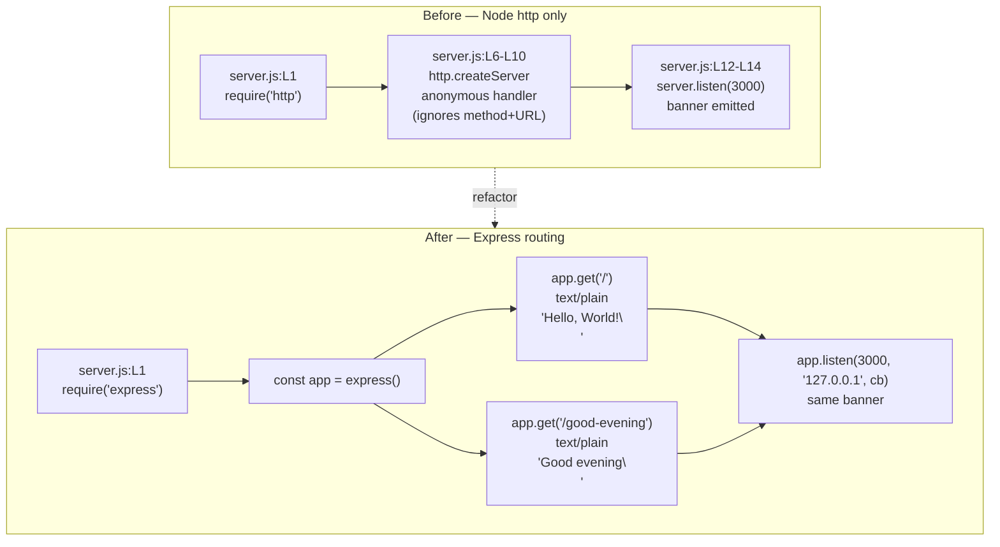

# Technical Specification

# 0. Agent Action Plan

## 0.1 Intent Clarification

This sub-section restates the user's request in precise technical terms and surfaces every requirement — explicit and implicit — that the Blitzy platform must satisfy.

### 0.1.1 Core Feature Objective

Based on the prompt, the Blitzy platform understands that the new feature requirement is to **introduce the Express.js framework into an existing minimal Node.js HTTP server and expose a second endpoint that returns the plaintext response `Good evening`, while preserving the existing endpoint that returns the canonical `Hello, World!` response**.

The user's verbatim request, preserved exactly:

> User Example: "this is a tutorial of node js server hosting one endpoint that returns the response "Hello world". Could you add expressjs into the project and add another endpoint that return the response of "Good evening"?"

Decomposed into discrete, testable requirements:

- **R1 — Adopt Express.js as the web framework.** The repository currently uses only Node's built-in `http` module [server.js:L1] with `package.json` declaring no dependencies [package.json:L1-L11]; Express must become the first production dependency.
- **R2 — Preserve the existing `Hello, World!` response.** The repository's canonical body is the byte-exact string `Hello, World!\n` returned with HTTP 200 and `Content-Type: text/plain` [server.js:L7-L9]. This contract (catalogued as features F-003, F-004, and F-005 in [§2.1 Feature Catalog]) must continue to be served by the post-change application.
- **R3 — Add a new endpoint that returns `Good evening`.** The new endpoint must be served by the same Express application on the same host/port, and (for consistency with R2) must return HTTP 200 with `Content-Type: text/plain`.

### 0.1.2 Implicit Requirements Surfaced

The user's prompt does not enumerate the following, but each is a necessary consequence of R1–R3 and is therefore in scope:

- **I1 — Route paths must be assigned.** Because Express is route-driven, both endpoints require explicit URL paths. The user did not specify them; the Blitzy platform assigns:
    - Existing `Hello, World!` endpoint → `GET /` (root path; closest approximation to the prior "any-URL accepts" behavior catalogued as F-002 in [§2.1.2])
    - New `Good evening` endpoint → `GET /good-evening` (kebab-case is the most idiomatic REST URL convention)
- **I2 — HTTP method is `GET`.** The user wrote "endpoint that returns" with no state-mutating verb; idempotent retrieval semantics apply.
- **I3 — Content-Type must remain `text/plain` for both routes.** Express's `res.send(string)` defaults the response Content-Type to `text/html`; preserving feature F-004 ([§2.1.4]) therefore requires an explicit `res.type('text/plain')` (or equivalent `res.set('Content-Type','text/plain')`) call on each route handler.
- **I4 — Server binding constants are preserved.** The hostname `127.0.0.1` and port `3000` [server.js:L3-L4] must remain identical so feature F-001 ([§2.1.1]) continues to hold and external "backprop" consumers ([§1.2.1.3]) are not disrupted.
- **I5 — Startup banner format is preserved.** The line `Server running at http://${hostname}:${port}/` [server.js:L13] is the sole observability surface ([§5.2.3]); it must be re-emitted unchanged after migrating to Express.
- **I6 — `package-lock.json` must be regenerated.** The lockfile currently records only the root package [package-lock.json:L1-L13]; `npm install express` will populate the `packages` graph with Express and its transitive dependencies. The agent must allow npm to author this file rather than hand-editing it.
- **I7 — Response newline convention is matched.** The existing body ends with `\n` (one line feed) [server.js:L9]; the new `Good evening` body should follow the same convention (`Good evening\n`) for parity.
- **I8 — The Node.js runtime constraint is satisfied.** Setup instructions specify Node.js 20; Express 5.x requires Node.js ≥18, so the runtime is compatible.

### 0.1.3 Special Instructions and Constraints

- **Architectural constraint — single-process model preserved.** The repository runs a single Node.js process binding to loopback only ([§5.2.5]); the Express migration must not introduce clustering, multi-worker patterns, or any non-loopback exposure.
- **Architectural constraint — purity of the request handler is now relaxed by necessity.** The pre-change handler was a "pure function over (req, res)" with no routing inspection ([§5.2.2.4]); Express inherently dispatches by method and path, so per-route handlers replace the single anonymous handler. This is a deliberate, user-requested deviation from the prior contract.
- **README override.** `README.md` carries the directive "test project for backprop integration. Do not touch!" [README.md:L1-L2]. The user's explicit modification request supersedes this directive for the purposes of this feature; documentation outside the requested change is not modified.
- **Web search performed.** The Blitzy platform confirmed Express's current packaging state: Express 5.1.0 is the npm default with an official LTS schedule (per expressjs.com), and Node.js ≥18 is required for Express 5. No other research was necessary; Express usage is well-documented and the implementation pattern is standard.
- **No project rules supplied.** The user-specified rules array is empty (`[]`), so no rule-mandated files are added to scope and no project-specific coding conventions apply beyond what the existing repository demonstrates.

### 0.1.4 Technical Interpretation

These feature requirements translate to the following technical implementation strategy:

- **To adopt Express.js (R1, I8)**, we will add `express` at version `^5.1.0` to a newly created `"dependencies"` block in `package.json` [package.json:L1-L11], and let `npm install express` materialize `node_modules/` and regenerate `package-lock.json` [package-lock.json:L1-L13] with the express subtree.
- **To preserve the existing `Hello, World!` response (R2, I3, I7)**, we will register a route handler `app.get('/', (req, res) => res.type('text/plain').status(200).send('Hello, World!\n'))` in the rewritten `server.js`. The byte-exact body, the explicit `text/plain` Content-Type, and the HTTP 200 status code all match the F-003/F-004/F-005 contract from [§2.1.3]/[§2.1.4]/[§2.1.5].
- **To add the new `Good evening` endpoint (R3, I1, I2, I3, I7)**, we will register `app.get('/good-evening', (req, res) => res.type('text/plain').status(200).send('Good evening\n'))` in the same file.
- **To preserve binding and startup observability (I4, I5)**, we will instantiate Express with `const app = express();` and call `app.listen(port, hostname, () => console.log(`Server running at http://${hostname}:${port}/`));` keeping the existing `hostname` and `port` constants [server.js:L3-L4] untouched and re-emitting the F-006 banner verbatim [server.js:L13].
- **To regenerate the lockfile (I6)**, the agent must execute `npm install` (or `npm install express@^5.1.0`) rather than hand-authoring `package-lock.json`.

## 0.2 Repository Scope Discovery

This sub-section enumerates every existing file evaluated during scope discovery, identifies the integration points where the new feature touches existing code, and records the research consulted to validate the implementation approach.

### 0.2.1 Comprehensive File Analysis

The repository is a flat single-directory project with no sub-folders; `find . -maxdepth 3 -type d` returned no directories beyond the root and `.git/`. Every file in the repository was inspected (directly or via folder summary) and classified by relevance to the feature.

| File | Type | Relevance | Action |
|---|---|---|---|
| `server.js` | Node.js source — current HTTP server [server.js:L1-L14] | **DIRECT** — implements all current request/response behavior | UPDATE |
| `package.json` | npm manifest [package.json:L1-L11] | **DIRECT** — must declare express dependency | UPDATE |
| `package-lock.json` | npm lockfile [package-lock.json:L1-L13] | **DIRECT** — must record express + transitive deps | UPDATE (regenerated by `npm install`) |
| `server - Copy.js` | Duplicate of `server.js` ([§1.2.2.2] "Runtime (duplicate)") | Indirect — backup artifact; modifying would split source of truth | NO CHANGE |
| `README.md` | Project description [README.md:L1-L2] | Reference only — informs intent ("Do not touch!" overridden by user) | NO CHANGE |
| `industry.csv`, `industry - Copy.csv` | Controlled vocabulary lookup ([§1.2.2.2] "Reference data (inert)") | Irrelevant — never read by the Node server | NO CHANGE |
| `LoginTest.java`, `LoginTest - Copy.java` | Non-compilable Java skeleton ([§1.2.2.2] "Java skeleton (inert)") | Irrelevant — different language, no Java toolchain in repo | NO CHANGE |
| `test.py.txt`, `test.py - Copy.txt` | Code-graph metadata / empty placeholder ([§1.2.2.2] "Tooling artifacts (inert)") | Irrelevant — not Python source despite the extension | NO CHANGE |
| `.blitzyignore.txt`, `test.blitzyignore.txt`, `test1.blitzyignore.txt` | Empty placeholder ignore files ([§1.2.2.2] "Placeholders (inert)") | All three verified empty via `cat`; no ignore rules in effect | NO CHANGE |
| `100Pages.pdf`, `100Pages - Copy.pdf`, `demo.jpg`, `demo - Copy.jpg`, `sample.doc`, `sample - Copy.doc` | Unrelated binary artifacts (present in root but absent from the [§1.2.2.2] component classification) | Irrelevant — no functional role in the Node application | NO CHANGE |

**Integration point discovery (where the new feature attaches to existing code):**

- **HTTP runtime** — `server.js` [server.js:L1] currently imports Node's `http` module; this import will be swapped for `express`.
- **Server instantiation** — `server.js` [server.js:L6-L10] currently calls `http.createServer(...)` with a single anonymous handler that ignores all request details (F-002 from [§2.1.2]); this is replaced by `express()` plus per-route `app.get(...)` handlers.
- **Listener binding** — `server.js` [server.js:L12-L14] currently calls `server.listen(port, hostname, callback)`; this becomes `app.listen(port, hostname, callback)` with the identical callback content to preserve F-006 from [§2.1.6].
- **Module-level constants** — `server.js` [server.js:L3-L4] declares `hostname = '127.0.0.1'` and `port = 3000`; both are preserved unchanged.
- **Dependency manifest** — `package.json` [package.json:L1-L11] has no `"dependencies"` key today; the change creates this key with `"express": "^5.1.0"`.
- **Dependency lockfile** — `package-lock.json` [package-lock.json:L1-L13] has only the root package record; `npm install` will rewrite it to include express + its transitive subtree while preserving `lockfileVersion: 3`.

There are no other integration touchpoints. The repository has no service classes, no controllers, no middleware modules, no database models, no migrations, no CI/CD pipeline, no environment-variable configuration ([§1.2.1.3]) — and therefore no further "indirect" integration surface exists.

### 0.2.2 Web Search Research Conducted

The Blitzy platform consulted the following authoritative source to validate the dependency choice:

- **Topic: Express.js current stable version and Node.js runtime requirement.**
  - **Finding:** `Express 5.1.0 is now the default on npm` with an official LTS schedule for the v4 and v5 release lines (expressjs.com home page banner). The npm registry lists `Latest version: 5.2.1` as of the most recent publish for the `express` package. Node.js ≥18 is required by Express 5.
  - **Conclusion:** The Blitzy platform will pin Express at `^5.1.0` in `package.json` — caret-range allows patch and minor uptake within v5 (currently resolving to 5.2.1 or newer), and the Node.js 20 runtime specified in the setup instructions satisfies the ≥18 requirement.

No further research was required: the implementation pattern (`const express = require('express'); const app = express(); app.get(path, handler); app.listen(port, host, callback);`) is the standard Express usage documented in every introductory Express tutorial.

### 0.2.3 New File Requirements

**No new source files are required.** The feature can be implemented entirely by modifying three existing files (`server.js`, `package.json`, `package-lock.json`). Specifically:

- No new source modules — there is no need for a `routes/`, `controllers/`, or `services/` directory in a tutorial that exposes two trivial GET endpoints in a single file.
- No new test files — the project's `scripts.test` is hard-coded to fail (`echo "Error: no test specified" && exit 1`) per [§5.2.4.1] / constraint C-003, and the user did not request test addition.
- No new configuration — the server binds to hard-coded constants ([§1.2.1.3] "No environment configuration"); the user did not request `.env`, `config/`, or environment-variable extraction.
- No new documentation — the user did not request README or `docs/` updates.

The `node_modules/` directory will be created as a side effect of `npm install`, but it is a tooling artifact (not source) and is not enumerated as a "new file" deliverable.

## 0.3 Dependency Inventory

This sub-section documents the dependency changes introduced by the feature. Because the existing repository declares no third-party packages [package.json:L1-L11] and [package-lock.json:L1-L13], every entry below is an **addition**; there are no updates or removals.

### 0.3.1 Public Package Updates

The single new direct dependency is `express`. All other entries in the regenerated lockfile are transitive and managed automatically by npm.

| Registry | Package | Version | Purpose |
|---|---|---|---|
| npm | `express` | `^5.1.0` | Web framework providing the `app.get(path, handler)` routing primitive used to register the two endpoints (`/` and `/good-evening`) and the `app.listen(port, host, callback)` primitive used to bind the listener while preserving the F-006 startup banner. |

**Version rationale.** The caret range `^5.1.0` is selected because Express 5.1.0 was confirmed via web search to be the current npm `default` with an official LTS schedule (expressjs.com), and the registry's `latest` tag points to 5.2.1 within the same v5 line. The caret allows compatible patch and minor uptake within v5 without requiring an AAP revision. The Node.js 20 runtime in the project's setup instructions satisfies Express 5's `Node.js ≥ 18` requirement.

**Transitive dependencies.** Express 5 brings a standard transitive subtree (e.g., `accepts`, `body-parser`, `content-type`, `cookie`, `debug`, `encodeurl`, `escape-html`, `etag`, `finalhandler`, `fresh`, `http-errors`, `mime-types`, `on-finished`, `parseurl`, `path-to-regexp`, `proxy-addr`, `qs`, `range-parser`, `send`, `serve-static`, `statuses`, `type-is`, `vary`, and others). These are not declared in `package.json` — they are recorded automatically in `package-lock.json` by `npm install` and consumed transitively by Express. The agent must not enumerate them in `package.json`.

### 0.3.2 Private Package Updates

None. The project is a self-contained tutorial; no private registry, scoped package, or workspace dependency is involved.

### 0.3.3 Removed Dependencies

None. The Node built-in `http` module is no longer imported directly in `server.js` after the change, but `http` is part of the Node runtime distribution (not an npm package) and Express uses it internally; therefore no `package.json` removal is required.

### 0.3.4 Import Updates

Only a single import statement changes; no wildcard pattern is needed.

| File | Old Import | New Import |
|---|---|---|
| `server.js` [server.js:L1] | `const http = require('http');` | `const express = require('express');` |

There are no other JavaScript files in the repository, so no `src/**/*.js` or `tests/**/*.js` pattern applies.

### 0.3.5 External Reference Updates

None. The repository contains no other configuration, documentation, or CI/CD files that reference the previous dependency posture. Specifically:

- No `tsconfig.json`, `.eslintrc*`, or other tool configs exist that would mention `http` or `express`.
- `README.md` [README.md:L1-L2] contains a two-line description with no dependency list to update.
- No `.github/workflows/`, `.gitlab-ci.yml`, `Dockerfile`, or other build/CI artifacts exist ([§1.2.1.3]).

## 0.4 Integration Analysis

This sub-section enumerates every existing-code touchpoint where the new feature attaches and documents the contract-level impact on previously catalogued features (F-001 through F-007 from [§2.1 Feature Catalog]).

### 0.4.1 Direct Modifications Required

The diagram below depicts the integration flow before and after the change.

Direct modifications, file by file and line by line:

- **`server.js` [server.js:L1]** — Replace `const http = require('http');` with `const express = require('express');`. This is the only top-level import change.
- **`server.js` [server.js:L3-L4]** — `const hostname = '127.0.0.1';` and `const port = 3000;` are **preserved exactly** so feature F-001 ([§2.1.1]) continues to bind to the same loopback address and the F-006 banner ([§2.1.6]) continues to interpolate the same values.
- **`server.js` [server.js:L6-L10]** — Replace the `http.createServer((req, res) => { res.statusCode = 200; res.setHeader('Content-Type', 'text/plain'); res.end('Hello, World!\n'); })` block with:
    - `const app = express();`
    - `app.get('/', (req, res) => res.type('text/plain').status(200).send('Hello, World!\n'));`
    - `app.get('/good-evening', (req, res) => res.type('text/plain').status(200).send('Good evening\n'));`
- **`server.js` [server.js:L12-L14]** — Replace `server.listen(port, hostname, () => { console.log(\`Server running at http://${hostname}:${port}/\`); });` with `app.listen(port, hostname, () => { console.log(\`Server running at http://${hostname}:${port}/\`); });`. The callback body, the argument order, and the template literal content are unchanged so the stdout signal in [§5.2.3] remains byte-identical.
- **`package.json` [package.json:L1-L11]** — Insert a new top-level key `"dependencies": { "express": "^5.1.0" }` (canonical placement is after `"scripts"`). Recommended ancillary cleanup: fix the dead pointer `"main": "index.js"` to `"main": "server.js"` to resolve the inconsistency catalogued in [§5.2.4.3] as constraint C-002. This cleanup is optional but beneficial; it aligns the manifest with the actual entrypoint and is safe because the `main` field has no runtime effect for `node server.js` invocations.
- **`package-lock.json` [package-lock.json:L1-L13]** — **Regenerated automatically** by `npm install express`. The agent must not hand-edit this file. The regenerated lockfile must preserve `"lockfileVersion": 3` and populate the `packages` object with the root entry plus `node_modules/express` and its transitive subtree.

### 0.4.2 Dependency Injections, Service Registrations, Container Wiring

**None apply.** The repository has no DI container, no service registry, no `src/services/`, no `src/config/dependencies.py`-style wiring file. The application is a single file with two module-level constants and a single server instance; the Express `app` object encapsulates all routing and replaces any need for external wiring.

### 0.4.3 Database / Schema Updates

**None apply.** The repository has no persistence layer ([§1.3.3.1] / [§3.3.1] "No ORM/data layer"); no migrations, no `src/db/`, no schema files. The two new endpoints emit hard-coded plaintext bodies and read nothing from any backing store.

### 0.4.4 Feature-Contract Impact (F-001 through F-007)

The change preserves the majority of the catalogued feature contracts and intentionally alters two of them. This table captures the impact and is the authoritative summary for stakeholder review.

| Feature ID | Name | Source | Post-change status |
|---|---|---|---|
| F-001 | HTTP Server Listener Binding | [§2.1.1] | **Preserved.** `app.listen(3000, '127.0.0.1', cb)` binds the same loopback socket. |
| F-002 | Universal HTTP Request Acceptance | [§2.1.2] | **Altered by user request.** Express dispatches by method+path; only `GET /` and `GET /good-evening` are served. All other requests receive Express's default 404. This is an intentional and necessary deviation introduced by R1+R3. |
| F-003 | HTTP 200 Status Response | [§2.1.3] | **Preserved.** Both handlers explicitly call `.status(200)`. |
| F-004 | Plaintext Content-Type Header | [§2.1.4] | **Preserved with explicit re-assertion.** Express's `res.send(string)` defaults to `text/html`; both handlers call `res.type('text/plain')` to force the same `Content-Type` value as before. |
| F-005 | Canonical Response Body | [§2.1.5] | **Preserved on `GET /`.** The byte-exact 13-byte body `Hello, World!\n` is reproduced by `res.send('Hello, World!\n')`. The new `GET /good-evening` route emits the additional body `Good evening\n` per R3 and is not part of the F-005 canonical contract. |
| F-006 | Startup Confirmation Logging | [§2.1.6] | **Preserved.** The `console.log` in the `app.listen` callback is byte-identical to the prior `server.listen` callback. |
| F-007 | Zero-Dependency npm Package Definition | [§2.1.7] | **No longer holds.** Express becomes the first runtime dependency. The "zero-install execution" success criterion from [§1.2.3.2] is also invalidated — the post-change application requires `npm install` before `node server.js` will succeed. This is an unavoidable consequence of R1. |

Downstream tech-spec sections [§2.1.2], [§2.1.7], [§3.3.1] ("No web framework is used"), and [§1.2.3.2] ("Zero-install execution") describe contracts that no longer hold after this change. Updating those sections is a documentation maintenance pass that is **out of scope** for this AAP (this AAP is the implementation plan, not the spec-rewrite pass), but the change is flagged here for stakeholder awareness.

## 0.5 Technical Implementation

This sub-section is the file-by-file execution plan. Every file listed here MUST be created, updated, or regenerated by the implementing agent; every file not listed here MUST remain untouched.

### 0.5.1 File-by-File Execution Plan

#### 0.5.1.1 Group 1 — Core Source File

- **UPDATE** `server.js` — Rewrite to use the Express application pattern while preserving the existing binding constants, the startup banner, and the canonical `Hello, World!\n` body. The post-change file must:
    - Replace `const http = require('http');` with `const express = require('express');` [server.js:L1]
    - Preserve `const hostname = '127.0.0.1';` and `const port = 3000;` unchanged [server.js:L3-L4]
    - Instantiate the app: `const app = express();`
    - Register the existing endpoint: `app.get('/', (req, res) => { res.type('text/plain').status(200).send('Hello, World!\n'); });`
    - Register the new endpoint: `app.get('/good-evening', (req, res) => { res.type('text/plain').status(200).send('Good evening\n'); });`
    - Bind and emit the banner: `app.listen(port, hostname, () => { console.log(\`Server running at http://${hostname}:${port}/\`); });` (callback body byte-identical to [server.js:L13])

#### 0.5.1.2 Group 2 — Manifest Files

- **UPDATE** `package.json` — Insert a top-level `"dependencies": { "express": "^5.1.0" }` block (canonical position: after the `"scripts"` key) [package.json:L1-L11]. Optional ancillary cleanup: change `"main": "index.js"` to `"main": "server.js"` to resolve the dead-pointer inconsistency catalogued in [§5.2.4.3] as constraint C-002. All other existing keys (`name`, `version`, `description`, `author`, `license`) remain unchanged.
- **UPDATE** `package-lock.json` — **Regenerated automatically** by `npm install` (or `npm install express@^5.1.0`). The agent must invoke the npm command rather than hand-editing the file. Post-regeneration: `"lockfileVersion": 3` preserved; root package entry preserved; `node_modules/express` and the full Express transitive subtree populated under `packages`.

#### 0.5.1.3 Group 3 — Out-of-Scope (Listed for Traceability)

The remaining repository files require no action and must not be modified. They are enumerated in [§0.6.2 Explicitly Out of Scope] below and are documented here only to prevent accidental edits:

- `server - Copy.js` (backup duplicate of `server.js`)
- `README.md`, `industry.csv`, `industry - Copy.csv`, `LoginTest.java`, `LoginTest - Copy.java`, `test.py.txt`, `test.py - Copy.txt`
- All `.blitzyignore.txt`, `test.blitzyignore.txt`, `test1.blitzyignore.txt` (all empty)
- All unrelated binary artifacts in the root directory (PDFs, JPGs, DOCs)

### 0.5.2 Implementation Approach per File

- **`server.js`** — The file's structural skeleton (require → constants → server construction → listen) is preserved end-to-end; only the *server construction* block is restructured. The `require('http')` swap to `require('express')` is the single import change. The `hostname`/`port` constants remain at the same module-level position. The `http.createServer(...)` call is replaced by `express()` + two `app.get(...)` registrations. The trailing `server.listen(...)` becomes `app.listen(...)` with identical arguments and an identical callback body. This minimal-delta refactor keeps the file readable as a "tutorial" and makes the diff trivial to review.

- **`package.json`** — The change is additive: a new `"dependencies"` key is created (it does not exist today). The optional `"main"` fix is included because the cost is one character pair and the benefit is resolving a documented constraint (C-002). All existing keys are preserved in the same order. JSON formatting (4-space indentation, double quotes) is maintained per the existing style [package.json:L1-L11].

- **`package-lock.json`** — Not authored by hand. The agent runs `npm install` (no arguments needed, since `express` will be declared in `package.json` by the prior step). npm rewrites the lockfile to record the express subtree; the agent verifies that `lockfileVersion: 3` is preserved by reading the regenerated file before committing.

### 0.5.3 Operational Sequencing for the Implementing Agent

The downstream code-generation agent must execute the changes in this order to avoid intermediate broken states:

1. **Modify `package.json`** to add the `"dependencies"` block (and optionally fix `main`).
2. **Run `npm install`** from the repository root. This materializes `node_modules/` and regenerates `package-lock.json` with `lockfileVersion: 3` preserved.
3. **Rewrite `server.js`** with the Express implementation described in [§0.5.1.1].
4. **Smoke-validate** by starting the server (`node server.js`) and curling each endpoint. Expected results:
    - `curl -s -i http://127.0.0.1:3000/` → `HTTP/1.1 200 OK`, header `Content-Type: text/plain`, body exactly `Hello, World!\n`
    - `curl -s -i http://127.0.0.1:3000/good-evening` → `HTTP/1.1 200 OK`, header `Content-Type: text/plain`, body exactly `Good evening\n`
    - Stdout must contain `Server running at http://127.0.0.1:3000/` from the listen callback.

### 0.5.4 User Interface Design

**Not applicable.** The feature is entirely server-side. Both endpoints return `text/plain` responses consumed by HTTP clients (curl, browsers display them as raw text, automated test harnesses byte-compare them). There is no visual UI surface, no frontend code, no template engine, no static asset, and no design system to align against. The Figma attachment "WorkOS Unified Login" present in the project inputs is unrelated to greeting endpoints and does not drive any implementation decisions here; it is acknowledged for completeness in [§0.8 Attachments].

## 0.6 Scope Boundaries

This sub-section is the authoritative scope contract. Anything listed in [§0.6.1] must be addressed by the implementation; anything listed in [§0.6.2] must not be touched.

### 0.6.1 Exhaustively In Scope

The following files are the complete set of in-scope deliverables. The repository's flat single-directory layout (no `src/`, no `tests/`, no `config/`) makes wildcard patterns unnecessary — the in-scope set is the explicit three-file list below.

- **Source file:**
    - `server.js` — Rewrite to use Express; register `GET /` for the existing `Hello, World!\n` response and `GET /good-evening` for the new `Good evening\n` response; preserve `hostname`, `port`, and the startup banner [server.js:L1-L14]
- **Dependency manifest files:**
    - `package.json` — Add `"dependencies": { "express": "^5.1.0" }`; optionally fix the `"main"` dead pointer to `"server.js"` [package.json:L1-L11]
    - `package-lock.json` — Regenerated automatically by `npm install`; must preserve `"lockfileVersion": 3` and include the full express transitive subtree [package-lock.json:L1-L13]

There are no configuration files, no environment variables, no migrations, no documentation files, no test files, and no Figma assets in the in-scope list because none are required by the feature.

### 0.6.2 Explicitly Out of Scope

The items below are recognized but are NOT part of this change. The implementing agent must not modify them, generate work for them, or expand the scope to include them.

- **Duplicate source artifacts:**
    - `server - Copy.js` — Byte-identical backup of `server.js` per [§1.2.2.2] "Runtime (duplicate)"; modifying it would create divergence between the canonical source and its backup
- **Inert repository artifacts (no functional role in the application):**
    - `industry.csv`, `industry - Copy.csv` — Controlled vocabulary lookup data; not read by `server.js`
    - `LoginTest.java`, `LoginTest - Copy.java` — Non-compilable Java skeleton; unrelated to the Node application
    - `test.py.txt`, `test.py - Copy.txt` — Code-graph metadata / empty placeholder; not Python source despite the extension
    - `.blitzyignore.txt`, `test.blitzyignore.txt`, `test1.blitzyignore.txt` — All three verified empty; no ignore rules are enforced
    - Unrelated binary artifacts in the root (`100Pages.pdf`, `100Pages - Copy.pdf`, `demo.jpg`, `demo - Copy.jpg`, `sample.doc`, `sample - Copy.doc`)
- **Documentation:**
    - `README.md` — User did not request a documentation update. The "Do not touch!" directive [README.md:L1-L2] is overridden specifically for the requested source modification and is not rewritten by this change.
- **Behavior preservation that is NOT modified:**
    - The canonical response body for the existing endpoint — `Hello, World!\n` is preserved byte-exactly per F-005 ([§2.1.5])
    - The bind address `127.0.0.1:3000` — preserved per F-001 ([§2.1.1])
    - The startup banner content `Server running at http://127.0.0.1:3000/` — preserved per F-006 ([§2.1.6])
- **Capabilities not requested by the user:**
    - Authentication, authorization, sessions, cookies, CSRF protection
    - Database integration, ORM, caching, persistence of any kind ([§3.3.1] confirms none exists today)
    - Logging beyond the startup banner; structured logging, log aggregation
    - 404 customization, custom error-handling middleware, request validation, CORS configuration
    - Rate limiting, performance optimization, clustering, multi-worker patterns
    - Tests, test scaffolding, test fixtures, or test framework adoption (the `npm test` script is hard-coded to fail per [§5.2.4.1] / C-003; user did not request test addition)
    - CI/CD pipeline, GitHub Actions, GitLab CI, Dockerfile, Kubernetes manifests, deployment scripts ([§1.2.1.3] confirms none exist today)
    - Environment-variable extraction or `.env` files for `hostname`/`port` (constants remain hard-coded)
    - TypeScript migration, ES module (`import`/`export`) conversion, linter / formatter introduction
    - The Acme Platform setup instructions (api/web/docs subprojects, `API_GATEWAY_URL_PLATFORM` variable aliasing, etc.) — these do not apply to this single-package tutorial repository; only the Node.js 20 runtime requirement is materially relevant
- **Figma-driven UI work:**
    - The attached Figma frame "WorkOS Unified Login" has no semantic relationship to the prompt (a login UI is unrelated to text-only greeting endpoints) and will not drive any implementation. It is acknowledged in [§0.8.2] for completeness.

### 0.6.3 Scope Validation Checklist

The implementing agent must confirm each item before declaring the feature complete:

- [ ] `server.js` exports both `GET /` and `GET /good-evening` route handlers via Express
- [ ] `GET /` returns HTTP 200, `Content-Type: text/plain`, body `Hello, World!\n`
- [ ] `GET /good-evening` returns HTTP 200, `Content-Type: text/plain`, body `Good evening\n`
- [ ] `hostname` constant remains `'127.0.0.1'`; `port` constant remains `3000`
- [ ] Startup banner output is exactly `Server running at http://127.0.0.1:3000/`
- [ ] `package.json` contains `"dependencies": { "express": "^5.1.0" }` (caret range preserved)
- [ ] `package-lock.json` has `"lockfileVersion": 3` and includes `node_modules/express` plus the transitive Express subtree
- [ ] No files outside the in-scope list have been modified

## 0.7 Rules for Feature Addition

This sub-section captures the user-specified and derived implementation rules that the downstream code-generation agent must obey. The user-supplied rules array is empty (`[]`), so the rules below are derived from the prompt's explicit constraints and the existing tech spec evidence.

### 0.7.1 User-Specified Rules

**None.** The project's rules input was empty. No project-specific patterns, coding conventions, naming standards, or architectural prescriptions are imposed beyond what the prompt and existing repository demonstrate.

### 0.7.2 Derived Implementation Rules

The following rules are not from the explicit "rules" input but are mandatory consequences of the prompt and the existing repository's documented contracts. They are listed here so the downstream agent treats them with the same weight as user-specified rules.

- **R-1 — Preserve the canonical response body byte-for-byte.** The existing endpoint's body must remain exactly `Hello, World!\n` (13 bytes: 12 printable characters plus one trailing `\n`). This is F-005 in [§2.1.5] and is the system's most visible contract. The agent must not edit the string (e.g., do not change to `Hello World`, `hello world`, `Hello, World`, or any other casing/spacing variant).
- **R-2 — Preserve the bind address.** The agent must call `app.listen(3000, '127.0.0.1', cb)` with these exact constants. Binding to `0.0.0.0`, `localhost`, or any other host violates F-001 [§2.1.1] and changes the system's exposure posture.
- **R-3 — Preserve the startup banner format.** The agent must emit `Server running at http://127.0.0.1:3000/` via `console.log` from the `app.listen` callback. The template literal interpolation pattern using the `hostname` and `port` constants ([server.js:L13]) should be preserved as-is. This is F-006 in [§2.1.6] and is the system's sole observability surface.
- **R-4 — Explicitly set `Content-Type: text/plain` on both routes.** Express's `res.send(string)` defaults the response Content-Type to `text/html`. To preserve F-004 [§2.1.4], both handlers must call `res.type('text/plain')` (or equivalent `res.set('Content-Type', 'text/plain')`) before sending the body. Relying on Express's default is a regression.
- **R-5 — Explicitly set HTTP status 200 on both routes.** Express defaults to 200 on `res.send`, but an explicit `.status(200)` chain (matching the pre-change `res.statusCode = 200` assignment on [server.js:L7]) makes the F-003 [§2.1.3] contract self-evident and defends against accidental future modification.
- **R-6 — Use the Express idiomatic application pattern.** The agent must use the standard pattern (`const express = require('express'); const app = express(); app.get(path, handler); app.listen(...)`) and must not introduce additional middleware (`express.json`, `morgan`, `helmet`, `cors`, etc.) that the user did not request. Keep the change minimal and tutorial-friendly.
- **R-7 — Do not modify the backup file.** `server - Copy.js` is a byte-identical duplicate per [§1.2.2.2]; modifying it would create source-of-truth divergence and is explicitly out of scope per [§0.6.2].
- **R-8 — Do not introduce environment-variable configuration.** The existing repository hard-codes `hostname` and `port` ([§1.2.1.3] "No environment configuration"); the user did not request configuration extraction. Adding `.env` handling, `dotenv`, or `process.env.PORT` patterns is a scope expansion and must not be introduced.
- **R-9 — Do not hand-edit `package-lock.json`.** The agent must regenerate the lockfile by running `npm install`. Hand-edited lockfiles are fragile and routinely diverge from what `npm install` would produce; this rule prevents that class of error.
- **R-10 — Use the caret version range exactly as specified.** The dependency entry must be `"express": "^5.1.0"`. Do not pin to an exact version (e.g., `5.1.0`), do not use `latest`, and do not specify a tilde range. The caret range allows compatible patch/minor uptake without an AAP revision.

### 0.7.3 Performance, Security, and Scalability Considerations

The user did not specify performance, security, or scalability requirements. The following are noted only to set expectations:

- The post-change application retains the loopback-only bind ([§5.2.1.4]) and therefore inherits the same exposure surface (none beyond the local host). No new attack surface is introduced relative to the pre-change application — Express's default behavior on the two specified routes does not expose request data, error stacks, or framework metadata to clients.
- The application remains single-process / single-threaded per Node's event-loop model ([§5.2.1.4]); the change does not affect concurrency characteristics.
- The "zero-install execution" success criterion from [§1.2.3.2] is invalidated by the introduction of Express as a dependency; this is an unavoidable consequence of the user's request and is documented in [§0.4.4].

## 0.8 Attachments

This sub-section enumerates every attachment provided with the project inputs. Per the project review:

### 0.8.1 File Attachments

**None.** The project's file-attachment list returned no PDFs, images, or other document attachments.

### 0.8.2 Figma Attachments

One Figma frame was provided with the project inputs.

| Frame Name | URL | Contents Summary |
|---|---|---|
| Frame 0 — "WorkOS Unified Login" | `https://www.figma.com/design/91TpUu5OYVLFkPdcBCmOUu/Blitzy-Platform-2.0?node-id=42485-38057&p=f&m=dev` | A WorkOS unified login user-interface design (a sign-in / authentication screen). The frame title and its location within a design file named "Blitzy-Platform-2.0" indicate it is a login UI mockup; it has no semantic relationship to the prompt's request (a backend Node.js tutorial that adds Express and a second text-only HTTP endpoint). |

**Relevance to this feature: none.** The user's prompt asks for two changes (add Express as a dependency; add an HTTP endpoint that returns the text `Good evening`). Both changes are entirely server-side and emit `text/plain` responses; neither requires a visual UI, a frontend, a login flow, or any design-system alignment. The "WorkOS Unified Login" frame is therefore acknowledged here for completeness and traceability, but it does **not** drive any implementation decision in this AAP. The Figma Design Inspection Protocol was not invoked for this attachment because executing it on a backend-only task would produce a misleading specification that the downstream agent could mistakenly act on.

If a later request re-introduces the same Figma frame in a context that legitimately requires a login UI, a fresh AAP will analyze it through the protocol at that time.

